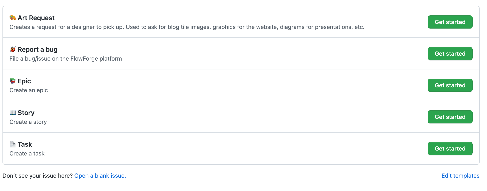

Across FlowFuse it will be a common occurence that we need visual content created. These can be part of development tasks (where you're comfortable doing the development work, but less doing the graphic/illustrative design work) or social/marketing materials.  

Likely places this will be required are:

- Tiles for Blog Posts
- Tiles & Associated Graphics/Assets for Webinars & AMA Sessions
- Diagrams for Presentations
- Social Media Adverts & Graphics
- YouTube Video Thumbnails
- Product Illustrations & Graphics

## Creating an Art Request

You can create an issue on any of the FlowFuse Repositories that best suits the asset required, e.g:

- [FlowFuse/flowfuse](https://github.com/FlowFuse/flowfuse): In-Product Visuals (e.g. icons, diagrams, pictograms)
- [FlowFuse/website](https://github.com/FlowFuse/website): Markitechture Diagrams, Blog Tiles, Webinar & AMA Tiles
- [FlowFuse/content](https://github.com/FlowFuse/customer): Social Media Assets, YouTube Thumbnails Tiles and anything else that doesn't fit above 

When creating an issue, you'll be presented with an option to create an "Art Request" from the Issue Templates:

### Details to Include

Please be sure to include as much detail as possible, but most importantly:

- **Type**: What type of asset is this? Blog Tile? YouTube Thumbnail?
- **Format**: Image (e.g. `.png`, `.jpg`), Video (e.g. `mp4`), Animation (e.g. `.gif` or Lottie Animtion)
- **Deadline**: This is defined on the right-side of the issue under the "Art Requests" project, once the issue has been created.
- **Milestone**: If this is a Product request, please add the Development Project and assign the relevant release milestone, otherwise, this is not required.

## Tracking Art Request Progress

All newly created Art Requests will be tagged with `design` and `artwork` - this ensures that the issue is automatically added to our [Art Requests Project Board](https://github.com/orgs/FlowFuse/projects/10), and alerts a designer in the `#gh-art-requests` channel on Slack.

When a designer assigns themselves to the issue, they should also add the issue to the Development Project Board, and assign the relevant Iteration within which the piece of work is being undertaken, this ensures that it shows on our wider Team view as to what everyone is working on at any given time.

## Delivery of Art

While the art request will include a delivery method of the assets, please be
sure to also always export the asset to the [Design directory](https://drive.google.com/drive/folders/1PiuFwW3H8XuydolepmfQQ4BjcdNekVQg)
so others, non-designers, can find and reuse these assets.