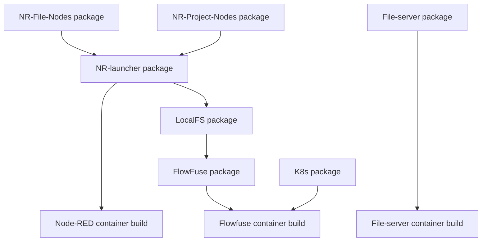

This paragraph shows a graphical presentation of dependencies between each build pipeline in our CI/CD process.



## How does it work?

The CI/CD process is executed by GitHub Actions.
Each change pushed to the repositories `main` branch initiates the process.
Node package publish process is defined in the file `.github/workflows/publish.yml` in each repository while container images build steps can be found in `.github/workflows/*-containers.yml` files in [helm repository](https://github.com/FlowFuse/helm/tree/main/.github/workflows).

Each package has its dedicated code repository. Due to the security limitations of GitHub Actions, there is no possibility to access the pipeline from one repository to another.
Therefore, there is a need to use a dedicated [Github App](https://docs.github.com/en/apps/overview) to access repositories and trigger the build process of the dependent package. The process of creating such GitHub App is described in the [GitHub documentation](https://docs.github.com/en/developers/apps/creating-a-github-app).
Because such GitHub App imitates a regular user, it is necessary to include `workflow_dispatch` event in the dependent workflow definition.

Example of job responsible for triggering dependent pipeline:

```yaml
  dispatch_container_build:
    runs-on: ubuntu-latest
    steps:
        # This step uses GitHub App to generate a token 
        # which is used to trigger dependent pipeline
      - name: Generate a token
        # ID of the step to reference it in the next one
        id: generate_token                                        
        # Name of the action
        uses: tibdex/github-app-token@v1
        with:
          # GitHub App ID
          app_id: ${{ secrets.GH_BOT_APP_ID }}
          # GitHub App private key
          private_key: ${{ secrets.GH_BOT_APP_KEY }}

        # This step triggers dependent pipeline located in 
        # the `helm` repository and defined in the 
        # `flowforge-container.yml` file
      - name: Trigger flowforge container build
        # Name of the action
        uses: benc-uk/workflow-dispatch@v1
        with:
          # Name of the workflow to trigger
          workflow: flowforge-container.yml
          # Name of the repository where 
          # the dependent workflow is located
          repo: flowfuse/helm
          # Branch name
          ref: main
          # Token generated in the previous step                                                 
          token: ${{ steps.generate_token.outputs.token }}
```


