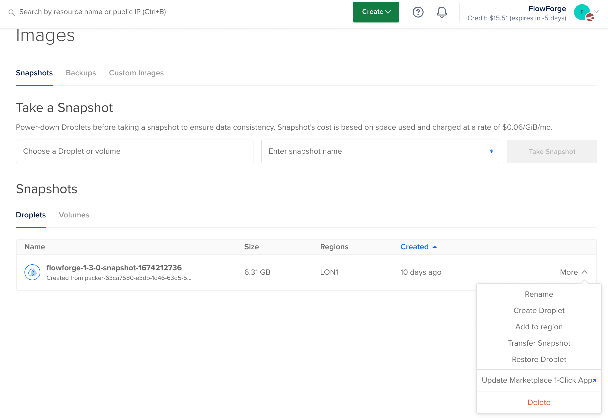

When a release is tagged in the [Digital Ocean](https://github.com/FlowFuse/digital-ocean) 
repository a GitHub Action will run and rebuild the image.

Once complete the Release Manager should post to the #dev slack chanel to ask somebody with
Digital Ocean access to do the following steps.

 1. Log into the FlowFuse team on Digital Ocean
 2. Navigate to the "Backups & Snapshots" section, from the "Manage" options in the left hand menu
 3. Select the new image from the "Droplets" list and click on "More"
    
 4. Select the "Update Marketplace 1-Click App"
 5. Select the FlowFuse entry, not the old FlowForge entry
 6. Update the version numbers and any documentation in the Marketplace form
 7. Submit the new image for review, this will take 3-4 days before the new version is on 
 the Market Place
