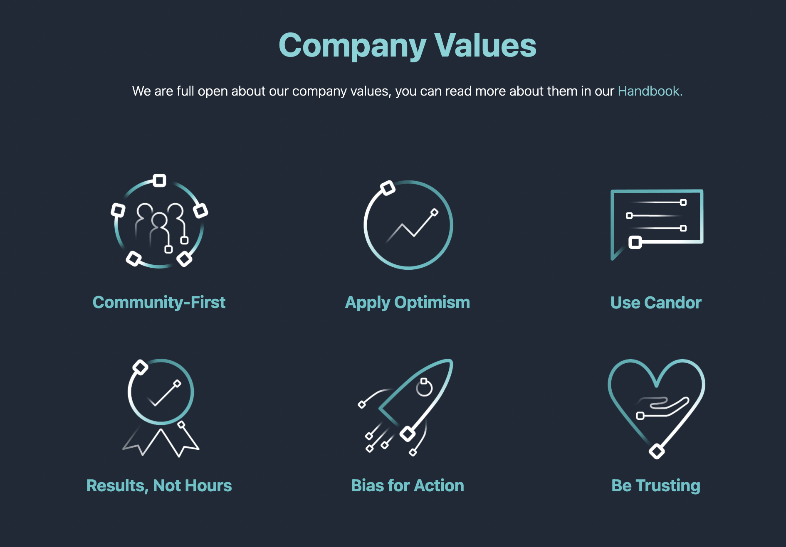

# FlowForge Branding Guidelines

For FlowForge Assets (e.g. logos, pictograms, and raw design files), please look in the [`/design/Media`](https://drive.google.com/drive/u/1/folders/1guBnBUrIiRXuK6vsik_NIXIhtE1cZRRa) folder on Google Drive.
## Fonts

In both the FlowForge application and on our website, we use [Tailwind CSS](https://tailwindcss.com/). With Tailwind, comes the `font-sans` class, which we use across FlowForge.

For branded materials such as videos and images we have two stylized fonts in-use:

- ["DIN Alternate Bold"](https://fontsgeek.com/fonts/DIN-Alternate-Bold): Used in videos & social media content.
- ["Baloo Da 2"](https://fonts.google.com/specimen/Baloo+Da+2): Used in the FlowForge logo.
## Colour Palette

    

        

            Black
            #000000
        

        

            White
            #FFFFFF
        

    

    

        

            Grey 50
            #F9FAFB
        

        

            Grey 100
            #F3F4F6
        

        

            Grey 200
            #E5E7EB
        

        

            Grey 300
            #D1D5DB
        

        

            Grey 400
            #9CA3AF
        

        

            Grey 500
            #6B7280
        

        

            Grey 600
            #4B5563
        

        

            Grey 700
            #374151
        

        

            Grey 800
            #1F2937
        

        

            Grey 900
            #111827
        

    

    

        

            Red 50
            #FFEBEB
        

        

            Red 100
            #FFC6C6
        

        

            Red 200
            #FF8D8D
        

        

            Red 300
            #F16F6F
        

        

            Red 400
            #ED4E4E
        

        

            Red 500
            #D82525
        

        

            Red 600
            #BC3838
        

        

            Red 700
            #AB1818
        

        

            Red 800
            #8F0001
        

        

            Red 900
            #760000
        

    

    

        

            Teal 50
            #E4FBFC
        

        

            Teal 100
            #C4F3F5
        

        

            Teal 200
            #B2EBEE
        

        

            Teal 300
            #8CE2E7
        

        

            Teal 400
            #74D4D9
        

        

            Teal 500
            #50C3C9
        

        

            Teal 600
            #35AAB0
        

        

            Teal 700
            #31959A
        

        

            Teal 800
            #397B7E
        

        

            Teal 900
            #406466
        

    

    

        

            Blue 50
            #EFF6FF
        
 
        

            Blue 100
            #DBEAFE
        

        

            Blue 200
            #BFDBFE
        

        

            Blue 300
            #93C5FD
        

        

            Blue 400
            #60A5FA
        

        

            Blue 500
            #3B82F6
        

        

            Blue 600
            #2563EB
        

        

            Blue 700
            #1D4ED8
        

        

            Blue 800
            #1E40AF
        

        

            Blue 900
            #1E3A8A
        

    

## Iconography

All app and site iconography uses [Heroicons](https://heroicons.com/), by the makers of Tailwind CSS. Within our flowforge app, we have two icon sizes available which can be assigned with `ff-icon` and `ff-icon-sm`.

## Pictograms

These larger images are used for stylistic purposes. We use pictograms to communicate in a glance, offer interactivity, or simplify complex ideas.

If you wish to create your own Pictograms, you can use this Adobe Illustrator file as a template:
[pictogram.ai](https://drive.google.com/drive/u/1/folders/1guBnBUrIiRXuK6vsik_NIXIhtE1cZRRa)

Sizings:

- **128 x 128px**: Used when showing multiple pictograms in the same section of the website or application.
- **250 x 250 px:** Used as part of page headers, inline with the page title and page description.
