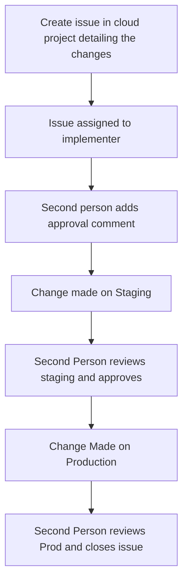

# Change Control

To keep track of what changes where made, why these were made, and if the changes
took the wanted effect there's a process for requesting changes on FlowForge.cloud.

Configuration changes and code deployments must create a "change request" issue
on the [admin repository](https://github.com/flowforge/admin/issues/new/choose).

The key points here are:
- This is a 2 person process, someone to implement and someone to review
- All changes are recorded

