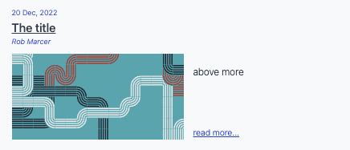
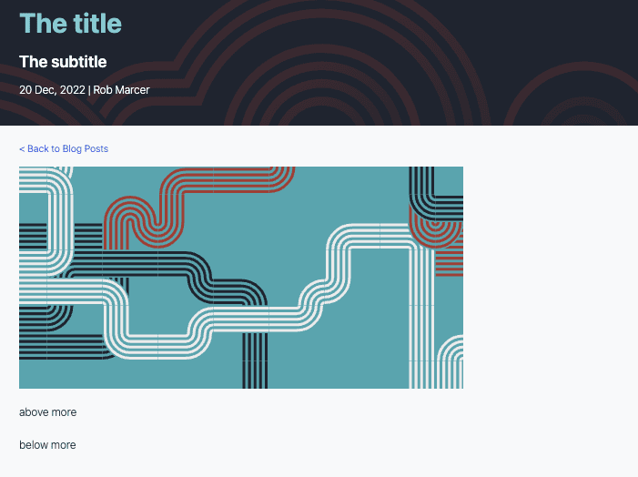

## Blog

### Blogging Process

When adding content to our blog we follow a similar process as when making changes to our other codebases, with a few minor changes. The process is as follows:

1. Raise an issue for the content in our private [Github repository](https://github.com/flowforge/content).
2. If the content is date specific create an 'all day' event on the Google Calendar [FlowForge Publishing Schedule](https://calendar.google.com/calendar/u/0?cid=Y18yMGFjMmM5MmMwYmE0YTYwNDg4NDE1MjBmMGU2YWE0MGFhZGUxNTlkNThjZGY0ZGMwMjA0NTI4ZjFjMTcxZmQ0QGdyb3VwLmNhbGVuZGFyLmdvb2dsZS5jb20), include a link to the issue in the event description. If you don't have the permission to create events please ask our Google Workspace admin to give you access.
3. If you want to work on the content immediately please triage the issue into our [development board](https://github.com/orgs/flowforge/projects/1/views/33).
4. Create a new branch of the website repository and then follow our standard [development processes](https://flowforge.com/handbook/development/#development-board).
5. It is OK for you to merge your own PR to main without review where the content is urgent or has been reviewed outside of Git but where it is practical to follow the [standard process](https://flowforge.com/handbook/development/#development-board) we encourage you to do so.

### Blog CMS

When creating a blog post there are several headers which are used by the CMS to populate the blog article as well as the blog index page. The headers are as follows:

#### Title

The title of the page can be seen on both the blog index and the articles.

#### Subtitle

The subtitle is only shown on the articles.

#### Description

The description is unused currently

#### Date

The data can be seen on both the blog index and the articles.

#### Authors

The author can be seen on both the blog index and the articles.

#### More tag

The '\<\!\-\-more\-\-\>' tag is used to define the text shown in the blog index from each article.

#### Example header content

```
---
title: The title
subtitle: The subtitle
description: The description
date: 2022-12-20
authors: ["rob-marcer"]
---

above more
<!--more-->
below more
```

#### Example blog index item based on the header above



#### Example blog article based on the header above

