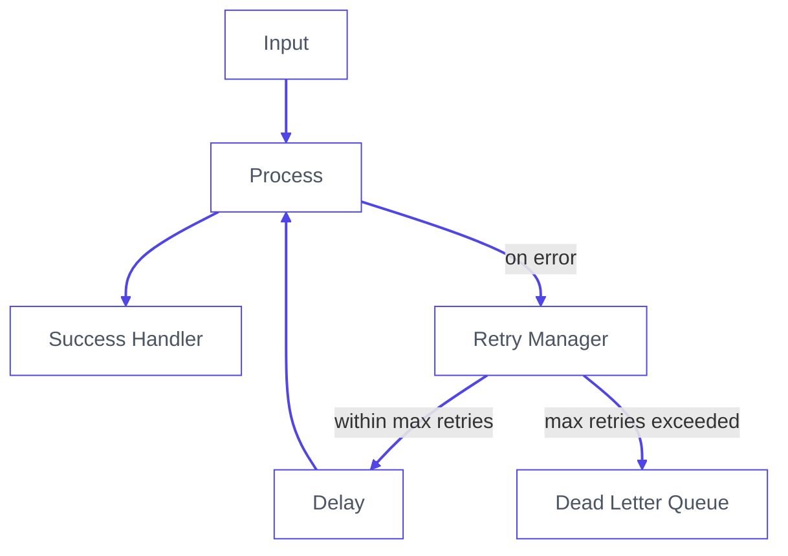

Somewhere in your IIoT pipeline, a message just failed. You don't know which one. You don't know when. And unless you have a Dead Letter Queue, you never will.

<!--more-->

In industrial environments, failure is not the exception. It is the contract. Networks partition. APIs rate-limit. A sensor alert fires at the wrong moment and vanishes without a trace. And unlike consumer applications, missed messages in manufacturing have a real cost.

That cost is invisible by default. No error surface. No audit trail. Just data that was there and then wasn't. FlowFuse changes that. It gives your IIoT pipelines the production-grade tooling they need to handle failure the right way: catch it, retry it, and preserve everything that couldn't be recovered so you can act on it later.

This guide shows you how to build exactly that. You will walk away with a production-ready pattern for catching failed messages, retrying them with exponential backoff, and routing the unrecoverable ones into a Dead Letter Queue where they can be inspected, replayed, or discarded on your terms.

## What Is a Dead Letter Queue?

A Dead Letter Queue is a holding area for messages that could not be delivered. When a message fails processing and has no path forward, it gets routed to the DLQ instead of being dropped or causing your flow to crash.

A message ends up in a DLQ for four reasons. It exceeded the maximum number of retry attempts. It is malformed and cannot be parsed. The target system is permanently unavailable. Or a business rule explicitly rejected it.

The value of a DLQ is not just storage. It is observability. Every failed message arrives with its full payload, error reason, retry history, and timestamps intact. You know exactly what failed, when it failed, and how many times it was attempted before giving up. That information is what makes recovery possible.

Without a DLQ, failed messages disappear silently. With one, failure becomes something you can inspect, act on, and fix.

## The Retry Pattern: Exponential Backoff

Before a message earns its place in the DLQ, you should try, and try again. But naive retries are dangerous. Hammering a failing service every 100ms does not give it time to recover. It makes things worse for everyone.

The industry standard is **exponential backoff with jitter**:
```
delay = min(base * 2^attempt, max_delay) + random_jitter
```

| Attempt | Base Delay | With Jitter (approx.) |
|---------|-----------|----------------------|
| 1       | 1s        | 1.2s                 |
| 2       | 2s        | 2.5s                 |
| 3       | 4s        | 4.1s                 |
| 4       | 8s        | 8.9s                 |
| 5       | —         | → DLQ               |

The jitter prevents the **thundering herd problem**, where every failed client retries at exactly the same moment and overloads the service all over again.

## Building It

In this section, we'll build this pattern in FlowFuse step by step.

FlowFuse is the Industrial Application Platform that connects any machine or system, collects data across any protocol, and lets you act on it at production scale, with enterprise features like role-based access control, centralized device management, audit logging, and team collaboration built in. It also includes FlowFuse Tables, a built-in database service that gives all your instances a single shared DLQ, so every failed message across your entire fleet lands in one place, visible and queryable from anywhere. [Contact us](/contact-us/) to get started.

The architecture has five components:

1. Retry state initializer
2. Catch node for centralized error handling
3. Retry manager with exponential backoff
4. Delay node for controlled retries
5. Dead Letter Queue backed by FlowFuse Tables

Here's how they connect:


Every step below maps directly to one part of that diagram. Follow it in order.

### Step 1: Initialize Retry State

This function node runs once when a fresh message enters the pipeline. It attaches retry metadata to `msg` so every downstream node knows where the message stands.

1. Drag a **function node** onto the canvas.
2. Double-click it to open its settings.
3. In the **Name** field, enter `Init Retry State`.
4. In the **Function** tab, paste the following code:
```javascript
msg._originalPayload = RED.util.cloneMessage(msg.payload);

if (!msg._retry) {
    msg._retry = {
        attempts: 0,
        maxAttempts: 5,
        lastError: null,
        originalTimestamp: new Date().toISOString(),
        topic: msg.topic
    };
}

return msg;
```

5. Click **Done**.

Two things are happening here worth noting. First, `msg._originalPayload` saves a deep clone of the original payload using `RED.util.cloneMessage` before anything touches it. A plain assignment (`= msg.payload`) would only copy a reference. If a downstream node mutates the object in place, the saved copy changes too. `cloneMessage` ensures the DLQ always holds the payload exactly as it arrived. Some nodes, like the HTTP Request node, also overwrite `msg.payload` with their response body, so this clone is what gets stored in the DLQ later. Second, the `if (!msg._retry)` check ensures initialization only runs on a fresh message. When the retry loop sends the message back through, this block is skipped entirely and the existing retry state is preserved. The underscore prefix on `msg._retry` also protects it from being overwritten by processing nodes.

### Step 2: Add a Catch Node

The catch node monitors your processing nodes and intercepts any message that causes an error, routing it to the retry logic instead of letting it disappear.

Scoping it to `All nodes` is tempting but dangerous. If any node in the retry infrastructure itself throws, for example the Retry Manager calling `node.error()`, the catch node will intercept it and feed it back into the retry loop, creating an infinite loop. Scoping it explicitly to your processing nodes prevents this.

1. Drag a **catch node** onto the canvas.
2. Double-click it to open its settings.
3. In the **Name** field, enter `Catch Errors`.
4. Set **Catch errors from** to `Selected nodes`.
5. Select only the nodes where real failures can occur. In practice, these are the nodes that talk to the outside world: MQTT nodes, HTTP request nodes, database nodes, WebSocket nodes, or anything that reaches beyond the flow itself. Taking the example flow provided at the end of this guide, that means selecting the HTTP Request node and the Check Response function node.
6. Click **Done**.

Next, add a normalization step between the catch node and the retry manager. Built-in nodes sometimes attach `msg.error` as an object rather than a string, which causes problems downstream. This function node converts it to a consistent string format.

1. Drag a **function node** onto the canvas.
2. Double-click it to open its settings.
3. In the **Name** field, enter `Normalize Error`.
4. In the **Function** tab, paste:
```javascript
msg.retry = msg._retry;

if (typeof msg.error === 'object') {
    msg.error = msg.error.message || JSON.stringify(msg.error);
}

msg.error = msg.error || 'Processing failed';
return msg;
```

5. Click **Done**.
6. Wire the **catch node** output to the **Normalize Error** input.

### Step 3: Add the Retry Manager

This is the decision node. It increments the attempt count, calculates the backoff delay, and routes the message either back into the pipeline for another try or forward to the DLQ if retries are exhausted.

1. Drag a **function node** onto the canvas.
2. Double-click it to open its settings.
3. In the **Name** field, enter `Retry Manager`.
4. Go to the **Setup** tab and set **Outputs** to `2`. This gives the node two output ports, one for retrying and one for the DLQ.
5. Go to the **Function** tab and paste:
```javascript
const MAX_ATTEMPTS = msg.retry.maxAttempts || 5;
const BASE_DELAY_MS = 1000;
const MAX_DELAY_MS = 30000;

msg.retry.attempts += 1;
msg.retry.lastError = msg.error || 'Unknown error';
msg.retry.lastAttemptAt = new Date().toISOString();

// keep _retry in sync
msg._retry = msg.retry;

if (msg.retry.attempts >= MAX_ATTEMPTS) {
    msg.retry.exhausted = true;
    msg.dlq = {
        reason: 'Max retries exceeded',
        attempts: msg.retry.attempts,
        lastError: msg.retry.lastError,
        deadAt: new Date().toISOString()
    };
    return [null, msg];
}

const exponential = BASE_DELAY_MS * Math.pow(2, msg.retry.attempts - 1);
const jitter = Math.random() * 1000;
const delay = Math.min(exponential + jitter, MAX_DELAY_MS);

msg.delay = Math.round(delay);

node.status({
    fill: 'yellow',
    shape: 'ring',
    text: `Retry ${msg.retry.attempts}/${MAX_ATTEMPTS} in ${Math.round(delay / 1000)}s`
});

return [msg, null];
```

6. Click **Done**.
7. Wire the **Normalize Error** output to the **Retry Manager** input.

`return [msg, null]` sends the message out of **Output 1** (retry path). `return [null, msg]` sends it out of **Output 2** (DLQ path). No switch node is needed. The routing is built into the return statement.

### Step 4: Add the Delay Node

The delay node holds the message for the calculated backoff period before it re-enters the pipeline. Without this, retries fire instantly and you are hammering an already-struggling service.

1. Drag a **delay node** onto the canvas.
2. Double-click it to open its settings.
3. In the **Name** field, enter `Backoff Delay`.
4. Set **Action** to `Delay each message`.
5. Set **For** to `Override delay with msg.delay`. This tells the node to use the backoff value the Retry Manager calculated rather than a fixed duration.
6. Click **Done**.
7. Wire **Retry Manager Output 1** to **Backoff Delay** input.

Each pass through the loop, the delay gets longer. Roughly 1 second on the first retry, 2 seconds on the second, 4 on the third, and so on. When the Retry Manager decides retries are exhausted, it stops sending to Output 1 entirely and routes to Output 2 instead, ending the loop.

Wire **Backoff Delay** output to your processing node input. This completes the retry loop.

### Step 5: Set Up the DLQ Handler

When a message reaches this stage, retries are finished. The goal now is to preserve everything: the original payload, the error reason, how many attempts were made, and the timestamp. That context is what makes later recovery possible. Without a persistent store, that context disappears the moment the flow restarts, the device reboots, or the pipeline moves on to the next message. And in a multi-instance deployment, you need a store that is accessible across every instance in your fleet, not just the device the failure happened on.

[FlowFuse Tables](/blog/2025/08/getting-started-with-flowfuse-tables/) gives you exactly that: a managed PostgreSQL database that connects directly to your flows with no credentials to configure and no external infrastructure to manage, making it the right storage layer for a production DLQ.

> **Note:** FlowFuse Tables requires an Enterprise plan.

#### 5a: Create the DLQ Table

1. In FlowFuse, go to **Team Settings** and [enable the Tables feature](/blog/2025/08/getting-started-with-flowfuse-tables/#step-1%3A-enable-the-database-in-your-project) for your team.
2. Once enabled, drag a **Query node** from the FlowFuse category onto the canvas.
3. The Query node is pre-configured to connect to your FlowFuse-managed database automatically. No credentials needed.
4. Paste the following into the Query field:
```sql
CREATE TABLE IF NOT EXISTS "dlq" (
  "id" TEXT PRIMARY KEY,
  "topic" TEXT,
  "payload" TEXT,
  "attempts" INTEGER,
  "last_error" TEXT,
  "captured_at" TEXT
)
```

5. Connect an **Inject node** set to run once on deploy to the Query node input.
6. Click **Done** and deploy.

> **Tip:** If you prefer, you can also create the table directly from the **Tables** section in the FlowFuse navigation without writing any SQL.

#### 5b: Build the Insert Flow

1. Drag a **change node** onto the canvas and name it `Build DLQ Params`.
2. Add the following rules:

| Action | Target | Value type | Value |
|--------|--------|------------|-------|
| Set | `msg.queryParameters` | JSON | `{}` |
| Set | `msg.queryParameters.id` | msg | `_msgid` |
| Set | `msg.queryParameters.topic` | msg | `retry.topic` |
| Set | `msg.queryParameters.payload` | JSONata | `$string(_originalPayload)` |
| Set | `msg.queryParameters.attempts` | msg | `retry.attempts` |
| Set | `msg.queryParameters.last_error` | msg | `retry.lastError` |
| Set | `msg.queryParameters.captured_at` | JSONata | `$now()` |

3. Drag a **Query node** from the FlowFuse category onto the canvas and name it `Insert DLQ Record`.
4. Paste the following SQL:
```sql
INSERT INTO "dlq" ("id", "topic", "payload", "attempts", "last_error", "captured_at")
VALUES ($id, $topic, $payload, $attempts, $last_error, $captured_at)
ON CONFLICT ("id") DO UPDATE SET
  "attempts" = EXCLUDED."attempts",
  "last_error" = EXCLUDED."last_error",
  "captured_at" = EXCLUDED."captured_at"
```

5. Wire **Retry Manager Output 2** to **Build DLQ Params**, then **Build DLQ Params** to **Insert DLQ Record**.

`ON CONFLICT DO UPDATE` ensures a message that appears multiple times does not create duplicate rows. It updates cleanly on the same `id`.

## Putting It All Together: Simulation

The best way to understand the pattern is to watch it work. This simulation models a temperature sensor publishing readings to an HTTP API every 5 seconds. The mock API is deliberately configured to fail 80% of the time so you can watch the full cycle in action: messages attempting delivery, retrying with increasing delays, and after 5 failed attempts landing permanently in FlowFuse Tables.

Import the flow below directly into FlowFuse. It contains everything: the sensor data simulator, the mock API, the retry logic, the DLQ handler, and a query button to inspect what landed in the database.

> **Note:** In the simulation, the retry state initialization from Step 1 is folded directly into the **Simulate Reading** function node rather than existing as a separate node. In a real deployment you would keep them separate as described in the tutorial.


::render-flow
---
height: 300
flow: "W3siaWQiOiIzZjcwZTFiMDljNjk4YThiIiwidHlwZSI6Imdyb3VwIiwieiI6ImI0MTNmOTZlMDA2MzUyZGIiLCJuYW1lIjoiQ3JlYXRlIFRhYmxlIiwic3R5bGUiOnsibGFiZWwiOnRydWV9LCJub2RlcyI6WyI2NzZmNDY4YTVlYWNmNDgwIiwiZjI0ZmNkY2QzYzY4MjQ3NCJdLCJ4IjoxNzQsInkiOjIzOSwidyI6NTcyLCJoIjo4Mn0seyJpZCI6IjY3NmY0NjhhNWVhY2Y0ODAiLCJ0eXBlIjoiaW5qZWN0IiwieiI6ImI0MTNmOTZlMDA2MzUyZGIiLCJnIjoiM2Y3MGUxYjA5YzY5OGE4YiIsIm5hbWUiOiJDcmVhdGUgVGFibGUgb24gRGVwbG95IiwicHJvcHMiOltdLCJyZXBlYXQiOiIiLCJjcm9udGFiIjoiIiwib25jZSI6dHJ1ZSwib25jZURlbGF5IjowLjEsInRvcGljIjoiIiwieCI6MzMwLCJ5IjoyODAsIndpcmVzIjpbWyJmMjRmY2RjZDNjNjgyNDc0Il1dfSx7ImlkIjoiZjI0ZmNkY2QzYzY4MjQ3NCIsInR5cGUiOiJ0YWJsZXMtcXVlcnkiLCJ6IjoiYjQxM2Y5NmUwMDYzNTJkYiIsImciOiIzZjcwZTFiMDljNjk4YThiIiwibmFtZSI6IkNyZWF0ZSBETFEgVGFibGUiLCJxdWVyeSI6IkNSRUFURSBUQUJMRSBJRiBOT1QgRVhJU1RTIFwiZGxxXCIgKFxuICBcImlkXCIgVEVYVCBQUklNQVJZIEtFWSxcbiAgXCJ0b3BpY1wiIFRFWFQsXG4gIFwicGF5bG9hZFwiIFRFWFQsXG4gIFwiYXR0ZW1wdHNcIiBJTlRFR0VSLFxuICBcImxhc3RfZXJyb3JcIiBURVhULFxuICBcImNhcHR1cmVkX2F0XCIgVEVYVFxuKSIsInNwbGl0IjpmYWxzZSwicm93c1Blck1zZyI6MSwieCI6NjMwLCJ5IjoyODAsIndpcmVzIjpbW11dfSx7ImlkIjoiMWVkODUzOGMzMTNjZDgxMiIsInR5cGUiOiJncm91cCIsInoiOiJiNDEzZjk2ZTAwNjM1MmRiIiwibmFtZSI6IlF1ZXJ5IERMUSBSZWNvcmRzIiwic3R5bGUiOnsibGFiZWwiOnRydWV9LCJub2RlcyI6WyI5OGJkNWIyMzY3Mjk5M2ExIiwiMjgxNzM0ZTlhMDBiNjIxZSIsImFkMjU1M2Y0MDNkMTRiMmYiXSwieCI6MTc0LCJ5Ijo3NTksInciOjY5MiwiaCI6ODJ9LHsiaWQiOiI5OGJkNWIyMzY3Mjk5M2ExIiwidHlwZSI6ImluamVjdCIsInoiOiJiNDEzZjk2ZTAwNjM1MmRiIiwiZyI6IjFlZDg1MzhjMzEzY2Q4MTIiLCJuYW1lIjoiQ2xpY2sgdG8gc2VlIERMUSByZWNvcmRzIiwicHJvcHMiOltdLCJyZXBlYXQiOiIiLCJjcm9udGFiIjoiIiwib25jZSI6dHJ1ZSwib25jZURlbGF5IjowLjEsInRvcGljIjoiIiwieCI6MzMwLCJ5Ijo4MDAsIndpcmVzIjpbWyJhZDI1NTNmNDAzZDE0YjJmIl1dfSx7ImlkIjoiMjgxNzM0ZTlhMDBiNjIxZSIsInR5cGUiOiJkZWJ1ZyIsInoiOiJiNDEzZjk2ZTAwNjM1MmRiIiwiZyI6IjFlZDg1MzhjMzEzY2Q4MTIiLCJuYW1lIjoiUmVzdWx0IiwiYWN0aXZlIjp0cnVlLCJ0b3NpZGViYXIiOnRydWUsImNvbnNvbGUiOmZhbHNlLCJ0b3N0YXR1cyI6ZmFsc2UsImNvbXBsZXRlIjoicGF5bG9hZCIsInRhcmdldFR5cGUiOiJtc2ciLCJzdGF0dXNWYWwiOiIiLCJzdGF0dXNUeXBlIjoiYXV0byIsIngiOjc3MCwieSI6ODAwLCJ3aXJlcyI6W119LHsiaWQiOiJhZDI1NTNmNDAzZDE0YjJmIiwidHlwZSI6InRhYmxlcy1xdWVyeSIsInoiOiJiNDEzZjk2ZTAwNjM1MmRiIiwiZyI6IjFlZDg1MzhjMzEzY2Q4MTIiLCJuYW1lIjoiUXVlcnkgRExRIFRhYmxlIiwicXVlcnkiOiJTRUxFQ1QgKiBGUk9NIFwiZGxxXCI7Iiwic3BsaXQiOmZhbHNlLCJyb3dzUGVyTXNnIjoxLCJ4Ijo1OTAsInkiOjgwMCwid2lyZXMiOltbIjI4MTczNGU5YTAwYjYyMWUiXV19LHsiaWQiOiI4NWM4ODNmOTU4YTgyNDhlIiwidHlwZSI6Imdyb3VwIiwieiI6ImI0MTNmOTZlMDA2MzUyZGIiLCJuYW1lIjoiRExRIEltcGxlbWVudGF0aW9uIiwic3R5bGUiOnsibGFiZWwiOnRydWV9LCJub2RlcyI6WyI4ZTBhYzA3N2U5MjYzMGIxIiwiZDg4NzE1OTlkNGM3NmVkNiIsImFlY2UzZGZiNTQwN2IyYmUiLCJkZGJmZDgwZWMzZGEwNDE5IiwiMTg5NzZhYzU1YmM0OWI5NSIsIjA4NmFkYmQxMDQwODJmYzYiLCJlMjNjZTgxMjliOGFhMDZhIiwiZmZjMzAyMzEyNzVmNmIxNSIsIjkyNTA0ZWQ0N2QxYWNjMDgiLCJhNmQyMjc2ZjUwNGZiNjQ5IiwiYzFkZjMwZTcxNDk4Yjc1ZSIsIjBlMTZjYzFjODBkOGQyOGMiXSwieCI6MTc0LCJ5Ijo0MzksInciOjE2NTIsImgiOjIwMn0seyJpZCI6IjhlMGFjMDc3ZTkyNjMwYjEiLCJ0eXBlIjoiaHR0cCByZXF1ZXN0IiwieiI6ImI0MTNmOTZlMDA2MzUyZGIiLCJnIjoiODVjODgzZjk1OGE4MjQ4ZSIsIm5hbWUiOiJQT1NUIC9pbmdlc3QiLCJtZXRob2QiOiJQT1NUIiwicmV0Ijoib2JqIiwidXJsIjoiaHR0cDovL2xvY2FsaG9zdDoxODgwL2luZ2VzdCIsIngiOjEyNzAsInkiOjUwMCwid2lyZXMiOltbImQ4ODcxNTk5ZDRjNzZlZDYiXV19LHsiaWQiOiJkODg3MTU5OWQ0Yzc2ZWQ2IiwidHlwZSI6ImZ1bmN0aW9uIiwieiI6ImI0MTNmOTZlMDA2MzUyZGIiLCJnIjoiODVjODgzZjk1OGE4MjQ4ZSIsIm5hbWUiOiJDaGVjayBSZXNwb25zZSIsImZ1bmMiOiIvLyByZXN0b3JlIHJldHJ5IHN0YXRlIGZyb20gcHJvdGVjdGVkIHByb3BlcnR5XG5tc2cucmV0cnkgPSBtc2cuX3JldHJ5O1xuXG5pZiAobXNnLnN0YXR1c0NvZGUgIT09IDIwMCkge1xuICAgIG1zZy5lcnJvciA9IGBBUEkgcmV0dXJuZWQgJHttc2cuc3RhdHVzQ29kZX1gO1xuICAgIG5vZGUuZXJyb3IobXNnLmVycm9yLCBtc2cpO1xuICAgIHJldHVybiBudWxsO1xufVxuXG5yZXR1cm4gbXNnOyIsIm91dHB1dHMiOjEsInRpbWVvdXQiOiIiLCJub2VyciI6MCwiaW5pdGlhbGl6ZSI6IiIsImZpbmFsaXplIjoiIiwibGlicyI6W10sIngiOjE0NzAsInkiOjUwMCwid2lyZXMiOltbImFlY2UzZGZiNTQwN2IyYmUiXV19LHsiaWQiOiJhZWNlM2RmYjU0MDdiMmJlIiwidHlwZSI6ImRlYnVnIiwieiI6ImI0MTNmOTZlMDA2MzUyZGIiLCJnIjoiODVjODgzZjk1OGE4MjQ4ZSIsIm5hbWUiOiJTdWNjZXNzIiwiYWN0aXZlIjp0cnVlLCJ0b3NpZGViYXIiOnRydWUsImNvbnNvbGUiOmZhbHNlLCJ0b3N0YXR1cyI6ZmFsc2UsImNvbXBsZXRlIjoicGF5bG9hZCIsIngiOjE2NjAsInkiOjUwMCwid2lyZXMiOltdfSx7ImlkIjoiZGRiZmQ4MGVjM2RhMDQxOSIsInR5cGUiOiJjYXRjaCIsInoiOiJiNDEzZjk2ZTAwNjM1MmRiIiwiZyI6Ijg1Yzg4M2Y5NThhODI0OGUiLCJuYW1lIjoiQ2F0Y2ggRXJyb3JzIiwic2NvcGUiOlsiOGUwYWMwNzdlOTI2MzBiMSIsImQ4ODcxNTk5ZDRjNzZlZDYiXSwidW5jYXVnaHQiOmZhbHNlLCJ4IjoyNzAsInkiOjU2MCwid2lyZXMiOltbIjE4OTc2YWM1NWJjNDliOTUiXV19LHsiaWQiOiIxODk3NmFjNTViYzQ5Yjk1IiwidHlwZSI6ImZ1bmN0aW9uIiwieiI6ImI0MTNmOTZlMDA2MzUyZGIiLCJnIjoiODVjODgzZjk1OGE4MjQ4ZSIsIm5hbWUiOiJOb3JtYWxpemUgRXJyb3IiLCJmdW5jIjoibXNnLnJldHJ5ID0gbXNnLl9yZXRyeTtcblxuaWYgKHR5cGVvZiBtc2cuZXJyb3IgPT09ICdvYmplY3QnKSB7XG4gICAgbXNnLmVycm9yID0gbXNnLmVycm9yLm1lc3NhZ2UgfHwgSlNPTi5zdHJpbmdpZnkobXNnLmVycm9yKTtcbn1cblxubXNnLmVycm9yID0gbXNnLmVycm9yIHx8ICdQcm9jZXNzaW5nIGZhaWxlZCc7XG5yZXR1cm4gbXNnOyIsIm91dHB1dHMiOjEsIngiOjQ2MCwieSI6NTYwLCJ3aXJlcyI6W1siMDg2YWRiZDEwNDA4MmZjNiJdXX0seyJpZCI6IjA4NmFkYmQxMDQwODJmYzYiLCJ0eXBlIjoiZnVuY3Rpb24iLCJ6IjoiYjQxM2Y5NmUwMDYzNTJkYiIsImciOiI4NWM4ODNmOTU4YTgyNDhlIiwibmFtZSI6IlJldHJ5IE1hbmFnZXIiLCJmdW5jIjoiY29uc3QgTUFYX0FUVEVNUFRTID0gbXNnLnJldHJ5Lm1heEF0dGVtcHRzIHx8IDU7XG5jb25zdCBCQVNFX0RFTEFZX01TID0gMTAwMDtcbmNvbnN0IE1BWF9ERUxBWV9NUyA9IDMwMDAwO1xuXG5tc2cucmV0cnkuYXR0ZW1wdHMgKz0gMTtcbm1zZy5yZXRyeS5sYXN0RXJyb3IgPSBtc2cuZXJyb3IgfHwgJ1Vua25vd24gZXJyb3InO1xubXNnLnJldHJ5Lmxhc3RBdHRlbXB0QXQgPSBuZXcgRGF0ZSgpLnRvSVNPU3RyaW5nKCk7XG5cbi8vIGtlZXAgX3JldHJ5IGluIHN5bmNcbm1zZy5fcmV0cnkgPSBtc2cucmV0cnk7XG5cbmlmIChtc2cucmV0cnkuYXR0ZW1wdHMgPj0gTUFYX0FUVEVNUFRTKSB7XG4gICAgbXNnLnJldHJ5LmV4aGF1c3RlZCA9IHRydWU7XG4gICAgbXNnLmRscSA9IHtcbiAgICAgICAgcmVhc29uOiAnTWF4IHJldHJpZXMgZXhjZWVkZWQnLFxuICAgICAgICBhdHRlbXB0czogbXNnLnJldHJ5LmF0dGVtcHRzLFxuICAgICAgICBsYXN0RXJyb3I6IG1zZy5yZXRyeS5sYXN0RXJyb3IsXG4gICAgICAgIGRlYWRBdDogbmV3IERhdGUoKS50b0lTT1N0cmluZygpXG4gICAgfTtcbiAgICByZXR1cm4gW251bGwsIG1zZ107XG59XG5cbmNvbnN0IGV4cG9uZW50aWFsID0gQkFTRV9ERUxBWV9NUyAqIE1hdGgucG93KDIsIG1zZy5yZXRyeS5hdHRlbXB0cyAtIDEpO1xuY29uc3Qgaml0dGVyID0gTWF0aC5yYW5kb20oKSAqIDEwMDA7XG5jb25zdCBkZWxheSA9IE1hdGgubWluKGV4cG9uZW50aWFsICsgaml0dGVyLCBNQVhfREVMQVlfTVMpO1xuXG5tc2cuZGVsYXkgPSBNYXRoLnJvdW5kKGRlbGF5KTtcblxubm9kZS5zdGF0dXMoe1xuICAgIGZpbGw6ICd5ZWxsb3cnLFxuICAgIHNoYXBlOiAncmluZycsXG4gICAgdGV4dDogYFJldHJ5ICR7bXNnLnJldHJ5LmF0dGVtcHRzfS8ke01BWF9BVFRFTVBUU30gaW4gJHtNYXRoLnJvdW5kKGRlbGF5IC8gMTAwMCl9c2Bcbn0pO1xuXG5yZXR1cm4gW21zZywgbnVsbF07Iiwib3V0cHV0cyI6MiwieCI6NjYwLCJ5Ijo1NjAsIndpcmVzIjpbWyJlMjNjZTgxMjliOGFhMDZhIl0sWyI5MjUwNGVkNDdkMWFjYzA4Il1dfSx7ImlkIjoiZTIzY2U4MTI5YjhhYTA2YSIsInR5cGUiOiJkZWxheSIsInoiOiJiNDEzZjk2ZTAwNjM1MmRiIiwiZyI6Ijg1Yzg4M2Y5NThhODI0OGUiLCJuYW1lIjoiQmFja29mZiBEZWxheSIsInBhdXNlVHlwZSI6ImRlbGF5diIsInRpbWVvdXQiOiIxIiwidGltZW91dFVuaXRzIjoic2Vjb25kcyIsInJhdGUiOiIxIiwibmJSYXRlVW5pdHMiOiIxIiwicmF0ZVVuaXRzIjoic2Vjb25kIiwicmFuZG9tRmlyc3QiOiIxIiwicmFuZG9tTGFzdCI6IjUiLCJyYW5kb21Vbml0cyI6InNlY29uZHMiLCJkcm9wIjpmYWxzZSwib3V0cHV0cyI6MSwieCI6ODgwLCJ5Ijo1NDAsIndpcmVzIjpbWyJmZmMzMDIzMTI3NWY2YjE1Il1dfSx7ImlkIjoiZmZjMzAyMzEyNzVmNmIxNSIsInR5cGUiOiJjaGFuZ2UiLCJ6IjoiYjQxM2Y5NmUwMDYzNTJkYiIsImciOiI4NWM4ODNmOTU4YTgyNDhlIiwibmFtZSI6IlJlc3RvcmUgUGF5bG9hZCIsInJ1bGVzIjpbeyJ0Ijoic2V0IiwicCI6InBheWxvYWQiLCJwdCI6Im1zZyIsInRvIjoiX29yaWdpbmFsUGF5bG9hZCIsInRvdCI6Im1zZyJ9XSwieCI6MTA4MCwieSI6NTAwLCJ3aXJlcyI6W1siOGUwYWMwNzdlOTI2MzBiMSJdXX0seyJpZCI6IjkyNTA0ZWQ0N2QxYWNjMDgiLCJ0eXBlIjoiY2hhbmdlIiwieiI6ImI0MTNmOTZlMDA2MzUyZGIiLCJnIjoiODVjODgzZjk1OGE4MjQ4ZSIsIm5hbWUiOiJCdWlsZCBETFEgUGFyYW1zIiwicnVsZXMiOlt7InQiOiJzZXQiLCJwIjoicXVlcnlQYXJhbWV0ZXJzIiwicHQiOiJtc2ciLCJ0byI6Int9IiwidG90IjoianNvbiJ9LHsidCI6InNldCIsInAiOiJxdWVyeVBhcmFtZXRlcnMuaWQiLCJwdCI6Im1zZyIsInRvIjoiX21zZ2lkIiwidG90IjoibXNnIn0seyJ0Ijoic2V0IiwicCI6InF1ZXJ5UGFyYW1ldGVycy50b3BpYyIsInB0IjoibXNnIiwidG8iOiJyZXRyeS50b3BpYyIsInRvdCI6Im1zZyJ9LHsidCI6InNldCIsInAiOiJxdWVyeVBhcmFtZXRlcnMucGF5bG9hZCIsInB0IjoibXNnIiwidG8iOiIkc3RyaW5nKF9vcmlnaW5hbFBheWxvYWQpIiwidG90IjoianNvbmF0YSJ9LHsidCI6InNldCIsInAiOiJxdWVyeVBhcmFtZXRlcnMuYXR0ZW1wdHMiLCJwdCI6Im1zZyIsInRvIjoicmV0cnkuYXR0ZW1wdHMiLCJ0b3QiOiJtc2cifSx7InQiOiJzZXQiLCJwIjoicXVlcnlQYXJhbWV0ZXJzLmxhc3RfZXJyb3IiLCJwdCI6Im1zZyIsInRvIjoicmV0cnkubGFzdEVycm9yIiwidG90IjoibXNnIn0seyJ0Ijoic2V0IiwicCI6InF1ZXJ5UGFyYW1ldGVycy5jYXB0dXJlZF9hdCIsInB0IjoibXNnIiwidG8iOiIkbm93KCkiLCJ0b3QiOiJqc29uYXRhIn1dLCJ4Ijo4OTAsInkiOjYwMCwid2lyZXMiOltbIjBlMTZjYzFjODBkOGQyOGMiXV19LHsiaWQiOiJhNmQyMjc2ZjUwNGZiNjQ5IiwidHlwZSI6ImRlYnVnIiwieiI6ImI0MTNmOTZlMDA2MzUyZGIiLCJnIjoiODVjODgzZjk1OGE4MjQ4ZSIsIm5hbWUiOiJETFEgUmVjb3JkIFNhdmVkIiwiYWN0aXZlIjp0cnVlLCJ0b3NpZGViYXIiOnRydWUsImNvbnNvbGUiOmZhbHNlLCJ0b3N0YXR1cyI6ZmFsc2UsImNvbXBsZXRlIjoicGF5bG9hZCIsIngiOjE2OTAsInkiOjYwMCwid2lyZXMiOltdfSx7ImlkIjoiYzFkZjMwZTcxNDk4Yjc1ZSIsInR5cGUiOiJsaW5rIGluIiwieiI6ImI0MTNmOTZlMDA2MzUyZGIiLCJnIjoiODVjODgzZjk1OGE4MjQ4ZSIsIm5hbWUiOiJsaW5rIGluIDEiLCJsaW5rcyI6WyJlMGFkZGNjMDlmMzZhMDI1Il0sIngiOjk0NSwieSI6NDgwLCJ3aXJlcyI6W1siZmZjMzAyMzEyNzVmNmIxNSJdXX0seyJpZCI6IjBlMTZjYzFjODBkOGQyOGMiLCJ0eXBlIjoidGFibGVzLXF1ZXJ5IiwieiI6ImI0MTNmOTZlMDA2MzUyZGIiLCJnIjoiODVjODgzZjk1OGE4MjQ4ZSIsIm5hbWUiOiJJbnNlcnQgRExRIFJlY29yZCIsInF1ZXJ5IjoiSU5TRVJUIElOVE8gXCJkbHFcIiAoXCJpZFwiLCBcInRvcGljXCIsIFwicGF5bG9hZFwiLCBcImF0dGVtcHRzXCIsIFwibGFzdF9lcnJvclwiLCBcImNhcHR1cmVkX2F0XCIpXG5WQUxVRVMgKCRpZCwgJHRvcGljLCAkcGF5bG9hZCwgJGF0dGVtcHRzLCAkbGFzdF9lcnJvciwgJGNhcHR1cmVkX2F0KVxuT04gQ09ORkxJQ1QgKFwiaWRcIikgRE8gVVBEQVRFIFNFVFxuICBcImF0dGVtcHRzXCIgPSBFWENMVURFRC5cImF0dGVtcHRzXCIsXG4gIFwibGFzdF9lcnJvclwiID0gRVhDTFVERUQuXCJsYXN0X2Vycm9yXCIsXG4gIFwiY2FwdHVyZWRfYXRcIiA9IEVYQ0xVREVELlwiY2FwdHVyZWRfYXRcIiIsInNwbGl0IjpmYWxzZSwicm93c1Blck1zZyI6MSwieCI6MTI5MCwieSI6NjAwLCJ3aXJlcyI6W1siYTZkMjI3NmY1MDRmYjY0OSJdXX0seyJpZCI6IjdjZjhkNzk3NjcwZDQwMjUiLCJ0eXBlIjoiZ3JvdXAiLCJ6IjoiYjQxM2Y5NmUwMDYzNTJkYiIsIm5hbWUiOiJTaW11bGF0ZWQgQVBJIOKAlCBGYWlscyA4MCUgb2YgdGhlIFRpbWUiLCJzdHlsZSI6eyJsYWJlbCI6dHJ1ZX0sIm5vZGVzIjpbIjViZGExNjc3YTMwM2JhZDUiLCIxNjA5OGY2MTIzMDI4MDA3IiwiODcxMDg1ODVlNTE3N2QzNCJdLCJ4IjoxNzQsInkiOjY1OSwidyI6NzMyLCJoIjo4Mn0seyJpZCI6IjViZGExNjc3YTMwM2JhZDUiLCJ0eXBlIjoiaHR0cCBpbiIsInoiOiJiNDEzZjk2ZTAwNjM1MmRiIiwiZyI6IjdjZjhkNzk3NjcwZDQwMjUiLCJuYW1lIjoiUE9TVCAvaW5nZXN0IiwidXJsIjoiL2luZ2VzdCIsIm1ldGhvZCI6InBvc3QiLCJ4IjoyNzAsInkiOjcwMCwid2lyZXMiOltbIjE2MDk4ZjYxMjMwMjgwMDciXV19LHsiaWQiOiIxNjA5OGY2MTIzMDI4MDA3IiwidHlwZSI6ImZ1bmN0aW9uIiwieiI6ImI0MTNmOTZlMDA2MzUyZGIiLCJnIjoiN2NmOGQ3OTc2NzBkNDAyNSIsIm5hbWUiOiJNb2NrIEFQSSA4MCUgRmFpbCIsImZ1bmMiOiJjb25zdCBzaG91bGRGYWlsID0gTWF0aC5yYW5kb20oKSA8IDAuODtcblxuaWYgKHNob3VsZEZhaWwpIHtcbiAgICBtc2cuc3RhdHVzQ29kZSA9IDUwMztcbiAgICBtc2cucGF5bG9hZCA9IHsgZXJyb3I6IFwiU2VydmljZSB1bmF2YWlsYWJsZVwiLCBzdGF0dXM6IDUwMyB9O1xufSBlbHNlIHtcbiAgICBtc2cuc3RhdHVzQ29kZSA9IDIwMDtcbiAgICBtc2cucGF5bG9hZCA9IHsgc3VjY2VzczogdHJ1ZSwgc3RhdHVzOiAyMDAgfTtcbn1cblxucmV0dXJuIG1zZzsiLCJvdXRwdXRzIjoxLCJ0aW1lb3V0IjoiIiwibm9lcnIiOjAsImluaXRpYWxpemUiOiIiLCJmaW5hbGl6ZSI6IiIsImxpYnMiOltdLCJ4Ijo1OTAsInkiOjcwMCwid2lyZXMiOltbIjg3MTA4NTg1ZTUxNzdkMzQiXV19LHsiaWQiOiI4NzEwODU4NWU1MTc3ZDM0IiwidHlwZSI6Imh0dHAgcmVzcG9uc2UiLCJ6IjoiYjQxM2Y5NmUwMDYzNTJkYiIsImciOiI3Y2Y4ZDc5NzY3MGQ0MDI1IiwibmFtZSI6IlNlbmQgUmVzcG9uc2UiLCJ4Ijo4MDAsInkiOjcwMCwid2lyZXMiOltdfSx7ImlkIjoiYTIzZTdiOTZkOWFhNzI2ZSIsInR5cGUiOiJncm91cCIsInoiOiJiNDEzZjk2ZTAwNjM1MmRiIiwibmFtZSI6IlNpbXVsYXRlIFNlbnNvciBSZWFkaW5nIiwic3R5bGUiOnsibGFiZWwiOnRydWV9LCJub2RlcyI6WyJkZDFiMTQ0MGUxYmY2Y2Q0IiwiMmE5Mjg1YzA5OWI5NzRhNCIsImUwYWRkY2MwOWYzNmEwMjUiXSwieCI6MTc0LCJ5IjozMzksInciOjYyMiwiaCI6ODJ9LHsiaWQiOiJkZDFiMTQ0MGUxYmY2Y2Q0IiwidHlwZSI6ImluamVjdCIsInoiOiJiNDEzZjk2ZTAwNjM1MmRiIiwiZyI6ImEyM2U3Yjk2ZDlhYTcyNmUiLCJuYW1lIjoiRXZlcnkgNXMiLCJyZXBlYXQiOiI1IiwiY3JvbnRhYiI6IiIsIm9uY2UiOnRydWUsIm9uY2VEZWxheSI6MC4xLCJ0b3BpYyI6IiIsIngiOjI4MCwieSI6MzgwLCJ3aXJlcyI6W1siMmE5Mjg1YzA5OWI5NzRhNCJdXX0seyJpZCI6IjJhOTI4NWMwOTliOTc0YTQiLCJ0eXBlIjoiZnVuY3Rpb24iLCJ6IjoiYjQxM2Y5NmUwMDYzNTJkYiIsImciOiJhMjNlN2I5NmQ5YWE3MjZlIiwibmFtZSI6IlNpbXVsYXRlIFJlYWRpbmciLCJmdW5jIjoibXNnLnBheWxvYWQgPSB7XG4gICAgc2Vuc29ySWQ6ICdzZW5zb3ItMDAxJyxcbiAgICB0ZW1wZXJhdHVyZTogKyhNYXRoLnJhbmRvbSgpICogNDAgKyAxMCkudG9GaXhlZCgyKSxcbiAgICB1bml0OiAnY2Vsc2l1cycsXG4gICAgdGltZXN0YW1wOiBuZXcgRGF0ZSgpLnRvSVNPU3RyaW5nKClcbn07XG5tc2cudG9waWMgPSAnc2Vuc29ycy90ZW1wZXJhdHVyZSc7XG5tc2cuX29yaWdpbmFsUGF5bG9hZCA9IFJFRC51dGlsLmNsb25lTWVzc2FnZShtc2cucGF5bG9hZCk7XG5cbmlmICghbXNnLl9yZXRyeSkge1xuICAgIG1zZy5fcmV0cnkgPSB7XG4gICAgICAgIGF0dGVtcHRzOiAwLFxuICAgICAgICBtYXhBdHRlbXB0czogNSxcbiAgICAgICAgbGFzdEVycm9yOiBudWxsLFxuICAgICAgICBvcmlnaW5hbFRpbWVzdGFtcDogbmV3IERhdGUoKS50b0lTT1N0cmluZygpLFxuICAgICAgICB0b3BpYzogbXNnLnRvcGljXG4gICAgfTtcbn1cblxucmV0dXJuIG1zZzsiLCJvdXRwdXRzIjoxLCJ0aW1lb3V0IjoiIiwibm9lcnIiOjAsImluaXRpYWxpemUiOiIiLCJmaW5hbGl6ZSI6IiIsImxpYnMiOltdLCJ4Ijo2MzAsInkiOjM4MCwid2lyZXMiOltbImUwYWRkY2MwOWYzNmEwMjUiXV19LHsiaWQiOiJlMGFkZGNjMDlmMzZhMDI1IiwidHlwZSI6Imxpbmsgb3V0IiwieiI6ImI0MTNmOTZlMDA2MzUyZGIiLCJnIjoiYTIzZTdiOTZkOWFhNzI2ZSIsIm5hbWUiOiJsaW5rIG91dCAxIiwibW9kZSI6ImxpbmsiLCJsaW5rcyI6WyJjMWRmMzBlNzE0OThiNzVlIl0sIngiOjc1NSwieSI6MzgwLCJ3aXJlcyI6W119LHsiaWQiOiIxMDI4OGM1OGNlZGRiNzIyIiwidHlwZSI6Imdsb2JhbC1jb25maWciLCJlbnYiOltdLCJtb2R1bGVzIjp7IkBmbG93ZnVzZS9uci10YWJsZXMtbm9kZXMiOiIwLjIuMSJ9fV0="
---
::


## Closing Thoughts

Every message your system drops was someone's data. A sensor reading that never made it. A transaction that silently disappeared. An event that the downstream system never knew existed. In most IIoT deployments these failures are invisible. No record, no alert, no way to recover what was lost.

That is the problem this pattern solves.

A Dead Letter Queue does not make your system more reliable. Reliability comes from good infrastructure, careful design, and redundancy. What a DLQ gives you is honesty. An honest record of every message that could not be delivered, with enough context to understand why, and enough structure to do something about it.

You deploy it once and it works quietly in the background until the moment you need it.

And you will need it. Not because your flows are poorly built, but because distributed systems fail. APIs go down. Networks drop. Services timeout at the worst possible moment. The question has never been whether that happens. It is whether you are ready when it does.

Now you are.
