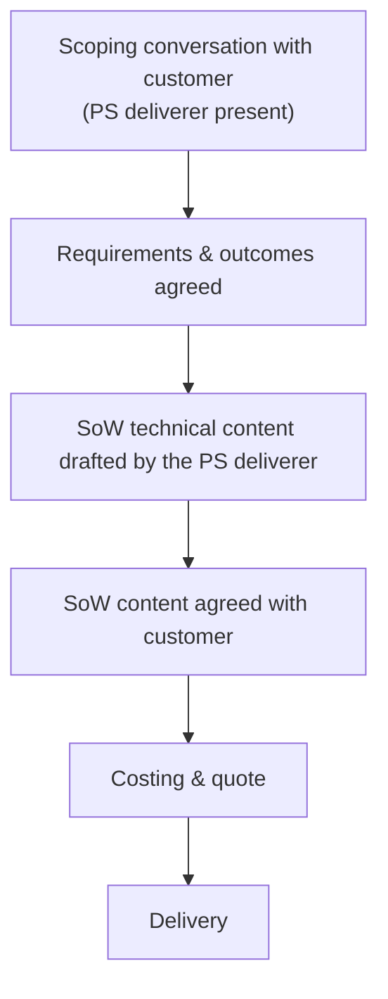

FlowFuse offers Professional Services (PS) to help customers deliver work that
goes beyond standard product support, such as migrations, integrations, and
solution builds. PS is scoped and captured in a Statement of Work (SoW),
separately from the subscription.

This page sets out how we scope a PS engagement and write the SoW. It exists to
stop two recurring problems: SoWs written from second-hand notes, and solutions
designed before we understand what the customer actually needs.

## Principles

Two rules govern every PS engagement.

### 1. Whoever writes and delivers the SoW takes part in scoping it with the customer

We do not write a SoW from a brief that someone else captured on our behalf. A
colleague's notes are useful background, but they are not a substitute for the
delivery person hearing the requirements first-hand. Detail and intent are lost
each time requirements are passed along, and the person responsible for delivery
is the one who needs to ask the follow-up questions.

In practice: before any SoW is drafted, the person who will write and deliver it
joins a scoping conversation with the customer. This can be part of a discovery
or technical call (see [Discovery Meeting](/handbook/sales/meetings/discovery/))
or a dedicated session. If that conversation has not happened, the SoW is not
ready to be written.

### 2. We agree what the customer needs before we propose how to build it

The "how" (the architecture, tooling, and implementation approach) comes after we
understand the outcome the customer wants and why. Settling on a solution before
scope is agreed leads to SoWs that solve the wrong problem.

Anyone is welcome to suggest approaches at any point, but until scope is agreed
those suggestions are non-binding options, not decisions. The PS deliverer owns
the final solution design. Presenting an early idea as the way we will build
something, before the need is understood, is the thing we are trying to avoid.

### 3. We do not discuss costing until the SoW content is agreed

Costing follows scope. We do not put a price or an estimate in front of the
customer, and no one commits to numbers on our behalf, until the technical
content of the SoW has been agreed with the customer. Discussing cost before the
work is defined either anchors the customer to a figure we cannot stand behind or
commits us to work we have not scoped. Once the SoW content is agreed, prepare
the costing and quote by following
[Engagements & Pricing](/handbook/sales/engagements/).

## The flow

## Writing the SoW

The SoW is written by the person who will deliver the work, grounded in what was
discussed with the customer. For commercials and quoting, follow
[Engagements & Pricing](/handbook/sales/engagements/).

- Lead with the technical scope and outcomes. Put commercials and costings last.
- Only list what is in scope. Do not add an out-of-scope section unless the
  matching item has been stated as in scope.
- Write for the customer. Keep internal shorthand out of it.
- Tie each deliverable back to a need raised in the scoping conversation.

## Sharing what we learn

If Professional Services are rendered, document the learnings in issues,
documentation, and blog content so that the information gleaned is available to
the rest of the organization and the public.
