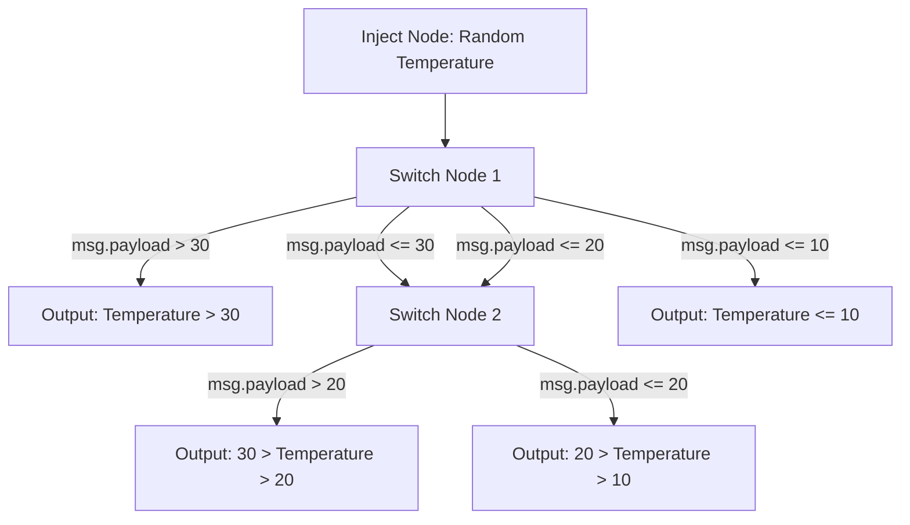
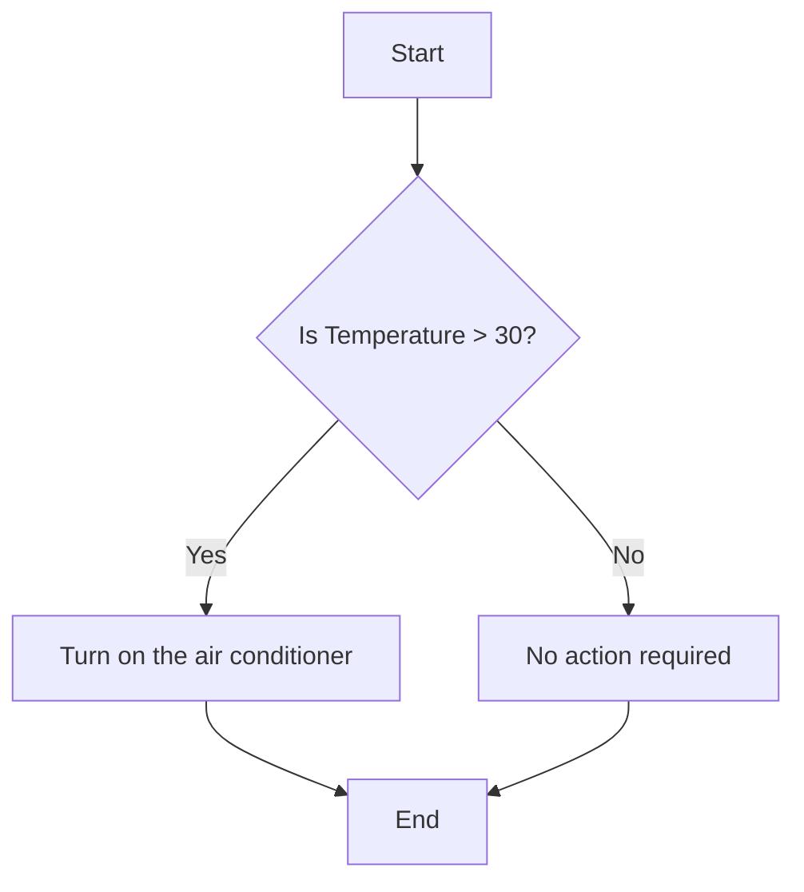
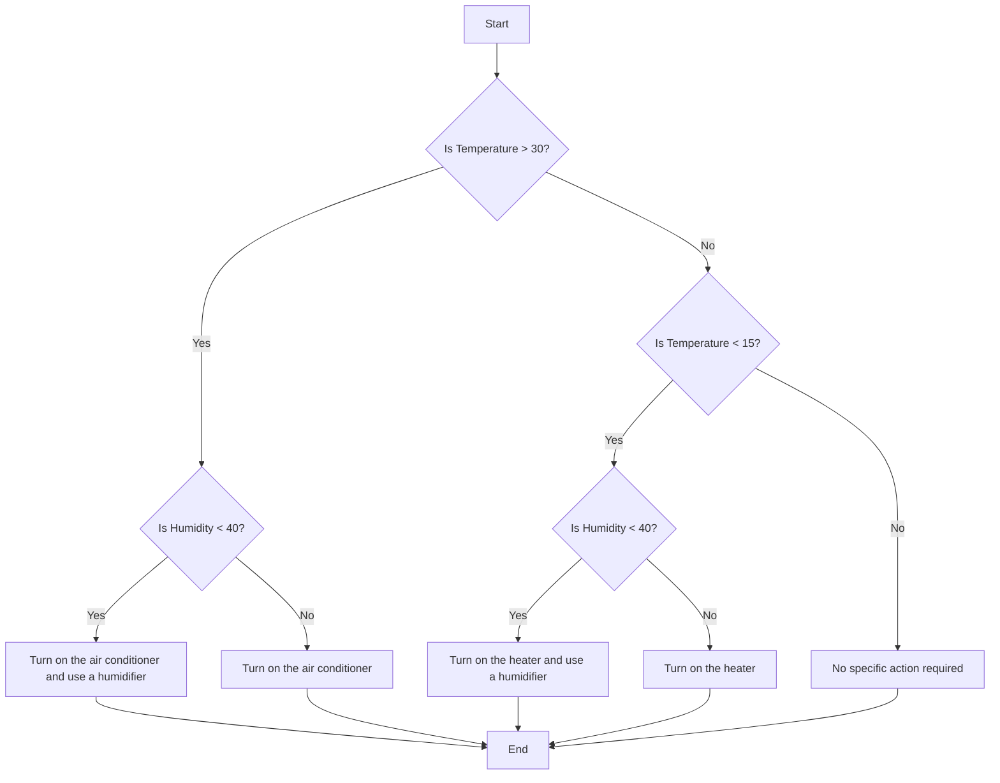

# {{meta.title}}

Human decision-making is often guided by a series of "if this, then that" choices—whether it's deciding what to wear based on the weather or determining the quickest route to work depending on traffic. This kind of logic is equally crucial in systems, especially those built in Node-RED. Just as we make decisions based on various factors, systems must evaluate conditions and choose the appropriate course of action.

When developing automated solutions in Node-RED, the ability to replicate this human-like decision-making process is essential. By implementing If-Else logic, your system can intelligently navigate different scenarios, adapting its behavior based on the inputs it receives. This guide will show you how to effectively incorporate If-Else logic into your Node-RED flows, ensuring your system can make smart, context-aware decisions—just like you would.

## Understanding If-Else Logic

The concept of If-Else logic emerged from the need for computers to make decisions. As programming languages developed, guiding a computer through different actions based on varying conditions became essential. This led to the creation of conditional statements, which allow programs to choose different paths depending on specific criteria.

### What is If-Else Logic?

If-Else logic is a way for programs to make decisions. It works like this:

- **If** a particular condition is true (e.g., "Is the temperature above 30°C?"), then execute a set of actions (e.g., "Turn on the air conditioner").
- **Else** (if the condition is not true), execute a different set of actions (e.g., "Turn off the air conditioner").

This approach allows systems to respond appropriately to different situations.

## Implementing Conditional Flows in Node-RED: A Practical Walkthrough

In Node-RED, implementing If-Else logic allows you to create dynamic and responsive flows that react to different inputs and conditions. Whether you're automating a smart home, managing IoT devices, or developing complex workflows, mastering conditional logic is essential for creating intelligent systems.

To implement If-Else logic in Node-RED, you can use the Switch node, which aligns perfectly with Node-RED's low-code approach. However, another way to achieve this is using the Function node, which offers more flexibility and control when writing custom JavaScript logic.

### Using Switch Node

The [Switch](/node-red/core-nodes/switch/) node in Node-RED is used for routing messages based on specific conditions, offering a straightforward, low-code approach to implementing conditional logic in your flows. The Switch node allows you to set up rules using a visual interface, making it ideal for users who prefer a more intuitive method for handling conditions. However, it’s important to note that the Switch node represents a different, independent concept known as the "[switch statement](https://developer.mozilla.org/en-US/docs/Web/JavaScript/Reference/Statements/switch)." While it serves a similar purpose to If-Else logic by building conditional flows, it operates under its own programming paradigm.

To demonstrate the Switch node, we'll set up a flow to make decisions based on the temperature value. We will route messages through different outputs based on temperature thresholds.

1. Drag the inject node onto the canvas and set the `msg.payload` to `$random() * 100` as JSONata expression; this inject node will simulate a temperature sensor by generating a random number.
2. Drag a Switch node onto the canvas. Double-click on it and set Property to `msg.payload`.
3. To add rules, click the + Add button at the bottom left of the configuration panel. You will see a prompt to select the condition and a prompt to enter the value to compare with. Add the following four rules and set it for "checking all rules":

    - Rule 1: `msg.payload > 30` 
    - Rule 2: `msg.payload <= 30` 
    - Rule 3: `msg.payload <= 20` 
    - Rule 4: `msg.payload <= 10`

4. Now drag another Switch node and connect its input to the output of Switch nodes 2 and 3. We are adding a second switch node because we need to route messages based on ranges. A single Switch node doesn’t allow multiple checks in one rule, so we need to use another Switch node to route the temperature based on ranges. Add the following rules and set it for "stopping after the first match":

    - Rule 1: `msg.payload > 20` 
    - Rule 2: `msg.payload > 10` 

5. Now drag the Debug nodes and connect them to the Switch nodes' outputs according to our example. For messages greater than 30, connect the Debug node to the first output of the first Switch node. For the range between 30 to 20, connect the Debug node to the first output of the second Switch node. For the range between 20 to 10, connect the Debug node to the second output of the second Switch node. Finally, for messages less than 10, connect the Debug node to the fourth output of the first Switch node.
6. Deploy the flow by clicking the "Deploy" button in the top-right corner of the Node-RED editor.
7. Once deployed, click the button on the Inject node to trigger it. The Debug nodes will show the routed messages based on the temperature value.

Notice how messages are routed through different outputs based on the temperature value. Now, you may ask how to update the message payload based on a condition. For that, you will need to use the Change node or the Function node.


_Node-RED flow using the Switch node to route messages based on temperature thresholds._


::render-flow
---
height: 200
flow: "W3siaWQiOiJiOTA3MjJhMjhmODFjMDE0IiwidHlwZSI6Imdyb3VwIiwieiI6IjljZjgyYjY4YmI4OWU4Y2UiLCJzdHlsZSI6eyJzdHJva2UiOiIjYjJiM2JkIiwic3Ryb2tlLW9wYWNpdHkiOiIxIiwiZmlsbCI6IiNmMmYzZmIiLCJmaWxsLW9wYWNpdHkiOiIwLjUiLCJsYWJlbCI6dHJ1ZSwibGFiZWwtcG9zaXRpb24iOiJudyIsImNvbG9yIjoiIzMyMzMzYiJ9LCJub2RlcyI6WyJkZDBkMzQzMmMzNDhlMWYyIiwiMjFiZDUzNTY4ODc3ZjNiNSIsIjUyNzdlMTg0ZmFhZDM3NWEiLCI3ZmJmMzc5MTYyMzZhOTYwIiwiYWFjMWY0NjE2OWU0MzFhYiIsIjNlYjI0YTYxMjlkOGZhOGUiLCIzNmU1MWQ0MmQzNGM5NTg3Il0sIngiOjE5NCwieSI6MTIxOSwidyI6ODkyLCJoIjozMjJ9LHsiaWQiOiJkZDBkMzQzMmMzNDhlMWYyIiwidHlwZSI6ImRlYnVnIiwieiI6IjljZjgyYjY4YmI4OWU4Y2UiLCJnIjoiYjkwNzIyYTI4ZjgxYzAxNCIsIm5hbWUiOiJoaWdoIHRlbXBlcmF0dXJlIiwiYWN0aXZlIjp0cnVlLCJ0b3NpZGViYXIiOnRydWUsImNvbnNvbGUiOmZhbHNlLCJ0b3N0YXR1cyI6ZmFsc2UsImNvbXBsZXRlIjoicGF5bG9hZCIsInRhcmdldFR5cGUiOiJtc2ciLCJzdGF0dXNWYWwiOiIiLCJzdGF0dXNUeXBlIjoiYXV0byIsIngiOjgxMCwieSI6MTI2MCwid2lyZXMiOltdfSx7ImlkIjoiMjFiZDUzNTY4ODc3ZjNiNSIsInR5cGUiOiJpbmplY3QiLCJ6IjoiOWNmODJiNjhiYjg5ZThjZSIsImciOiJiOTA3MjJhMjhmODFjMDE0IiwibmFtZSI6IlRlbXBlcmF0dXJlIiwicHJvcHMiOlt7InAiOiJwYXlsb2FkIn1dLCJyZXBlYXQiOiIiLCJjcm9udGFiIjoiIiwib25jZSI6ZmFsc2UsIm9uY2VEZWxheSI6MC4xLCJ0b3BpYyI6IiIsInBheWxvYWQiOiIkcmFuZG9tKCkqMTAwIiwicGF5bG9hZFR5cGUiOiJqc29uYXRhIiwieCI6MzEwLCJ5IjoxMzgwLCJ3aXJlcyI6W1siNTI3N2UxODRmYWFkMzc1YSJdXX0seyJpZCI6IjUyNzdlMTg0ZmFhZDM3NWEiLCJ0eXBlIjoic3dpdGNoIiwieiI6IjljZjgyYjY4YmI4OWU4Y2UiLCJnIjoiYjkwNzIyYTI4ZjgxYzAxNCIsIm5hbWUiOiIiLCJwcm9wZXJ0eSI6InBheWxvYWQiLCJwcm9wZXJ0eVR5cGUiOiJtc2ciLCJydWxlcyI6W3sidCI6Imd0IiwidiI6IjMwIiwidnQiOiJudW0ifSx7InQiOiJsdGUiLCJ2IjoiMzAiLCJ2dCI6Im51bSJ9LHsidCI6Imx0ZSIsInYiOiIyMCIsInZ0IjoibnVtIn0seyJ0IjoibHRlIiwidiI6IjEwIiwidnQiOiJudW0ifV0sImNoZWNrYWxsIjoidHJ1ZSIsInJlcGFpciI6ZmFsc2UsIm91dHB1dHMiOjQsIngiOjUzMCwieSI6MTM4MCwid2lyZXMiOltbImRkMGQzNDMyYzM0OGUxZjIiXSxbIjdmYmYzNzkxNjIzNmE5NjAiXSxbIjdmYmYzNzkxNjIzNmE5NjAiXSxbIjNlYjI0YTYxMjlkOGZhOGUiXV19LHsiaWQiOiI3ZmJmMzc5MTYyMzZhOTYwIiwidHlwZSI6InN3aXRjaCIsInoiOiI5Y2Y4MmI2OGJiODllOGNlIiwiZyI6ImI5MDcyMmEyOGY4MWMwMTQiLCJuYW1lIjoiIiwicHJvcGVydHkiOiJwYXlsb2FkIiwicHJvcGVydHlUeXBlIjoibXNnIiwicnVsZXMiOlt7InQiOiJndCIsInYiOiIyMCIsInZ0IjoibnVtIn0seyJ0IjoiZ3QiLCJ2IjoiMTAiLCJ2dCI6Im51bSJ9XSwiY2hlY2thbGwiOiJmYWxzZSIsInJlcGFpciI6ZmFsc2UsIm91dHB1dHMiOjIsIngiOjY3MCwieSI6MTM4MCwid2lyZXMiOltbImFhYzFmNDYxNjllNDMxYWIiXSxbIjM2ZTUxZDQyZDM0Yzk1ODciXV19LHsiaWQiOiJhYWMxZjQ2MTY5ZTQzMWFiIiwidHlwZSI6ImRlYnVnIiwieiI6IjljZjgyYjY4YmI4OWU4Y2UiLCJnIjoiYjkwNzIyYTI4ZjgxYzAxNCIsIm5hbWUiOiJmb3IgbWVkaXVtIHRlbXBlcmF0dXJlIiwiYWN0aXZlIjp0cnVlLCJ0b3NpZGViYXIiOnRydWUsImNvbnNvbGUiOmZhbHNlLCJ0b3N0YXR1cyI6ZmFsc2UsImNvbXBsZXRlIjoicGF5bG9hZCIsInRhcmdldFR5cGUiOiJtc2ciLCJzdGF0dXNWYWwiOiIiLCJzdGF0dXNUeXBlIjoiYXV0byIsIngiOjkzMCwieSI6MTM0MCwid2lyZXMiOltdfSx7ImlkIjoiM2ViMjRhNjEyOWQ4ZmE4ZSIsInR5cGUiOiJkZWJ1ZyIsInoiOiI5Y2Y4MmI2OGJiODllOGNlIiwiZyI6ImI5MDcyMmEyOGY4MWMwMTQiLCJuYW1lIjoiZm9yIHZlcnkgbG93IHRlbXBlcmF0dXJlIiwiYWN0aXZlIjp0cnVlLCJ0b3NpZGViYXIiOnRydWUsImNvbnNvbGUiOmZhbHNlLCJ0b3N0YXR1cyI6ZmFsc2UsImNvbXBsZXRlIjoicGF5bG9hZCIsInRhcmdldFR5cGUiOiJtc2ciLCJzdGF0dXNWYWwiOiIiLCJzdGF0dXNUeXBlIjoiYXV0byIsIngiOjgxMCwieSI6MTUwMCwid2lyZXMiOltdfSx7ImlkIjoiMzZlNTFkNDJkMzRjOTU4NyIsInR5cGUiOiJkZWJ1ZyIsInoiOiI5Y2Y4MmI2OGJiODllOGNlIiwiZyI6ImI5MDcyMmEyOGY4MWMwMTQiLCJuYW1lIjoiZm9yIGxvdyB0ZW1wZXJhdHVyZSIsImFjdGl2ZSI6dHJ1ZSwidG9zaWRlYmFyIjp0cnVlLCJjb25zb2xlIjpmYWxzZSwidG9zdGF0dXMiOmZhbHNlLCJjb21wbGV0ZSI6InBheWxvYWQiLCJ0YXJnZXRUeXBlIjoibXNnIiwic3RhdHVzVmFsIjoiIiwic3RhdHVzVHlwZSI6ImF1dG8iLCJ4Ijo5MTAsInkiOjE0MjAsIndpcmVzIjpbXX1d"
---
::


### Using Function Node

The [Function](/node-red/core-nodes/function/) node allows for more complex logic by writing JavaScript. It's suitable when you need more control, or multiple values must be checked together.

For demonstration purposes, let's use the temperature example where we determine whether to turn the air conditioner on or off based on the temperature:

1. Drag the inject node onto the canvas and set the `msg.payload` to `$random() * 100` as JSONata expression; this inject node will simulate a temperature sensor by generating a random number.
2. Drag the function node onto the canvas, double-click on it, and paste the following code into it:

    ```javascript
    let Temperature = msg.payload;
    if (Temperature > 30) {
        msg.payload = "Turn on the air conditioner";
    } else {
        msg.payload = "No action required";
    }
    return msg;
    ```

Before moving further, let's pause and understand what’s happening in the code and how `msg.payload` is being used.

In Node-RED, `msg.payload` is used to carry data through the flow. Initially, it holds the temperature value injected by the Inject node. The Function node then processes this value using If-Else logic. If the temperature exceeds 30°C, `msg.payload` is set to `"Turn on the air conditioner"`, indicating that the air conditioner should be turned on. If the temperature is 30°C or lower, `msg.payload` is set to `"No action required"`, signaling that the air conditioner should remain off. This updated `msg.payload` is then passed on to the next node, ensuring the system responds appropriately based on the temperature input.

Many people need clarification on the messaging system in Node-RED. For a deeper understanding of how messaging works in Node-RED, I recommend going through this document: [Node-RED Messaging Guide](/node-red/getting-started/node-red-messages/).

3. Next, drag the Debug node onto the canvas and connect it to the output of the Function node. This will allow you to see the results of your conditional logic in the Node-RED debug window.
4. Deploy the flow by clicking the "Deploy" button in the top-right corner of the Node-RED editor.
5. Once deployed, click the button on the Inject node to trigger it. You should see the output of the Function node in the debug window, which will show true or false depending on the temperature value.




::render-flow
---
height: 200
flow: "W3siaWQiOiI1MWZmYTc3ZTU1ZWI3ZjYzIiwidHlwZSI6Imdyb3VwIiwieiI6IjljZjgyYjY4YmI4OWU4Y2UiLCJzdHlsZSI6eyJzdHJva2UiOiIjYjJiM2JkIiwic3Ryb2tlLW9wYWNpdHkiOiIxIiwiZmlsbCI6IiNmMmYzZmIiLCJmaWxsLW9wYWNpdHkiOiIwLjUiLCJsYWJlbCI6dHJ1ZSwibGFiZWwtcG9zaXRpb24iOiJudyIsImNvbG9yIjoiIzMyMzMzYiJ9LCJub2RlcyI6WyIxOWZhMDkzNzRjMWJlN2M0IiwiZmY0MWVmMjE1ZDg2MGMxYSIsIjc3MzE3NWNiZTgwMTQzNzIiXSwieCI6MTU0LCJ5IjoyMDU5LCJ3Ijo2NzIsImgiOjgyfSx7ImlkIjoiMTlmYTA5Mzc0YzFiZTdjNCIsInR5cGUiOiJpbmplY3QiLCJ6IjoiOWNmODJiNjhiYjg5ZThjZSIsImciOiI1MWZmYTc3ZTU1ZWI3ZjYzIiwibmFtZSI6IlRlbXBlcmF0dXJlIiwicHJvcHMiOlt7InAiOiJwYXlsb2FkIn1dLCJyZXBlYXQiOiIiLCJjcm9udGFiIjoiIiwib25jZSI6ZmFsc2UsIm9uY2VEZWxheSI6MC4xLCJ0b3BpYyI6IiIsInBheWxvYWQiOiIkcmFuZG9tKCkqMTAwIiwicGF5bG9hZFR5cGUiOiJqc29uYXRhIiwieCI6MjcwLCJ5IjoyMTAwLCJ3aXJlcyI6W1siZmY0MWVmMjE1ZDg2MGMxYSJdXX0seyJpZCI6ImZmNDFlZjIxNWQ4NjBjMWEiLCJ0eXBlIjoiZnVuY3Rpb24iLCJ6IjoiOWNmODJiNjhiYjg5ZThjZSIsImciOiI1MWZmYTc3ZTU1ZWI3ZjYzIiwibmFtZSI6IlRlbXBlcmF0dXJlIFRocmVzaG9sZCBDaGVjayIsImZ1bmMiOiJsZXQgVGVtcGVyYXR1cmUgPSBtc2cucGF5bG9hZDtcbiAgICBpZiAoVGVtcGVyYXR1cmUgPiAzMCkge1xuICAgICAgICBtc2cucGF5bG9hZCA9IFwiVHVybiBvbiB0aGUgYWlyIGNvbmRpdGlvbmVyXCI7XG4gICAgfSBlbHNlIHtcbiAgICAgICAgbXNnLnBheWxvYWQgPSBcIk5vIGFjdGlvbiByZXF1aXJlZFwiO1xuICAgIH1cbnJldHVybiBtc2c7Iiwib3V0cHV0cyI6MSwidGltZW91dCI6MCwibm9lcnIiOjAsImluaXRpYWxpemUiOiIiLCJmaW5hbGl6ZSI6IiIsImxpYnMiOltdLCJ4Ijo1MTAsInkiOjIxMDAsIndpcmVzIjpbWyI3NzMxNzVjYmU4MDE0MzcyIl1dfSx7ImlkIjoiNzczMTc1Y2JlODAxNDM3MiIsInR5cGUiOiJkZWJ1ZyIsInoiOiI5Y2Y4MmI2OGJiODllOGNlIiwiZyI6IjUxZmZhNzdlNTVlYjdmNjMiLCJuYW1lIjoiUmVzdWx0IiwiYWN0aXZlIjp0cnVlLCJ0b3NpZGViYXIiOnRydWUsImNvbnNvbGUiOmZhbHNlLCJ0b3N0YXR1cyI6ZmFsc2UsImNvbXBsZXRlIjoicGF5bG9hZCIsInRhcmdldFR5cGUiOiJtc2ciLCJzdGF0dXNWYWwiOiIiLCJzdGF0dXNUeXBlIjoiYXV0byIsIngiOjczMCwieSI6MjEwMCwid2lyZXMiOltdfV0="
---
::


_Node-RED flow using the Function node to implement simple If-Else logic for temperature control._

### Handling Multiple Flows with Node-RED's Function Node

We’ve seen how to handle a simple one-way flow using If-Else logic with a function node, but what if you need to direct messages along different paths based on various conditions or evaluate multiple values while using a function node? In such cases, the Function node in Node-RED provides the flexibility to write complete JavaScript code, enabling more complex decision-making. Additionally, the Function node supports setting it for multiple output ports, which allows you to route messages to different destinations based on various conditions.

Let’s update our example to handle multiple values. In this scenario, we will incorporate both temperature and humidity into our decision-making process. We will use multiple output ports in the Function node to route messages based on different conditions.

1. Drag another inject node onto the canvas, set `msg.payload.temperature` to `$random() * 100` as the JSONata expression and `msg.payload.humidity` to `$random() * 100`.
2. Drag another function node onto the canvas, double-click on it, switch to the "Setup" tab, and increase the number of output ports to match the number of conditions you will handle. For our example, increase the number of outputs to 4 and click Done.

    ```javascript
    let Temperature = msg.payload.temperature;
    let Humidity = msg.payload.humidity;

    // Initialize output array
    let outputs = [null, null, null, null];

    if (Temperature > 30 && Humidity < 40) {
        // High temperature and low humidity
        outputs[0] = { payload: "High temperature and low humidity: Turn on the air conditioner and use a humidifier" };
    } else if (Temperature > 30 && Humidity >= 40) {
        // High temperature and high humidity
        outputs[1] = { payload: "High temperature and high humidity: Turn on the air conditioner" };
    } else if (Temperature < 15 && Humidity < 40) {
        // Low temperature and low humidity
        outputs[2] = { payload: "Low temperature and low humidity: Turn on the heater and use a humidifier" };
    } else if (Temperature < 15 && Humidity >= 40) {
        // Low temperature and high humidity
        outputs[3] = { payload: "Low temperature and high humidity: Turn on the heater" };
    }

    return outputs;
    ```

Now, you will see that the Function node has four outputs, each corresponding to the sequence of conditions we have written. For example, the message for the first condition will appear at the first output of the Function node, the message for the second condition will appear at the second output, and so on.

Regarding the outputs being sent, the Function node initializes an array with `null` values to ensure all outputs are accounted for. When a specific condition is met, the corresponding index in this array is updated with the desired message. For example, if the temperature is high and the humidity is low, the message will be set at `outputs[0]`, which is the first output. If no condition is met, the output remains `null`, meaning nothing is sent for that output, ensuring only the relevant outputs are populated with messages.

3. Next, drag four Debug nodes onto the canvas. Connect each Debug node to one of the outputs from the Function node. This setup will allow you to see the messages routed through each output in the Debug panel.
4. Deploy the flow by clicking the "Deploy" button in the top-right corner of the Node-RED editor.
5. Once deployed, click the button on the Inject node to trigger it.


_Node-RED flow using the Function node with multiple outputs for handling various conditions like temperature and humidity._


::render-flow
---
height: 200
flow: "W3siaWQiOiIzMDFhMzFiMDk3MmIwYjIwIiwidHlwZSI6Imdyb3VwIiwieiI6IjljZjgyYjY4YmI4OWU4Y2UiLCJzdHlsZSI6eyJzdHJva2UiOiIjYjJiM2JkIiwic3Ryb2tlLW9wYWNpdHkiOiIxIiwiZmlsbCI6IiNmMmYzZmIiLCJmaWxsLW9wYWNpdHkiOiIwLjUiLCJsYWJlbCI6dHJ1ZSwibGFiZWwtcG9zaXRpb24iOiJudyIsImNvbG9yIjoiIzMyMzMzYiJ9LCJub2RlcyI6WyJkYmQwODVlZDYwN2U0MWRlIiwiMzFkMmU4ZjBjODcxMTQzZCIsImIxNjliZjM4NWNhODVmNmMiLCJhYTdhYjY0NTJmNGE3NzkxIiwiY2MzZTZlMmM3MDY0M2Y2ZiIsIjgwMDUwOGU0MjhkNzRmNWYiXSwieCI6MTE0LCJ5Ijo3MTksInciOjgzMiwiaCI6MjAyfSx7ImlkIjoiZGJkMDg1ZWQ2MDdlNDFkZSIsInR5cGUiOiJpbmplY3QiLCJ6IjoiOWNmODJiNjhiYjg5ZThjZSIsImciOiIzMDFhMzFiMDk3MmIwYjIwIiwibmFtZSI6IlRlbXBlcmF0dXJlICYmIEh1bWlkaXR5IiwicHJvcHMiOlt7InAiOiJwYXlsb2FkLnRlbXBlcmF0dXJlIiwidiI6IiRyYW5kb20oKSAqIDEwMCIsInZ0IjoianNvbmF0YSJ9LHsicCI6InBheWxvYWQuaHVtaWRpdHkiLCJ2IjoiJHJhbmRvbSgpICogMTAwIiwidnQiOiJqc29uYXRhIn1dLCJyZXBlYXQiOiIiLCJjcm9udGFiIjoiIiwib25jZSI6ZmFsc2UsIm9uY2VEZWxheSI6MC4xLCJ0b3BpYyI6IiIsIngiOjI3MCwieSI6ODIwLCJ3aXJlcyI6W1siMzFkMmU4ZjBjODcxMTQzZCJdXX0seyJpZCI6IjMxZDJlOGYwYzg3MTE0M2QiLCJ0eXBlIjoiZnVuY3Rpb24iLCJ6IjoiOWNmODJiNjhiYjg5ZThjZSIsImciOiIzMDFhMzFiMDk3MmIwYjIwIiwibmFtZSI6IlRlbXAvSHVtaWRpdHkgRGVjaXNpb24gRW5naW5lIiwiZnVuYyI6ImxldCBUZW1wZXJhdHVyZSA9IG1zZy5wYXlsb2FkLnRlbXBlcmF0dXJlO1xubGV0IEh1bWlkaXR5ID0gbXNnLnBheWxvYWQuaHVtaWRpdHk7XG5cbi8vIEluaXRpYWxpemUgb3V0cHV0IGFycmF5XG5sZXQgb3V0cHV0cyA9IFtudWxsLCBudWxsLCBudWxsLCBudWxsXTtcblxuaWYgKFRlbXBlcmF0dXJlID4gMzAgJiYgSHVtaWRpdHkgPCA0MCkge1xuICAgIC8vIEhpZ2ggdGVtcGVyYXR1cmUgYW5kIGxvdyBodW1pZGl0eVxuICAgIG91dHB1dHNbMF0gPSB7IHBheWxvYWQ6IFwiSGlnaCB0ZW1wZXJhdHVyZSBhbmQgbG93IGh1bWlkaXR5OiBUdXJuIG9uIHRoZSBhaXIgY29uZGl0aW9uZXIgYW5kIHVzZSBhIGh1bWlkaWZpZXJcIiB9O1xufSBlbHNlIGlmIChUZW1wZXJhdHVyZSA+IDMwICYmIEh1bWlkaXR5ID49IDQwKSB7XG4gICAgLy8gSGlnaCB0ZW1wZXJhdHVyZSBhbmQgaGlnaCBodW1pZGl0eVxuICAgIG91dHB1dHNbMV0gPSB7IHBheWxvYWQ6IFwiSGlnaCB0ZW1wZXJhdHVyZSBhbmQgaGlnaCBodW1pZGl0eTogVHVybiBvbiB0aGUgYWlyIGNvbmRpdGlvbmVyXCIgfTtcbn0gZWxzZSBpZiAoVGVtcGVyYXR1cmUgPCAxNSAmJiBIdW1pZGl0eSA8IDQwKSB7XG4gICAgLy8gTG93IHRlbXBlcmF0dXJlIGFuZCBsb3cgaHVtaWRpdHlcbiAgICBvdXRwdXRzWzJdID0geyBwYXlsb2FkOiBcIkxvdyB0ZW1wZXJhdHVyZSBhbmQgbG93IGh1bWlkaXR5OiBUdXJuIG9uIHRoZSBoZWF0ZXIgYW5kIHVzZSBhIGh1bWlkaWZpZXJcIiB9O1xufSBlbHNlIGlmIChUZW1wZXJhdHVyZSA8IDE1ICYmIEh1bWlkaXR5ID49IDQwKSB7XG4gICAgLy8gTG93IHRlbXBlcmF0dXJlIGFuZCBoaWdoIGh1bWlkaXR5XG4gICAgb3V0cHV0c1szXSA9IHsgcGF5bG9hZDogXCJMb3cgdGVtcGVyYXR1cmUgYW5kIGhpZ2ggaHVtaWRpdHk6IFR1cm4gb24gdGhlIGhlYXRlclwiIH07XG59XG5cbnJldHVybiBvdXRwdXRzOyIsIm91dHB1dHMiOjQsInRpbWVvdXQiOjAsIm5vZXJyIjowLCJpbml0aWFsaXplIjoiIiwiZmluYWxpemUiOiIiLCJsaWJzIjpbXSwieCI6NTcwLCJ5Ijo4MjAsIndpcmVzIjpbWyJiMTY5YmYzODVjYTg1ZjZjIl0sWyJhYTdhYjY0NTJmNGE3NzkxIl0sWyJjYzNlNmUyYzcwNjQzZjZmIl0sWyI4MDA1MDhlNDI4ZDc0ZjVmIl1dfSx7ImlkIjoiYjE2OWJmMzg1Y2E4NWY2YyIsInR5cGUiOiJkZWJ1ZyIsInoiOiI5Y2Y4MmI2OGJiODllOGNlIiwiZyI6IjMwMWEzMWIwOTcyYjBiMjAiLCJuYW1lIjoiT3V0cHV0IDEiLCJhY3RpdmUiOnRydWUsInRvc2lkZWJhciI6dHJ1ZSwiY29uc29sZSI6ZmFsc2UsInRvc3RhdHVzIjpmYWxzZSwiY29tcGxldGUiOiJwYXlsb2FkIiwidGFyZ2V0VHlwZSI6Im1zZyIsInN0YXR1c1ZhbCI6IiIsInN0YXR1c1R5cGUiOiJhdXRvIiwieCI6ODQwLCJ5Ijo3NjAsIndpcmVzIjpbXX0seyJpZCI6ImFhN2FiNjQ1MmY0YTc3OTEiLCJ0eXBlIjoiZGVidWciLCJ6IjoiOWNmODJiNjhiYjg5ZThjZSIsImciOiIzMDFhMzFiMDk3MmIwYjIwIiwibmFtZSI6Ik91dHB1dCAyIiwiYWN0aXZlIjp0cnVlLCJ0b3NpZGViYXIiOnRydWUsImNvbnNvbGUiOmZhbHNlLCJ0b3N0YXR1cyI6ZmFsc2UsImNvbXBsZXRlIjoicGF5bG9hZCIsInRhcmdldFR5cGUiOiJtc2ciLCJzdGF0dXNWYWwiOiIiLCJzdGF0dXNUeXBlIjoiYXV0byIsIngiOjg0MCwieSI6ODAwLCJ3aXJlcyI6W119LHsiaWQiOiJjYzNlNmUyYzcwNjQzZjZmIiwidHlwZSI6ImRlYnVnIiwieiI6IjljZjgyYjY4YmI4OWU4Y2UiLCJnIjoiMzAxYTMxYjA5NzJiMGIyMCIsIm5hbWUiOiJPdXRwdXQgMyIsImFjdGl2ZSI6dHJ1ZSwidG9zaWRlYmFyIjp0cnVlLCJjb25zb2xlIjpmYWxzZSwidG9zdGF0dXMiOmZhbHNlLCJjb21wbGV0ZSI6InBheWxvYWQiLCJ0YXJnZXRUeXBlIjoibXNnIiwic3RhdHVzVmFsIjoiIiwic3RhdHVzVHlwZSI6ImF1dG8iLCJ4Ijo4NDAsInkiOjg0MCwid2lyZXMiOltdfSx7ImlkIjoiODAwNTA4ZTQyOGQ3NGY1ZiIsInR5cGUiOiJkZWJ1ZyIsInoiOiI5Y2Y4MmI2OGJiODllOGNlIiwiZyI6IjMwMWEzMWIwOTcyYjBiMjAiLCJuYW1lIjoiT3V0cHV0IDQiLCJhY3RpdmUiOnRydWUsInRvc2lkZWJhciI6dHJ1ZSwiY29uc29sZSI6ZmFsc2UsInRvc3RhdHVzIjpmYWxzZSwiY29tcGxldGUiOiJwYXlsb2FkIiwidGFyZ2V0VHlwZSI6Im1zZyIsInN0YXR1c1ZhbCI6IiIsInN0YXR1c1R5cGUiOiJhdXRvIiwieCI6ODQwLCJ5Ijo4ODAsIndpcmVzIjpbXX1d"
---
::


## Choosing Between the Function Node and Switch Node

When deciding between the Function node and the Switch node in Node-RED, it is essential to consider the complexity of your logic and the nature of the message routing you require.

The Function node excels in scenarios where complex logic and detailed message processing are necessary. It allows for writing custom JavaScript code, which can handle sophisticated conditions and perform calculations. This node is particularly useful when you need to make intricate decisions based on multiple values or when you need to perform detailed updates to the `msg` object. For instance, if your flow requires combining data from different sources, applying complex rules, or modifying multiple properties of `msg.payload`, the Function node offers the flexibility and power to accomplish these tasks.

In contrast, the Switch node is designed for simpler, value-based routing. It is ideal for straightforward scenarios where you need to route messages based on a single value with multiple possible outputs. This node enables you to create rules based on specific values or conditions without the need for complex logic or extensive message modifications. If your routing logic involves basic comparisons and does not require advanced processing or calculations, the Switch node provides a more streamlined and intuitive approach.

In summary, choose the Function node for intricate decision-making and detailed message processing, while the Switch node is better suited for scenarios where simple value-based routing is sufficient.