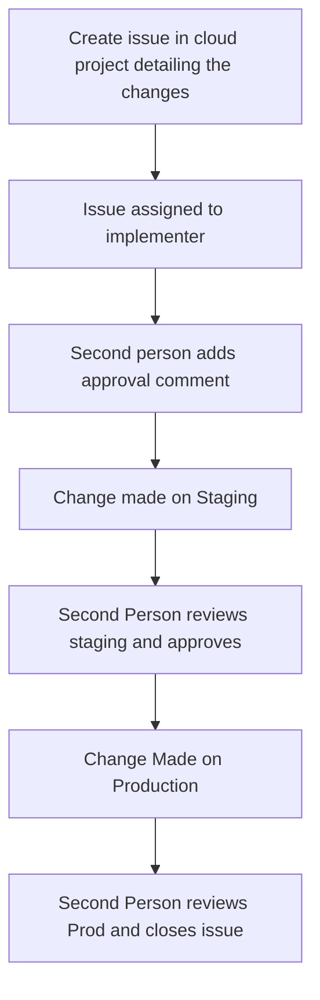

# Change Control

We have a simple change control process for flowforge.cloud

Any configuration is changed or new code deployment must go through the following steps.

The key points here are:
- This is a 2 person process, someone to implement and someone to review
- All changes are recorded 

