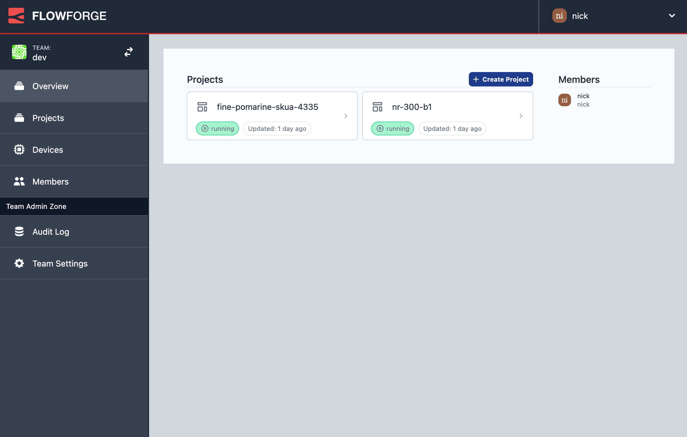

The cycle continues with our next regularly scheduled release, bringing a fresh
new look to the platform.

<!--more-->

Since joining the team, Joe has been hard at work bringing a more consistent
design language to what we're doing. This release brings a lot of his hardwork
to the platform itself.

There's more to be done on the individual pages of the platform, but this
gives us a solid framework to build on.

 - [Epic #430 - Rebrand Forage App](https://github.com/FlowFuse/flowfuse/issues/430)

### Copying Projects

One of the usage scenarios we want to support is having an easy way to have separate
test and production environments. The previous release added the ability to configure
environment variables on individual projects.

This release unlocks the next piece of the puzzle - making it easy to copy flows
between projects.

The Project settings page has two new options:

 - Copy Project lets you create a complete copy of the project.
 - Export to existing project lets you copy over selected aspects of the project
   over to another project.

In both cases, you get to pick what parts of the project should be copied.

 - [Epic #268 - Export Project](https://github.com/FlowFuse/flowfuse/issues/268)
 - [Story #271 - Duplicate Project](https://github.com/FlowFuse/flowfuse/issues/271)
 - [Story #272 - Export to Existing Project](https://github.com/FlowFuse/flowfuse/issues/272)

### Improve Billing Information

We've been getting some great feedback from the users of FlowFuse Cloud. One of the
areas we identified as needing some more clarity was around the point users are
asked to setup their billing information.

 - [Story #563 - Improve Information on billing](https://github.com/FlowFuse/flowfuse/issues/563)

### Edge Devices

Whilst we always want to deliver new functionality to end users in each release,
sometimes bits of work don't fit naturally into a single four week iteration.

That's the case here with some of the preliminary work we've done to introduce
the idea of Edge Devices to the platform.

The goal here is to provide a way to easily deploy and manage Node-RED projects
on remote devices.

This release introduces a bunch of work to the core app and front-end to begin
introducing the concept of a Device. It includes the basic workflows for registering
a device on the platform and being able to assign it to a team.

The whole feature is hidden behind a feature flag so users on FlowFuse Cloud won't
see any of this quite yet.

The next release will introduce the Edge Agent piece of this - the bit that runs
on devices.

- [Epic #446 - Devices](https://github.com/FlowFuse/flowfuse/issues/446)

### Upgrading FlowFuse

If you installed a previous version of FlowFuse  and want to upgrade, our documentation provides a
guide for [upgrading FlowFuse on a local server](/docs/upgrade/#upgrading-flowfuse).

### Getting help

If you hit any problems with the platform, or have questions to ask, please do
raise an [issue on GitHub](https://github.com/FlowFuse/flowfuse/issues).

That also includes if you have any feedback or feature requests.

We also have a `#flowfuse` channel on the [Node-RED Slack workspace](https://nodered.org/slack).
