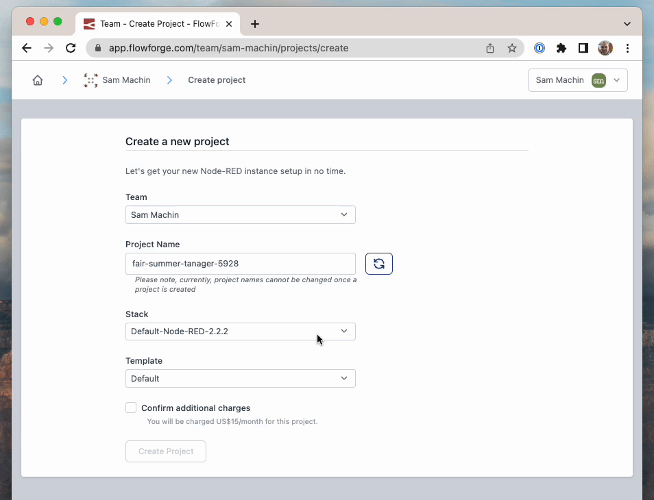

The first beta of Node-RED 3.0 is here and FlowFuse is ready for you to try it out.
<!--more-->

When we released [FlowFuse 0.4](/blog/2022/04/flowforge-04-released/) last month we talked about allowing users to select the stack their project runs on.
Until now we've only offered one stack which has been the latest Node-RED release (2.2.2).

Yesterday the first beta of Node-RED 3.0 was [released](https://discourse.nodered.org/t/node-red-3-0-0-beta-1-released/62124), so as of today we have added a choice of stacks to FlowFuse Cloud. You can stick with the _Default_ and use Node-RED 2.2.2 or if you want to try out the beta you can select _Node-RED-3.0.0-beta-1_.

FlowFuse is the best way to run multiple Node-RED instances at different versions. Beta releases are exciting to try out, but you don't want to risk your production applications with an early upgrade. FlowFuse makes it easy to create a new project to try things out.

We'll continue to update the stack choice with each beta when they are released.
