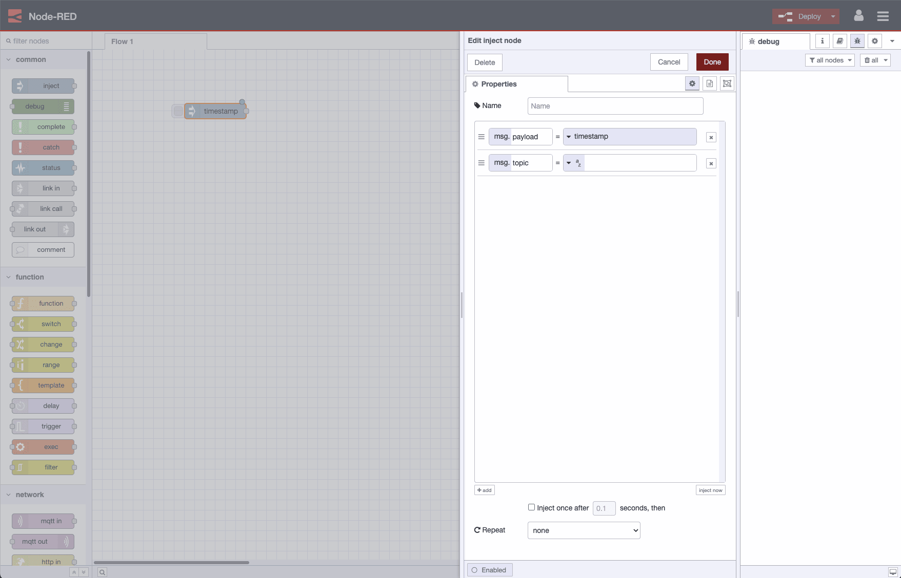

Rollback projects to a previous snapshot, improvements in using Devices, and more.

<!--more-->

Keep reading for  the details of whats in this release our you can watch our 1 min roundup video of the new release above. 

We're pleased to announce version 0.7 is now available. the next release of the FlowFuse application.

## Features
[Rollback](https://github.com/FlowFuse/flowfuse/issues/587)
FlowFuse is about running Node-RED at any scale, part of that scale is having multiple users collaborate on the same project. When you are collaborating with people it's important to be able to go back in time to a known working state. As part of that we are introducing rollbacks, this means that you can now take a snapshot of your project at a point in time and then make changes safe in the knowledge that you can rollback to that previous snapshot if you need to.

[Device Environment Variables](https://github.com/FlowFuse/flowfuse/issues/680)
In the last release we introduced the concept of devices. We're already learning from how these are used and one feature we've added in 0.7 is Device Environment Variables. You have been able to set Environment Variables at the project level but when deploying a snapshot to multiple devices you may want to override these values for each device, for example to set a site ID. With device specific variable users are enabled to differentiate based on the context in their flows.

[FlowFuse Theme](https://github.com/FlowFuse/flowforge-nr-theme/)
Now that we have a stronger visual identity in the Forge application we have continued that work through to the Node-RED editor. If you create or upgrade a project with a Node-RED 3.0 stack you will see a different theme in the editor. It's still very much Node-RED but just has some subtle hints to tie it back to the FlowFuse application. We will continue to iterate on this to further integrate the experience between FlowFuse and Node-RED in both directions.

[ProjectTypes](https://github.com/FlowFuse/flowfuse/issues/380)
The introduction of ProjectTypes is a way to group Stacks together that share common characteristics - such as memory/cpu limits, or the availability of particular features. In platforms with billing enabled, such as our own FlowFuse Cloud, the ProjectTypes can have different price points set on them. Within FlowFuse Cloud, you'll see we've introduced the Small ProjectType - which applies to all existing projects on the platform.

[Stack Versions](https://github.com/FlowFuse/flowfuse/issues/694)
This allows an admin to link different stacks together in their lineage. This allows administrators to nudge users to new Node-RED versions or upgrade pre-installed dependencies when running in a container environment. Any users with projects on an old version will be prompted that there is an update available, making it even easier to stay up to date with Node-RED versions when you build your flows on FlowFuse.

## Improvements
We've made a number of improvements to the overall experience of running FlowFuse.
- The Team Switch menu has been moved to a more prominent position in the interface, this also makes it easier to see how to create a new team. [#616](https://github.com/FlowFuse/flowfuse/issues/616)
- Notifications have had an overhaul, you will now see waiting invites on all pages. [#515](https://github.com/FlowFuse/flowfuse/issues/515)
- If you are running your own copy of FlowFuse you can now see the version details in the admin pages [#655](https://github.com/FlowFuse/flowfuse/issues/655)
- Device polling is no longer an INFO level message  filling the log on your devices [#10](https://github.com/FlowFuse/device-agent/issues/10)

## Bug Fixes
We've fixed the following bugs in this release.
- [Devices now listen on all Interfaces allowing you to run local http servers](https://github.com/FlowFuse/device-agent/issues/7) 
- [Solved an issue where a device gets an error  unknown device](https://github.com/FlowFuse/device-agent/issues/7) 
- [The Audit Log in the Forge app displays the correct IP when a user logs in to Node-RED](https://github.com/FlowFuse/flowfuse/issues/507) 
- [Resolved an issue with devices downloading snaphots from legacy stacks](https://github.com/FlowFuse/flowfuse/issues/507) 
- [Fixed an error where objects in the Node-RED log would hang the log page](https://github.com/FlowFuse/flowfuse/issues/735) 
- [Next Billing Date is now shown correctly](https://github.com/FlowFuse/flowfuse/issues/745) 
- [Fixed a bug where the loading page would flash during polling](https://github.com/FlowFuse/flowfuse/issues/689) 

### Upgrading FlowFuse

[FlowFuse Cloud]({{ site.appURL }}) is already running 0.7 - ready for
you to try out rollbacks and the new theme. 

If you installed a previous version of FlowFuse and want to upgrade, our documentation provides a
guide for [upgrading FlowFuse on a local server](/docs/upgrade/#upgrading-flowfuse).

### Getting help

If you hit any problems with the platform, or have questions to ask, please do
raise an [issue on GitHub](https://github.com/FlowFuse/flowfuse/issues).
That also includes if you have any feedback or feature requests.

Customers of FlowFuse Cloud can raise a ticket by emailing support@flowfuse.com

We also have a `#flowfuse` channel on the [Node-RED Slack workspace](https://nodered.org/slack).
