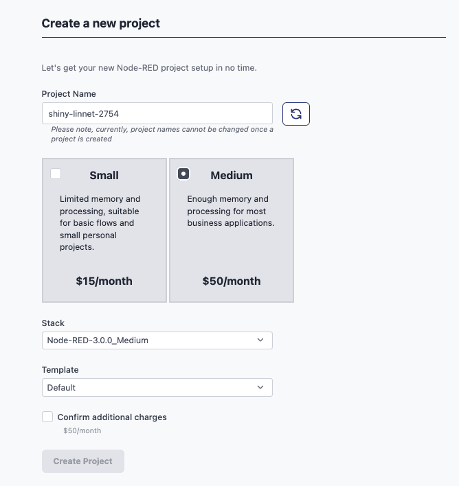

We've added a second size of project to FlowForge Cloud. A bigger project type with more resources available to it.
<!--more-->

Our [0.7 release](https://flowforge.com/blog/2022/07/flowforge-07-released/) introduced the concept of Project Types. This allows platforms to provide different sizes of projects, varying the memory/cpu or features available within a given type.

Today we've put this feature to work on FlowForge Cloud by introducing the new **Medium Project** type.

Medium projects have 3 times the resources of the existing Small type, allowing for more complex flows and larger message objects. This will be useful to business users looking to process complex sets of data.

Our Medium project is priced at $50 a month and we'll be adding new features to this project type in the coming months to further enhance the value of this new tier.

We don't currently support directly upgrading a project between types, but that is in the [plan for the future](https://github.com/flowforge/flowforge/issues/595). In the meantime, you can use the 'Export Project' feature on a project's settings tab to copy it over into a new Medium type project.

