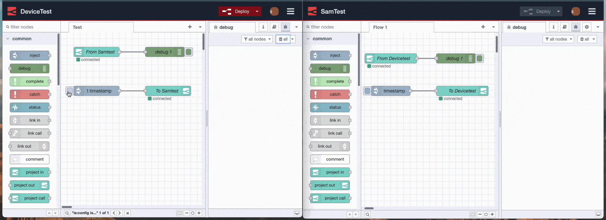

Easily pass messages between your projects on the cloud or devices, UX improvements, and more.

<!--more-->

Keep reading for  the details of whats in this release our you can watch our 1 minute roundup video of the new release above. 

We're pleased to announce version 0.8 is now available. The next release of the FlowFuse application containing new features, a number of improvements, and bug fixes.

## Features
[Project Link Nodes](https://github.com/FlowFuse/flowfuse/issues/662)
We've introduced our first custom FlowFuse nodes to the palette of new projects. The Project Link nodes allow you to easily pass data between different projects within the same team. 
These projects can be running in the cloud or on devices, with the communication powered by our own internal MQTT broker.
Try these out today on FlowFuse Cloud by creating a new project or updating your existing project's stack. There's more information in the [README](https://github.com/FlowFuse/nr-project-nodes/blob/main/README.md) for the nodes.
For local installs of FlowFuse, the nodes are only available with an Enterprise Edition license.

[Start & Stop Flows](https://github.com/FlowFuse/flowfuse/issues/839)
Node-RED 3.0 [introduced a new feature](https://nodered.org/blog/2022/07/14/version-3-0-released#editing-stopped-flows) that allows you to stop your flows from processing requests while still being able to work in the editor and deploy changes. We've now enabled this feature within FlowFuse for projects running a Node-RED 3.x stack.

[Default Team](https://github.com/FlowFuse/flowfuse/issues/298)
If you are a member of multiple teams you can now set your preferred default saving you from having to change teams each time you log in.

## Improvements
We've made a number of improvements to the overall experience of running FlowFuse.

- Devices now communicate to the Forge application over MQTT instead of polling [#754](https://github.com/FlowFuse/flowfuse/issues/754). You'll need to update your Device Agent to the latest version to take advantage of this.
- The table views have had a major overhaul allowing you to sort and search items [#28](https://github.com/FlowFuse/forge-ui-components/issues/28)
- If the application receives an error you now see a notification in the UI. [#771](https://github.com/FlowFuse/flowfuse/issues/771)
- The Verification email page has been cleaned up [#718](https://github.com/FlowFuse/flowfuse/issues/718)
- The initial Thank-you page has been cleaned up [#648](https://github.com/FlowFuse/flowfuse/issues/648)

## Bug Fixes
We've fixed the following bugs in this release.
- [Logo Distorted in Safari](https://github.com/FlowFuse/flowfuse/issues/793) 
- [LocalFS Install doesn't check for Build Tools](https://github.com/FlowFuse/flowfuse/issues/729) 
- [Users with Expired passwords can create teams](https://github.com/FlowFuse/flowfuse/pull/842) 
- [Click-jacking Vulnerability](https://github.com/FlowFuse/flowfuse/pull/790)
- [Users with can create teams without verifying email](https://github.com/FlowFuse/flowfuse/pull/824) 
- [Occasional Timeout when deploying flows](https://github.com/FlowFuse/flowforge-nr-storage/issues/17) 
- [Notification of member deletion contains internal ID](https://github.com/FlowFuse/flowfuse/issues/833) 
- [Pressing Enter in the Team Delete modal triggers cancel](https://github.com/FlowFuse/flowfuse/issues/334) 
- [Node-RED Isn't ready when Forge app says it is running (Docker)](https://github.com/FlowFuse/flowfuse/issues/751) 

## Contributors
We'd like the thank the following for their contributions to this release:

 - [HaroldPetersInskipp](https://github.com/HaroldPetersInskipp) helped [updating our documentation](https://github.com/FlowFuse/flowfuse/pull/812)
 - [Steveorevo](https://github.com/Steveorevo) also [updated our documentation](https://github.com/FlowFuse/flowfuse/pull/818)

As an open-source project, we welcome the community involvement in what we're building. If you're interested in contributing, checkout our [guide in the docs](/docs/contribute/).

### Upgrading FlowFuse

[FlowFuse Cloud]({{ site.appURL }}) is already running 0.8 and the stacks updated. Upgrade your project stacks to the latest version and start using the Project Link nodes now.

If you installed a previous version of FlowFuse and want to upgrade, our documentation provides a
guide for [upgrading FlowFuse on a local server](/docs/upgrade/#upgrading-flowfuse).

### Getting help

If you hit any problems with the platform, or have questions to ask, please do
raise an [issue on GitHub](https://github.com/FlowFuse/flowfuse/issues).
That also includes if you have any feedback or feature requests.

Customers of FlowFuse Cloud can raise a ticket by emailing support@flowfuse.com

We also have a `#flowfuse` channel on the [Node-RED Slack workspace](https://nodered.org/slack).
