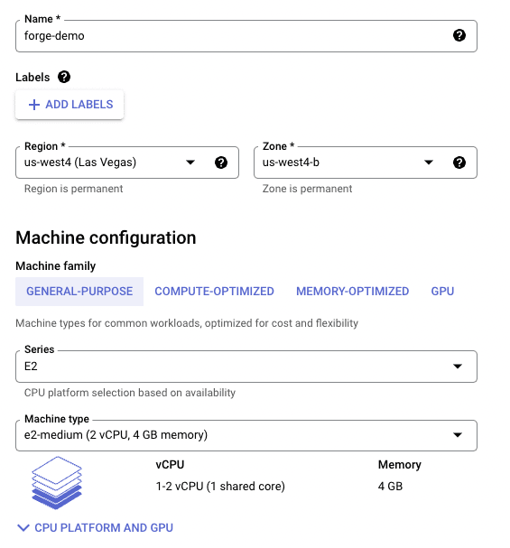
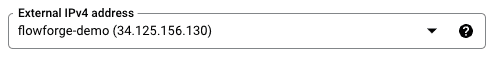

As part of our preparations for FlowFuse 1.0 we have been testing various real world scenarios to see where we can add to our documentation and where we might be able to improve our releases to make the install process easier for users. As a benefit of that testing we have been able to hone these installation processes and we wanted to share one of those with you today.
<!--more-->

In this first of three articles, we are going to run through the process for installing FlowFuse on Google Cloud Platform (GCP) within a virtual machine (VM) using Docker.

We have set ourselves the goal of delivering a production environment. We want this installation benefit from:

- Email alerts (emails to users when they are added to teams etc)
- HTTPS access to the install
- FlowFuse [Device](/docs/user/concepts/#device) deployment via the included MQTT server that comes in our Docker build

We will follow up with a second article covering the process of getting HTTPS running then we will close out the series by covering how to use key features of FlowFuse including [Devices](/docs/user/concepts/#device).

# Prerequisites

- A domain name - We've registered flowforge-demo.com to demonstrate these steps
- A DNS provider - Our Domain registrar provides a basic DNS service for free
- A GCP account - Google will often give you free service credits on sign up so setting up FlowFuse on GCP should not cost you anything for at least a few weeks
- An email provider which will allow SMTP connections to send email - To manage users on your FlowFuse platform you will need to be able to send emails to them. We have used a Google Workspace account for this purpose

# GCP VM Creation

Create a GCP account, once logged in navigate to Compute Engine then VM Instances. Select Create Instance you should now be [here](https://console.cloud.google.com/compute/instancesAdd?project).

Give your instance a name, select a Region and Zone. I have found that the default machine configuration works fine but depending on your project you may wish to change the resources.



You now need to allow access to your FlowFuse installation from the internet. In the Firewall section tick Allow HTTP traffic and Allow HTTPS traffic.


Next up, assigna static IP address to the VM. Click Advanced options, then Networking. Now scroll down until you see Network interfaces and click on default to expand that section. In External IPv4 address select Create IP Address, give it a name than press Reserve.


Once you have reserved your IP it will be shown in the External IPv4 address field, write it down as we will need it later to create the DNS records. Our IP address was 34.125.156.130.



You are now ready to create and boot your VM, scroll to the bottom of the page and press Create. It can take a minute or two for the VM to be ready to use.

# DNS Set Up

So that you can run FlowFuse on your newly created GCP VM you will need to set up 2 DNS records. These records are slightly different to what is suggested in the FlowFuse install docs. We were keen to be able to run other services on this domain so we set up the following records.


DNS changes need to propagate, and depending on your DNS provider, ISP, and other factors, this can take anywhere between a few seconds to 4 hours. Our’s were in place very quickly. To validate the DNS records you can use `dig` on either a Mac or Linux.


The DNS records are set to the IP record we noted down earlier, so we're good to continue.

# FlowFuse Docker Installation

The next step is to install Docker on our GCP VM. If you return to GCP you should see that your VM is now up and running, you can now click on SSH to connect to your VM. This will open up a browser based SSH session to your VM.


Once you have a Secure Shell (SSH) session open, the first step is to install Docker using the following commands.

`sudo apt-get update`
  	
 ```
 sudo apt-get install \
    ca-certificates \
    curl \
    gnupg \
    lsb-release
```

`sudo mkdir -p /etc/apt/keyrings`


`curl -fsSL https://download.docker.com/linux/debian/gpg | sudo gpg --dearmor -o /etc/apt/keyrings/docker.gpg`

```
echo \
  "deb [arch=$(dpkg --print-architecture) signed-by=/etc/apt/keyrings/docker.gpg] https://download.docker.com/linux/debian \
  $(lsb_release -cs) stable" | sudo tee /etc/apt/sources.list.d/docker.list > /dev/null
```
  

`sudo apt-get update`


`sudo apt-get install docker-ce docker-ce-cli containerd.io docker-compose-plugin`

You can read a lot more detail about what each these commands actually do [here](https://docs.docker.com/engine/install/debian/).

# Download FlowFuse’s latest Docker build

The next step is to get the codebase for FlowFuse onto your VM, to do so you will need to run the following commands. Please note that we are working with our 0.10.0 build, you will need to update the version number in the commands below if you are working with a newer build.

Use curl to download the files we need.

`sudo curl -L https://github.com/FlowFuse/docker-compose/archive/refs/tags/v0.10.1.tar.gz -o v0.10.1.tar.gz`

Make the directory where we will store FlowFuse.

`sudo mkdir /opt/flowforge`

Uncompress FlowFuse and save it to the directory.

`sudo tar zxf v0.10.1.tar.gz --directory /opt/flowforge`

You should now have all the code you need for FlowFuse in the directory `/opt/flowforge/docker-compose-0.10.1`, it should look something like this.


# Configure FlowFuse

We can now configure FlowFuse on your VM. We are going to need to edit two files. Firstly we need to switch into the directory where we just placed FlowFuse.

`cd /opt/flowforge/docker-compose-0.10.1`

Then we need to edit the flowforge.yml file, we're using Nano to do that.

`sudo nano /opt/flowforge/docker-compose-0.10.1/etc/flowforge.yml`

At the top of the file you need to update the domain and base_url to match your domain


Next we will need to edit the Email Configuration section to match your SMTP provider. Set enabled to true then add in the details provider by your email provider. For example in this case I am using our Google Workspace account.


Finally, you need to update the `public_url` for your mqtt broker to match your DNS record.


You can now save and close that file, in Nano you can do that by pressing ‘control x’ then ‘y’ then the Return key.

Now we need to edit the `docker-compose.yml` file. We will use Nano again to do that.

`sudo nano /opt/flowforge/docker-compose-0.10.1/docker-compose.yml`

We need to edit the file to add in to the domain as follows.


Save and exit from that file, in Nano you can do that by pressing ‘control x’ then ‘y’ then the Return key.

# Start FlowFuse

We are now ready to start up FlowFuse for the first time, to do so we will use the following command.

`sudo docker compose -p flowforge up -d`

The build process will take a few minutes, once it’s completed let’s make sure all the docker containers are running.

`sudo docker ps`


You should see 4 running Docker containers.

If everything went well you should now be able to access your FlowFuse server via the DNS record you created.


Nice, you now have a working instance of FlowFuse running on GCP but remember that all traffic is currently running on HTTP so we still have some work to do.

In the next article we will cover how to add HTTPS support to this FlowFuse installation.
