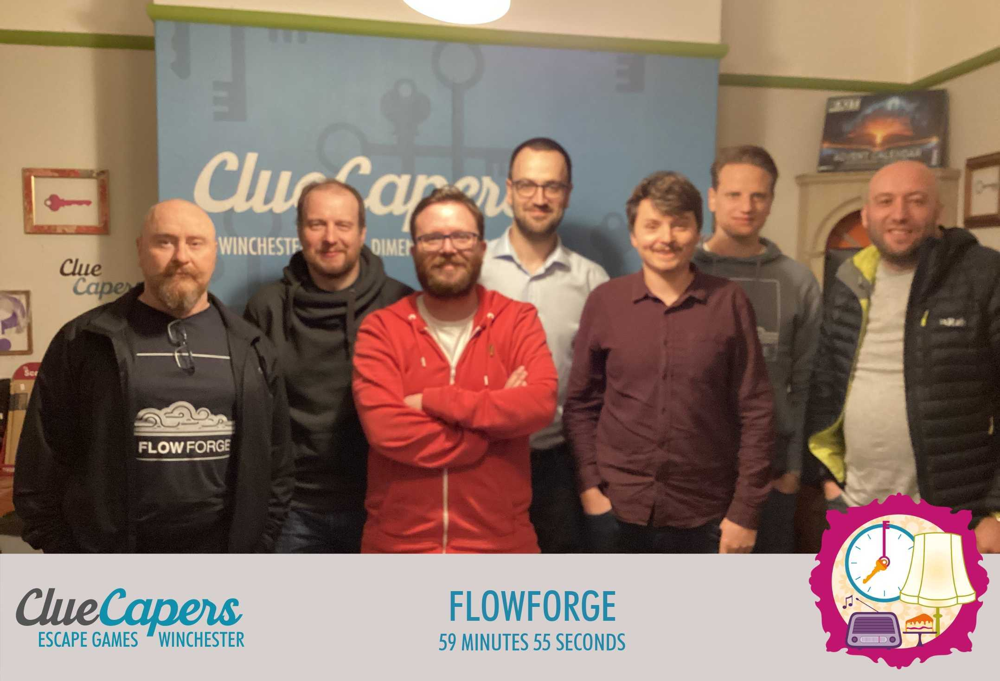

Welcome to the FlowFuse newsletter for November 2022, a monthly roundup of what’s been happening with both FlowFuse and the wider Node-RED community.
<!--more-->
If you've got something that you think we should share on our newsletters please [get it touch](mailto:contact@flowfuse.com).

[**Node-RED Nears 3.1 Release**](https://github.com/node-red/node-red/milestone/19)
As we mentioned last month, the release of Node-RED 3.1 is expected very soon. 3.1 includes lots of great new features such as support for [locking flows in the editor](https://github.com/node-red/node-red/pull/3938) and [improving the user experience around hiding flows](https://github.com/node-red/node-red/pull/3930). As an open source project the development of Node-RED is entirely dependent on individuals and companies giving their time to work towards each new release. If you'd like to know how you can get involved you can read more on the [Node-RED web site](https://nodered.org/about/contribute/).

[**FlowFuse 1.1 Released**](/blog/2022/11/flowforge-1-1-released/)   
Version 1.1 of FlowFuse was released on 24th November. Our latest release included some great new features such as [Persistent file storage](https://github.com/FlowFuse/flowfuse/issues/998), the ability to [import Node-RED snapshots](/docs/migration/node-red-tools/) from outside of FlowFuse and a much improved interface to [deploy projects to your devices](https://github.com/FlowFuse/flowfuse/issues/1046). We're now working towards our final release of 2022 which is due just before Christmas. You can see what we are planning to deliver in that release and beyond on [FlowFuse's project board](https://github.com/orgs/FlowFuse/projects/5). 

If you’d like to learn more about what else was included in 1.1 you can do so on our [blog post](/blog/2022/11/flowforge-1-1-released), [GitHub release page](https://github.com/FlowFuse/flowfuse/releases/tag/v1.1.0), and [Youtube channel](https://www.youtube.com/watch?v=134iljE_urI).

[**Node-Redscape - 100% Free, Open-Source Escape Room Control Software**](https://github.com/playfultechnology/node-redscape)  
As we'll come to later in this newsletter, FlowFuse visited an Escape Room in Winchester as part of our team meet-up. Co-incidentally, a great Node-RED project came up a few days after our visit which we thought was worth sharing. In their own words [Node-Redscape](https://github.com/playfultechnology/node-redscape) 'provides a set of templates, flows, and examples that turn Node-RED into a complete Escape Room automation system'. Very topical for us and also seems like a great project. You can learn more about the project on [Youtube](https://www.youtube.com/watch?v=f9yYDxqK_2E) as well as on [Github](https://github.com/playfultechnology/node-redscape).

**FlowFuse team meetup** 
FlowFuse is a fully remote team, we currently have a strong skew towards western Europe but we are in the process of adding team members in each of the continents. On that point, any great Product Managers who live in Antarctica are encouraged to [apply for a job with us](https://boards.greenhouse.io/flowfuse/jobs/4717778004)! Remote work is great but it's also valuable to get everyone together in the real world from time to time. FlowFuse had such a meet up last month in Winchester, UK. We came from near and far and took the opportunity to have productive round-table discussions about some features we are working towards in 1.2 and beyond.  We also dropped into [Clue Capers](https://cluecapers.co.uk/), a great Escape Room in the center of Winchester who provided the photo below to mark the occasion. 

[**FlowFuse Team News**](/team/)    
We are currently recruiting a [Product Manager](https://boards.greenhouse.io/flowfuse/jobs/4717778004), and a [Senior Community Manager](https://boards.greenhouse.io/flowfuse/jobs/4700809004). You can view any of the roles we currently have open and apply on our [Jobs page](https://boards.greenhouse.io/flowfuse).
    
[**Try FlowFuse for Free**](?code=RELEASE11)  
As a thank you for reading our newsletters we’d like to offer you a free, small project for one month on our managed FlowFuse platform when you create a new team. To get this discount please follow [this link](?code=RELEASE11) or use the code RELEASE11 when on the payment page after creating a new team. As an open source project you can also use [FlowFuse](/docs/install/) for free, forever.
