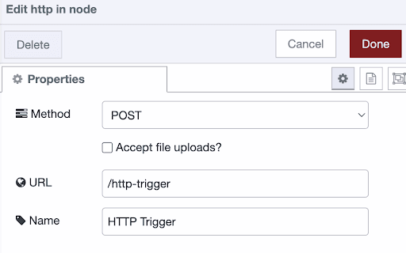

Having an HTTP endpoint trigger your flows is very useful. From any browser or command line you now have the ability to trigger your flows.
<!--more-->
Doing so safely with authentication is slightly harder, but not a lot. FlowFuse makes it rather easy to accomplish.

### Creating the HTTP flow

When you start a project on FlowFuse, remember the project name. For this how-to we’ll use `example`. Open the editor and drag in the HTTP In node as well as the HTTP response node. Connect them, and add a debug node, which is connected to the “HTTP in” node.

First off; let’s set the HTTP in node properties:



You can import this flow into your own project if you’d like:

```
[{"id":"4faa84d37a52bb28","type":"group","z":"3c6e2dc732ada815","name":"Allow HTTP Post request to trigger a flow","style":{"label":!0},"nodes":["1fa26e0ed3ddec1a","45a180052e1a2f43","09347881f4fa4057"],"x":34,"y":79,"w":472,"h":122},{"id":"1fa26e0ed3ddec1a","type":"http in","z":"3c6e2dc732ada815","g":"4faa84d37a52bb28","name":"HTTP Trigger","url":"/http-trigger","method":"post","upload":!1,"swaggerDoc":"","x":130,"y":120,"wires":[["45a180052e1a2f43","09347881f4fa4057"]]},{"id":"45a180052e1a2f43","type":"http response","z":"3c6e2dc732ada815","g":"4faa84d37a52bb28","name":"Empty HTTP response","statusCode":"200","headers":{},"x":360,"y":120,"wires":[]},{"id":"09347881f4fa4057","type":"debug","z":"3c6e2dc732ada815","g":"4faa84d37a52bb28","name":"Print HTTP Request","active":!0,"tosidebar":!0,"console":!1,"tostatus":!1,"complete":"payload","targetType":"msg","statusVal":"","statusType":"auto","x":360,"y":160,"wires":[]}]
```

Now I’ve opened a terminal and executed:

```
curl -X POST https://example.flowforge.com/http-trigger
```
When there’s no output, that means it’s all good! There should be an empty message in the debug console in the Node-RED editor though

### Securing the HTTP trigger with a username and password

The problem with our trigger is that anyone with internet access could trigger it. That’s not a great idea. So let’s secure this endpoint with HTTP Basic Authentication. There are various ways to include a secure endpoint in Node-RED, we’ve built authentication directly into FlowFuse to make it easier for all users. On the FlowFuse project, go to settings and then to ‘Editor’. Under the section HTTP Auth you can set a username and password. You should generate both by a random string generator, and store the credentials somewhere safe.  Restart the project to have the runtime pick up the changes, and the endpoint is secured!

Let’s validate the endpoint that worked a minute ago doesn’t anymore:

```
curl -X POST https://example.flowforge.cloud/http-trigger
=> Unauthorized
```

Let’s get it working again: (replace <username> and <password> with the details from the sticky note)

```
curl -X POST https://<username>:<password>@example.flowforge.cloud/http-trigger
```

That’s it! You now have a flow that’s protected by a username and password combination!
