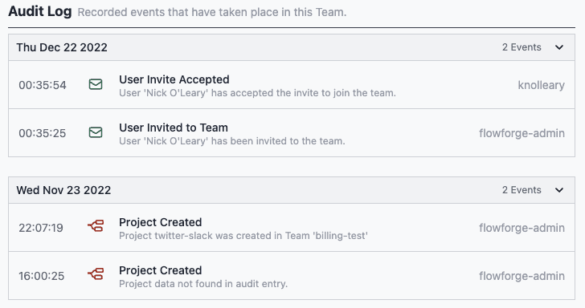

Control access to FlowFuse using single sign-on and retain context values when restarting projects.

<!--more-->

We're pleased to announce version 1.2 is now available! The latest release of the FlowFuse application contains new features, improvements, better documentation, and bug fixes.

We've put a great deal of work in this release to make it easier to run your own self-managed instance of FlowFuse. That includes significant improvements for FlowFuse in [Kubernetes](/docs/install/kubernetes/) and [Docker](/docs/install/docker/).

Keep reading for the details of what's in this release or you can watch our 1 minute roundup video of the new release above.

## Features

[Single Sign-On](https://github.com/FlowFuse/flowfuse/issues/226) Single sign-on (SSO) is a method of authentication that allows a user to access multiple applications or systems with a single set of login credentials, improving security, productivity, and user experience, and reducing IT overhead. We've implemented SSO using the Security Assertion Markup Language [(SAML)](https://en.wikipedia.org/wiki/Security_Assertion_Markup_Language) framework. This allows users of FlowFuse Cloud, Premium and the open source edition to easily access their FlowFuse projects.

[Persistent Context](https://github.com/FlowFuse/flowfuse/issues/212) Node-RED provides a way to store information that can be shared between different nodes and flow executions without using the messages that pass through a flow. This is called ‘context’. You can now select if context should be stored in memory or in persistent storage. Persistent storage allows the stored values to be recalled after a restart of your project. You can see a demonstration of this feature on our [Youtube channel](https://youtu.be/ma2vYrXmssc).

## Improvements

- In FlowFuse 1.1 we added logging of user actions. In 1.2 we’ve [improved the audit log interface](https://github.com/FlowFuse/flowfuse/issues/517) to help you read the recorded user actions.

- Configuring DNS for FlowFuse has historically been challenging as for most FlowFuse installs you'll need two entries. One for the FlowFuse application, and one for the Node-RED projects. There's been updates to the documentation to make it much easier to set this up, and much faster. Please checkout the new [documentation](/docs/install/dns-setup/).

- We've updated our documentation to always link to the latest build (older builds are still available).

- Previously customers were asked to build their own containers for the main FlowFuse applications, as well as the Node-RED ones. For the Node-RED containers this allows customers to pre-install packages in the container they intent to use. For FlowFuse Cloud these containers are build by FlowFuse. These containers are now published to the [Docker Hub](https://hub.docker.com/u/flowforge). This makes it much easier to get up and running with your first containers.

- We are now pushing our Docker builds to Docker Hub, this saves users from having to build the Docker images when installing or updating. These containers are used by default by `docker-compose`.

- Setting up MQTT for inter-project communication and communication with devices has been simplified. Please read the improved the documentation around configuration of [MQTT](https://github.com/FlowFuse/flowfuse/issues/1397).

## Bug Fixes

We've fixed the following bugs in this release.

- Unable to edit 'Prevent Install of External nodes' template option [#1376](https://github.com/FlowFuse/flowfuse/issues/1376)

- Self-managed FlowFuse needs an external email server to deliver email to users. FlowFuse should be able deal with the email server being offline and gracefully recover once it is back online. [#1159](https://github.com/FlowFuse/flowfuse/issues/1159)

- Duplicate Activity Log for Project whose state is in flight [#1461](https://github.com/FlowFuse/flowfuse/issues/1461)

## Contributors

We'd like the thank the following for their contributions to this release:

[flecoufle](https://github.com/flecoufle) for their work on [#59](https://github.com/FlowFuse/docker-compose/pull/59)

[sumanpaikdev](https://github.com/sumanpaikdev) for their work on [#53](https://github.com/FlowFuse/docker-compose/pull/53)

[sdirosa](https://github.com/sdirosa) for their work on [#1326](https://github.com/FlowFuse/flowfuse/pull/1326)

As an open-source project, we welcome community involvement in what we're building.
If you're interested in contributing, checkout our [guide in the docs](/docs/contribute/).

### Try it out

In 1.2 we've continued to improve the experience of running your own self managed FlowFuse installation. We're confident you can have self managed FlowFuse running locally in under 30 minutes.
You can install our [local build](/docs/contribute/local/), through [Docker](/docs/install/docker/), or [Kubernetes](/docs/install/kubernetes/).

If you'd rather use our hosted offering: [Sign up for FlowFuse Cloud](?code=FF12)
with the coupon **FF12** to get your first project free for a month.

### Upgrading FlowFuse

[FlowFuse Cloud]({{ site.appURL }}) is already running 1.2. To use
persistent context you'll need to upgrade your projects stack.

If you installed a previous version of FlowFuse and want to upgrade, our documentation provides a
guide for [upgrading your FlowFuse instance](/docs/upgrade/).

### Getting help

Please check FlowFuse's [documentation](/docs/) as the answers to many questions are covered there.

If you hit any problems with the platform please raise an [issue on GitHub](https://github.com/FlowFuse/flowfuse/issues).
That also includes if you have any feedback or feature requests.

Chat with us on the `#flowfuse` channel on the [Node-RED Slack workspace](https://nodered.org/slack).

You can raise a support ticket by emailing [support@flowfuse.com](mailto:support@flowfuse.com).

We've also added a live chat widget to our website, you can access it using the icon on the bottom right corner of our website. We'd love to hear from you.
