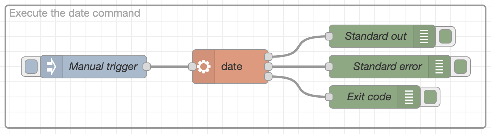
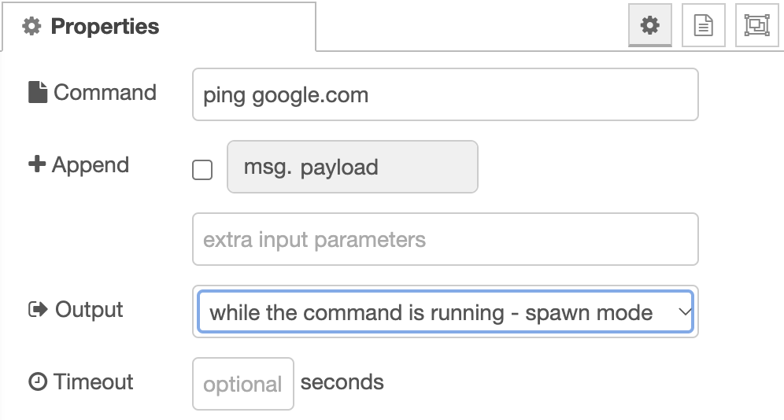

Node-RED is written in Javascript, as are the custom nodes in the
[Flows Library](https://flows.nodered.org/search?type=node). At times it would
be great to use programs written in other languages. In this guide we'll explain
the `exec` node. 

<!--more-->

### Exec Node

Node-RED by default comes with the `exec` node. This node allows you to run a
command as if you're on the command line. The exec node has one input, and three
outputs. Let's create a basic example and work from there. Let's connect the
inject to the `exec` input, and connect the three dots to debug nodes. I've set
the command in the exec node to `date`.

When triggered, you'll see two outputs in the debug pane. One from `Standard out`;
the date and timestamp of the execution and the `Exit code` will output too.
`Standard error` didn't output anything.

Let's explain what happened: the `date` command was executed by the NodeJS without
any input. The command returned the date as a string, and execution of the commmand
completed. There weren't any errors, so the error code is set to zero. Non-zero
exit codes imply didn't go as intended. Output is written to the standard output,
and not standard error. This allows us to handle errors differently from succesful
exections and the output in standard output.

### Exec vs Spawn mode

Let's change the `exec` node to execute `ping google.com`. The ping command
provides the round-trip time to google.com in milliseconds, each second. When
we deploy, the program is stuck. That's because the output is generated each
second and won't complete until there's a failure in the command. Not what you'd
want.

When there's continous output you'll need to select `spawn` mode in the settings
windown of the `exec` node:

This will produce a message per line to the standard out output for further
processing.

### FlowFuse

On FlowFuse Cloud, the Node-RED exec nodes are disabled. The Stacks, that is the
containers that Node-RED runs in, don't include any accessible executatables so there would be no benefit to running exec commands. All the data is exposed through Javascript and Node.JS already.
