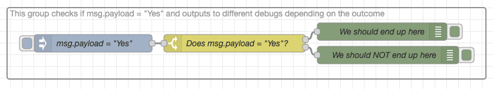

When it comes to working on Node-RED flows as part of a team, there are a few best practices that can make things go more smoothly.
<!--more-->
From formatting your flows for readability to providing clear comments on nodes and groups, a little bit of effort upfront can save your team a lot of headaches down the road. In this post, we'll cover some of the main things to keep in mind when working on Node-RED flows as part of a team.

### Give your groups descriptive names

Let’s start with [grouping your flows](https://nodered.org/docs/user-guide/editor/workspace/groups) and giving each group a clear explanation of what it does. Compare the first to the second example below and consider how much more quickly you can understand what the flow is doing.

#### This is not helpful, 'Time' doesn't tell you enough to understand the flow's purpose.

#### This is much better, we know what the flow is doing without inspecting the nodes.

### Explain what your switches do

Try to make it obvious what each switch does without having to open the node editor. Ask a question in the switch's name and make a positive answer the top connection out.

#### This is not easy to understand, what does the switch do?

#### This is a lot better, we can see that the top debug should be triggered.

### Where possible your flows should work down the canvas

It makes it so much easier to understand what happens and in which order if your flows start at the top of the canvas and work down to the bottom.

#### This is almost unreadable, it's very hard to work out the order of the groups.

#### Where as this is so much easier to understand.

### Use link nodes rather than wires to join groups

Groups should not be joined using wires, it just looks untidy and quickly reduces readability of your flows.

#### The wire is blocking the title, it only gets worse as you add more wires.

#### You can see the group titles easily now.

### Keep your groups compact

Keeping your groups compact will save time when reading the flow. This is especially helpful if when viewed on a smaller screen.

#### Consider how hard a flow made of groups spaced out like this would be to read on a smaller laptop screen.

#### This now takes up less space and is arguably easier to read on any screen size.

### Don’t cross ~~beams~~ wires
Crossed wires are not only hard to read, they can lead to misinterpretation of what a flow actually does. Where possible don’t cross your wires, where you can’t avoid it try to make sure it’s easy for the reader to understand where wires cross as rather than join.

#### This is confusing, which change node does the top switch output link to?

#### This is better, much less chance of confusing the change nodes.

### Don’t use link nodes in groups where avoidable

Excessive link nodes within groups can make a flow much harder to understand, where possible use wires to join nodes within a group.

#### This is hard to read and you will end up checking the link nodes again and again.

#### Functionally identical to the example above, it should only take a few seconds to understand this flow now.

### Conclusion

Working on Node-RED flows as part of a team doesn't have to be a headache. By following some simple best practices you can make collaboration smooth sailing for everyone involved. So next time you're starting work on a new Node-RED flow, remember these tips and make life easier for yourself and your teammates.