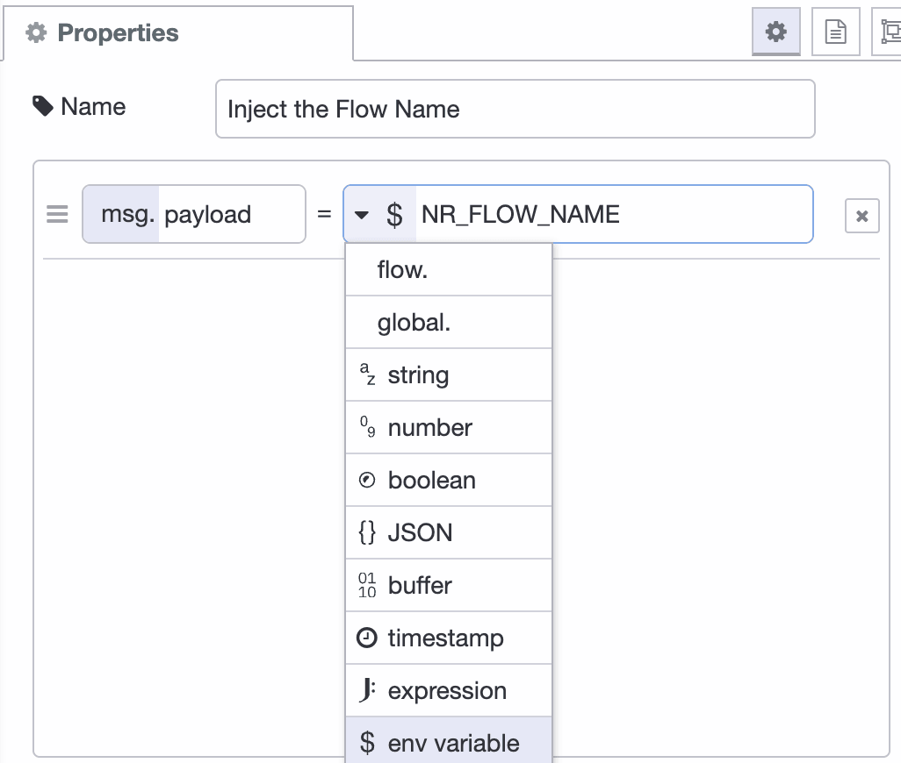

Programs, written with Node-RED or otherwise, need to sometimes retrieve information that wasn’t decided on during the creation of the program. 
<!--more-->

Contextual data like configuration, which user is executing the code, differentiate based on what device is executing a flow, or sometimes secrets which shouldn’t be exposed in the code. This is usually done through environment variables. These are pairs of strings, a key with an attached value, which are accessed by their key. Say you want to access an API endpoint with a key, you’d save the key as `API_KEY` with the value set to `yoursupersecretkey`. FlowFuse allows setting environment variables. Let’s start using them to understand how they work.

One of the options for the `inject` node is to inject a `env variable`, short for; you guessed it: Environment Variable. In this case we’re going to one that’s pre-defined by Node-RED: `NR_FLOW_NAME`. The name of each variable is in all caps by convention. When connecting this inject to a debug it prints “Flow 1” for me.

Leveraging environment variables can also be done with other nodes, like for example `change`, `switch`. Note however; you can set the `inject` node to output the value for `FOO` even when it doesn’t exist, but it doesn’t allow you to check in the switch node for example if `FOO` exists.

Node-RED allows you to set environment variables, but not to change them when executing flows. If you want to update data during execution, look into using [persistent context](/docs/user/persistent-context/). Node-RED doesn’t support Environment Variables like other programming environments do. When the flow is deployed the environment variables are replaced with the known values at that time. This is the biggest gotcha for most developers.

### Predefined variables

Our first example was using a predefined variable, exposed by Node-RED. As of 3.0 it exposes a few environment variables among which `NR_NODE_NAME`, `NR_GROUP_NAME`, and `NR_FLOW_NAME`.

[FlowFuse](/) extends this list with for example a `FF_PROJECT_ID` allowing you to for example understand what group of instances sent a certain message, but also sets them for each [device agent](/docs/device-agent/introduction/). This allows users to pinpoint which device sent a message, for example to update a dashboard accordingly.

### Managing environments variables

In FlowFuse it’s easy to manage variables set for instances. Under settings in the environment tab it’s a form to set them. You’ll have to restart your instances to make them available in the cloud, and update the target snapshot for devices. When done, these are available.

## Boost Your Node-RED Security with FlowFuse

FlowFuse provides a comprehensive platform for managing and securing your Node-RED solutions. It includes advanced security features such as role-based access control, Multi-factor Authentication (MFA), Single Sign-On (SSO), and encryption to protect your data and enhance operational efficiency.

Learn how FlowFuse can boost your Node-RED security and streamline management through the [FlowFuse security statement](/platform/security/#application).

### Explore More on Security

- [Role-Based Access Control (RBAC) for Node-RED with FlowFuse](/blog/2024/04/role-based-access-control-rbac-for-node-red-with-flowfuse/)
- [Protecting Instances from Being Modified](/docs/user/devops-pipelines/#protected-instances)
- [How to Set Up SSO LDAP for Node-RED](/blog/2024/07/how-to-setup-sso-ldap-for-the-node-red/)
- [How to Set Up SSO SAML for Node-RED](/blog/2024/07/how-to-setup-sso-saml-for-the-node-red/)
- [Securing HTTP Traffic for Node-RED with FlowFuse](/blog/2024/03/http-authentication-node-red-with-flowfuse/)
- [FlowFuse is now SOC 2 Type 1 Compliant](/blog/2024/01/soc2/)