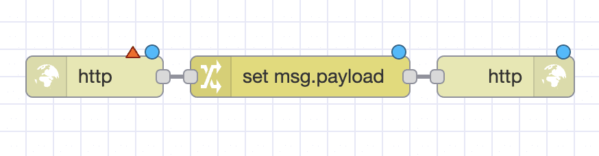
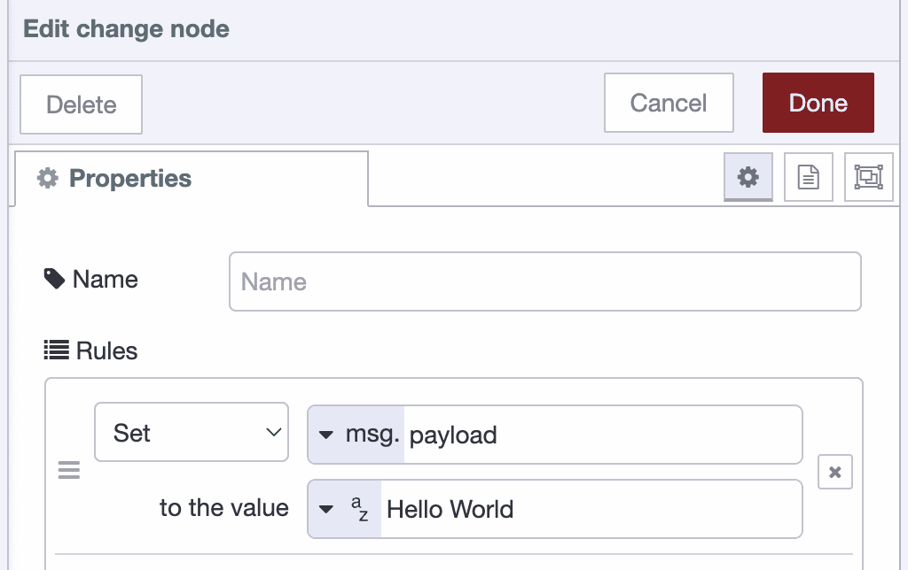
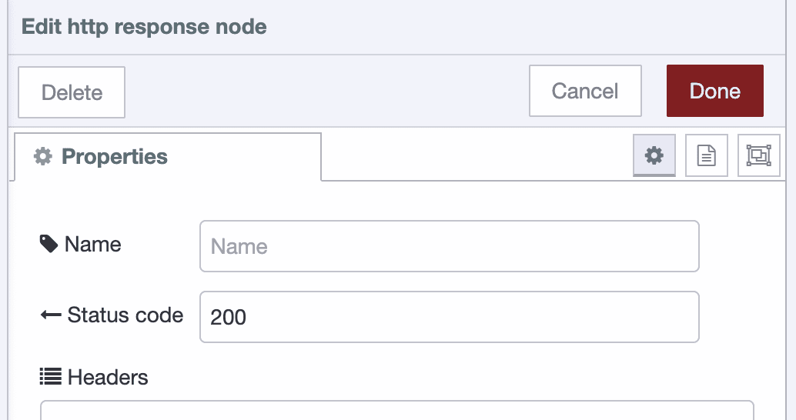

Node-RED is a visual programming tool for working with IoT devices and web services. It allows users to create flows using a drag-and-drop interface, making it easy to connect different nodes together to build powerful automations.

<!--more-->

In this blog post, we'll take a look at how to get started with Node-RED and create some basic flows. We'll also explore the palette manager, a powerful feature that allows users to install and manage additional nodes for Node-RED.

### Installing Node-RED

First, you'll need to get an installation of Node-RED up and running. There are several ways to do this. We suggest using FlowFuse as it's very easy to get Node-RED running. You can also install Node-RED locally using npm (Node Package Manager), which comes with Node.js.

#### FlowFuse

To get Node-RED running on FlowFuse [sign up as a new user]({{ site.appURL }}/account/create). New users are enrolled in a trial and a Node-RED instance will be started for you within a minute.

Once that instance has booted up you can access Node-RED by pressing "Open Editor".

#### npm

To install Node-RED locally using npm, open up your terminal and type the following command:

```bash
npm install -g node-red
```

Once Node-RED is installed, you can start it by running the following command:

```bash
node-red
```

This will start the Node-RED server and open up the [editor in your web browser](http://localhost:1880). You can also specify a different port or a settings file if you want to. If you want to run Node-RED locally but manage it remotely through FlowFuse, check out [this guide](https://flowfuse.com/blog/2025/09/installing-node-red/).

### First Flow

Now that you have Node-RED running, let's take a look at how to create a simple flow. In this example, we'll create a simple "Hello World" endpoint. To do this, we'll use the `http in`, `http response`, and the `change` nodes, which can be found in the common nodes menu on the left of Node-RED.

First, drag an `http in` node into the editor. This node will listen for incoming HTTP requests. Next drag in the "change" and the `http response` node into the editor. Connect the `http in` node to the `change` node and connect the `change` node to the `http response` node. Your flow should look similar to this:



To configure the `http in` node, double-click on it to open its properties. Here, you can set the URL that the node will listen to, as well as the method (GET, POST, etc.). In this example, we'll set the URL to `/hello` and the method to `GET`.

Now we need to set what the endpoint will respond with, we will do that in the `change` node. Double-click the `change` node then add "Hello World" to the field which says "to the value". It should look like this:



To configure the `http response` node, double-click on it to open its properties. Here, you should set the "Status Code" to be 200. This is not vital for the demo to work but it's good practice to return the correct codes when something connects to an API. Status code 200 means the API responded OK. This is how your `http response` node should look:



You can read more about HTTP response codes in [this article](https://en.wikipedia.org/wiki/List_of_HTTP_status_codes).

### Testing Your Flow

Now that we have our flow set up, we can deploy it by clicking the "Deploy" button in the top right corner of the editor. Once the flow is deployed, you can test it by opening up a web browser. If you installed Node-RED using npm navigate to "http://localhost:1880/hello". If you are working on FlowFuse and running cloud hosted instance, use your instance URL with "/hello" added to the end, it should look something like "https://your-instance-name.flowfuse.cloud/hello". You should see "Hello World!" displayed in the browser.

### Debug Output

One of the most powerful features in Node-RED is the ability to debug your flow. This can be done by adding a debug node to your flow and connecting it to the nodes you want to debug. When a message is sent through the connected node, the debug node will print the message in the debug sidebar on the right side of the editor. This can be very helpful when trying to understand how a flow is working or troubleshoot any issues.

### The Palette Manager

In addition to the built-in nodes, Node-RED also has a palette manager feature which allows users to easily install and manage additional nodes from the community. To access the palette manager, go to the menu in the top right corner and select "Manage Palette". Here, you can search for and install new nodes, as well as update or remove existing ones. This is a great way to extend the functionality of Node-RED and add new capabilities to your flows.

### Import the flow

If you want to view this flow you can import it using the code below. Copy the code then select Import from the top right menu in Node-RED. Paste the code into the field then press Import.


[
    {
        "id": "a742e7a95697bb40",
        "type": "http in",
        "z": "9e9af3caa4dc14d3",
        "name": "",
        "url": "/hello",
        "method": "get",
        "upload": false,
        "swaggerDoc": "",
        "x": 180,
        "y": 200,
        "wires": [
            [
                "883e7d597f7c7c4b"
            ]
        ]
    },
    {
        "id": "aca024dcb79bdb92",
        "type": "http response",
        "z": "9e9af3caa4dc14d3",
        "name": "",
        "statusCode": "200",
        "headers": {},
        "x": 500,
        "y": 200,
        "wires": []
    },
    {
        "id": "883e7d597f7c7c4b",
        "type": "change",
        "z": "9e9af3caa4dc14d3",
        "name": "",
        "rules": [
            {
                "t": "set",
                "p": "payload",
                "pt": "msg",
                "to": "Hello World",
                "tot": "str"
            }
        ],
        "action": "",
        "property": "",
        "from": "",
        "to": "",
        "reg": false,
        "x": 340,
        "y": 200,
        "wires": [
            [
                "aca024dcb79bdb92"
            ]
        ]
    }
]


### What's Next?

Well done, you've now got your first flow up and running. Enjoy using Node-RED and thanks for reading. Now if you want to start with your first beginner friendly project, building a weather dashboard is great, read this [article for getting started](/blog/2025/12/getting-weather-data-in-node-red/). If you'd like to dive deeper into more Node-RED capabilities and how it can help in an enterprise setting, check out our [eBook The Ultimate Beginner Guide to a Professional Node-RED](https://flowfuse.com/ebooks/beginner-guide-to-a-professional-nodered/).
