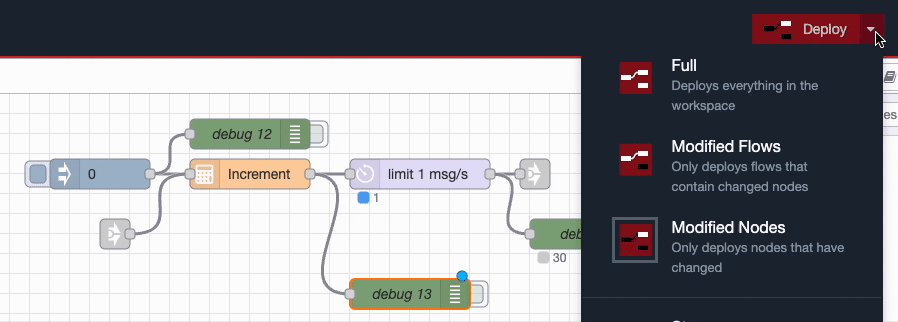
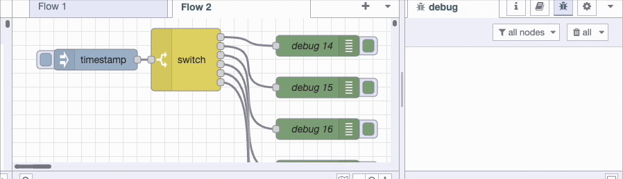
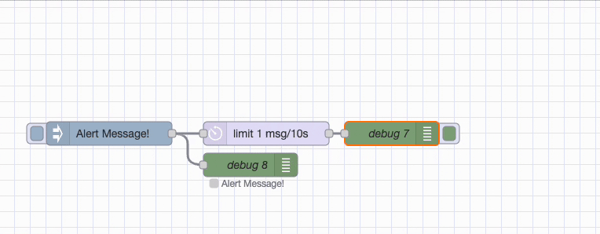

There is usually more than one way to complete a given task in software, and Node-RED is no exception. In each of this series of blog posts, we are going to share three useful tips to save yourself time when working on your flows.
<!--more-->

### 1. Deploy just what you've changed

When deploying your changes, the default option is deploy everything which also restarts all your flows. You can also select to deploy just the nodes you edited or just the flows in which any changes were made. 

This allows you to update part of your flow without restarting other sections. This can be really handy when you have different flows spread across your workspace or tabs but you don't want to reload them all each time you deploy.

### 2. Find which debug node generated an entry in the log

Once your flow has a few debug nodes it can become challenging to see which particular node generated an entry in the log. To quickly track an entry back to its source, click the text 'node: debug' and you will be whisked back to the specific debug node, even it it's elsewhere on you workspace or even on a different tab.

### 3. The delay node can be used as a rate limiter

Sometimes it's useful to be able to limit messages to only allow one every so many minutes. You may for example send alerts when a temperature sensor goes above a particular threshold but you don't want your email or instant messaging inbox being swamped with repeated alerts for the same issue.

You can use the delay node to limit how many messages can pass through in a given period of time.

Open the delay node settings, select Rate Limit then select 1 message per 15 minutes, then select 'Drop intermediate messages'. This flow will now output a maximum of one message every quarter of an hour, all others will be deleted.

We hope you found these tips useful, if you'd like to suggest some of your own tips which you think we should share in our future blog posts please [get in touch](mailto:contact@flowfuse.com).

## Enhance Efficiency with FlowFuse

FlowFuse is a cloud-based platform designed to boost collaboration, security, and scalability for your Node-RED applications. It features [numerous tools and functionalities](/platform/features/) that streamline the development-to-deployment process, including one-click deployment, the [FlowFuse Assistant](/handbook/development/ops/self-hosted-assistant/#flowfuse-assistant), and other capabilities that simplify managing your Node-RED environment.

For more tips, tricks, and professional development techniques with Node-RED, check out our recommended eBook:

[The Ultimate Beginner's Guide to Professional Node-RED](/ebooks/beginner-guide-to-a-professional-nodered/)
