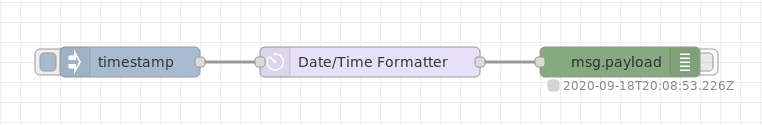

Welcome to the FlowFuse newsletter for February 2023, a monthly roundup of what’s been happening with both FlowFuse and the wider Node-RED community. 

<!--more-->

If you've got something that you think we should share on our newsletters please [get in touch](mailto:contact@flowfuse.com).

## News

### [Node-RED Ask Me Anything](/ask-me-anything/ama-nodered/)

Do you have any questions about Node-RED or need some advice on a tricky issue using Node-RED? Here is your opportunity to get help from the experts.

Nick O'Leary, co-founder of Node-RED & CTO of FlowFuse, and Rob Marcer, Node-RED community member & Developer Educator at FlowFuse, will be hosting an interactive Ask Me Anything session. This is a great opportunity to ask questions of the Node-RED experts. If you have any questions for Nick and Rob you can send them in before the session using [this form](https://docs.google.com/forms/d/e/1FAIpQLSdfPq4lAQjdvqhTpoYtKiMNgP8vcMhZsAf_AG0MHuVMRK83_Q/viewform).

### [Free FlowFuse project for 30 days, no catches]({{ site.onboardingURL }})
To make it easy for everyone to experience FlowFuse, we are introducing a new [free 30-day trial]({{ site.onboardingURL }}). With this trial, you can experience the power of using FlowFuse to quickly deliver Node-RED applications in a reliable, repeatable, collaborative, and secure manner. To get your trial simply [sign up for a new FlowFuse team]({{ site.onboardingURL }}).

### [1.3 Released](/blog/2023/01/flowforge-1-3-0-released)
Version 1.3 of FlowFuse was released on 19th January. Our first release of 2023 included some great new features such as the ability to share flows via a [team library](https://www.youtube.com/watch?v=B7XK3TUklUU), [control access to your Node-RED dashboards](https://www.youtube.com/watch?v=JRk-Cf7eNIo) using FlowFuse credentials, and [filtering on your audit logs](https://www.youtube.com/watch?v=p0Vuy5x42Go) for easier reading. We also added the ability to use FlowFuse on devices which cannot access npm, we think this will be really valuable to users of networks with limited access to the internet.

We're now working towards release 1.4 which is due on 16th February. You can see what we are planning to deliver in that release and beyond on [FlowFuse's project board](https://github.com/orgs/FlowFuse/projects/5).

If you’d like to learn more about what else was included in 1.3 you can do so on our [blog post](/blog/2023/01/flowforge-1-3-0-released/), [GitHub release page](https://github.com/FlowFuse/flowfuse/releases/tag/v1.3.0), and [Youtube channel](https://www.youtube.com/watch?v=ey3xv5j5x7k).

### [Team News](/team)
We are currently recruiting [NodeJS Developers](https://boards.greenhouse.io/flowfuse/jobs/4463977004) as well as a [Graphic Designer](https://boards.greenhouse.io/flowfuse/jobs/4785058004) to join our team. You can view any of the roles we currently have open and apply on our [Jobs page](https://boards.greenhouse.io/flowfuse).

## Node-RED in the Community

### [Twitch Streamer beats Elden Ring boss using mind control (and a little Node-RED)](https://www.vice.com/en/article/bvmqmm/watch-an-elden-ring-streamer-beat-a-boss-using-her-thoughts)

Streamer [Perrikaryal](https://www.twitch.tv/videos/1717013810) used an electroencephalography (EEG) headset to read her brain activity which in turn sends commands via Node-RED to her gaming computer. She then proceeded to use that control method to beat one of the harder bosses in Elden Ring, a notoriously difficult game to start with. The end result is a great example of how Node-RED can link disparate tech together easily. You can [watch the full stream on Twitch](https://www.twitch.tv/videos/1722048787).

### [Run Node-RED in a web browser, client side!](https://www.linkedin.com/posts/kazuhitoyokoi_nodered-webassembly-activity-7015696090112958464-F3MA/?utm_source=share&utm_medium=member_android)
[Kazuhito Yokoi](https://www.linkedin.com/in/kazuhitoyokoi/) has implemented an early prototype of Node-RED runtime for WebAssembly. As a demonstration, he built a simple flow which shows the current location of the International Space Station (ISS). This proof-of-concept shows that an entire Node-RED flow can be executed in a browser. We think this could be a very useful option for running Node-RED in places where it wasn’t previously practical. You can view his work on this [GitHub project](https://github.com/kazuhitoyokoi/node-red-wasm).

### [Custom Node Spotlight - Moment](https://flows.nodered.org/node/node-red-contrib-moment)

Being able to easily switch dates and times from one format to another is a huge timesaver, node-red-contrib-moment makes those tasks a breeze. The package actually includes two custom nodes, the first ‘Moment’ produces a nicely formatted Date/Time string using the Moment.JS library. The second custom node ‘Humanizer’ converts time durations (time spans) into textual descriptions (e.g. 2 minutes). We recommend you keep it in mind for any flows working with time conversions.
