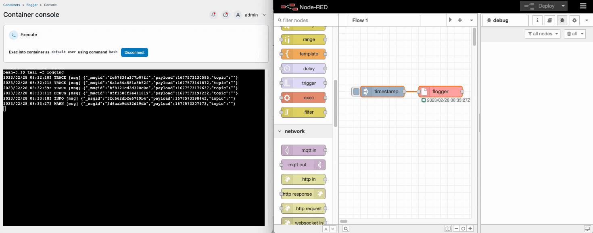

There were some great questions from our [first webinar](https://www.youtube.com/watch?v=47EvfmJji-k) that we didn't get time to answer, we wanted to share those questions and our answers here. 
<!--more-->

### Irvin asks, 'is it possible to save the debug information or data flow to a storage like Splunk or SQL'?

Hi Irvin, thanks for the question. I suspect you might be better using a custom node which is designed for logging data rather than capturing the debug node content to a database.

I've come across [Flogger](https://flows.nodered.org/node/node-red-contrib-flogger) which seems to do a good job of logging, including support for multiple log files, and built in support for log rotation.

If you really wanted to log to a database rather than a log file you could create your own logging subflow. Once that's in place you can drop it into your flow as needed to capture your debug data for later consumption.

### Anonymous asks 'can we make an mobile application with Node-RED or can the content only be accessed through a web browser'?

Hello Anon', it would be great if a Node-RED flow could be built into a mobile app. Sadly, there isn't a simple way to do so at the time of writing.

Assuming you want an easy way to package up and distribute the functionality you might be best creating a link to where the application is hosted. Both [iOS](https://www.macrumors.com/how-to/add-a-web-link-to-home-screen-iphone-ipad/) and [Android](https://www.androidauthority.com/add-website-android-iphone-home-screen-3181682/) support making a home icon. Once added using them is basically the same user experience as a locally installed application. 

### John asks 'From the random node example in the webinar, the node connected to four different nodes. Is there an order to which is invoked first? Can that be controlled'?

Hi John, interesting question, thanks for sending it in. For the sake of any readers who were not an the webinar here is what you are describing.

All downstream nodes linked to the same prior node will be triggered at practically the same time.

You could use a delay node if you want to ensure a particular node is triggered first. It might also make sense to wire your flow in series rather than parallel. This would allow your functions to all execute in a specific order. That being said, in this case all but one of the nodes do not have outputs so using delays might be the only practical option.

### Abdelhamid asks, 'How can I delete a subflow'?

Thanks Abdelhamid, that's actually really easy to do. Double click the subflow you want to delete, then select 'delete subflow' from the top of your workspace.

Thanks again to everyone who attended and participated in our first webinar. We have lots of other useful live content coming up soon, you can view and register for future events on our website's [webinars page](/webinars/).
