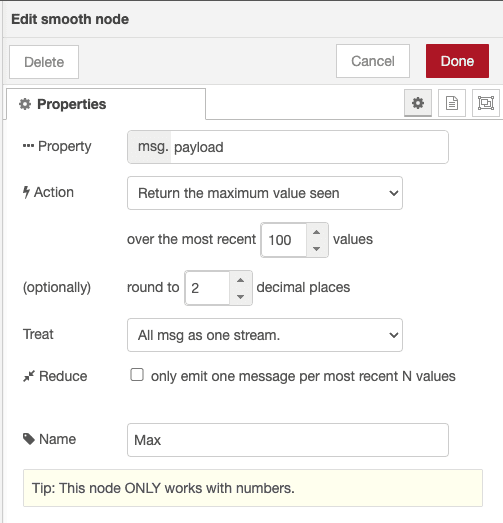
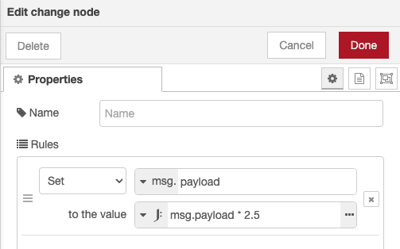
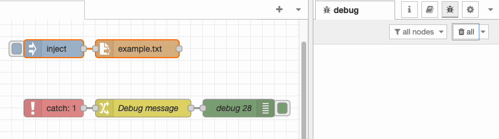

There is usually more than one way to complete a given task in software, and Node-RED is no exception. In each of this series of blog posts, we are going to share three useful tips to save yourself time when working on your flows.

<!--more-->

### 1. Use the Smooth node to get the minimum and maximum values of your payloads

When taking data in from sensors sometimes a spurious value can be sent into your flow. This can result in oddities in a graph or even misfiring of actions such as turning on a heating system. The Smooth custom node allows you to store the min and max of a payload for the last few messages received.



You can in turn use this to ignore values that deviate too far from the sample. To help demonstrate the Smooth node, I've created a flow you can import into Node-RED.

```json
[{"id":"9484c25a0120bd48","type":"group","z":"dd95c0bca1101c86","name":"Automatically outputs random value (temperature in Celcius) between 0 & 25 every second","style":{"label":!0},"nodes":["e4f972f9daad6246","c7fc075a1915e87b","966a772c46dc2888"],"x":34,"y":59,"w":574,"h":82},{"id":"e4f972f9daad6246","type":"link out","z":"dd95c0bca1101c86","g":"9484c25a0120bd48","name":"link out 1","mode":"link","links":["33594c64783cdc45","e6bf7b494b48861e"],"x":355,"y":100,"wires":[]},{"id":"c7fc075a1915e87b","type":"inject","z":"dd95c0bca1101c86","g":"9484c25a0120bd48","name":"","props":[],"repeat":"1","crontab":"","once":!1,"onceDelay":0.1,"topic":"","x":130,"y":100,"wires":[["966a772c46dc2888"]]},{"id":"966a772c46dc2888","type":"random","z":"dd95c0bca1101c86","g":"9484c25a0120bd48","name":"","low":"0","high":"25","inte":"true","property":"payload","x":260,"y":100,"wires":[["e4f972f9daad6246"]]},{"id":"37380f26e8bfc98a","type":"group","z":"dd95c0bca1101c86","name":"Calculate average, high and low, save to flow","style":{"label":!0},"nodes":["cc3978c7c4ea56ed","e1819526a5f365c8","33594c64783cdc45","fea261a15b3b7683","e28a69232f1cac53","aecb1727be523240","e30039ee13e480a8"],"x":34,"y":259,"w":552,"h":142},{"id":"cc3978c7c4ea56ed","type":"change","z":"dd95c0bca1101c86","g":"37380f26e8bfc98a","name":"","rules":[{"t":"set","p":"high","pt":"flow","to":"payload","tot":"msg"}],"action":"","property":"","from":"","to":"","reg":!1,"x":310,"y":300,"wires":[["aecb1727be523240"]]},{"id":"e1819526a5f365c8","type":"change","z":"dd95c0bca1101c86","g":"37380f26e8bfc98a","name":"","rules":[{"t":"set","p":"low","pt":"flow","to":"payload","tot":"msg"}],"action":"","property":"","from":"","to":"","reg":!1,"x":310,"y":360,"wires":[["e30039ee13e480a8"]]},{"id":"33594c64783cdc45","type":"link in","z":"dd95c0bca1101c86","g":"37380f26e8bfc98a","name":"link in 1","links":["c07b2e101cecbd3b","e4f972f9daad6246"],"x":75,"y":320,"wires":[["e28a69232f1cac53","fea261a15b3b7683"]]},{"id":"fea261a15b3b7683","type":"smooth","z":"dd95c0bca1101c86","g":"37380f26e8bfc98a","name":"Min","property":"payload","action":"min","count":"100","round":"2","mult":"single","reduce":!1,"x":170,"y":360,"wires":[["e1819526a5f365c8"]]},{"id":"e28a69232f1cac53","type":"smooth","z":"dd95c0bca1101c86","g":"37380f26e8bfc98a","name":"Max","property":"payload","action":"max","count":"100","round":"2","mult":"single","reduce":!1,"x":170,"y":300,"wires":[["cc3978c7c4ea56ed"]]},{"id":"aecb1727be523240","type":"debug","z":"dd95c0bca1101c86","g":"37380f26e8bfc98a","name":"debug 23","active":!0,"tosidebar":!1,"console":!1,"tostatus":!0,"complete":"payload","targetType":"msg","statusVal":"payload","statusType":"auto","x":480,"y":300,"wires":[]},{"id":"e30039ee13e480a8","type":"debug","z":"dd95c0bca1101c86","g":"37380f26e8bfc98a","name":"debug 25","active":!0,"tosidebar":!1,"console":!1,"tostatus":!0,"complete":"payload","targetType":"msg","statusVal":"payload","statusType":"auto","x":480,"y":360,"wires":[]},{"id":"ec11a9ee9148b0b5","type":"group","z":"dd95c0bca1101c86","name":"Evaluate if an incoming value is between flow.high and flow.low, if it is not, send the message down a different wire and show an alert in debug","style":{"label":!0},"nodes":["9393c22b2e3c1ec8","1cd18307cb919159","7c1f474e646765a7","a209cd10f33ec401","f4b15283e55babf4","e6bf7b494b48861e"],"x":34,"y":419,"w":1032,"h":162},{"id":"9393c22b2e3c1ec8","type":"switch","z":"dd95c0bca1101c86","g":"ec11a9ee9148b0b5","name":"Was the value between flow.high and flow.low?","property":"payload","propertyType":"msg","rules":[{"t":"btwn","v":"high","vt":"flow","v2":"low","v2t":"flow"},{"t":"else"}],"checkall":"true","repair":!1,"outputs":2,"x":300,"y":480,"wires":[["1cd18307cb919159"],["7c1f474e646765a7","a209cd10f33ec401"]]},{"id":"1cd18307cb919159","type":"debug","z":"dd95c0bca1101c86","g":"ec11a9ee9148b0b5","name":"debug 15","active":!0,"tosidebar":!0,"console":!1,"tostatus":!1,"complete":"false","statusVal":"","statusType":"auto","x":560,"y":460,"wires":[]},{"id":"7c1f474e646765a7","type":"debug","z":"dd95c0bca1101c86","g":"ec11a9ee9148b0b5","name":"debug 16","active":!1,"tosidebar":!0,"console":!1,"tostatus":!1,"complete":"false","statusVal":"","statusType":"auto","x":560,"y":540,"wires":[]},{"id":"a209cd10f33ec401","type":"change","z":"dd95c0bca1101c86","g":"ec11a9ee9148b0b5","name":"Alert to debug when value is outside of the range","rules":[{"t":"set","p":"payload","pt":"msg","to":"The value was outside of the range","tot":"str"}],"action":"","property":"","from":"","to":"","reg":!1,"x":690,"y":500,"wires":[["f4b15283e55babf4"]]},{"id":"f4b15283e55babf4","type":"debug","z":"dd95c0bca1101c86","g":"ec11a9ee9148b0b5","name":"debug 17","active":!0,"tosidebar":!0,"console":!1,"tostatus":!1,"complete":"false","statusVal":"","statusType":"auto","x":960,"y":500,"wires":[]},{"id":"e6bf7b494b48861e","type":"link in","z":"dd95c0bca1101c86","g":"ec11a9ee9148b0b5","name":"link in 2","links":["e4f972f9daad6246","c07b2e101cecbd3b"],"x":75,"y":480,"wires":[["9393c22b2e3c1ec8"]]},{"id":"caf4214602d5f2c9","type":"group","z":"dd95c0bca1101c86","name":"Manually send a spurious value","style":{"label":!0},"nodes":["14097fb7ba3a9ecc","c07b2e101cecbd3b"],"x":34,"y":159,"w":232,"h":82},{"id":"14097fb7ba3a9ecc","type":"inject","z":"dd95c0bca1101c86","g":"caf4214602d5f2c9","name":"","props":[{"p":"payload"}],"repeat":"","crontab":"","once":!1,"onceDelay":0.1,"topic":"","payload":"75","payloadType":"num","x":130,"y":200,"wires":[["c07b2e101cecbd3b"]]},{"id":"c07b2e101cecbd3b","type":"link out","z":"dd95c0bca1101c86","g":"caf4214602d5f2c9","name":"link out 2","mode":"link","links":["33594c64783cdc45","e6bf7b494b48861e"],"x":225,"y":200,"wires":[]}]
```

### 2. Perform simple maths functions using JSONata in Change nodes

You can perform basic maths functions using the Change node and JSONata. Let's say you wanted to take a payload and multiply it by a value. You could use a custom node such as [node-red-contrib-calc](https://flows.nodered.org/node/node-red-contrib-calc) but you can also easily complete the same task within a change node. 



This will take the input payload, multiply it by 2.5 then output it as the new payload. You can try this out using the code below.


[{"id":"6bbe9c1e81c4ee39","type":"inject","z":"cfe9fec308e144db","name":"","props":[{"p":"payload"}],"repeat":"","crontab":"","once":false,"onceDelay":0.1,"topic":"","payload":"2","payloadType":"num","x":350,"y":400,"wires":[["07aa636f3db17775"]]},{"id":"07aa636f3db17775","type":"change","z":"cfe9fec308e144db","name":"","rules":[{"t":"set","p":"payload","pt":"msg","to":"msg.payload * 2.5","tot":"jsonata"}],"action":"","property":"","from":"","to":"","reg":false,"x":520,"y":440,"wires":[["8bde558e6e2f8551"]]},{"id":"8bde558e6e2f8551","type":"debug","z":"cfe9fec308e144db","name":"debug 26","active":true,"tosidebar":true,"console":false,"tostatus":false,"complete":"false","statusVal":"","statusType":"auto","x":680,"y":440,"wires":[]},{"id":"1c04633997beb150","type":"inject","z":"cfe9fec308e144db","name":"","props":[{"p":"payload"}],"repeat":"","crontab":"","once":false,"onceDelay":0.1,"topic":"","payload":"3","payloadType":"num","x":350,"y":440,"wires":[["07aa636f3db17775"]]},{"id":"bc52c3d2f38115b1","type":"inject","z":"cfe9fec308e144db","name":"","props":[{"p":"payload"}],"repeat":"","crontab":"","once":false,"onceDelay":0.1,"topic":"","payload":"4","payloadType":"num","x":350,"y":480,"wires":[["07aa636f3db17775"]]}]


### 3. Use the Catch node to trigger flows on errors

Sometimes you might be working with nodes which don't output anything when they error or maybe output text directly to debug. This makes it difficult for you to run flows when something fails. For example, when using the Read File node, where the expected file is not found, it would be useful to be able to run a specific flow which sends an alert.

You can do this using the Catch node. Drop the node onto your workspace then select if you want errors from some or all nodes. For this example I am going to select just the Read File node. If I then rerun the flow I get an error message out of the Catch node every time there is an error with reading the file.



Note that there are no wires connecting the flow to the error output. This means you can have a single Catch node monitoring a whole project and logging errors as well as sending alerts as needed. You can import the flows from this example using the code below.


[{"id":"d6399c6fddb572ef","type":"debug","z":"0c6a2ba248b5933f","name":"debug 28","active":true,"tosidebar":true,"console":false,"tostatus":false,"complete":"payload","targetType":"msg","statusVal":"","statusType":"auto","x":1100,"y":300,"wires":[]},{"id":"de70fda720070c57","type":"inject","z":"0c6a2ba248b5933f","name":"","props":[],"repeat":"","crontab":"","once":false,"onceDelay":0.1,"topic":"","x":790,"y":260,"wires":[["a18f9c8638c78e57"]]},{"id":"a18f9c8638c78e57","type":"file in","z":"0c6a2ba248b5933f","name":"","filename":"example.txt","filenameType":"str","format":"utf8","chunk":false,"sendError":false,"encoding":"none","allProps":false,"x":930,"y":260,"wires":[[]]},{"id":"2dbb0cc4bc10d0bc","type":"catch","z":"0c6a2ba248b5933f","name":"","scope":["a18f9c8638c78e57"],"uncaught":false,"x":790,"y":300,"wires":[["b22988df6357a52a"]]},{"id":"b22988df6357a52a","type":"change","z":"0c6a2ba248b5933f","name":"Debug message","rules":[{"t":"set","p":"payload","pt":"msg","to":"There was an error reading the file","tot":"str"}],"action":"","property":"","from":"","to":"","reg":false,"x":940,"y":300,"wires":[["d6399c6fddb572ef"]]}]


We hope you found these tips useful, if you'd like to suggest some of your own tips which you think we should share in our future blog posts please [get in touch](mailto:contact@flowfuse.com).

### Simplifying Multi-Instance Communication with FlowFuse Project Nodes

Coordinating communication between multiple Node-RED instances can be challenging, but FlowFuse's [Project Nodes](/docs/user/projectnodes/) make it effortless. With these nodes, you can seamlessly send messages between instances without dealing with complicated network configurations.

Simply choose the target instance by name, and FlowFuse handles the connection automatically. This streamlines the management of multi-instance environments, ensuring smooth communication between flows across different devices or locations. Whether you're handling multiple projects or managing large-scale systems, FlowFuse Project Nodes help you save time and minimize errors.

FlowFuse continues to push the boundaries of collaboration and scalability in Node-RED projects. For more details on these features, visit the [FlowFuse website](/).