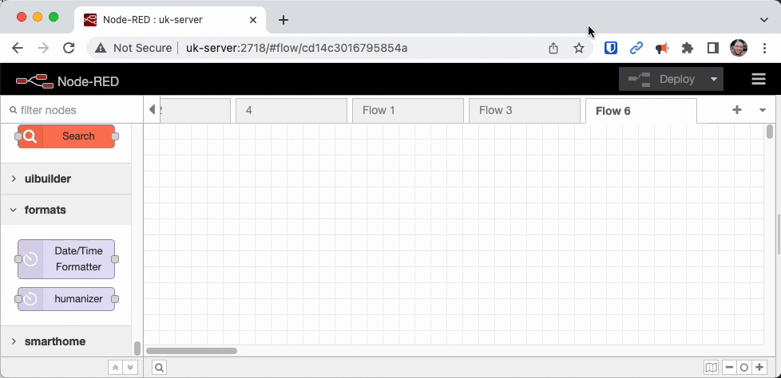

There is usually more than one way to complete a given task in software, and Node-RED is no exception. In each of this series of blog posts, we are going to share three useful tips to save yourself time when working on your flows.
<!--more-->

### 1. Copy and share your flows using Export and Import

Node-RED provides both import and export features that allow you to save your flows and settings as compressed JSON files. You can use these features to easily move your flows between multiple Node-RED instances or to back up your work.

To import a flow, follow these steps:

1. Click on the three horizontal lines in the upper right corner of the Node-RED editor and click on "Import".
2. Select the JSON file that contains the flow you want to import.
3. Click on "Import" and the flow will be imported into the current instance of Node-RED.

To export a flow, follow these steps:

1. Click on the three horizontal lines in the upper right corner of the Node-RED editor and click on "Export".
2. Select the type of export you want to perform - this can be either the "Clipboard" or "File".
3. If you chose "File" you will be prompted to save a compressed JSON file to your computer; if you chose "Clipboard" the flow JSON will be copied to your clipboard.
4. Use the exported file or clipboard content to import into a different instance of Node-RED.

Keep in mind that some nodes or flows may require additional setup or node installation on the Node-RED instance you import your flow to.

### 2. Import helpful example flows provided with custom nodes

In Node-RED, custom nodes can include examples that provide users with a starting point for using the node. These examples can help users understand how a node works and how it can be integrated into their flows. 

To use example flows in custom nodes, follow these steps:

1. Open the Node-RED editor and drag the custom node you want to use into your flow.
2. Double-click on the node to open its configuration panel.
3. Look for an "Examples" menu or button within the node configuration panel. The name and location of the Examples button can vary depending on the node.
4. Click on the "Examples" button to bring up a list of example flows included with the node.
5. Select the example flow you want to use and click on "Import" to add the example flow to your Node-RED workspace.

Once the example flow has been added to your workspace, you can modify it to fit your specific needs.

It's important to note that while custom node examples can be a useful starting point, they may not always work seamlessly with your other flows or nodes. Be sure to thoroughly test any custom node examples before incorporating them into a production environment.

### 3. Group nodes together to make your flows easier to read

The group feature in Node-RED allows users to visually group nodes together within the workspace. This feature offers several benefits:

1. Improved organization: The group feature allows you to group related nodes visually, which can make your flow easier to understand and navigate. This can be particularly helpful for larger, more complex flows.

2. Simplified editing: When you group nodes together, you can edit or move them as a single unit, rather than individually. This can save time and reduce the chance of errors.

3. Easier sharing: When you share your flow with others, the group feature allows you to package related nodes together, making it easier for others to understand and use your flow.

4. Reduced clutter: Grouping nodes can help reduce the visual clutter in your workspace, making it easier to focus on key aspects of your flow.

Overall, the group feature in Node-RED is a valuable tool that can help users better organise, edit, and share their flows.

We hope you found these tips useful, if you'd like to suggest some of your own tips which you think we should share in our future blog posts please [get in touch](mailto:contact@flowfuse.com).

You can read our previous Node-RED tips here.

[Node-RED Tips - Smooth, Catch, and Math](/blog/2023/03/3-quick-node-red-tips-4/)\
[Node-RED Tips - Exec, Filter, and Debug](/blog/2023/03/3-quick-node-red-tips-3/)\
[Node-RED Tips - Deploying, Debugging, and Delaying](/blog/2023/02/3-quick-node-red-tips-2/)\
[Node-RED Tips - Wiring Shortcuts
](/blog/2023/02/3-quick-node-red-tips-1/)

## Version Control and Collaboration for Your Node-RED Flows

[FlowFuse](/) simplifies managing and collaborating on your Node-RED flows with seamless version control. You can easily track changes, take snapshots, and revert to previous versions, ensuring your work is always safe and recoverable.

With FlowFuse [Team Library](/docs/user/shared-library/#shared-team-library), sharing flows across different Node-RED instances is effortless. This Library feature allows you to organize and share flows among team members without the need for manual copying, making collaboration more efficient and effective.

**[Sign up]() for a free trial today and discover how FlowFuse can enhance your Node***