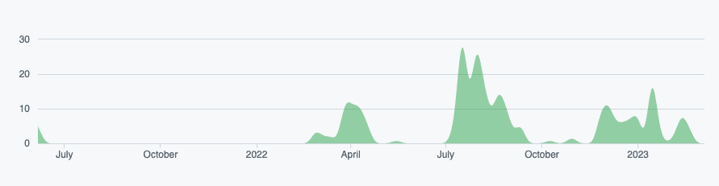

Dashboards are a great feature of Node-RED, allowing you to easily expose data visualisations and interactive elements of your flows to users via a web browser. I often see discussions in the community about which dashboard option is best for any given scenario, I wanted to compare the most popular options as they stand in early 2023.

<!--more-->

    
<strong>UPDATE:</strong> Since this article was published, it's worth noting a couple of important updates:

    <ul>
        <li>FlexDash is no longer maintained and supported.</li>
        <li><a href="https://dashboard.flowfuse.com">Node-RED Dashboard 2.0</a> has been released, which is a new, modern dashboard stack for Node-RED, and offers all of the benefits of the original "Node-RED Dashboard", plus more.</li>
    </ul>

## Which dashboards am I going to consider?

 Based on their downloads per week and active development, I believe there are 3 main dashboards worth considering. In no particular order, they are [Dashboard](https://flows.nodered.org/node/node-red-dashboard), [uibuilder](https://flows.nodered.org/node/node-red-contrib-uibuilder), and [FlexDash](https://flows.nodered.org/node/@flexdash/node-red-fd-corewidgets).

It's not to say that there are not other options, I am focusing on the dashboards I believe are popular in the Node-RED community.

I'd like to take this opportunity to thank the project leads for each of the three dashboards for responding to me and providing their take on the current state and future development of each. Where possible I have quoted their words, either from their messages to me or from the projects' documentation. Thanks to [Dave](https://github.com/dceejay), [Julian](https://github.com/TotallyInformation), and [Thorsten](https://github.com/tve) for their replies as well as all the work they've put into these great projects!

## Methodology

To compare these dashboards, I am going to consider each of them based on the following factors:

- [How easy is it to install?](#how-easy-is-it-to-install%3F)

- [How easy is it to get your first demo dashboard running?](#how-easy-is-it-to-get-your-first-demo-dashboard-running%3F)

- [How extensive is the collection of UI elements?](#how-extensive-is-the-collection-of-ui-elements%3F)

- [How good is the support and documentation?](#how-good-is-the-support-and-documentation%3F)

- [How 'cloud native' is the dashboard?](#how-'cloud-native'-is-the-dashboard%3F)

- [How active is each project's development?](#how-active-is-each-project's-development%3F)

- [What are the future development plans?](#what-are-the-future-development-plans%3F)

I am assuming the user is a low-code developer. They may have limited experience with coding and are most comfortable working in visual interfaces.

So, that's the methodology, let's get on with looking at the strengths of each project.

## How easy is it to install?

### uibuilder - 1st place

A search on Google for uibuilder returns the correct custom node. When searching for the custom node in the palette manager there is only one result, this is great as users are very likely to install what they were searching for. Once you've found the correct custom node, the installation takes just a few moments using the palette manager.

### Dashboard - 2nd place

As Dashboard is currently the most popular solution to build dashboards in Node-RED, it's very easy to find both in search engines and in the Node-RED interface. A Google search brings up the correct custom node. Finding this custom node in Node-RED's palette manager is not quite as easy, at the time of writing it's the third from top result for the search term 'dashboard'. Some users might not select the intended item from the palette manager on first attempt. However, once you have found the correct custom node, installation is easy and takes just a few moments.

### FlexDash - 3rd place

When searching for 'FlexDash node red' on Google, the top result is the Node-RED website for the custom node. The issue with this, and this is also a problem when searching in the palette manager, is the project 'FlexDash' is apparently not what we actually need to install. When reading the readme for the project on Github it says *'You most likely do not want to explicitly install this package, you want to install the [core widgets](https://github.com/flexdash/node-red-fd-corewidgets), which will bring in this package and more and will provide a usable whole'.*

Credit to the developers for adding in this helpful text but I suspect most users will start off by installing FlexDash then later discover that was not the correct way to proceed. It would be great if the custom node which needs to be installed was the one called 'FlexDash' in my opinion.

This problem is compounded by there being no help file at all for 'FlexDash' showing up on the Node-RED web site. That may well be a deliberate attempt to help users get the right custom node installed, but it was still a confusing start for me and I suspect other users will have a similar experience.

When setting up FlexDash, one thing that wasn't immediately obvious was that I needed to restart Node-RED before the custom node showed in the palette. This step is [covered in the docs](https://flexdash.github.io/docs/quick-start/#installing-flexdash-in-node-red) but I suspect a lot of users will get stuck working out why the palette manager says the custom node is installed but nothing new has been added to the palette.

There is also an [ongoing discussion](https://github.com/node-red/node-red/issues/569) about a way to resolve issue by changing how Node-RED deals with dependencies which sounds promising.

I believe a few improvements to the install process could make FlexDash a much more popular custom node.

## How easy is it to get your first demo dashboard running?

### FlexDash - 1st place

Getting an example dashboard up and running in FlexDash is very easy thanks to the example flows which are included in the package. Simply go to 'Import', 'Examples' then select 'Hello-world' from the example flows. Now deploy and add /flexdash to the end of the URL of your Node-RED editor and you should have your first dashboard running.

### uibuilder - 2nd place

It was quite simple to get an example dashboard up and running in uibuilder. As with FlexDash, there are examples you can import. Once we import an example we do start to see the significantly different approach to delivering dashboards with uibuilder to the other two solutions. The examples seem to demonstrate how you could build a dashboard rather than showing specific UI elements such as charts in use.

### Dashboard - 3rd place

Getting your first dashboard running in Dashboard is quite easy, once installed you need to drag in a Dashboard UI element then assign that to a UI group and tab. The group and tab can be left as their default options (home) which I suspect most users will work out quickly. 

You then need to deploy your flow and visit the dashboard using '/ui' on the end of the URL of your Node-RED editor and you are up and running.

Dashboard would benefit from some example flows as we see with the other two custom nodes.

## How extensive is the collection of UI elements?

### FlexDash and Dashboard - joint 1st place

It's really hard to separate these two, when considering the UI elements they come with. They both have out of the box solutions for charts, gauges, buttons, drop downs, toggles, text etc. I think they both deserve 1st place in this category.

### uibuilder - 3rd place

This is possibly a little unfair on uibuilder. Arguably by design, uibuilder does not currently include many UI elements. To add most useful elements (charts, gauges etc) to your dashboard, you will need to set out your design in HTML or look at using one of the supported frontend frameworks. This makes uibuilder more versatile for users who are comfortable using code to set out dashboards but for the low-coders among us it's less ideal.

## How good is the support and documentation?

### All three - joint first place

All three projects have an active community and good support documentation. Where as I may have a personal preference about how I like documentation to be set out, I don't think that makes any one project better than the rest.

## How 'cloud native' is the dashboard?

In the words of the [Cloud Native Computing Foundation](https://www.cncf.io/) '*Cloud native technologies empower organizations to build and run scalable applications in modern, dynamic environments such as public, private, and hybrid clouds. Containers, service meshes, microservices, immutable infrastructure, and declarative APIs exemplify this approach*'.

'*These techniques enable loosely coupled systems that are resilient, manageable, and observable. Combined with robust automation, they allow engineers to make high-impact changes frequently and predictably with minimal toil*'.

So, how well does each project conform to these ideals?

### Dashboard - 1st place

Dashboard stores all configuration data within the Node-RED instance. When deploying an existing Node-RED project to a new instance everything just works exactly as it did previously.

### FlexDash - 2nd place 

As with Dashboard, everything required to define each dashboard is stored within Node-RED. This makes redeployment trivial. Unfortunately, as the Node-RED instance currently needs to be restarted before FlexDash works, it just missed out on joint first place. It would be great to see that issue resolved in future versions. There is also an [ongoing discussion](https://github.com/node-red/node-red/issues/569) about a way to resolve issue by changing how Node-RED deals with dependencies. 

### uibuilder - 3rd place

uibuilder uses the filesystem of the host instance to store its configuration. In practice this means that if you migrate the Node-RED project files to a new location you probably will find your dashboard no longer works. This can be mitigated by also migrating the filesystem (for example using persistent storage in Docker) and re-deploying via a Docker registry but it would be great to see uibuilder move towards not being dependant on the filesystem as it will make DevOps tasks that much easier.

## How active is each project's development?

### uibuilder - 1st place

uibuilder has has consistent commits to the project going back several years with even greater activity since the start of 2022.

### FlexDash - 2nd place

The commits to FlexDash have been regular since mid 2022.

### Dashboard - 3rd place

Dashboard is now in a a maintenance only state. In the words of the project lead, *'Angular 1 (the framework used to build Dashboard) is now unsupported and it's just a matter of time before there is a serious security hole raised against it, for which there will be no fix. Of course we don't use all the features of it so we may be lucky that an exploit doesn't necessarily expose us directly but it will compromise any audits people may wish to do'*.

In practice, this means that sooner or later using Dashboard might become a significant security risk.

## What are the future development plans?

### uibuilder - joint firstplace

During the writing of this article, uibuilder released a new version with some significant new features. In the words of the project lead when talking about version 6.1.0, '*It feels like uibuilder really is growing up. No more apologising for not being a direct Node-RED Dashboard replacement, uibuilder has its own path*.

*You can now create and update visible web page elements direct from Node-RED data without needing to understand all of the intricacies and inconsistencies of HTML. You can create your own utility tools either in Node-RED or in front-end code that leverages the low-code UI features of uibuilder*'.

It's great to see projects under active development. My greatest difficulty when using uibuilder, is I found it hard to create the UI elements I needed based on low-code workflows. According to the [development roadmap for uibuilder](https://totallyinformation.github.io/node-red-contrib-uibuilder/#/roadmap) the project should progress towards being easier and easier for low-coders to make use of.

To again quote the project lead, '*In general, the ongoing direction of travel is to enable more zero-code features that will work both in Node-RED flows and in front-end custom code. The low-code feature set is already quite mature now and is well documented enough that it can be used by other tools should anyone wish to do so. I will be making sure that both the zero-code and low-code features are as easy to use as possible both from Node-RED and front-end code for maximum flexibility*'.

### FlexDash - joint firstplace

The project Lead for FlexDash had the following to say about the future development of the project. '*FlexDash currently has a fairly rigid overall page structure: there's a tab bar and each tab's content is organized in grids of widgets. The plan is to open this up fully so the user can start from a blank page and place containers which contain widgets. This way almost any layout could be implemented in FlexDash*'.

'*I also would like to improve the multi-user capabilities of FlexDash by supporting authentication and making it easier for users to implement flows that present per-user data in the dashboard*'.

After using FlexDash over the past couple of weeks and finding it to be already be a strong contender for all my Node-RED dashboard needs, it's great to see it continuing to be improved.

### Dashboard - third place

***Important Update: New Generation of Node-RED Dashboard Released:*** *A new generation of the outdated and unmaintained Node-RED Dashboard has been released to replace it. Introducing [Node-RED Dashboard 2.0](https://dashboard.flowfuse.com/), built on Vue.js, offering significantly more versatility than its predecessor. This new dashboard, managed by FlowFuse, is designed to allow full customization, addressing the limitations of the previous version.* 

*Node-RED Dashboard 2.0 retains most of the widgets and concepts from the old version, so transitioning from Node-RED Dashboard 1.0 to 2.0 is easy. For a full feature comparison you can check out the [Migration Guide](https://dashboard.flowfuse.com/user/migration.html).

Dashboard 2.0 includes various chart types such as line, scatter, bar, gauge, and more, and it's compatible with all the [Vuetify component library](https://vuetifyjs.com/en/components/all/#containment), making it easier to build advanced dashboards.*

*Furthermore, the team is continuously working on adding more amazing features to enhance the user experience. For a smooth transition, FlowFuse provides easy-to-follow guides. Refer to [Node-RED Dashboard 2.0 Guides](https://flowfuse.com/blog/dashboard/) for more information.*

As mentioned above, Dashboard is no longer in active development. This is due to the framework upon which it was build [(AngularJS)](https://angularjs.org/) now being unsupported as of the end of 2021. You can read a lot more detail on why ongoing development of Dashboard is not practical in this [thread on the Node-RED forums](https://discourse.nodered.org/t/discussion-about-a-new-dashboard/51119/3).

There could possibly be new effort put into porting Dashboard over to a new framework but that is a significant amount of work. I suspect it would take hundreds of hours development just to get the feature set back to the same state as the current version so I suspect it won't ever happen.

## Conclusions

Personally, I was a little surprised by these results. I have used Dashboard for around 3 years and always found it to be a great tool for putting together quick and informative dashboards. That being said, when attempting to objectively compare it to uibuilder and FlexDash, the other two projects often are individually better in a given category. That coupled with the halt of development for Dashboard due to AngularJS being no longer supported, it's hard to recommend Dashboard for totally new Node-RED users in 2023, especially for commercial projects.

If you already use Dashboard, in a non-commercial setting you should probably continue to do so, you might find that its development slows down to a near stall due to the underlying framework now being abandoned but for at least as of right now it's a great solution to build your Node-RED dashboards in.

FlexDash is probably the best low-code solution for building dashboards in Node-RED. If you don't get blocked by the confusing install process I believe it's the one to pick up at the time of writing due to it's ongoing support and low-code interface.

uibuilder is currently not what I would consider a truly low-code option for creating dashboards but it is moving in that direction. It has some great features and is extremely flexible so it has a good chance of ending up as the most popular solution to build dashboards in Node-RED in the long term. That being said, as of time of writing unless you are a 'coder' you will may struggle to build a dashboard using it.
