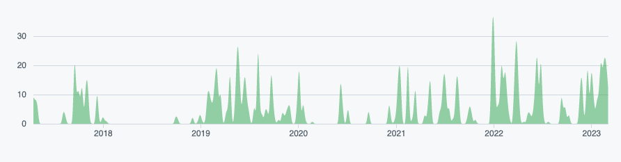

Dashboards are a great feature of Node-RED, allowing you to easily expose data visualisations and interactive elements of your flows to users via a web browser. I often see discussions in the community about which dashboard is best for any given scenario, I wanted to compare the most popular options as they stand in early 2023.

<!--more-->

## Which dashboards am I going to consider?

At this time I believe there are 3 main dashboards worth considering based on their downloads per week and active development. In no particular order, they are:

- [Dashboard](https://flows.nodered.org/node/node-red-dashboard)

- [UIBuilder](https://flows.nodered.org/node/node-red-contrib-uibuilder)

- [Flexdash](https://flows.nodered.org/node/@flexdash/node-red-fd-corewidgets)

It's not to say that there are not other options, I am focusing on the dashboards I believe you are most likely to use day to day.

## Methodology

To compare these dashboards, I am going to consider each of them based on the following factors:

- How easy is it to install?

- How easy is it to get your first demo dashboard running?

- How extensive is the collection of UI elements?

- How well supported and documented is the dashboard?

- How active is the development of the dashboard?

- What's the plan for development of the dashboard?

For each of these factors I will award a score of one to three, three being the highest score, one before the lowest. I will then use those scores to work out the highest scoring dashboard in what is an overly simplistic while easy to consume format.

I am also assuming the user as a 'low-code' developer. They may have limited experience with coding but they are most comfortable working in visual interfaces. I am also assuming that the user has been recommended to search for each of these dashboards by name. It's a little unfair to say that Dashboard is inherently better because its name is an obvious search term for dashboards, I'm going to attempt to leave that playing field.

So, that's the methodology, let's get to the dashboards.

## How easy is it to install?

### UI Builder - 1st place

A search on [Duck Duck go for the term 'node red ui builder'](https://duckduckgo.com/?q=node+red+ui+builder&t=h_&ia=web) returns the correct custom node. When searching for the customer node in the palette manager there is only one result, this is great as users are very likely to install what they were searching for. Once you've found the correct custom node installation takes just a few moments using the palette manager.

### Dashboard - 2nd place

As Dashboard is currently the most popular solution to build dashboards in Node-RED it's very easy to find both inside and outside of the Node-RED interface. For example, a [Duck Duck Go search for 'node red dashboard'](https://duckduckgo.com/?q=node+red+dashboard&t=h_&ia=web) brings up the correct custom node. Finding this custom node in Node-RED's palette manager is not quite as easy, at the time of writing it's the third from top result for the search term 'dashboard'. Some users might not select the intended item from the palette manager on first attempt. Once you have found the correct custom node installation is easy and takes just a few moments.

### Flexdash - 3rd place

When [searching on Duck Duck Go for 'node red flexdash'](https://duckduckgo.com/?q=node+red+flexdash&t=h_&ia=web) the top result is the Node-RED website for the custom node. The issue with this, and this is also a problem when searching in the palette manager, is the project 'Flexdash' is apparently not what we actually need to install. When reading the readme for the project on Github it says:

*'You most likely do not want to explicitly install this package, you want to install the [core widgets](https://github.com/flexdash/node-red-fd-corewidgets), which will bring in this package and more and will provide a usable whole'.*

Credit to the developers for adding in this helpful text but I suspect most users will start off by installing Flexdash then later discover that was not the correct way to proceed. It would be great if the custom node which needs to be installed was the one called 'Flexdash' in my opinion.

This problem is compounded by their being no help file at all for 'Flexdash' showing up on the Node-RED web site. I suspect they may be a deliberate attempt to get users to reconsider if they are on the right custom node but it was still a confusing start for me and I suspect many users will have a similar experience.

When setting up Flexdash, one thing that wasn't immediately obvious was that I needed to restart Node-RED before the custom nodes showed in the palette. This step is [covered in the docs](https://flexdash.github.io/docs/quick-start/#installing-flexdash-in-node-red) but I suspect a lot of users will get stuck working out why the palette manager says the customer node is installed but nothing new has been added to the palette.

## How easy is it to get your first demo dashboard running?

### Flexdash - 1st place

Getting an example dashboard up and running in Flexdash is very easy thanks to the example flows which come in the custom node. Simply go to 'Import', 'Examples' then select 'Hello-world' from the example flows. Now deploy and add /flexdash to the end of the URL of your Node-RED editor.

### UIBuilder - 2nd place

It was quite simple to get an example dashboard up and running fir UIBuilder. As with Flexdash, there are examples you can import. Once we import an example we do start to see the significantly different approach to delivering dashboards with UIBuilder to the other two dashboards. The examples seem to just show that a message can be sent from the front end to Node-RED and visa versa. More on that later.

### Dashboard - 3rd place

Getting your first dashboard running in Dashboard is quite easy, once installed you need to drag in a Dashboard UI element then assign that to a UI group and tab. The group and tab can be left as their default options (home) which we suspect most users will work out quickly. 

You then need to deploy your flow and visit the dashboard using '/ui' on the end of the URL of your Node-RED editor. 

Dashboard would benefit from some example flows as we see with the other two custom nodes.

## How extensive is the collection of UI elements?

### Flexdash and Dashboard - joint 1st place

It's really hard to separate these two, when considering the UI elements they come with. They both have out of the box solutions for charts, gauges, buttons, drop downs, toggles, text etc. I think they both deserve 1st place in this category.

### UIBuilder - 3rd place

This is possibly a little unfair on UIBuilder. Arguably by design, UIBuilder does not included any UI elements. To add elements to your dashboard you will need to set out your design in HTML or look at using one of the supported frontend frameworks. This makes UIBuilder more versatile for users who are comfortable using code to set out dashboards but for the low-coders among us it's less ideal.

## How well supported and documented is the dashboard?

### All three - joint first place.

All three projects have an active community and good support documentation. Where as I may have a personal preference about how I like documentation to be set out I don't think that makes one project better than the other two so equal points for all three.

## How active is the development of the dashboard?

### UIBuilder - 1st place

UIBuilder has has consistent commits to the project since 2019 with even greater activity since the start of 2022.

### Flexdash - 2nd place

The commits to Flexdash have been regular since mid 2022.

### Dashboard - 3rd place

Dashboard is very mature which might explain why there have been a lot less commits since 2021.

## What's the plan for development of the dashboard?

### UIBuilder and Flexdash - joint firstplace

Both of these project are seeing significant development with plans to make significant upgrades in  2023. 

### Dashboard - third place

## What are the scores and conclusions?

|Category|UIBuilder|Flexdash|Dashboard|
|-----------------|----|----|----|
|How easy is it to install?|3|2|1|
|How easy is it to get your first demo dashboard running?|2|3|1|
|How extensive is the collection of UI elements?|1|2.5|2.5|
|How well supported and documented is the dashboard?|2|2|2|
|How active is the development of the dashboard?|3|2|1|
|What's the plan for development of the dashboard?|2.5|2.5|1|
|**Totals**|13.5|14|8.5|

Personally, I was a little surprised at these results. I have used Dashboard for around 3 years and always found it to be a great tool for putting together quick and informative dashboards. That being said, when attempting to objectively compare it to UIBuilder and Flexdash the other two projects often are individually better in each category. That coupled with the slow down of development for Dashboard means that it's hard to recommend Dashboard for new users in 2023.

If you already use Dashboard you should probably continue to do so, you might find that its development slows down to a near stall due to the underlying framework now being abandoned but for at least as of right now it's a great solution to build your Node-RED dashboards in.

Flexdash is probably the best low-code solution to building dashboards in Node-RED. If you don't get blocked by the confusing install process it's the one to pick up at the time of writing.

UIBuilding is currently not really a low-code solution to creating dashboards. It's got some amazing features and has a good chance as ending up as the most popular solution to build dashboards in Node-RED in the long term but as of time of writing unless you are a 'coder' you will probably struggle to build dashboards using it.