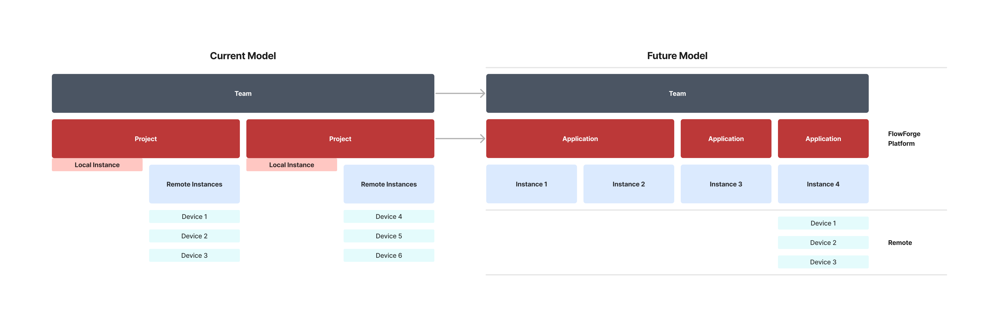

The focus of the new FlowForge 1.5 release is mainly on UI and architectural changes that will allow for future innovations of the FlowForge platform.

<!--more-->

The UI changes deal with how things are named in FlowForge. We are updating some key terms to allow us to expand the overall functionality of the FlowForge platform. Below is a summary of these changes.

### New ‘Application’ Concept

In FlowForge 1.5, we have introduced a new concept called **Application**. An Application allows you to organize Node-RED instances into managed groups. In the 1.5 release, an Application can have only a single Node-RED instance but in future releases Applications will allow for multiple Node-RED instances. In the future this will allow us to implement capabilities such as ‘deliver pipelines’ and high availability.

### Project renamed to Instance

The term ‘project’ is being removed from FlowForge and is replaced with the term **Instance**. An Instance is a customized version of Node-RED that includes various FlowForge plugins to integrate it with the FlowForge platform.

An Instance can store the environment variables used in your Node-RED flows. In future releases, environment variables will also be able to be stored at the Application level.

By default, an Instance will run on the FlowForge Platform. For example, FlowForge Cloud hosts running Node-RED instances. 

### Device

FlowForge can also be used to manage Node-RED instances running on remote devices. This is typically useful when you have a number of remote devices that are required to run the same Node-RED instance.

To accomplish this remote management capability, the Node-RED device agent needs to be installed on each device. Devices are registered with a Team, and then the appropriate device(s) are assigned to a Node-RED instance that should be deployed to the device(s). When the Node-RED instance is ready for deployment, a user creates a snapshot of the instance and marks it as a target snapshot for the device.

We hope these changes will simplify the FlowForge terminology for our users and allow us to grow the FlowForge platform.

## Other Improvements

Update to audit logs to improve usability  [[#1800](https://github.com/flowforge/flowforge/issues/1800)] [[#1785](https://github.com/flowforge/flowforge/issues/1785)]

## Bug Fixes

Device "Last Seen" status shows "never" even though it has previously been seen [[#1723](https://github.com/flowforge/flowforge/issues/1723)]

## Try it out

We're confident you can have self managed FlowForge running locally in under 30 minutes.
You can install our [local build](https://flowforge.com/docs/install/local/), use [Docker](https://flowforge.com/docs/install/docker/), or [Kubernetes](https://flowforge.com/docs/install/kubernetes/).

If you'd rather use our hosted offering: [Get started for free](https://app.flowforge.com/account/create) on FlowForge Cloud.

## Upgrading FlowForge

[FlowForge Cloud](https://app.flowforge.com) is already running 1.5.

If you installed a previous version of FlowForge and want to upgrade, our documentation provides a
guide for [upgrading your FlowForge instance](https://flowforge.com/docs/upgrade/).

## Getting help

Please check FlowForge's [documentation](https://flowforge.com/docs/) as the answers to many questions are covered there.

If you hit any problems with the platform please raise an [issue on GitHub](https://github.com/flowforge/flowforge/issues).
That's also a great place to send us any feedback or feature requests.

You can also get help on [the Node-RED forums](https://discourse.nodered.org/)

As well as in the [forum within our Github project](https://github.com/flowforge/flowforge/discussions)

Chat with us on the `#flowforge` channel on the [Node-RED Slack workspace](https://nodered.org/slack)

You can raise a support ticket by emailing [support@flowforge.com](mailto:support@flowforge.com)

We've also added a live chat widget to our website, you can access it using the icon on the bottom right corner of our website. We'd love to hear from you.
