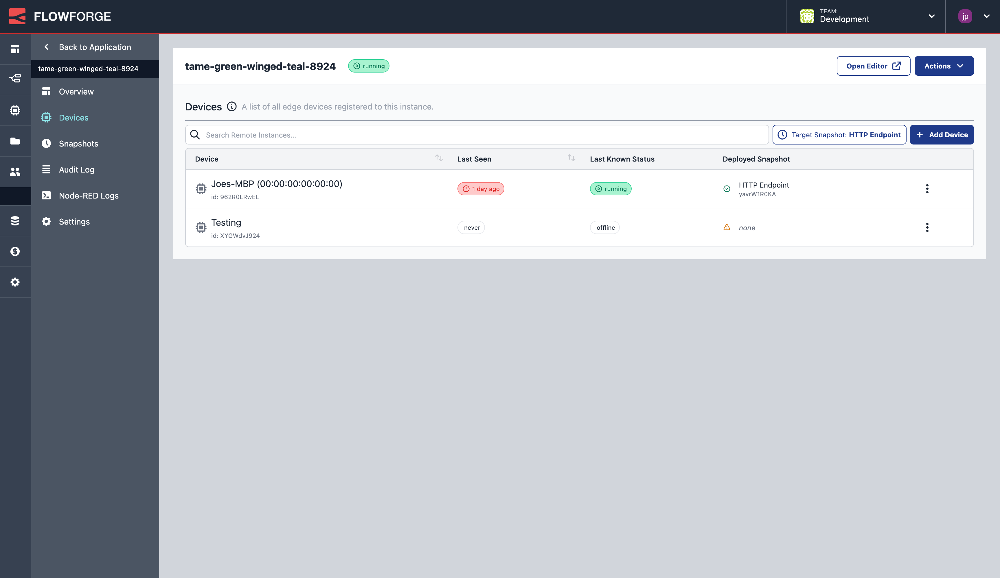

For FlowFuse 1.5 we have been busy making a lot of UX changes and upgrading our underlying architecture to enable future innovations on the FlowFuse platform.

<!--more-->

With our recently announced [Terminology Changes](/blog/2023/03/terminology-changes/), we have introduced some new concepts into FlowFuse.

- **Application**: A group of Node-RED Instances Each instance can run locally (in FlowFuse) or remotely (on Devices)
- **Instances**: We renamed "Projects" to "Instances" to be more inline with the terminology used in the Node-RED community

As such, our User Experience has been updated to reflect these changes, and allow for further functionality to be introduced with our plans for [Multiple Instances per Application](https://github.com/FlowFuse/flowfuse/issues/1689).

### "Applications" View

At the top-level in FlowFuse, you can now see a list of your "Appications". In FlowFuse 1.5, as we still have a 1:1 relationship of Applications to Local Instances, this will be the same as the list of "Projects" that you're used to seeing.

<figcaption class="-mt-6 text-center"><b>"Applications" view in FlowFuse, listing all available Applications</b></figcaption>

For 1.5, all of your settings, environment variables, etc. are all now at the "Instance" level. Applications will gain a lot more functionality in future releases.
### "Instances" View

When clicking on one of your Applications, you will see a list of Node-RED instances bound to that Application.

<figcaption class="-mt-6 text-center"><b>A list of Instances contained within a single Application.</b></figcaption>

Clicking on this Instance, will open up the "Instance" view, this is an exact replica of the "Project" view you'll be used to seeing in FlowFuse, and contains all of the same functionality:

<figcaption class="-mt-6 text-center"><b>FlowFuse 1.5's "Instance" view. This contains all of the functionality previously found in the "Project" view.</b></figcaption>

### Devices & Managing Remote Instances

Devices are now bound to "Instances", you'll see these in the "Devices" view, and can be managed and deployed to in exactly the same way as before. Devices will run whatever you've selected as your "Target Snapshot" for this Instance.

<figcaption class="-mt-6 text-center"><b>"Devices" view, available for a given Node-RED Instance. This lists all of the connected devices to a given instance, that will automatically update when a new Target Snapshot is set.</b></figcaption>

## Node-RED 3.1 Beta Available

FlowFuse Cloud is a great place to try out the new Node-RED features, with FlowFuse Cloud now including the [Node-RED 3.1.0-beta.2](https://discourse.nodered.org/t/node-red-3-1-0-beta-2-released/76192). If you want to try this version you can [duplicate your application](https://flowfuse.com/docs/user/instance-settings/#copy-instance) or [upgrade your stack](/docs/user/changestack/).

## Other Improvements

- Update to audit logs to improve usability [[#1800](https://github.com/FlowFuse/flowfuse/issues/1800)] [[#1785](https://github.com/FlowFuse/flowfuse/issues/1785)]
- Improve how licensing works with overages, for easier scaling of FlowFuse and your Node-RED Instances [[#1639](https://github.com/FlowFuse/flowfuse/issues/1639)] [[#1739](https://github.com/FlowFuse/flowfuse/issues/1739)]

## Bug Fixes

- Device "Last Seen" status shows "never" even though it has previously been seen [[#1723](https://github.com/FlowFuse/flowfuse/issues/1723)]
- Improved Safe Mode launch for small projects [[#1579](https://github.com/FlowFuse/flowfuse/issues/1579)]

## Try it out

We're confident you can have self managed FlowFuse running locally in under 30 minutes.
You can install FlowFuse yourself via a variety of install options. You can find out more details [here](/docs/install/introduction/).

If you'd rather use our hosted offering: [Get started for free]() on FlowFuse Cloud.

## Upgrading FlowFuse

[FlowFuse Cloud]({{ site.appURL }}) is already running 1.5.

If you installed a previous version of FlowFuse and want to upgrade, our documentation provides a
guide for [upgrading your FlowFuse instance](/docs/upgrade/).

## Getting help

Please check FlowFuse's [documentation](/docs/) as the answers to many questions are covered there.

If you hit any problems with the platform please raise an [issue on GitHub](https://github.com/FlowFuse/flowfuse/issues).
That's also a great place to send us any feedback or feature requests.

You can also get help on [the Node-RED forums](https://discourse.nodered.org/)

As well as in the [forum within our Github project](https://github.com/FlowFuse/flowfuse/discussions)

Chat with us on the `#flowfuse` channel on the [Node-RED Slack workspace](https://nodered.org/slack)

You can raise a support ticket by emailing [support@flowfuse.com](mailto:support@flowfuse.com)

We've also added a live chat widget to our website, you can access it using the icon on the bottom right corner of our website. We'd love to hear from you.
