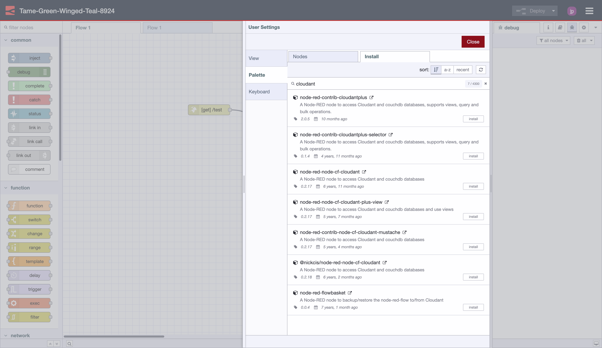
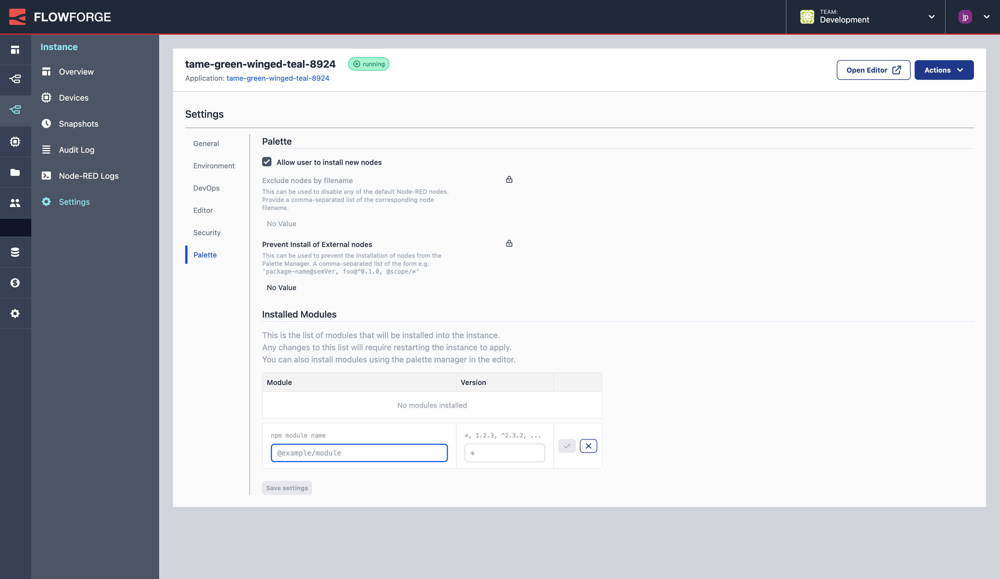

IBM Cloud has [recently announced](https://www.ibm.com/cloud/blog/announcements/deprecation-of-ibm-cloud-starter-kits) that they will no longer be providing their Cloud App Service Starter Kits, including the [Node-RED Starter Application](https://developer.ibm.com/tutorials/how-to-create-a-node-red-starter-application/).

<!--more-->

## Node-RED Starter Application

If you're looking for an alternative place to get started with Node-RED then FlowForge, founded by Node-RED co-creator Nick O'Leary, are here to help you with Cloud-hosted Node-RED as well as infrastructure and tooling to scale your Node-RED instances in production.

As an ex-IBM Employee myself, over the years, I've been very dependant upon the Node-RED Starter Application in IBM Cloud. I'd used it dozens of times with clients to showcase the value of Node-RED and how easy it is to spin up integrations between hardware devices, APIs and online services.

If you're now looking for somewhere to rely on in order to easily spin up new instance of Node-RED, then FlowForge is the obvious answer. If you're completely new for Node-RED too, we can also help you there with our [Getting Started](/blog/2023/01/getting-started-with-node-red/) guide.

You can sign up for a [free FlowForge Cloud Account](https://app.flowforge.com/account/create) where you'll be given one small Node-RED instance for free, for your first month.

## Integrations

If you've seen the excellent ["Create a Node-RED starter application"](https://developer.ibm.com/tutorials/how-to-create-a-node-red-starter-application/) article on IBM Developer, you'll probably be looking to connect up to a Cloudant Instance, or other IBM Cloud Services. Don't worry. All of that is still available through Node-RED on FlowForge.

You can install the relevant nodes in one of two places:

1. **Node-RED Palette Manager:** Click "Menu > Manage Palette > Install". The menu is available via the icon in the top-right of your running Node-RED Instance)

2. **FlowForge Instance Settings:** For a given Instance in FlowForge, click "Settings > Palette". You can then define the npm module name and versions explicitely in the "Installed Modules" section

It's also easy to setup [Environment Variables](/blog/2023/01/environment-variables-in-node-red/) for Node-RED in FlowForge for when you integrate with external services like APIs too.

## Security

As with IBM Cloud, FlowForge makes it very easy to secure your Node-RED Applications. [FlowForge offers three tiers of security](https://flowforge.com/docs/user/instance-settings/#security) options on your Node-RED Instances to secure any exposed HTTP routes on your Node-RED instance, e.g. REST API endpoints or Node-RED Dashboard.

- **None**: Anyone will be able to access the exposed routes.
- **Basic Auth**: Setup a single, dedicated username and password combination that is required in order to access the routes.
- **FlowForge Credentials**: Visitors can use their FlowForge username/password in order to access the endpoints. This also includes SSO if you have that configured for your FlowFoerge Team.

## Migrating Existing Instances

If you're looking to move your Node-RED applications from IBM Cloud, then you can do so through one of two options:

### Node-RED Tools Plugin

You can use our Node-RED Tools plugin to migrate your flows and credentials over to FlowForge. You can read the details in our [Migration Guide](https://flowforge.com/docs/user/migration/), which also includes instructions on how to export your environment variables too.

### Manual Import

This will only enable you to import your Flows, not the associated credentials.

1. Export your existing `flows.json` from your IBM Cloud-hosted Node-RED instance by choosing "Export > All Flows > Download" within Node-RED
2. Create a new Application on FlowForge
3. Once created, click the Node-RED instance that has been generated within your Application
4. Click "Settings"
5. Scroll down and select the "Import Instance" option
6. Choose your `flows.json` file that you downloaded earlier.

_If you have any questions about the above, or more generally about Node-RED or FlowForge, then please do reach out and [get in touch](/contact-us)._