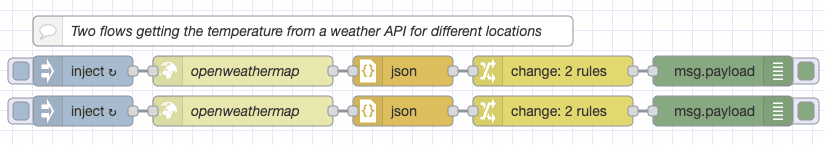
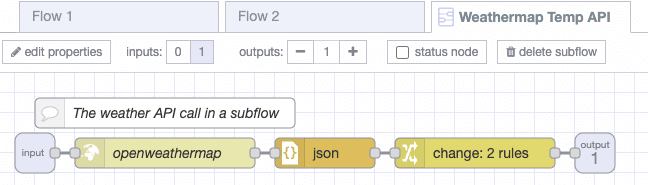
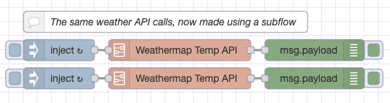
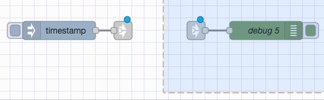
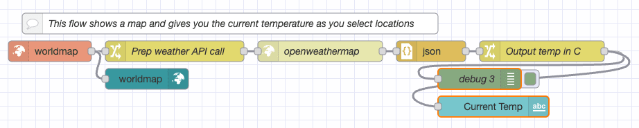
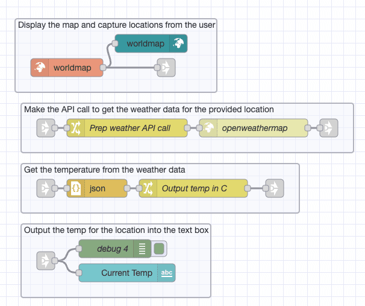
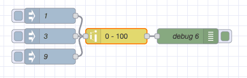
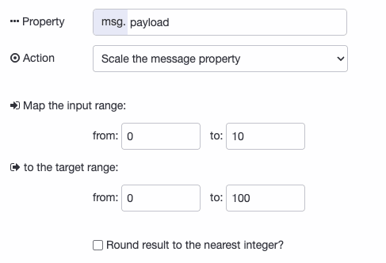
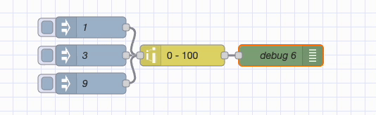

There is usually more than one way to complete a given task in software, and Node-RED is no exception. In each of this series of blog posts, we are going to share three useful tips to save yourself time when working on your flows.

<!--more-->

### 1. Subflows

Subflows are a great way to reuse sections of your flows. Once you have created a subflow, it can easily be dropped into your workspace one or more times.

#### Why use subflows?

Without using a subflow, you can copy and paste a flow into each place you need to use it. This takes up quite a bit of workspace, and makes it harder to update your flow in the future as you'll have to update each copy.

If we instead put the flow into a subflow we'll save a lot of workspace and it will be easier to update the reused sections of the flow if we need to in the future.

#### Creating a subflow

You can create a subflow using the burger menu in the top right corner of Node-RED, select Subflows, then Create Subflow. Lay out your subflow, making sure you create an input and output. You can even have more than one output if you want.

You can now drop the subflow into your workspace as needed, saving space and making it easier to manage changes to your flow.

### 2. Link Nodes

Link Nodes allow you to separate your flows into distinct sections. The wires between the link nodes are not visible until you select that part of the flow. You can also link flows on different tabs together.

Formatting your flows into distinct sections using link nodes can make it easier to read and update your work.

To use the link node, drag a link in and out node into your flow's workspace. Now draw a wire as you usually would to link to two nodes together. You should see a link between the nodes but it only shows when you have the link nodes selected.

In this example below, the first and second flows have the same nodes and functionality. In the second image of the workspace I've split the flow into specific groups of nodes.

It's easier to read and understand the flow once it's split up using the link nodes and groups.

### 3. Range Node

Sometimes you might need to map one numbering scale onto another. For example, where a user has selected a value between 0 and 10 but you want to use and store their response as a percentage. The Range node makes this task very easy.

To configure the node, set it up as follows:

You should now see that the input values are translated to the appropriate value out of 100.

We hope you found these tips useful, if you'd like to suggest some of your own tips which you think we should share in our future blog posts please [get in touch](mailto:contact@flowfuse.com). You can also read some of our previous Node-RED tips using the links below.

[Node-RED Tips - Importing, Exporting, and Grouping Flows](/blog/2023/03/3-quick-node-red-tips-5/)\
[Node-RED Tips - Smooth, Catch, and Maths](/blog/2023/03/3-quick-node-red-tips-4/)\
[Node-RED Tips - Exec, Filter, and Debug](/blog/2023/03/3-quick-node-red-tips-3/)\
[Node-RED Tips - Deploying, Debugging, and Delaying](/blog/2023/02/3-quick-node-red-tips-2/)\
[Node-RED Tips - Wiring Shortcuts](/blog/2023/02/3-quick-node-red-tips-1/)

