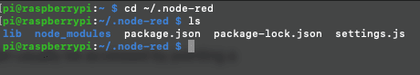
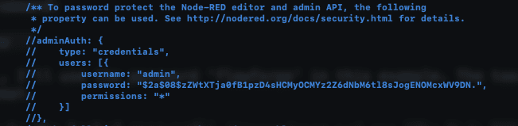
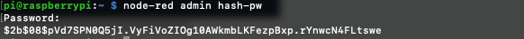
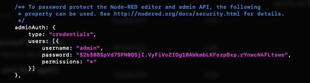
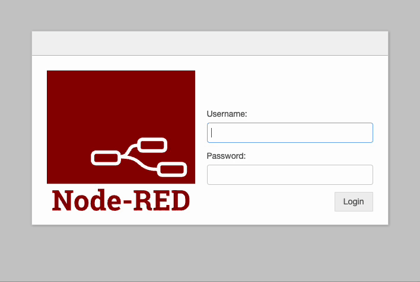
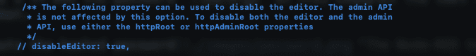
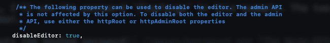
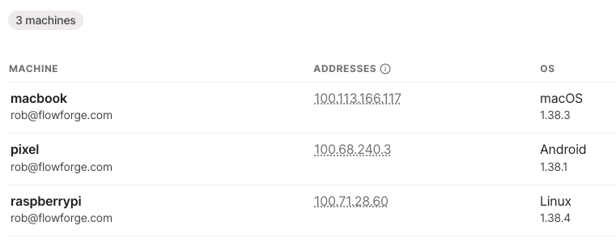
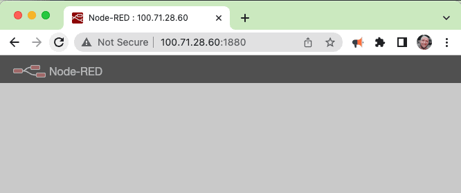

Node-RED is very easy to get up and running. Whether you run it locally, in Docker, on a Raspberry Pi, or on a service such as FlowFuse Cloud you can have a project up and running in minutes.

<!--more-->

One thing that can get overlooked is the security of Node-RED. From personal experience, the first few times I installed Node-RED I was more focussed on the possibilities of what I could do with this new tool than I was keeping my projects secure. 

In this article I’m going to look at some easy ways to make your Node-RED project more secure, even when first learning about it in a hobby environment.

## Protecting access from your LAN to Node-RED

Once you have an instance of Node-RED running it can usually be accessed from anywhere on your LAN (local area network) by pointing a web browser to the relevant IP address and port.

```http://192.168.0.3:1880```

With a URL similar to the one above, depending on your specific network and Node-RED configuration, anyone on your LAN can view but more importantly edit your flows. This can be really useful when you are first learning about Node-RED but it’s always a good idea to get into the habit of locking down access to the editor, even if you trust everyone who can access your LAN.

One of the easiest ways to protect your flows is to add a username and password to your Node-RED instance.

The first step is to find your Node-RED settings.js file. It's not always in the same place but on a default Debian Linux installation it can be found in this directory.

```cd ~/.node-red```

If you list that directory you should now see something like this:



We now need to edit settings.js, I'm going to use my favourite text editor, [Nano](https://www.nano-editor.org/) to do that.

```nano settings.js```

We now need to find and edit the following section of the settings file:



For this example, I'm going to add a password and uncomment the relevant section of the settings file, you could also change the username for additional security.

To create the password we'll need to use a command line tool which is included in Node-RED. Open a second terminal then run this command:

```node-red admin hash-pw```

Put in your new password, I'll use the password 'flowforge' in this example. The tool returns your password in a hashed format:



We can now return to the other terminal window, uncomment the section then paste in the new password, this is how it looks for me:



We can now save and exit out of the settings file.

The last step is to restart Node-RED, I'm using Debian so the command is:

```node-red-restart```

Now, when we try to access Node-RED I will need to provide a username and password.



You might also want to consider turning off the editor interface once you are happy with your flows. This can make it a little harder to make changes to your project but it also gives you peace of mind that nobody has accidentally or deliberately changed your flows. You can turn off the editor interface as follows.

Edit your settings.js file as explained above, look for the following section:



All you need to do is uncomment the bottom line then change the value from false to true, once done it should look something like this:



Now restart Node-RED as covered above, then try accessing your Node-RED instance again. You will no longer be able to edit or view your flows.

Using these two features, we now have much better control over who can access the design interface for Node-RED.

## Traffic to your Node-RED instance is unencrypted

Hopefully, we all know the importance of encrypting your connections between devices to stop people intercepting your traffic. This isn't a huge concern when working on your home LAN but what if you want to access your Node-RED instance from a remote location? 

There are two obvious options, HTTPS, and a VPN (Virtual Private Network).

We could setup your Node-RED traffic to run over HTTPS, this solution ensures that all traffic to and from your Node-RED is encrypted. The downside to this approach is it's quite complex to set up. We will need to have a domain name, open up ports on our LAN's firewall, use a HTTPS certificate provider and then make sure we remember to renew the certificates as needed. It's doable if you are comfortable with those concepts (I covered how to do this as part of my blog [hosting FlowFuse on Google Cloud](/blog/2022/12/flowforge-gcp-https-set-up/)) but there is an easier way to get started, using a VPN.

A VPN provides a lot of security advantages depending on which you are using and how it is configured. To secure my traffic I'm going to use a great service call [Tailscale](https://tailscale.com/) which is free for personal projects.

I'm going to install Tailscale on the Raspberry Pi I'm running Node-RED on as well as any other devices I want to access my project from. Once that's done I can access Node-RED from anywhere with internet access but more importantly the traffic to and from my devices is also encrypted.

Before we start, it's important to remember that a VPN is only as secure as the company who runs it. You should always consider if you trust the VPN provider as they could potentially access your devices. I trust Tailscale but please do your own research before using a VPN provider.

The first step we need to take is creating a Tailscale account, [you can sign up for free here](https://login.tailscale.com/start). We next need to add our devices to our VPN using their software, I'm installing Tailscale on my Apple laptop, Google phone as well as the Raspberry Pi I'm running Node-RED on.

The install process is really easy, even on the Pi running Raspbian the steps you need to take are well explained in the [Tailscale docs](https://tailscale.com/download/linux/debian-bullseye).

For the Pi, these are the commands we need to run.

1. Add Tailscale to the Apt package manager.

```curl -fsSL https://pkgs.tailscale.com/stable/debian/bullseye.noarmor.gpg | sudo tee /usr/share/keyrings/tailscale-archive-keyring.gpg >/dev/null```

```curl -fsSL https://pkgs.tailscale.com/stable/debian/bullseye.tailscale-keyring.list | sudo tee /etc/apt/sources.list.d/tailscale.list```

```sudo apt-get update```

2. Install Tailscale

```sudo apt-get install tailscale```

3. Start Tailscale and connect your device

```sudo tailscale up```

After running the last command, we need to follow the on screen prompts to link our devices to your VPN.

One last thing which you might want to consider doing, every few months you will need to reconnect your devices to your VPN, if you are only going to be accessing your Node-RED device over the VPN you should consider [disabling your Tailscale key expiry](https://tailscale.com/kb/1028/key-expiry/).

OK, now we've got our devices all connected you should see something like this in the Tailscale dashboard.



I can now access Node-RED on my Pi from my laptop and phone by pointing a browser to the correct IP address (as shown in the image above) with the port for Node-RED:

```http://100.71.28.60:1880```

I’ve now secured all traffic between my devices and Node-RED project, I can access Node-RED from anywhere on the internet.



If you follow these steps you should be on the right path to running a more secure Node-RED instance. There is a lot more you can do and I recommend you read the [relevant docs on the Node-RED](https://nodered.org/docs/user-guide/runtime/securing-node-red) website to gain some more ideas.

## What about hosting Node-RED on a cloud solution such as FlowFuse?

In this article, I've focussed on hosting Node-RED on a Pi on your own LAN but if you use FlowFuse Cloud to host Node-RED the solutions discussed above are either ready out of the box or are not needed.

By default, the Node-RED editor is secured using your FlowFuse user credentials. You can also enable SSO to enhance account security and easily grant access to team members. With role-based access control, you can further protect your flows by managing who can view or edit them.

All traffic to FlowFuse and your Node-RED instances is protected by HTTPS. FlowFuse has set up the domain name and manages the certificates, so you can spend time on your flows rather than configuring security. Additionally, remote device access is secured through encrypted tunnels, providing comprehensive protection for your deployments.

FlowFuse has a [free trial]({{ site.onboardingURL }}) if you'd like to see how we've made secure hosting of Node-RED easy.

## Conclusion

How ever you host Node-RED, it's a great idea to get into good security practices as early as possible to ensure that no unsecured Node-RED instances are exposed to the internet. I hope some of the tips above help you get started down the path to creating more secure Node-RED projects.