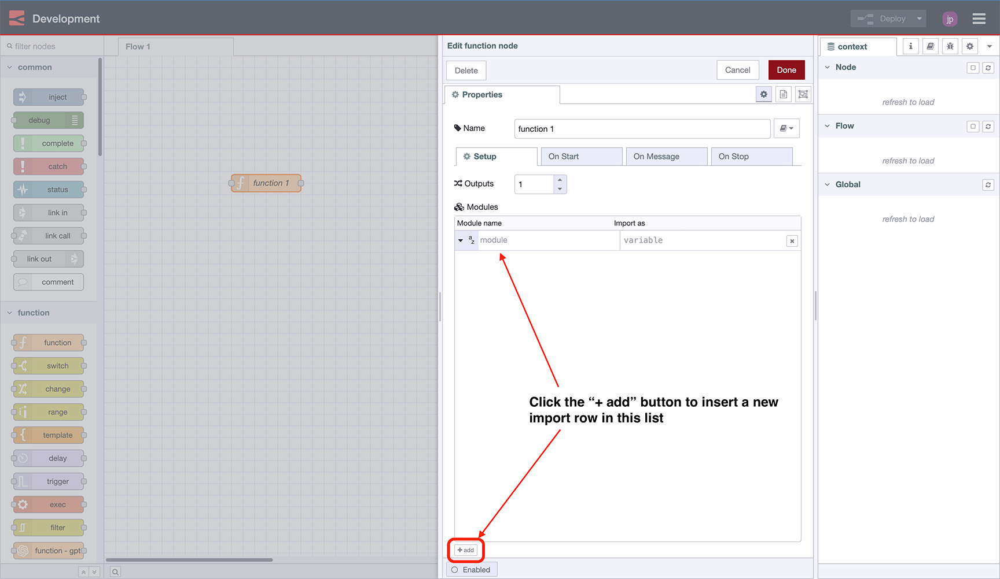

Node-RED has <a href="https://flows.nodered.org/search?type=node" target="_blank">an incredibly rich resource of integrations available</a>, but sometimes you need that little bit of extra functionality, or access to a Node.js module that doesn't have it's own custom nodes in Node-RED. **We can easily import any npm module within the built-in Node-RED function nodes.**

<!--more-->

Historically in Node-RED, you would have needed to manually `npm install` modules from the command line, but now that it's so easy to run Node-RED in the Cloud, where you don't have easy access to those tools, what are the other options available?

## Function Node - Setup

All you need is the name of the module you want to import, then:

1. Drop in a new "function" node & double-click it
1. Switch to the "Setup" tab
1. Underneath the "modules" tab, click "+ add" in the bottom-left of the window.
1. Enter the name of the module you want to use in the newly created row, and (optionally) modify the `variable` that this module will be imported in as.
2. Switch back to the "On Message" tab and write your function. Your new module will be available via the `variable` you defined in the "Setup" tab.

## Example: Easy CRC

Something we see [a lot on the Node-RED Forums](https://discourse.nodered.org/search?q=crc%20order%3Alatest) are questions on how to conduct CRC calculations. There is a popular node module `easy-crc` that can be imported and used in the function nodes, e.g:

<video width="560" height="315" controls>
  <source src="video.mov" type="video/mp4">
</video>

## Example: Moment.js

Recently we wanted to use [moment](https://www.npmjs.com/package/moment) for some custom date calculations. Whilst there was set of [Moment Node-RED nodes](https://flows.nodered.org/node/node-red-contrib-moment) already available, it didn't have all of the functionality we needed.

So, all we needed to do was import the module into a function node, and define our comparison there instead, here's a working example:

<video width="560" height="315" controls>
  <source src="video.mov" type="video/mp4">
</video>

## Example: PostHog

We use <a href="https://posthog.com/" target="_blank">PostHog</a> for our internal Product Analysis. We record live events as they occur on FlowForge Cloud to better understand features that are (and are not) used.

We wanted to investigate whether or not we could add backdated data, which in theory was possible via their <a href="https://posthog.com/docs/libraries/node" target="_blank">posthog-node</a> module. We wanted to populate it with data driven from our own database and API. 

Within two minutes, we could wire up a node to retrieve data from our API, and then ingest it into `posthog-node` via the import of a function node.

Node-RED is great for [data integration](/solutions/data-integration/).