The world of industrial automation is slow to adopt new technology. With legacy equipment already working and in place, paralyzing down-time costs, and fears of introducing instability into a plant, technology change has a cautious pace.
<!--more-->

Node-RED provides a way to extend the capabilities of the simpler, proven technology, allowing connections with modern systems.  However, the same fundamentals that have made industrial equipment dependable, must be incorporated into your Node-RED architecture.  And, inversely, the same abstraction and simplicity that makes a low-code, Node-RED environment fast, and easy to work with, can also make it difficult to interface with a lower-level system. 

Modbus is a widely adopted protocol for accessing data from existing legacy manufacturing equipment. Node-RED makes it very easy to connect to Modbus enabled equipment. However, there are some best practices we have developed to maintain system integrity when integrating Modbus devices with Node-RED:

### Add Watchdogs to Node-RED Flows
To keep your automation system running with peace of mind and little human intervention, use a watchdog timer.  A watchdog timer is typically used to detect and recover from system malfunctions. In Node-RED a watchdog timer can be tied to a broadcast messaging system to get push alerts directly to cell phones, as well as to an auto-reset to try to get your Flows back online automatically.  A simple implementation of this is to just put two Trigger nodes in a loop, the first one to send an alert when it hasn’t seen any recent events, and the second to to reset the first one.

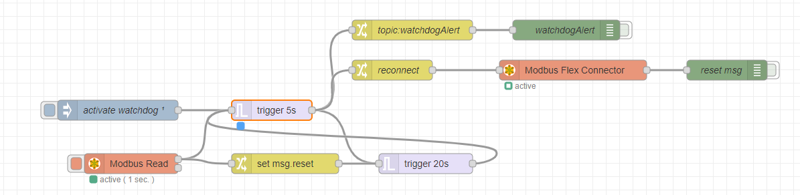

Each of the trigger nodes are setup with similar parameters, only the delay values differ.

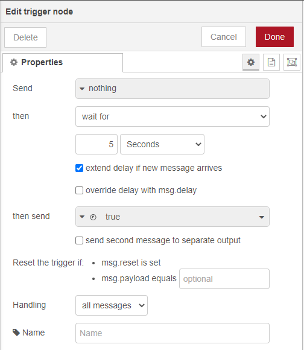

Sending a payload of {"connectorType":"TCP"} to the Modbus Flex Connector is enough to reset the connection without needing to send all the other parameters.

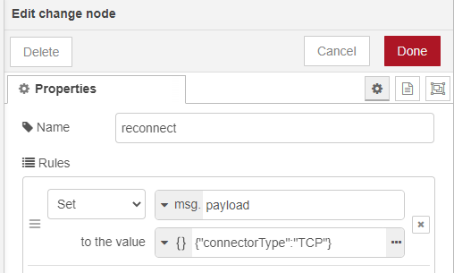

### Choosing a Safe Poll Rate
Be careful when adding new traffic to an industrial network, which might not be able to handle the extra load.  Some networks have low-bandwidth, especially at large plants that might be using antiquated IP devices and long-distance, Wi-Fi bridges in electrically noisy environments.  Furthermore, some PLCs and other Modbus devices have limits as to how many other devices can connect to them, and a new connection might not work, or worse, bump off an old connection.  A PLC’s general operation is to poll its inputs every cycle and react accordingly, running logic and triggering outputs as quickly as possible. The general use-case for Node-RED with a PLC is to create an HMI or broader, SCADA system.  A poll rate of every second suffices for a simple HMI.  For dashboards published to a greater audience, rather than just the operator, poll rates of several minutes to hours might be adequate.  If this is a new integration, it’s better to start slow and make sure the current infrastructure can handle the extra load.  

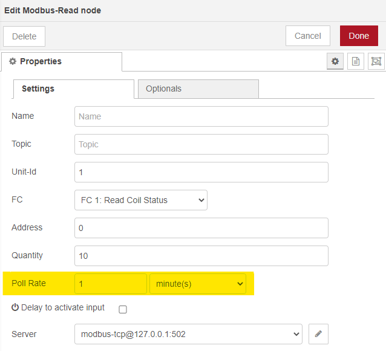

### Coil/Register Grouping
Modbus works more efficiently when it is reading and writing addresses as groups.  Creating banks of consecutively numbered coils or registers can help with this.  If Modbus is already in use, perhaps for an existing HMI, but for your Node-RED dashboard you just want a selection of these addresses and they are too scattered to be read all at once, pick a starting address numbered far higher than what you will use for any HMI work and create a new bank of coils or registers just for the Node-RED dashboard.  The PLC can handle this easily and it greatly simplifies the polling for your Node-RED dashboard.  On the Node-RED side of the connection, it’s a good idea to parse and to filter this data as soon as it enters the flow.  Below, the first node creates an appropriate message for each coil, with a topic name and a true/false payload.  This message is then filtered by the “block unless value changes” mode in the filter node and finally a switch (by topic) node separates out each message.  In this example, every Tag coming in from the PLC only triggers downstream nodes when there is a change and each Tag has its own output to connect a wire, and subsequent nodes to.

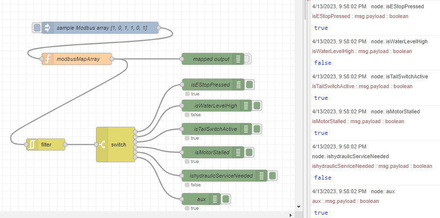

The filter node blocks redundant data from triggering subsequent nodes.

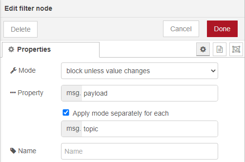

The function node, “modbusMapArray,” creates messages that are much more user-friendly in the Node-RED environment.

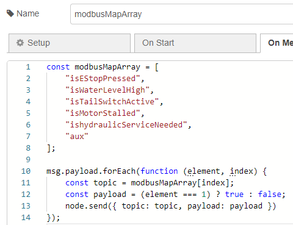

Quick tip: If your PLC environment has limits on the number of addresses allowed and you want to read a lot of coils, you can work with registers bitwise and stuff 16 coils into one register.

### Reading Data Types
No matter what data type the PLC is sending over Modbus, it’s going to be sent using the 16-bit registers.  For example, to send 1234.5678 as a 32-bit Float (little-endian), the payload from the PLC will be a seemingly unhelpful array, [21035,17562].  I can simulate this with the [Productivity Suite Programming Software](https://www.automationdirect.com/adc/overview/catalog/software_products/programmable_controller_software/productivity_suite_programming_software) from Automation Direct set to simulator mode.  Below, I have created a 32-bit float “Tag,” named “mySampleFloat32,” using modbus registers 40001 and 40002, and set the “Init Value” to 1234.5678.

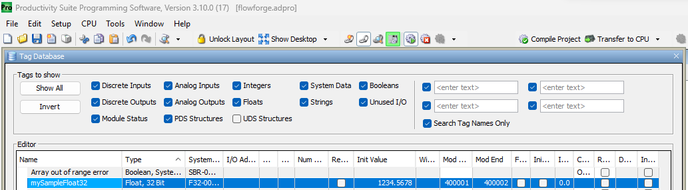

Node-RED is typically used at a much higher level, but luckily there is still a way to work with this low-level data.  Node-RED uses the Buffer Class to work with this type of data stream, but it’s a little tricky.  First the 16-bit registers have to be broken into 8-bit chunks, here we use msg.responseBuffer.buffer to retrieve each octet.  Once our buffer is properly filled, there are many built-in functions to reconstruct the data into the actual number you are looking for.

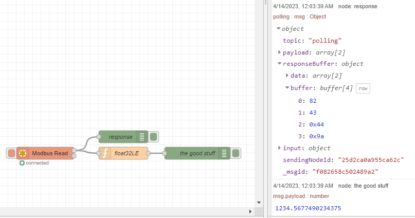

Notice below that to read these 2 registers at 400001 and 400002 I have set my Modbus-Read node to start at “Address” 0 and ready “Quantity” 2 registers.  Unfortunately, there are two different standards for writing Modbus addresses and my PLC uses the traditional convention (400001 to 465536) and this Modbus node uses the hexadecimal convention (4x0000 to 4xFFFF).

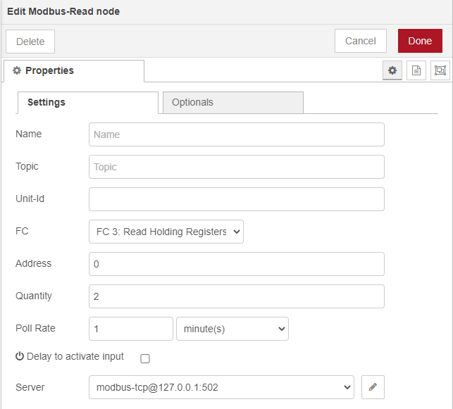

In this example the byte order from msg.responseBuffer.buffer doesn’t quite match the data type, so we have to rebuild the buffer.

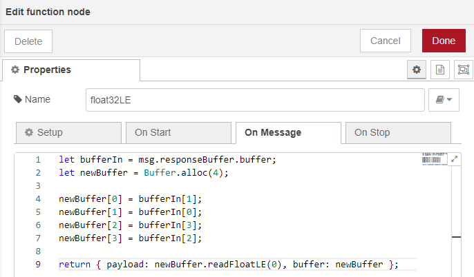

Amazingly after all that work we get the response: 1234.5677490234375.  This is the shortcoming of the 32-bit float data type.  Although it can handle a huge range of values, they aren’t very accurate.  For this reason, many times PLCs will send a number as an integer, say 12345678, and the documentation will prescribe 4 decimal place accuracy to bring the number back to 1234.5678.  Find out more ways to work with a Buffer at [https://nodejs.org/dist/latest-v10.x/docs/api/buffer.html](https://nodejs.org/dist/latest-v10.x/docs/api/buffer.html).

### General Architecture
Although you can off-load some of the higher-level logic from the PLC into Node-RED, it’s important to remember that Node-RED augments, but doesn’t create a replacement for a PLC’s IDE and the IEC 61131-3 suite of languages.  Make a conscious distinction between the type of work the PLC should handle and what you expect from Node-RED.  Any real-time responses to inputs should strictly be handled by the PLC.

### Security
Connecting Node-RED to your PLC also creates a larger attack surface for cyber threats.  Make sure that you follow the guidelines found on the Node-RED.org site at [Securing Node-RED](https://nodered.org/docs/user-guide/runtime/securing-node-red).  Node-RED’s strength is its ability to make connections where they weren’t possible before, but this can be taken advantage of by a hacker.  For instance, maybe it’s tempting to make Node-RED a transparent gateway and make a RESTful API fully exposing a modbus-flex-write node.  This is amazingly easy and powerful with Node-RED, but anyone who can access your IP could send http://<yourIP>:1880/careful?value=true&fc=15&unitid=1&address=0&quantity=10 and remotely turn on and off whatever they wanted.

Instead, a better practice would be to more narrowly define what you want to accomplish and only allow Node-RED to do exactly that. In this case you might send http://<yourIP>:1880/honkTheLunchHorn?honk=true

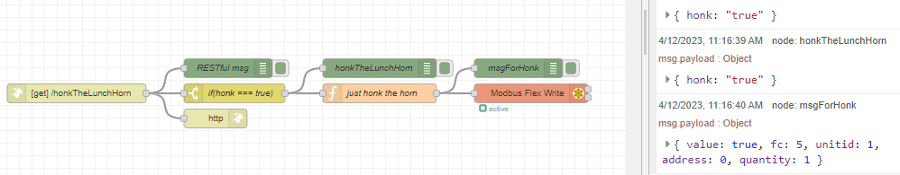

### Final Thoughts
If not done right, there could be some hard lessons, so it’s best to monitor the processes to help track down bugs.  Add a log, keep your eyes out, and as a community let’s work to create stable systems.

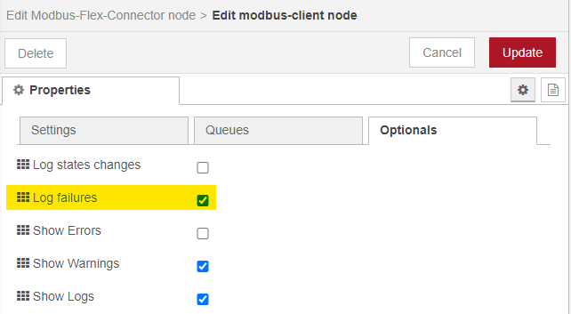

How readily upper management gives an “okay” to this new technology comes with how well it is implemented.  There will be some growing pains, but by the end, you will have supercharged your plant, bringing it into the 21st century.
