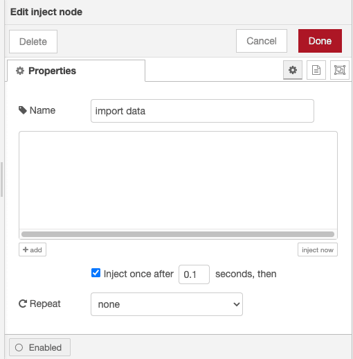
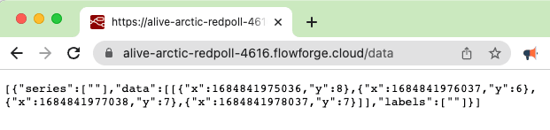
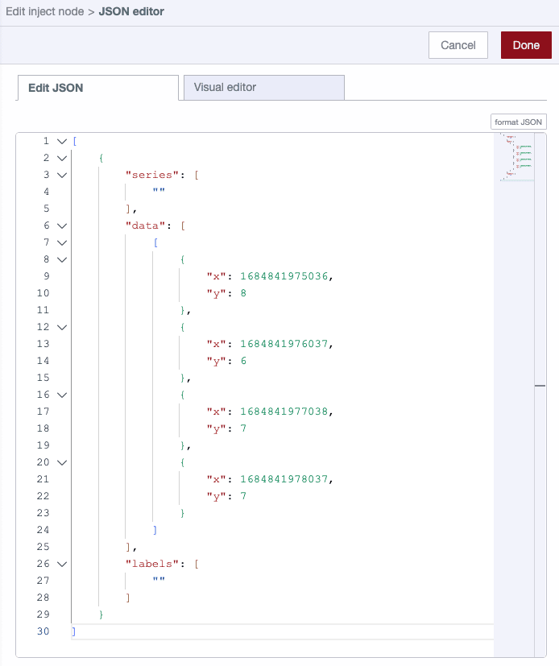

Node-RED makes it easy to create HMI (Human Machine Interfaces) using the [Dashboard set of custom nodes](https://flows.nodered.org/node/node-red-dashboard).

<!--more-->

One of the most useful features of Dashboard 1 is the ability to store historic data passed to a chart within the chart node itself. This makes your flows far simpler than would be the case if you needed to send the entire data set to the chart for each update.

### The Importance of Persisting Chart Data

Storing the data in the chart node is fine to show prototypes of HMIs, but where it's vital the correct data is always shown we are going to need a backup. Data can easily be lost when you move your flow to a new device, restart your instance, or simply when upgrading Node-RED.

How can we store our chart data so we can be confident it will be there each time a user views your HMI?

### Example Dashboard

In this example, we are passing in a random number between one and 10 each second. With each new value received the chart updates and as mentioned about, the values are also stored in the chart node.

If you'd like to see and edit the flows I've created, you can copy and paste the JSON below into your Node-RED import feature.


[{"id":"c6825b1001216b89","type":"inject","z":"668c56888fd0f960","name":"","props":[],"repeat":"1","crontab":"","once":false,"onceDelay":0.1,"topic":"","x":110,"y":220,"wires":[["6b609d978540fb2a"]]},{"id":"6b609d978540fb2a","type":"Number","z":"668c56888fd0f960","name":"Random Number","minimum":"1","maximum":"10","roundTo":"0","Floor":true,"x":270,"y":220,"wires":[["794846db6dc8cef8"]]},{"id":"794846db6dc8cef8","type":"ui_chart","z":"668c56888fd0f960","name":"","group":"af1535b39b74f94a","order":0,"width":0,"height":0,"label":"chart","chartType":"line","legend":"false","xformat":"HH:mm:ss","interpolate":"linear","nodata":"","dot":false,"ymin":"","ymax":"","removeOlder":1,"removeOlderPoints":"","removeOlderUnit":"3600","cutout":0,"useOneColor":false,"useUTC":false,"colors":["#1f77b4","#aec7e8","#ff7f0e","#2ca02c","#98df8a","#d62728","#ff9896","#9467bd","#c5b0d5"],"outputs":1,"useDifferentColor":false,"className":"","x":430,"y":220,"wires":[["ad53848ee4b0d91e"]]},{"id":"ad53848ee4b0d91e","type":"debug","z":"668c56888fd0f960","name":"debug","active":true,"tosidebar":true,"console":false,"tostatus":false,"complete":"payload","targetType":"msg","statusVal":"","statusType":"auto","x":550,"y":220,"wires":[]},{"id":"af1535b39b74f94a","type":"ui_group","name":"Example","tab":"14f1442eb7525190","order":1,"disp":true,"width":"6","collapse":false,"className":""},{"id":"14f1442eb7525190","type":"ui_tab","name":"Home","icon":"dashboard","disabled":false,"hidden":false}]

x
### How can we store and recall the chart data?

The chart node has a really useful feature which allows us to access all the data currently shown in the chart. Each time the chart receives new data, it's added to the existing values then the whole data set is sent out the outbound port of the chart node.

Now that we have a way to easily access the chart data in a single payload, we next need to store that data somewhere safer. I'm going to explain 3 potential solutions, which I use on a regular basis.

#### 1. Node-RED file-out and file-in nodes

Node-RED can read and write data to a local filesystem. Being that we already have the chart data in a single payload, we just need to write that payload to a file for later use, which we can do using the file-out node.

This example flow shows how to use the file-out node to write the chart data to your local filesystem.


[{"id":"ead9df683d29fb8a","type":"inject","z":"668c56888fd0f960","name":"","props":[],"repeat":"1","crontab":"","once":false,"onceDelay":0.1,"topic":"","x":110,"y":560,"wires":[["ef5359b8bd3f78b3"]]},{"id":"ef5359b8bd3f78b3","type":"Number","z":"668c56888fd0f960","name":"Random Number","minimum":"1","maximum":"10","roundTo":"0","Floor":true,"x":270,"y":560,"wires":[["69ad440cd8d1ce30"]]},{"id":"69ad440cd8d1ce30","type":"ui_chart","z":"668c56888fd0f960","name":"","group":"af1535b39b74f94a","order":0,"width":0,"height":0,"label":"chart","chartType":"line","legend":"false","xformat":"HH:mm:ss","interpolate":"linear","nodata":"","dot":false,"ymin":"","ymax":"","removeOlder":1,"removeOlderPoints":"","removeOlderUnit":"3600","cutout":0,"useOneColor":false,"useUTC":false,"colors":["#1f77b4","#aec7e8","#ff7f0e","#2ca02c","#98df8a","#d62728","#ff9896","#9467bd","#c5b0d5"],"outputs":1,"useDifferentColor":false,"className":"","x":430,"y":560,"wires":[["e4e7758028477505","d9d6a2e34767f568"]]},{"id":"e4e7758028477505","type":"debug","z":"668c56888fd0f960","name":"debug","active":true,"tosidebar":true,"console":false,"tostatus":false,"complete":"payload","targetType":"msg","statusVal":"","statusType":"auto","x":550,"y":560,"wires":[]},{"id":"d9d6a2e34767f568","type":"json","z":"668c56888fd0f960","name":"","property":"payload","action":"","pretty":false,"x":550,"y":600,"wires":[["b5b020fb17f615df"]]},{"id":"b5b020fb17f615df","type":"file","z":"668c56888fd0f960","name":"","filename":"example.json","filenameType":"str","appendNewline":true,"createDir":false,"overwriteFile":"true","encoding":"none","x":690,"y":600,"wires":[["a6d9eab41d4dcf97"]]},{"id":"a6d9eab41d4dcf97","type":"debug","z":"668c56888fd0f960","name":"debug 92","active":true,"tosidebar":true,"console":false,"tostatus":false,"complete":"false","statusVal":"","statusType":"auto","x":840,"y":600,"wires":[]},{"id":"af1535b39b74f94a","type":"ui_group","name":"Example","tab":"14f1442eb7525190","order":1,"disp":true,"width":"6","collapse":false,"className":""},{"id":"14f1442eb7525190","type":"ui_tab","name":"Home","icon":"dashboard","disabled":false,"hidden":false}]


As the chart node sends the full data set each time new data is added, we overwrite the content of the file rather than append the new values.

The next step is to pull the data back from the filesystem to your Node-RED instance. Node-RED makes this very easy using the file-in node.


[{"id":"ead9df683d29fb8a","type":"inject","z":"668c56888fd0f960","name":"","props":[],"repeat":"1","crontab":"","once":false,"onceDelay":0.1,"topic":"","x":110,"y":560,"wires":[["ef5359b8bd3f78b3"]]},{"id":"ef5359b8bd3f78b3","type":"Number","z":"668c56888fd0f960","name":"Random Number","minimum":"1","maximum":"10","roundTo":"0","Floor":true,"x":270,"y":560,"wires":[["69ad440cd8d1ce30"]]},{"id":"69ad440cd8d1ce30","type":"ui_chart","z":"668c56888fd0f960","name":"","group":"af1535b39b74f94a","order":0,"width":0,"height":0,"label":"chart","chartType":"line","legend":"false","xformat":"HH:mm:ss","interpolate":"linear","nodata":"","dot":false,"ymin":"","ymax":"","removeOlder":1,"removeOlderPoints":"","removeOlderUnit":"3600","cutout":0,"useOneColor":false,"useUTC":false,"colors":["#1f77b4","#aec7e8","#ff7f0e","#2ca02c","#98df8a","#d62728","#ff9896","#9467bd","#c5b0d5"],"outputs":1,"useDifferentColor":false,"className":"","x":430,"y":560,"wires":[["e4e7758028477505","d9d6a2e34767f568"]]},{"id":"e4e7758028477505","type":"debug","z":"668c56888fd0f960","name":"debug","active":true,"tosidebar":true,"console":false,"tostatus":false,"complete":"payload","targetType":"msg","statusVal":"","statusType":"auto","x":550,"y":560,"wires":[]},{"id":"d9d6a2e34767f568","type":"json","z":"668c56888fd0f960","name":"","property":"payload","action":"","pretty":false,"x":550,"y":600,"wires":[["b5b020fb17f615df"]]},{"id":"b5b020fb17f615df","type":"file","z":"668c56888fd0f960","name":"","filename":"example.json","filenameType":"str","appendNewline":true,"createDir":false,"overwriteFile":"true","encoding":"none","x":690,"y":600,"wires":[["a6d9eab41d4dcf97"]]},{"id":"a6d9eab41d4dcf97","type":"debug","z":"668c56888fd0f960","name":"debug 92","active":true,"tosidebar":true,"console":false,"tostatus":false,"complete":"false","statusVal":"","statusType":"auto","x":840,"y":600,"wires":[]},{"id":"e9cb9350f1aaeb38","type":"inject","z":"668c56888fd0f960","name":"import data","props":[],"repeat":"","crontab":"","once":false,"onceDelay":0.1,"topic":"","x":110,"y":660,"wires":[["600f014947f73d8f"]]},{"id":"600f014947f73d8f","type":"file in","z":"668c56888fd0f960","name":"","filename":"example.json","filenameType":"str","format":"utf8","chunk":false,"sendError":false,"encoding":"none","allProps":false,"x":270,"y":660,"wires":[["972118c0e114f47b","69ad440cd8d1ce30"]]},{"id":"972118c0e114f47b","type":"debug","z":"668c56888fd0f960","name":"debug 93","active":true,"tosidebar":true,"console":false,"tostatus":false,"complete":"false","statusVal":"","statusType":"auto","x":420,"y":660,"wires":[]},{"id":"af1535b39b74f94a","type":"ui_group","name":"Example","tab":"14f1442eb7525190","order":1,"disp":true,"width":"6","collapse":false,"className":""},{"id":"14f1442eb7525190","type":"ui_tab","name":"Home","icon":"dashboard","disabled":false,"hidden":false}]


When you press the 'import data' trigger node, the data is loaded in from the filesystem and shown in the chart. You may want to automate that task to run each you deploy your Node-RED instance.

Bear in mind that your data is stored in your filesystem, if your storage drive fails you will lose your data, you might want to consider taking backups and storing elsewhere for emergencies.

#### 2. FlowFuse's persistent context

FlowFuse Cloud and premium self hosted version provides persistent context storage as part of its Node-RED instances. This allows you to create, read, update, and delete data as needed, even if you have restarted a Node-RED instance.

This flow shows chart data being sent to persistent context so we can access it later. The process is very similar to using the file-out and file-in nodes.


[{"id":"c6825b1001216b89","type":"inject","z":"4767c2f7095bee53","name":"","props":[],"repeat":"1","crontab":"","once":false,"onceDelay":0.1,"topic":"","x":170,"y":100,"wires":[["6b609d978540fb2a"]]},{"id":"794846db6dc8cef8","type":"ui_chart","z":"4767c2f7095bee53","name":"","group":"af1535b39b74f94a","order":0,"width":0,"height":0,"label":"chart","chartType":"line","legend":"false","xformat":"HH:mm:ss","interpolate":"linear","nodata":"","dot":false,"ymin":"","ymax":"","removeOlder":1,"removeOlderPoints":"","removeOlderUnit":"3600","cutout":0,"useOneColor":false,"useUTC":false,"colors":["#1f77b4","#aec7e8","#ff7f0e","#2ca02c","#98df8a","#d62728","#ff9896","#9467bd","#c5b0d5"],"outputs":1,"useDifferentColor":false,"className":"","x":490,"y":100,"wires":[["ad53848ee4b0d91e","938c7d878545e623"]]},{"id":"ad53848ee4b0d91e","type":"debug","z":"4767c2f7095bee53","name":"debug","active":true,"tosidebar":true,"console":false,"tostatus":false,"complete":"payload","targetType":"msg","statusVal":"","statusType":"auto","x":610,"y":100,"wires":[]},{"id":"6b609d978540fb2a","type":"Number","z":"4767c2f7095bee53","name":"Random Number","minimum":"1","maximum":"10","roundTo":"0","Floor":true,"x":330,"y":100,"wires":[["794846db6dc8cef8"]]},{"id":"938c7d878545e623","type":"change","z":"4767c2f7095bee53","name":"","rules":[{"t":"set","p":"#:(persistent)::chart-data","pt":"global","to":"payload","tot":"msg"}],"action":"","property":"","from":"","to":"","reg":false,"x":660,"y":140,"wires":[["3792cc96a748e75a"]]},{"id":"3792cc96a748e75a","type":"debug","z":"4767c2f7095bee53","name":"debug 1","active":true,"tosidebar":true,"console":false,"tostatus":false,"complete":"false","statusVal":"","statusType":"auto","x":840,"y":140,"wires":[]},{"id":"af1535b39b74f94a","type":"ui_group","name":"Example","tab":"14f1442eb7525190","order":1,"disp":true,"width":"6","collapse":false,"className":""},{"id":"14f1442eb7525190","type":"ui_tab","name":"Home","icon":"dashboard","disabled":false,"hidden":false}]


We now need to have a method to load the data back into our chart. We will again use a manual 'import data' trigger to load the full set of data from the persistent context, and then push it back into the chart.


[{"id":"c6825b1001216b89","type":"inject","z":"4767c2f7095bee53","name":"","props":[],"repeat":"1","crontab":"","once":false,"onceDelay":0.1,"topic":"","x":170,"y":100,"wires":[["6b609d978540fb2a"]]},{"id":"794846db6dc8cef8","type":"ui_chart","z":"4767c2f7095bee53","name":"","group":"af1535b39b74f94a","order":0,"width":0,"height":0,"label":"chart","chartType":"line","legend":"false","xformat":"HH:mm:ss","interpolate":"linear","nodata":"","dot":false,"ymin":"","ymax":"","removeOlder":1,"removeOlderPoints":"","removeOlderUnit":"3600","cutout":0,"useOneColor":false,"useUTC":false,"colors":["#1f77b4","#aec7e8","#ff7f0e","#2ca02c","#98df8a","#d62728","#ff9896","#9467bd","#c5b0d5"],"outputs":1,"useDifferentColor":false,"className":"","x":490,"y":100,"wires":[["ad53848ee4b0d91e","938c7d878545e623"]]},{"id":"ad53848ee4b0d91e","type":"debug","z":"4767c2f7095bee53","name":"debug","active":true,"tosidebar":true,"console":false,"tostatus":false,"complete":"payload","targetType":"msg","statusVal":"","statusType":"auto","x":610,"y":100,"wires":[]},{"id":"6b609d978540fb2a","type":"Number","z":"4767c2f7095bee53","name":"Random Number","minimum":"1","maximum":"10","roundTo":"0","Floor":true,"x":330,"y":100,"wires":[["794846db6dc8cef8"]]},{"id":"938c7d878545e623","type":"change","z":"4767c2f7095bee53","name":"","rules":[{"t":"set","p":"#:(persistent)::chart-data","pt":"global","to":"payload","tot":"msg"}],"action":"","property":"","from":"","to":"","reg":false,"x":660,"y":140,"wires":[["3792cc96a748e75a"]]},{"id":"3792cc96a748e75a","type":"debug","z":"4767c2f7095bee53","name":"debug 1","active":true,"tosidebar":true,"console":false,"tostatus":false,"complete":"false","statusVal":"","statusType":"auto","x":840,"y":140,"wires":[]},{"id":"3379276c77b4691c","type":"inject","z":"4767c2f7095bee53","name":"import data","props":[],"repeat":"","crontab":"","once":true,"onceDelay":0.1,"topic":"","x":150,"y":180,"wires":[["ddd1ef41321fb4a6"]]},{"id":"ddd1ef41321fb4a6","type":"change","z":"4767c2f7095bee53","name":"","rules":[{"t":"set","p":"payload","pt":"msg","to":"#:(persistent)::chart-data","tot":"global"}],"action":"","property":"","from":"","to":"","reg":false,"x":320,"y":180,"wires":[["794846db6dc8cef8","fa65b958e34bc971"]]},{"id":"fa65b958e34bc971","type":"debug","z":"4767c2f7095bee53","name":"debug 2","active":true,"tosidebar":true,"console":false,"tostatus":false,"complete":"false","statusVal":"","statusType":"auto","x":480,"y":180,"wires":[]},{"id":"af1535b39b74f94a","type":"ui_group","name":"Example","tab":"14f1442eb7525190","order":1,"disp":true,"width":"6","collapse":false,"className":""},{"id":"14f1442eb7525190","type":"ui_tab","name":"Home","icon":"dashboard","disabled":false,"hidden":false}]


You may have noticed that when we are pushing duplicate data into the chart it automatically checks to see if the data is already stored. If the data points are already in the chart the new data is disregard. This saves us writing an extra section of the flow to delete the data before we load it in.

#### 3. Expose the data via an API then manually import it

In some cases you may want to copy your chart data to somewhere outside of your Node-RED instances. You can do this by creating a simple API which allows an outside system to request the chart data. You can also manually go to the URL of the API in a web browser to get your data. This example flow allows a user or system to access the chart data via a URL.


[{"id":"6523e86042252710","type":"inject","z":"4767c2f7095bee53","name":"","props":[],"repeat":"1","crontab":"","once":false,"onceDelay":0.1,"topic":"","x":150,"y":540,"wires":[["d51aba5f9a808592"]]},{"id":"427c60f2c4f523b7","type":"ui_chart","z":"4767c2f7095bee53","name":"","group":"af1535b39b74f94a","order":0,"width":0,"height":0,"label":"chart","chartType":"line","legend":"false","xformat":"HH:mm:ss","interpolate":"linear","nodata":"","dot":false,"ymin":"","ymax":"","removeOlder":1,"removeOlderPoints":"","removeOlderUnit":"3600","cutout":0,"useOneColor":false,"useUTC":false,"colors":["#1f77b4","#aec7e8","#ff7f0e","#2ca02c","#98df8a","#d62728","#ff9896","#9467bd","#c5b0d5"],"outputs":1,"useDifferentColor":false,"className":"","x":470,"y":540,"wires":[["ba84cd1820120139","d9087436f4769691"]]},{"id":"ba84cd1820120139","type":"debug","z":"4767c2f7095bee53","name":"debug","active":true,"tosidebar":true,"console":false,"tostatus":false,"complete":"payload","targetType":"msg","statusVal":"","statusType":"auto","x":590,"y":540,"wires":[]},{"id":"d51aba5f9a808592","type":"Number","z":"4767c2f7095bee53","name":"Random Number","minimum":"1","maximum":"10","roundTo":"0","Floor":true,"x":310,"y":540,"wires":[["427c60f2c4f523b7"]]},{"id":"d9087436f4769691","type":"change","z":"4767c2f7095bee53","name":"","rules":[{"t":"set","p":"chart-data","pt":"flow","to":"payload","tot":"msg"}],"action":"","property":"","from":"","to":"","reg":false,"x":630,"y":580,"wires":[[]]},{"id":"4dd97b29430ad2ba","type":"http in","z":"4767c2f7095bee53","name":"","url":"/data","method":"get","upload":false,"swaggerDoc":"","x":200,"y":640,"wires":[["b4f0eb085cc91834"]]},{"id":"7ca49e5465699355","type":"http response","z":"4767c2f7095bee53","name":"","statusCode":"","headers":{},"x":670,"y":640,"wires":[]},{"id":"b4f0eb085cc91834","type":"change","z":"4767c2f7095bee53","name":"Get the chart data from flow.chart-data","rules":[{"t":"set","p":"payload","pt":"msg","to":"chart-data","tot":"flow"}],"action":"","property":"","from":"","to":"","reg":false,"x":440,"y":640,"wires":[["7ca49e5465699355"]]},{"id":"af1535b39b74f94a","type":"ui_group","name":"Example","tab":"14f1442eb7525190","order":1,"disp":true,"width":"6","collapse":false,"className":""},{"id":"14f1442eb7525190","type":"ui_tab","name":"Home","icon":"dashboard","disabled":false,"hidden":false}]


We can now access the data by simply visiting the URL of the API.

Bear in mind that you should secure the API as appropriate for the data. If you don't put security around the API, anyone on the same network as your Node-RED instance can access your chart data. Potentially that could give access to our data to the whole internet, so where needed take steps to keep your data safe. You can read more about securing Node-RED in our [blog post here](/blog/2023/04/securing-node-red-in-production/).

We now need to get that data back into a Node-RED instance. We can do that by editing a node and pasting in the data we got from the API. The flow below shows where you can paste in your data, you will then need to deploy and manually trigger 'import data'.


[{"id":"6523e86042252710","type":"inject","z":"4767c2f7095bee53","name":"","props":[],"repeat":"1","crontab":"","once":false,"onceDelay":0.1,"topic":"","x":150,"y":540,"wires":[["d51aba5f9a808592"]]},{"id":"427c60f2c4f523b7","type":"ui_chart","z":"4767c2f7095bee53","name":"","group":"af1535b39b74f94a","order":0,"width":0,"height":0,"label":"chart","chartType":"line","legend":"false","xformat":"HH:mm:ss","interpolate":"linear","nodata":"","dot":false,"ymin":"","ymax":"","removeOlder":1,"removeOlderPoints":"","removeOlderUnit":"3600","cutout":0,"useOneColor":false,"useUTC":false,"colors":["#1f77b4","#aec7e8","#ff7f0e","#2ca02c","#98df8a","#d62728","#ff9896","#9467bd","#c5b0d5"],"outputs":1,"useDifferentColor":false,"className":"","x":470,"y":540,"wires":[["ba84cd1820120139","d9087436f4769691"]]},{"id":"ba84cd1820120139","type":"debug","z":"4767c2f7095bee53","name":"debug","active":true,"tosidebar":true,"console":false,"tostatus":false,"complete":"payload","targetType":"msg","statusVal":"","statusType":"auto","x":590,"y":540,"wires":[]},{"id":"d51aba5f9a808592","type":"Number","z":"4767c2f7095bee53","name":"Random Number","minimum":"1","maximum":"10","roundTo":"0","Floor":true,"x":310,"y":540,"wires":[["427c60f2c4f523b7"]]},{"id":"d9087436f4769691","type":"change","z":"4767c2f7095bee53","name":"","rules":[{"t":"set","p":"chart-data","pt":"flow","to":"payload","tot":"msg"}],"action":"","property":"","from":"","to":"","reg":false,"x":630,"y":580,"wires":[[]]},{"id":"4dd97b29430ad2ba","type":"http in","z":"4767c2f7095bee53","name":"","url":"/data","method":"get","upload":false,"swaggerDoc":"","x":200,"y":660,"wires":[["b4f0eb085cc91834"]]},{"id":"7ca49e5465699355","type":"http response","z":"4767c2f7095bee53","name":"","statusCode":"","headers":{},"x":670,"y":660,"wires":[]},{"id":"b4f0eb085cc91834","type":"change","z":"4767c2f7095bee53","name":"Get the chart data from flow.chart-data","rules":[{"t":"set","p":"payload","pt":"msg","to":"chart-data","tot":"flow"}],"action":"","property":"","from":"","to":"","reg":false,"x":440,"y":660,"wires":[["7ca49e5465699355"]]},{"id":"d13d16b33ec638b2","type":"inject","z":"4767c2f7095bee53","name":"import data","props":[{"p":"payload"}],"repeat":"","crontab":"","once":true,"onceDelay":0.1,"topic":"","payload":"[{\"series\":[\"\"],\"data\":[[{\"x\":1684841975036,\"y\":8},{\"x\":1684841976037,\"y\":6},{\"x\":1684841977038,\"y\":7},{\"x\":1684841978037,\"y\":7}]],\"labels\":[\"\"]}]","payloadType":"json","x":170,"y":600,"wires":[["427c60f2c4f523b7"]]},{"id":"af1535b39b74f94a","type":"ui_group","name":"Example","tab":"14f1442eb7525190","order":1,"disp":true,"width":"6","collapse":false,"className":""},{"id":"14f1442eb7525190","type":"ui_tab","name":"Home","icon":"dashboard","disabled":false,"hidden":false}]


Each of these solutions has strengths and weaknesses but there are many other ways to persist your chart data. You should consider which approach is the best fit for your needs. To be as confident as possible that you data is safe, you may decide to push your data to dedicate external storage such as a database or backup solution. 

### Conclusion

Node-RED Dashboard 1 allows you to easily make informative HMIs, but it's important to make sure the chart data you are showing is stored safely. The approaches we have discussed above should give you a good start in ensuring your charts are populated with the correct data, even if your Node-RED instance crashes or you need to move it to a new hosting location.

