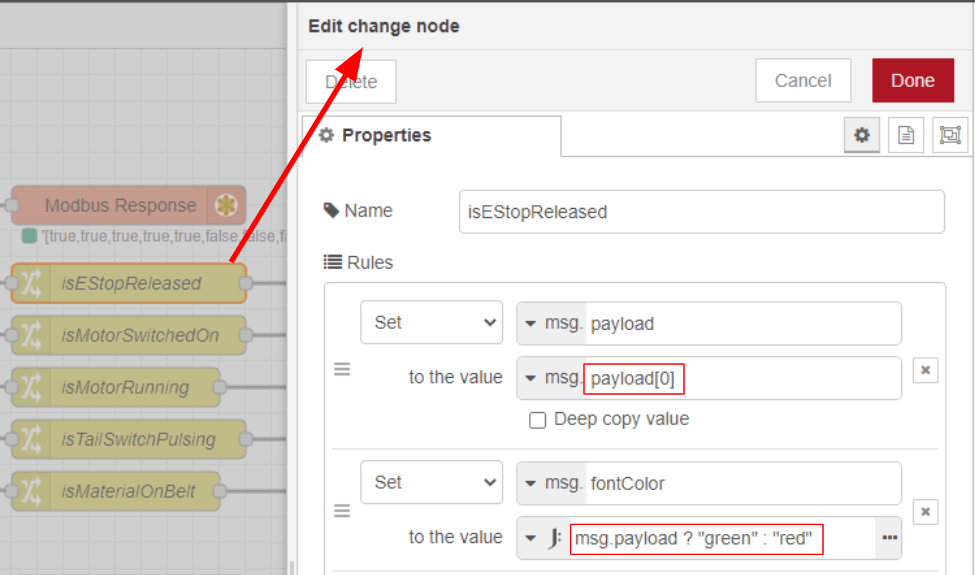
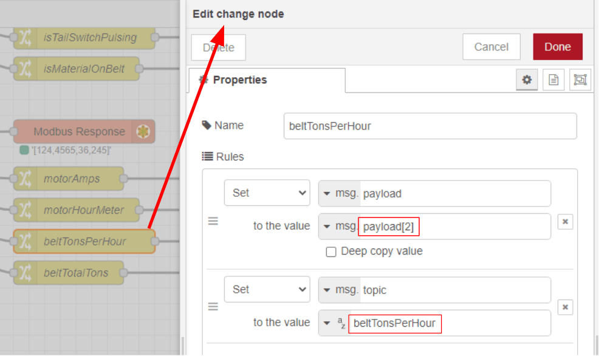

In manufacturing companies there is often a small set of production data, currently only available to an equipment operator through the HMI, which would be enormously valuable to a greater audience if there were some way to easily display and share it.

<!--more-->

Node-RED, along with Modbus and Dashboard modules, can easily create a web-based dashboard, shareable with a weblink and viewable on any web browser on the network.  Imagine the advantages of digital signage in the breakroom spurring healthy competition or a manager being able to check daily totals and live process values from the phone in their pocket.

## What is Modbus

Modbus is a serial protocol that is often found in the industrial world to allow devices to communicate. Originally developed by Schneider Electric, it is an open protocol and has been adopted by brands across the industry.  [Simply Modbus](https://www.simplymodbus.ca/) is a terrific resource to learn more about how the communication is structured. The beauty of Node-RED’s low-code environment is that a user only has to understand Modbus at the highest level to be able to implement it.  

The transport layer for Modbus can be either TCP over the Internet or RTU over RS-485/422/232.  There is a client-server relationship among devices where the clients read and write data which is stored by server using a numerical address.  There are four types of these addresses, 1) Output Coil and 2) Discrete Input addresses, which hold 1-bit data, and 3) Input Register and 4) Holding Register addresses, which hold 16-bit data.  Typically a PLC will be the Server and an HMI will be the client, reading and writing to the memory in the PLC, in order to give an operator control over machinery.  

## What is an HMI

An HMI, or human machine interface, is a piece of software that allows an operator to use a machine.  An HMI development environment typically allows programmers to choose among an array of digital assets to visualize the machine on the screen and create an intuitive interface to control the machine.  The HMI software may also offload some of the high-level logic from the PLC, however, the time-critical lower-level logic should stay on the PLC.  Node-RED can take this a step further, you may use it to create a simple HMI, but its real strength comes from its internet based heritage, and its ability to help share data from the PLC to the cloud.

Let’s look at the details of how you would use Node-RED for HMI and Modbus to
build an HMI with Node-RED to connect Modbus data to a dashboard accessible from any web browser.

## Installation of the Modbus package

The most popular package used for connecting Modbus devices is [node-red-contrib-modbus](https://flows.nodered.org/node/node-red-contrib-modbus); it has a wide range of configuration options and is well-documented in many blogs.  On its own, this Modbus package just provides the means of communicating the 1-bit and 16-bit data.  In doing so, your flow will be able to write 1-bit and 16-bit data to the PLC and read 1-bit and 16-bit data, which will arrive in an array.  So, just like with other protocols (MQTT, HTTP, etc) fully integrating Modbus into your flow requires data manipulation and a well-thought-out schema for how this data will be packed into your msg objects.  For example, below a payload of [false,false,false] comes in from a “Modbus Read” node, but how do you turn that into useful information?  Maybe, you want to work with all alarms as a group, use a “Change” node to create a payload that is an object holding the related keys, with a topic that lets us know that these are all “alarms.”

Note: for an even more comprehensive node to parse this data, check out [node-red-contrib-buffer-parser](https://flows.nodered.org/node/node-red-contrib-buffer-parser) by Flowforge’s own, Steve McLaughlin.
To install, first click on the hamburger menu in the upper right of the Node-RED editor and then click on “Manage palette.”

Next, click on the “Install” tab, search for “modbus” in the search bar, and click on the “install” button next to [node-red-contrib-modbus](https://flows.nodered.org/node/node-red-contrib-modbus).  As you can see there are many other custom nodes, but this one is a great jumping off point. It's always good to try other options too, and see what the community has to offer.

Finally, click on the “Install” button in the pop-up.

Success, your new set of nodes are ready to use.

## Configuring of modbus nodes

Here is a sample set of data on a PLC running a motor turning a belt with a belt scale.

All of this data is related so it has been grouped by consecutive numbers to make acquiring the data simpler.  You can also group data by the rate you expect to be polling for it, so that your Modbus nodes don’t have to make several calls to collect the data.  In the Modbus protocol the client specifies a start address and a number of subsequent addresses to read, and the server responds with all of this data at once.  Creating groups allows much more efficient communication.

This PLC uses the coil/register numbering convention with output coils in the 0nnnnn format and the holding registers in the 4nnnnn format.  Our Modbus nodes in Node-RED use a data address numbering convention which is zero-based, so we will have to remember to subtract 1 from the coils and registers.

Two “Modbus Read” nodes will work to capture these two types of data, coils and registers.  Drag them into the flow and double click on one to start configuring them.  First we will have to specify our Modbus Server, so click on the pencil icon to “add new.”  In the next “Modbus Read” node we configure, we can just select our newly added server from the drop-down menu.

Let’s assume that your PLC is connected to your local area network and we will be communicating over TCP.  Enter in the IP address of the PLC, the rest of the configuration can be left as-is.  502 is the default port for Modbus and generally the Unit-Id is 1, sometimes 0, sometimes ignored.  The “Queues” and “Optionals” can stay as-is as well. 

Click On “Add” and you will see your new server selected in the drop-down menu.  Now let’s set this “Modbus Read” node to read our Coils once every second.

Similarly, set up the other “Modbus Read” node to read the holding registers. Click on the “Done” Button.  Why the Modbus standard uses FC 3 to read the 4nnnnn registers and why there is both a zero-based and one-based convention is just a painful reality when using Modbus.

You can add some “Modbus Response” nodes to the “Modbus Read” nodes and click “Deploy” in order to see the data coming through, right in the editor.

## Simple visualization

Finally, let’s create a dashboard of this incoming data using node-red-dashboard.

“Change” nodes are an easy way to split apart the arrays of coils and registers into discrete messages.

The msg.payload is set to the entry at the correct index of the incoming msg.payload array, and the msg.fontColor is set using conditional formatting of “green” and “red”, for true and false, respectively.

The HTML in the “text” node for the dashboard can be entered directly into the “Value format” field using the msg.fontColor and msg.payload from the “change” node.

Similarly, for the “chart” node in the dashboard it is good to assign a msg.topic value so that if more data is charted, each line will be in a separate color, and hovering over the lines on the UI will display all the topics and values at that point.

## Final thoughts

The way that we set up this example worked well for the small sample size and quickly getting content on the dashboard, but as you work through your own needs, think about the data structures that will be the most conducive to efficiently working with your data.  Also, this dashboard is somewhat ephemeral, and even the “chart” node was only set to keep an hour's worth of information.  The next step after building a live dashboard, is to build a historical database, and see trends that happen over even longer periods.

The amazing thing about this dashboard you just created is that you can send the URL, http://<your_server_ip>:1880/ui, to someone else on your network and they will be able to see this same visualization in their own browser, whether on a computer, smartphone, or even show it on a smartTV.  And this is just the beginning, with Node-RED you can keep pushing and pulling data from other sources and reconcile it with the local data from your plant.

Using Node-RED allows you to innovate how you use and visualize data from your factory floor.  Maybe there is even information about the power grid or daily weather that affects production in ways you would never have thought of until you saw it visualized side-by-side with the industrial data we’ve now connected to.  Various services can be used to push critical notifications to your phone, as well, so you don’t have to continually look at the UI.  This is the power of the internet of things, and now, with Node-RED, you have it.

