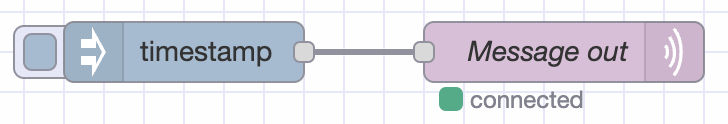

In the world of IIoT (Industrial Internet of Things), effective and efficient communication between devices is crucial. One protocol that has gained significant popularity for its lightweight and scalable nature is MQTT (Message Queuing Telemetry Transport). This post explains what MQTT is, highlight its relevance in IIoT, and walk you through the process of connecting a broker (HiveMQ) with Node-RED in FlowFuse.

<!--more-->

## Understanding MQTT

[MQTT](https://en.wikipedia.org/wiki/MQTT), of which development started in 1999, is a publish-subscribe-based messaging protocol designed to enable efficient communication between IoT devices. It operates on top of TCP/IP like for example HTTP, and provids a lightweight approach to messaging. MQTT follows a client-server model, where devices, known as clients, publish messages to a central server called the broker. Other clients, interested in receiving those messages, subscribe to specific topics on the broker.

## The Advantages of MQTT in IIoT

There are several reasons why MQTT has become a preferred choice for IoT and industrial IoT applications:
1. **Low Overhead**: MQTT uses a small packet size, minimizing bandwidth consumption and reducing network traffic, making it suitable for low-power devices and networks.
1. **Reliability**: MQTT incorporates a Quality of Service (QoS) mechanism that ensures message delivery, making it ideal for applications that require reliable data transmission.
1. **Asynchronous Communication**: MQTT enables asynchronous communication, allowing devices to operate independently, reducing latency and increasing system responsiveness.

## Sending messages to a MQTT broker with Node-RED

As broker we'll use a [Cloud MQTT broker](https://www.hivemq.com/mqtt-cloud-broker/)
provided by HiveMQ. We'll use FlowFuse to host and manage the Node-RED instance for us. After opening the editor
the MQTT nodes are pre-installed as these are "Core Nodes" in Node-RED.

Drag in the "Inject" node, as well as the "MQTT out" node and connect the Injects output to the MQTT
out node. Now it's time to configure the MQTT node to connect to the broker. On HiveMQ you should generate both a username and password, afterwards copy and paste those to the Node-RED MQTT Server
config pane, along with the server details:

After saving the config, and deploying the changes, the flow should tell display a green
status bubble under the MQTT node which tells you it's connected and configured properly.

If we than set the Inject node to send a message every say 1 second, the timestamp will be
sent to the broker through MQTT!

## Receiving message from a MQTT broker with Node-RED

Drag in the "mqtt in" node, and connect it to the "Debug" node.
Open the MQTT in node, and select the server configured. Do note that the topic
this node is listening on must match what was previously selected.

When deployed you should again see the status bubble turn green, and have a
timestamp appear in the sidebar every second!

## Conclusion

MQTT has emerged as a lightweight and efficient messaging protocol for IIoT applications. Its low overhead, reliability, and asynchronous communication make it an good choice. By following the steps outlined above, you can easily connect MQTT using HiveMQ with Node-RED and leverage the power of MQTT in your applications.

For the sake of simplicity we've sent messages from one Node-RED to another Node-RED.
Sending data from and to a Node-RED is much easier achieved with the FlowFuse
[Project Nodes](/docs/user/projectnodes/).