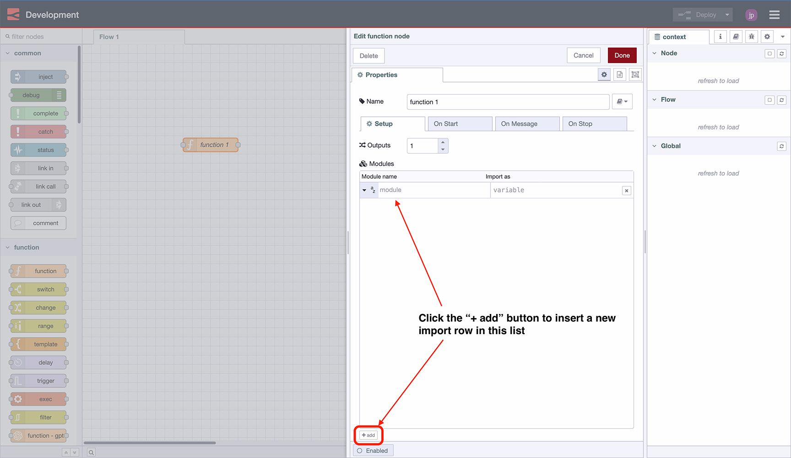

Node-RED has <a href="https://flows.nodered.org/search?type=node" target="_blank">an incredibly rich resource of integrations available</a>, but sometimes you need that little bit of extra functionality, or access to a Node.js module that doesn't have it's own custom nodes in Node-RED. **We can easily import any npm module within the built-in Node-RED function nodes.**

<!--more-->

Historically in Node-RED, you would have needed to manually `npm install` modules from the command line, but now that it's so easy to run Node-RED in the Cloud, where you don't have easy access to those tools, what are the other options available?

## Function Node - Setup

All you need is the name of the module you want to import, then:

1. Drop in a new "function" node & double-click it
1. Switch to the "Setup" tab
1. Underneath the "modules" tab, click "+ add" in the bottom-left of the window.
1. Enter the name of the module you want to use in the newly created row, and (optionally) modify the `variable` that this module will be imported in as.
2. Switch back to the "On Message" tab and write your function. Your new module will be available via the `variable` you defined in the "Setup" tab.

## Example: Moment.js

<video width="560" height="315" controls>
  <source src="https://website-data.s3.eu-west-1.amazonaws.com/MomentJS+Demo.mp4" type="video/mp4">
</video>

Recently we wanted to use [moment](https://www.npmjs.com/package/moment) for some custom date calculations. Whilst there was set of [Moment Node-RED nodes](https://flows.nodered.org/node/node-red-contrib-moment) already available, it didn't have all of the functionality we needed.

So, all we needed to do was import the module into a function node, and define our comparison there instead, here's a working example:

## Example: Easy CRC

<video width="560" height="315" controls>
  <source src="https://website-data.s3.eu-west-1.amazonaws.com/Easy+CRC+Demo.mp4" type="video/mp4">
</video>

Something we see [a lot on the Node-RED Forums](https://discourse.nodered.org/search?q=crc%20order%3Alatest) are questions on how to conduct CRC calculations. There is a popular node module `easy-crc` that can be imported and used in the function nodes, e.g:

## Example: PostHog

<video width="560" height="315" controls>
  <source src="https://website-data.s3.eu-west-1.amazonaws.com/PostHog+Node+Demo.mp4" type="video/mp4">
</video>

Node-RED is great for [data integration](/solutions/data-integration/). We use <a href="https://posthog.com/" target="_blank">PostHog</a> for our internal Product Analysis. We record live events as they occur on FlowFuse Cloud to better understand features that are (and are not) used.

We wanted to investigate whether or not we could add backdated data, which in theory was possible via their <a href="https://posthog.com/docs/libraries/node" target="_blank">posthog-node</a> module. We wanted to populate it with data driven from our own database and API. 

Within two minutes, we could wire up a node to retrieve data from our API, and then ingest it into `posthog-node` via the import of a function node.

## Simplify Function Node Creation with FlowFuse

[FlowFuse](/) provides a powerful platform to enhance, scale, and secure your Node-RED applications efficiently. One of our latest features, the **FlowFuse Expert**, is designed to streamline the process of creating Function nodes.

With the FlowFuse Expert, you can leverage AI to generate Function nodes effortlessly. Just input your prompt, and the Assistant will handle the creation for you, saving time and reducing manual coding.

To explore how to make the most of the FlowFuse Expert and its capabilities, check out the [Assistants Documentation](/docs/user/assistant/).