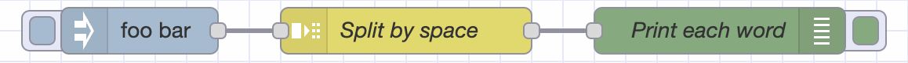
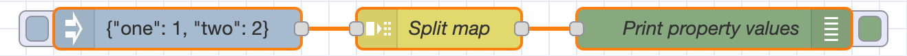

Granular data processing is important in IoT use-cases as multiple tags, for
example, might be sent in one request to a server. Or, when a SQL query results in
many results that need individual processing. In Node-RED, flows are message
based, but a message can be split in multiple messages if needed using the Split
node. The split node is one of the core nodes in Node-RED, thus installed by
default. It's a fundamental building block for powerful automations.

<!--more-->

The Split node is used to divide a single message into multiple messages based
on defined rules. It enables the extraction of individual data elements from many
structures of data like an array, object, or string. The Split node operates by
iterating over the elements of the input message and creating a new output
message for each item.

### Splitting arrays

The easiest way split a message into multiple is when the structure of the input
message is naturally split into multiple. Arrays are an example of such structures.
Creating an output message for each element is the default mode for Split. When
inputting one array with `1, 2, 3, 4` as contents, 4 messages will be printed in
order:


```json
[{"id":"6354daaccf2b2504","type":"inject","z":"2862bf5c278ff5bd","name":"","props":[{"p":"payload"}],"repeat":"","crontab":"","once":false,"onceDelay":0.1,"topic":"","payload":"[1, 2, 3, 4]","payloadType":"json","x":140,"y":100,"wires":[["82ab52c7f894f725"]]},{"id":"82ab52c7f894f725","type":"split","z":"2862bf5c278ff5bd","name":"Split Array","splt":"\\n","spltType":"str","arraySplt":1,"arraySpltType":"len","stream":false,"addname":"","x":310,"y":100,"wires":[["80ee79b75e373ba9"]]},{"id":"80ee79b75e373ba9","type":"debug","z":"2862bf5c278ff5bd","name":"Print individual values","active":true,"tosidebar":true,"console":false,"tostatus":false,"complete":"payload","targetType":"msg","statusVal":"","statusType":"auto","x":520,"y":100,"wires":[]}]
```

#### Regrouping elements

When a large number of elements need regrouping, the split node can be used to chunk the data. For example, some API's will only let you update 20
records at the time. If you have more input, splitting its sub-groups will divide it into multiple messages. This is done by setting
`Fixed length of` to the maximum size of the sub-group. Say the payload to split
is `[1, 2, 3, 4, 5]` with a `Fixed length of` set to 2. This will send 3
messages: `[1, 2]`, `[3, 4]`, and `[5]`.


```json
[{"id":"57087c8029d44fa2","type":"inject","z":"2862bf5c278ff5bd","name":"","props":[{"p":"payload"}],"repeat":"","crontab":"","once":false,"onceDelay":0.1,"topic":"","payload":"[1, 2, 3, 4, 5]","payloadType":"json","x":150,"y":160,"wires":[["b8d0aec7f0cba6c5"]]},{"id":"b8d0aec7f0cba6c5","type":"split","z":"2862bf5c278ff5bd","name":"Regroup array","splt":"\\n","spltType":"str","arraySplt":"2","arraySpltType":"len","stream":false,"addname":"","x":340,"y":160,"wires":[["d45d698bae8b575d"]]},{"id":"d45d698bae8b575d","type":"debug","z":"2862bf5c278ff5bd","name":"Print individual values","active":true,"tosidebar":true,"console":false,"tostatus":false,"complete":"payload","targetType":"msg","statusVal":"","statusType":"auto","x":560,"y":160,"wires":[]}]
```

### Splitting Strings

Strings are able to be split in multiple ways, most commonly by line. Though it's
also possible to split them by a fixed length, which is useful when data is structured
predicatably.

Let's start with splitting by line, as this is the default way the node operates.
Keep the `Split using` set to `\n`, which is the line ending character in Unix
based systems. In our next example, we have a list of 3 cities in Europe, which
we need individually. 


Note we use the template node here simply, as the "Inject" node does not allow you
to create multi-line strings.

```json
[{"id":"39a0a053a3696cd7","type":"inject","z":"2862bf5c278ff5bd","name":"Trigger","props":[],"repeat":"","crontab":"","once":false,"onceDelay":0.1,"topic":"","x":130,"y":220,"wires":[["60bf012438abb4eb"]]},{"id":"4b56a3ed831df59e","type":"split","z":"2862bf5c278ff5bd","name":"Split by line","splt":"\\n","spltType":"str","arraySplt":1,"arraySpltType":"len","stream":false,"addname":"","x":470,"y":220,"wires":[["31f8ca22882b297f"]]},{"id":"31f8ca22882b297f","type":"debug","z":"2862bf5c278ff5bd","name":"Print each line","active":true,"tosidebar":true,"console":false,"tostatus":false,"complete":"payload","targetType":"msg","statusVal":"","statusType":"auto","x":660,"y":220,"wires":[]},{"id":"60bf012438abb4eb","type":"template","z":"2862bf5c278ff5bd","name":"Data in lines","field":"payload","fieldType":"msg","format":"handlebars","syntax":"mustache","template":"Amsterdam\nAndorra la Vella\nAthens","output":"str","x":290,"y":220,"wires":[["4b56a3ed831df59e"]]}]
```

#### Splitting by word

When you've split something by line, you might need to split by word. Simply
putting a space in the `Split using` setting. That doesn't show a visible character
in the form, as opposed to the line ending character.



```json
[{"id":"619209d6e3f02473","type":"inject","z":"2862bf5c278ff5bd","name":"","props":[{"p":"payload"}],"repeat":"","crontab":"","once":false,"onceDelay":0.1,"topic":"","payload":"foo bar","payloadType":"str","x":130,"y":280,"wires":[["15b9b3d17a64e2c7"]]},{"id":"15b9b3d17a64e2c7","type":"split","z":"2862bf5c278ff5bd","name":"Split by space","splt":" ","spltType":"str","arraySplt":1,"arraySpltType":"len","stream":false,"addname":"","x":300,"y":280,"wires":[["12607e8708ef58f2"]]},{"id":"12607e8708ef58f2","type":"debug","z":"2862bf5c278ff5bd","name":"Print each word","active":true,"tosidebar":true,"console":false,"tostatus":false,"complete":"payload","targetType":"msg","statusVal":"","statusType":"auto","x":500,"y":280,"wires":[]}]
```

### Splitting Objects

The remaining data structure of the Node-RED split node is "Objects", which is
the catch-all category. Node-RED uses hashes, key-value pairs of property names
and values. JSON is example of this. In the example below, we'll split the mapping
of the words "one" and "two" versus the number values.



```json
[{"id":"3c4c5535ec3b2138","type":"inject","z":"2862bf5c278ff5bd","name":"","props":[{"p":"payload"}],"repeat":"","crontab":"","once":false,"onceDelay":0.1,"topic":"","payload":"{\"one\": 1, \"two\": 2}","payloadType":"json","x":170,"y":340,"wires":[["eb3227c954debb95"]]},{"id":"eb3227c954debb95","type":"split","z":"2862bf5c278ff5bd","name":"Split map","splt":"\\n","spltType":"str","arraySplt":"1","arraySpltType":"len","stream":false,"addname":"","x":360,"y":340,"wires":[["8c82877cdaff8f0d"]]},{"id":"8c82877cdaff8f0d","type":"debug","z":"2862bf5c278ff5bd","name":"Print property values","active":true,"tosidebar":true,"console":false,"tostatus":false,"complete":"payload","targetType":"msg","statusVal":"","statusType":"auto","x":560,"y":340,"wires":[]}]
```
