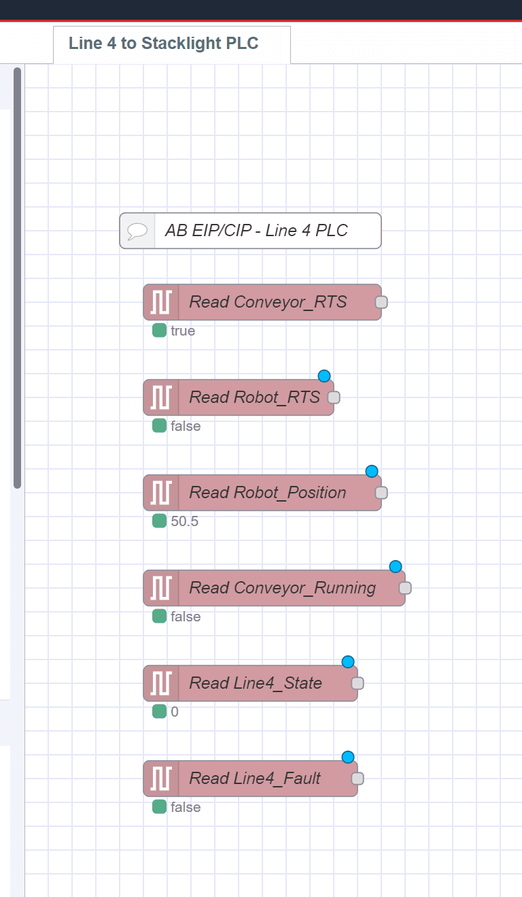
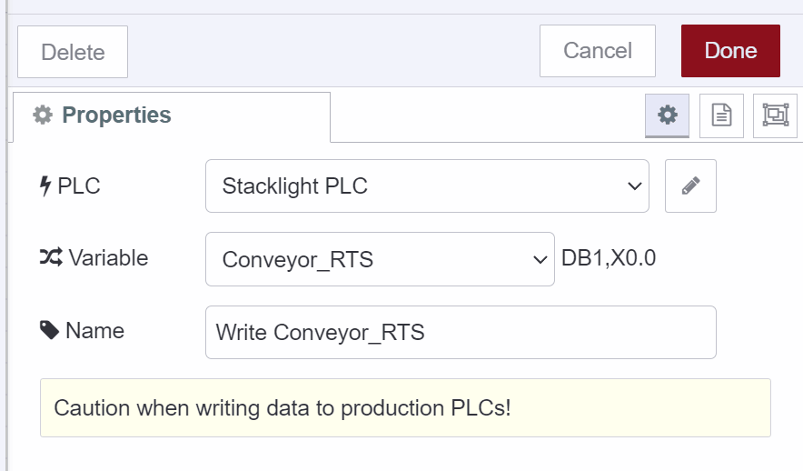

Frequently in industrial automation, there's a need for two devices that use different protocols to communicate with each other, requiring protocol conversion.  
In this tutorial, we present a mock scenario where Node-RED is used to enable an Allen Bradley PLC, which uses ethernet/IP, to communicate with a Siemens PLC, which uses S7, using a no-code solution. This example is geared toward beginners and assumes that the end-user knows how to use PLCs, but may be using FlowFuse or Node-RED for the first time.

<!--more-->

## Premise

The figure above shows the layout of a mock production facility. Inside this facility, operations suggested adding stack lights as an extra visual aid for operators to get a quick status of its 4 conveyor lines, avoiding the need to constantly monitor the HMI/SCADA displays.  
Engineering has suggested adding a siemens S7 1200 PLC with an IO link connection to 4 stacklights, with each line PLC sending basic status information to the stacklight PLC to control the stack light outputs.  
Line 1-3 PLCs are Siemens-based, and can communicate with the stacklight PLC natively over S7. But line 4 is an Allen Bradley PLC that uses ethernet/IP, and can't communicate with the stacklight PLC without some form of protocol conversion.  
Traditionally, we'd use protocol gateway hardware, like Anybus or Red Lion, to convert ethernet/IP to S7.  
But for this application, we will instead use FlowFuse, a pure software-based approach, to convert ethernet/IP to S7. Let's walk through the process.

## Pre-Requisites and Set Up

### FlowFuse

In addition to our two PLCs, we’ll be using FlowFuse software to serve our Node-RED instance. You can either self-host, on-premise or in the cloud. Or use the managed service [FlowFuse Cloud]({{ site.appURL }}).

In this example, we will be using a self-hosted FlowFuse instance running on [Docker](/docs/install/docker/).

### Data Treatment on Ethernet/IP PLC

In our Allen Bradley line 4 PLC, we will send some arbitrary tags of various datatypes to the stacklight PLC for illustrative purposes, described in table 1 below -

| **Tag** | **Data Type** | **Description** |
| --- | --- | --- |
| Conveyor\_RTS | BOOL | Conveyor Ready to Start |
| Robot\_RTS | BOOL | Robot is Ready to Start |
| Robot\_Position | REAL | Robot Arm position (degrees) |
| Conveyor\_Running | BOOL | Conveyor is running |
| Line4\_State | DINT | Line 4 Machine State |
| Line4\_Fault | BOOL | Line 4 is faulted |

Table 1 - Line 4 Tags to be sent to Stacklight PLC

We can send any atomic data type we want, but it must be globally (controller) scoped.

Each tag must also have external read/write access enabled.

### Data Treatment on S7 PLC

In the Siemens PLC, we have a DB for the data from the Line 4 PLC to be written to.

*   In the DBs attributes, “optimized block access” must be disabled.
    
*   The tags must be writeable and accessible
    
*   
    
    “No protection” must be set in the CPU properties
    
*   

## Create The Flow

With both PLCs up and running and properly set up to send/receive remote data, we can now create a flow to act as our protocol converter.

### Install Custom Nodes

First, we need to add two custom nodes that will give Node-RED the ability to read/write ethernet/IP and S7 data.

Click the hamburger icon → manage pallette

On the `install` tab, search for `s7` and install the `node-red-contrib-s7` node.

Next, search for `ethernet` and install the `node-red-contrib-cip-ethernet-ip` node.

Go to the `nodes` tab and confirm both custom nodes have been properly installed.

### Set Up Ethernet/IP Data

Let’s start by dragging a `eth-ip in` node onto the pallette. Then add a new endpoint, which will point to our Line4 PLC.

In the endpoint `connection` properties, the connection information must match the PLC, so set the IP address and CPU slot number appropriately. Also, the default cycle time is 500ms. Depending on your application, polling the CPU at 500ms may be appropriate. But being that this is a simple stacklight, 500ms is unnecessarily fast. So we will change it to 1000ms, which is a more appropriate polling rate for this type of application.

On the `Tags` tab, populate the tag information to match our Allen Bradley PLC. Then select `Update` to complete configuration of the `eth-ip endpoint`.

Now that we have our endpoint, let’s finish configuring the `eth-ip in` node.

1.  select the endpoint we just created
    
2.  select the first tag in the drop-down
    
3.  give the node a descriptive name
    

Now let’s set up a quick test to confirm our PLC connection is valid by adding a `debug` node to the `eth-ip in` node. Then hit `deploy`.

*   note - you can see we also have a `comment` above the nodes that describes what is happening. This is optional but good practice to help organize and understand your flow.
    

The output of the debug console did not report any errors so communication appears to be okay.

But just to confirm, let’s toggle the value and see if comes through.

So by toggling the value and see the result, here we confirmed 2 things:

*   We can detect changes in value
    
*   the `eth-ip in` node only sends a message when the value changes, also known as Report by Exception.
    

Because the `eth-ip in` node implicitly uses report by exception, and the protocol doesn't rely on contiguous data consistency (unlike modbus, for instance), we can receive our data one tag at a time to keep our flow simple.

Now we can remove the debug node and add the additional `eth-ip in` nodes to receive the remaining tags from our Line 4 PLC.

Here’s how the the flow should look at this point.

### Set Up S7 Data

Now we’ll set up the S7 endpoint, using an `s7 out` node.

Populate the connection properties to match your hardware. The cycle time is updated to 1000ms to match the cycle time of our `eth-ip in` nodes. You can adjust this value to match your intended application.

On the `Variables` tab, some special formatting is required to point to the absolute reference of the tag DB location in the S7 PLC.

For information on how to format S7 absolute tag references in a way the `s7 endpoint` node is expecting, refer to the [node documentation](https://flows.nodered.org/node/node-red-contrib-s7) for further information.

For reference, here is an example of how we set the tags in our stacklight PLC example and how it looks in our `s7 endpoint`.

Once the tags are populated we can select our configured endpoint from the dropdown list, point to our first variable, `Conveyor_RTS`, and give the node a name.

Repeat this process for the remaining tags.

## Test the Conversion

The only thing remaining is to simply wire the nodes together, and confirm the values pass through.

Manipulate the incoming values and confirm the data passes through as expected. Because of the report by exception nature of the `eth-ip in` node, tag changes should be near instantaneous on the receiving PLC.

We can stop here, but we can improve this flow by adding a `filter` node on our REAL data-type, `Robot_Position`.

### Add Filter to REAL data

Depending on how noisy the REAL data is, which is common with unfiltered 4-20mA field transmitters, and how much granularity you need to capture, it is good practice to add a filter on REAL data to reduce FieldBus traffic coming out of our soft protocol converter.

In the example above, we arbitrarily applied a 3% [deadband](/node-red/core-nodes/filter/)
to the `Robot_Position` value, which means that the value must change by greater than or equal to 3% compared to the last input value, or else the data will be discarded before being sent to the stacklight PLC.

You can adjust the deadband to find the right balance for your particular application.

We can see the effect the deadband filter had by adding debug nodes before and after the filter.

As shown above, when `Robot_Position` changed from 15.6 to 15.6999..., the value was captured on the input of the filter, but was discarded on the output.

When the `Robot_Position` went from 15.6999 to 18, the filter allowed it to pass as it exceeded the deadband limit we had set.

Use filters to optimize your fieldbus converter network performance, especially if dealing with noisy signals or large quantities of REAL datatypes.

## Conclusion

In this tutorial, we demonstrated how to use Node-RED as a free Ethernet/IP to S7 protocol converter using a simple no-code approach.  We showed how to configure PLC tags to be sent remotely using Ethernet/IP, how to configure PLC tags to be received remotely using S7, and how to create the flow to use Node-RED to seamlessly convert incoming PLC data between the two protocols using `node-red-contrib-cip-ethernet-ip` and `node-red-contrib-s7` custom nodes.  We also took things one step further and added a `filter` node to optimize FieldBus network traffic by putting a deadband on REAL data being sent to the receiving PLC.

The end result is a simple to set up, free and performant industrial protocol converter that requires minimal PLC configuration, which allows this application to be applied in non-mission critical production systems with minimal, if any downtime.  Additionally, the protocol traffic can be visually observed in real-time for easy trouble-shooting and fault analysis by simply accessing the Node-RED UI. 

In later tutorials, we can show ways this simple flow can be extended to add additional capabilities not normally available in traditional off-the-shelf protocol gateways. If you found this tutorial helpful, or have any questions or comments, please leave us a comment and let us know your thoughts.

JSON source code for the flow used in this tutorial is provided below - 

[{"id":"ad7b17411c8e83aa","type":"tab","label":"Line 4 to Stacklight PLC","disabled":false,"info":"","env":[]},{"id":"c97a4c9bd1981757","type":"comment","z":"ad7b17411c8e83aa","name":"AB EIP/CIP - Line 4 PLC","info":"","x":190,"y":140,"wires":[]},{"id":"2cc5227ef6a90814","type":"eth-ip in","z":"ad7b17411c8e83aa","endpoint":"4ab2910b66e16220","mode":"single","variable":"Conveyor_RTS","program":"","name":"Read Conveyor_RTS","x":200,"y":200,"wires":[["fe18ef80f9e18c13"]]},{"id":"9308dcbda17274c7","type":"comment","z":"ad7b17411c8e83aa","name":"Siemens S7 - Stacklight PLC","info":"","x":620,"y":140,"wires":[]},{"id":"fe18ef80f9e18c13","type":"s7 out","z":"ad7b17411c8e83aa","endpoint":"a1bec25858c6f3ef","variable":"Conveyor_RTS","name":"Write Conveyor_RTS","x":620,"y":200,"wires":[]},{"id":"94fe6b73efa1c56b","type":"eth-ip in","z":"ad7b17411c8e83aa","endpoint":"4ab2910b66e16220","mode":"single","variable":"Robot_RTS","program":"","name":"Read Robot_RTS","x":180,"y":280,"wires":[["7774d6ce188c288c"]]},{"id":"7e9564cd59e3d0a2","type":"eth-ip in","z":"ad7b17411c8e83aa","endpoint":"4ab2910b66e16220","mode":"single","variable":"Robot_Position","program":"","name":"Read Robot_Position","x":200,"y":360,"wires":[["832807bfdc4b76f0"]]},{"id":"c0f712b9e355f1f8","type":"eth-ip in","z":"ad7b17411c8e83aa","endpoint":"4ab2910b66e16220","mode":"single","variable":"Conveyor_Running","program":"","name":"Read Conveyor_Running","x":210,"y":440,"wires":[["fbf1b3e38897a9c7"]]},{"id":"db77621e418f1222","type":"eth-ip in","z":"ad7b17411c8e83aa","endpoint":"4ab2910b66e16220","mode":"single","variable":"Line4_State","program":"","name":"Read Line4_State","x":190,"y":520,"wires":[["cdeffd9e52cc4384"]]},{"id":"848af9b76f969dd2","type":"eth-ip in","z":"ad7b17411c8e83aa","endpoint":"4ab2910b66e16220","mode":"single","variable":"Line4_Fault","program":"","name":"Read Line4_Fault","x":190,"y":600,"wires":[["0c595b0ac2550593"]]},{"id":"7774d6ce188c288c","type":"s7 out","z":"ad7b17411c8e83aa","endpoint":"a1bec25858c6f3ef","variable":"Robot_RTS","name":"Write Robot_RTS","x":610,"y":280,"wires":[]},{"id":"f1572463c50bb4cb","type":"s7 out","z":"ad7b17411c8e83aa","endpoint":"a1bec25858c6f3ef","variable":"Robot_Position","name":"Write Robot_Position","x":620,"y":360,"wires":[]},{"id":"fbf1b3e38897a9c7","type":"s7 out","z":"ad7b17411c8e83aa","endpoint":"a1bec25858c6f3ef","variable":"Conveyor_Running","name":"Write Conveyor_Running","x":630,"y":440,"wires":[]},{"id":"cdeffd9e52cc4384","type":"s7 out","z":"ad7b17411c8e83aa","endpoint":"a1bec25858c6f3ef","variable":"Line4_State","name":"Write Line4_State","x":610,"y":520,"wires":[]},{"id":"0c595b0ac2550593","type":"s7 out","z":"ad7b17411c8e83aa","endpoint":"a1bec25858c6f3ef","variable":"Line4_Fault","name":"Write Line4_Fault","x":610,"y":600,"wires":[]},{"id":"832807bfdc4b76f0","type":"rbe","z":"ad7b17411c8e83aa","name":"","func":"deadbandEq","gap":"3%","start":"","inout":"in","septopics":true,"property":"payload","topi":"topic","x":420,"y":360,"wires":[["f1572463c50bb4cb"]]},{"id":"4ab2910b66e16220","type":"eth-ip endpoint","address":"192.168.0.5","slot":"0","cycletime":"1000","name":"Line4","vartable":{"":{"Conveyor_RTS":{"type":"BOOL"},"Robot_RTS":{"type":"BOOL"},"Robot_Position":{"type":"REAL"},"Conveyor_Running":{"type":"BOOL"},"Line4_State":{"type":"DINT"},"Line4_Fault":{"type":"BOOL"}}}},{"id":"a1bec25858c6f3ef","type":"s7 endpoint","transport":"iso-on-tcp","address":"192.168.0.10","port":"102","rack":"0","slot":"1","localtsaphi":"01","localtsaplo":"00","remotetsaphi":"01","remotetsaplo":"00","connmode":"rack-slot","adapter":"","busaddr":"2","cycletime":"1000","timeout":"3000","name":"Stacklight PLC","vartable":[{"addr":"DB1,X0.0","name":"Conveyor_RTS"},{"addr":"DB1,X0.1","name":"Robot_RTS"},{"addr":"DB1,R2","name":"Robot_Position"},{"addr":"DB1,X6.0","name":"Conveyor_Running"},{"addr":"DB1,DI8","name":"Line4_State"},{"addr":"DB1,X12.0","name":"Line4_Fault"}]}]


