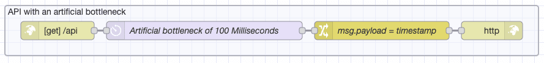
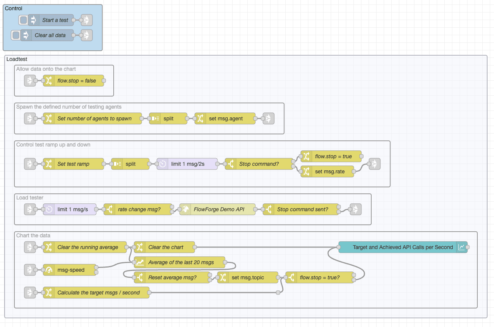
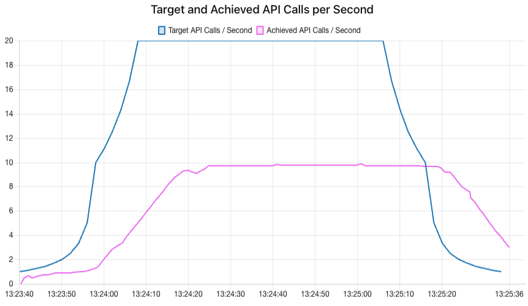
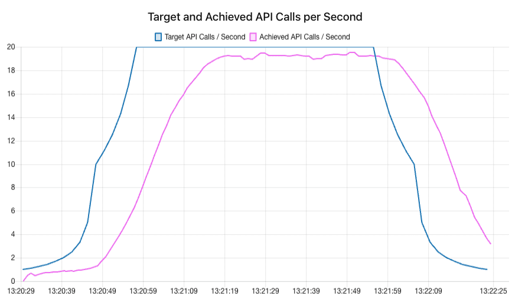

As part of FlowForge's 1.8 release, we have delivered our first step towards Highly Available (HA) Node-RED applications. In this article I'm going build an application to test the performance of Node-RED running in HA and standard mode.
<!--more-->

### Setting The Scene

HA is our first [preview feature](https://flowforge.com/handbook/product/versioning/#preview-features), and your feedback is crucial to the future development path we will take. We encourage you to try out HA in your Node-RED instances and share your experiences with us.

Our CTO Nick O'Leary, [wrote an article](/blog/2023/05/bringing-high-availability-to-node-red/) earlier this year exploring some of the terminology, concepts, and challenges of delivering HA for Node-RED. It's worth a read if you are new to HA or would like a refresher.

This article is not an attempt to fully load-test FlowForge's performance with HA, the loads used were synthetic but should correlate strongly with real world performance of Node-RED applications.

### How does the preview build of FlowForge's HA work?

When HA is enabled in FlowForge for a Node-RED instance, various things change under the hood. We need to consider these changes when writing Node-RED flows for HA. The main points we need to consider are:

##### HA runs multiple copies of the same instance

Once HA is enabled, FlowForge creates multiple copies of your instance (2 at the time of writing). These copies all run in parallel. Any traffic to your instance will be load-balanced so that the traffic is shared between all copies.

The load-balanced approach to HA creates a challenge when designing your applications, because it means you cannot:

* determine which copy of your flows is dealing with a given message.
* configure the copies of the flows to communicate to each other directly.
* determine how many copies are running at any given moment in time.

These factors need to be considered when designing your applications. They are not negative as such, but require a different approach when creating an application which will run in a single Node-RED instance.

##### Limited access to the Node-RED editor interface

Once HA is enabled, you cannot edit the flows in a Node-RED instance directly, you can't even access the interface for Node-RED. This is a deliberate limitation, if you were to edit the flows directly, you would end up with different versions of your instance running at the same time.

Don't worry, we have a solution. To update your instance you can use our [DevOps pipeline feature](https://flowforge.com/docs/user/devops-pipelines/#devops-pipelines) to promote the flows on a Node-RED instance to your HA instance. Editing your flows in this way allows FlowForge to ensure that the same flows are running on all your Node-RED HA copies.

### Let's build something

To explore FlowForge's HA feature preview, I am going to build a basic load testing application. The application will make an API call to a Node-RED instance which will in turn reply with a small payload. 

I'm not looking to methodically load-test HA on FlowForge Cloud here, but I want to make sure I can see the impact of HA on the application. To that end, I am going to create a synthetic bottleneck on the flows running in HA. In simple terms, I will use a delay node which only allows one message to pass through every 100 milliseconds. I'm going to queue up any messages that arrive in the mean-time. This is a reasonable simulation of what we might see if each connection to the HA instance was in turn completing an interaction with a database or MQTT broker.

 

 You can import this flow into your own Node-RED instance using the code below.

 ```json
[{"id":"045a7c658cff2c79","type":"group","z":"03c64b484908c3ed","name":"API with an artificial bottleneck","style":{"label":true},"nodes":["441caf15dca25bf5","3cb096f08952b5b0","31a50f37100b831c","3e9f592a0e907077"],"x":34,"y":39,"w":872,"h":82},{"id":"441caf15dca25bf5","type":"http in","z":"03c64b484908c3ed","g":"045a7c658cff2c79","name":"","url":"/api","method":"get","upload":false,"swaggerDoc":"","x":120,"y":80,"wires":[["31a50f37100b831c"]]},{"id":"3cb096f08952b5b0","type":"http response","z":"03c64b484908c3ed","g":"045a7c658cff2c79","name":"","statusCode":"","headers":{},"x":830,"y":80,"wires":[]},{"id":"31a50f37100b831c","type":"delay","z":"03c64b484908c3ed","g":"045a7c658cff2c79","name":"Artificial bottleneck of 100 Milliseconds","pauseType":"delay","timeout":"100","timeoutUnits":"milliseconds","rate":"1","nbRateUnits":"1","rateUnits":"second","randomFirst":"1","randomLast":"5","randomUnits":"seconds","drop":false,"allowrate":false,"outputs":1,"x":360,"y":80,"wires":[["3e9f592a0e907077"]]},{"id":"3e9f592a0e907077","type":"change","z":"03c64b484908c3ed","g":"045a7c658cff2c79","name":"msg.payload = timestamp","rules":[{"t":"set","p":"payload","pt":"msg","to":"","tot":"date"}],"action":"","property":"","from":"","to":"","reg":false,"x":650,"y":80,"wires":[["3cb096f08952b5b0"]]}]
 ```

The next step is to create a Node-RED flow to apply load to the API and record response rates. I want the flow to control the load-test level over a period of time and show the results on a graph.



If you'd like to view this flow yourself you can import the load-tester into Node-RED using the code below. I've tested this flow on standard and FlowForge Node-RED version 3.0.2 so it should run fine on any Node-RED instance with sufficient bandwidth and compute power.

```json
[{"id":"f6f2187d.f17ca8","type":"tab","label":"Load Tester","disabled":false,"info":""},{"id":"10522c0baed97b5b","type":"group","z":"f6f2187d.f17ca8","name":"Loadtest","style":{"stroke":"#b2b3bd","fill":"#f2f3fb","fill-opacity":"0.5","label":true,"color":"#32333b"},"nodes":["a2e1c5156a24ea78","c7373136339401aa","55e8c82ad7a34348","8501b8a0073d43b6","b68cd727d589a27f"],"x":38,"y":233,"w":1274,"h":694},{"id":"2efd22a943329fc5","type":"group","z":"f6f2187d.f17ca8","name":"Control","style":{"label":true,"fill":"#bfdbef","color":"#000000"},"nodes":["19ac671f57cb4861","b5bd39105d7e709f","e572e84b9390305a","020775aa43e7dfda"],"x":34,"y":99,"w":262,"h":122},{"id":"a2e1c5156a24ea78","type":"group","z":"f6f2187d.f17ca8","g":"10522c0baed97b5b","name":"Spawn the defined number of testing agents","style":{"label":true},"nodes":["091d36d6e00578ce","a82342ad9c7a5d43","5fddc154f1a56e2c","64414f6450cf3953","5a238b36ad1cd200"],"x":64,"y":359,"w":712,"h":82},{"id":"c7373136339401aa","type":"group","z":"f6f2187d.f17ca8","g":"10522c0baed97b5b","name":"Control test ramp up and down","style":{"label":true},"nodes":["6cb00c173376e046","3adab13204328c4d","9f19aff9ab804d3d","4d46ca64933ac1d3","71a35667382f0c5a","9490dab01d32ad32","3f9f8d0df34377f2","32fd211dc6eacc21"],"x":64,"y":459,"w":992,"h":122},{"id":"55e8c82ad7a34348","type":"group","z":"f6f2187d.f17ca8","g":"10522c0baed97b5b","name":"Load tester","style":{"label":true},"nodes":["908750260a627af8","8e6ea88e04427117","d543dcaaa192df98","f293c04ab38c4d90","4782b199b4716137","b6bd1006d988e945"],"x":64,"y":599,"w":942,"h":82},{"id":"8501b8a0073d43b6","type":"group","z":"f6f2187d.f17ca8","g":"10522c0baed97b5b","name":"Chart the data","style":{"label":true},"nodes":["180c5e48ef2bc3dc","35373d372a8332bd","50fc36ba2355499d","17e6b261606e685d","2c1f01a17d300de8","ae514cab763c2fa7","0715e1fb5dafc7b8","67c09ddccdf925b0","2f2ec619699434f9","7a47fef4a69aefb0","0f474f2e72a21deb","9cc5785934424c73","837736a63a478ade","35373d372a8332bd"],"x":64,"y":699,"w":1222,"h":202},{"id":"b68cd727d589a27f","type":"group","z":"f6f2187d.f17ca8","g":"10522c0baed97b5b","name":"Allow data onto the chart","style":{"label":true},"nodes":["220236ca84210a64","236bbe5fa503c96c"],"x":64,"y":259,"w":262,"h":82},{"id":"0f474f2e72a21deb","type":"junction","z":"f6f2187d.f17ca8","g":"8501b8a0073d43b6","x":760,"y":860,"wires":[["837736a63a478ade"]]},{"id":"091d36d6e00578ce","type":"change","z":"f6f2187d.f17ca8","g":"a2e1c5156a24ea78","name":"Set number of agents to spawn","rules":[{"t":"set","p":"payload","pt":"msg","to":"[\"1\",\"2\",\"3\",\"4\",\"5\",\"6\",\"7\",\"8\",\"9\",\"10\"]","tot":"json"}],"action":"","property":"","from":"","to":"","reg":false,"x":270,"y":400,"wires":[["a82342ad9c7a5d43"]]},{"id":"a82342ad9c7a5d43","type":"split","z":"f6f2187d.f17ca8","g":"a2e1c5156a24ea78","name":"","splt":"\\n","spltType":"str","arraySplt":1,"arraySpltType":"len","stream":false,"addname":"","x":470,"y":400,"wires":[["5a238b36ad1cd200"]]},{"id":"5fddc154f1a56e2c","type":"link in","z":"f6f2187d.f17ca8","g":"a2e1c5156a24ea78","name":"link in 13","links":["b5bd39105d7e709f"],"x":105,"y":400,"wires":[["091d36d6e00578ce"]]},{"id":"64414f6450cf3953","type":"link out","z":"f6f2187d.f17ca8","g":"a2e1c5156a24ea78","name":"link out 9","mode":"link","links":["8e6ea88e04427117"],"x":735,"y":400,"wires":[]},{"id":"5a238b36ad1cd200","type":"change","z":"f6f2187d.f17ca8","g":"a2e1c5156a24ea78","name":"","rules":[{"t":"set","p":"agent","pt":"msg","to":"payload","tot":"msg"}],"action":"","property":"","from":"","to":"","reg":false,"x":620,"y":400,"wires":[["64414f6450cf3953"]]},{"id":"6cb00c173376e046","type":"link out","z":"f6f2187d.f17ca8","g":"c7373136339401aa","name":"link out 10","mode":"link","links":["0715e1fb5dafc7b8","8e6ea88e04427117"],"x":1015,"y":520,"wires":[]},{"id":"3adab13204328c4d","type":"delay","z":"f6f2187d.f17ca8","g":"c7373136339401aa","name":"","pauseType":"rate","timeout":"5","timeoutUnits":"seconds","rate":"1","nbRateUnits":"2","rateUnits":"second","randomFirst":"1","randomLast":"5","randomUnits":"seconds","drop":false,"allowrate":false,"outputs":1,"x":520,"y":520,"wires":[["3f9f8d0df34377f2"]]},{"id":"9f19aff9ab804d3d","type":"split","z":"f6f2187d.f17ca8","g":"c7373136339401aa","name":"","splt":"\\n","spltType":"str","arraySplt":1,"arraySpltType":"len","stream":false,"addname":"","x":370,"y":520,"wires":[["3adab13204328c4d"]]},{"id":"4d46ca64933ac1d3","type":"link in","z":"f6f2187d.f17ca8","g":"c7373136339401aa","name":"link in 14","links":["b5bd39105d7e709f"],"x":105,"y":520,"wires":[["71a35667382f0c5a"]]},{"id":"71a35667382f0c5a","type":"change","z":"f6f2187d.f17ca8","g":"c7373136339401aa","name":"Set test ramp","rules":[{"t":"set","p":"payload","pt":"msg","to":"[1000,900,800,700,600,500,400,300,200,100,50,50,50,50,50,50,50,50,50,50,100,200,300,400,500,600,700,800,900,1000,\"stop\"]","tot":"json"}],"action":"","property":"","from":"","to":"","reg":false,"x":220,"y":520,"wires":[["9f19aff9ab804d3d"]]},{"id":"9490dab01d32ad32","type":"change","z":"f6f2187d.f17ca8","g":"c7373136339401aa","name":"","rules":[{"t":"set","p":"rate","pt":"msg","to":"payload","tot":"msg"}],"action":"","property":"","from":"","to":"","reg":false,"x":890,"y":540,"wires":[["6cb00c173376e046"]]},{"id":"3f9f8d0df34377f2","type":"switch","z":"f6f2187d.f17ca8","g":"c7373136339401aa","name":"Stop command?","property":"payload","propertyType":"msg","rules":[{"t":"eq","v":"stop","vt":"str"},{"t":"else"}],"checkall":"true","repair":false,"outputs":2,"x":710,"y":520,"wires":[["32fd211dc6eacc21"],["9490dab01d32ad32"]]},{"id":"32fd211dc6eacc21","type":"change","z":"f6f2187d.f17ca8","g":"c7373136339401aa","name":"flow.stop = true","rules":[{"t":"set","p":"stop","pt":"flow","to":"true","tot":"bool"}],"action":"","property":"","from":"","to":"","reg":false,"x":900,"y":500,"wires":[[]]},{"id":"908750260a627af8","type":"delay","z":"f6f2187d.f17ca8","g":"55e8c82ad7a34348","name":"","pauseType":"rate","timeout":"5","timeoutUnits":"seconds","rate":"1","nbRateUnits":"1","rateUnits":"second","randomFirst":"1","randomLast":"5","randomUnits":"seconds","drop":false,"allowrate":true,"outputs":1,"x":210,"y":640,"wires":[["f293c04ab38c4d90"]]},{"id":"8e6ea88e04427117","type":"link in","z":"f6f2187d.f17ca8","g":"55e8c82ad7a34348","name":"link in 15","links":["64414f6450cf3953","6cb00c173376e046","d543dcaaa192df98","702296619b530dfa"],"x":105,"y":640,"wires":[["908750260a627af8"]]},{"id":"d543dcaaa192df98","type":"link out","z":"f6f2187d.f17ca8","g":"55e8c82ad7a34348","name":"link out 11","mode":"link","links":["e90e02e14ea3224a","8e6ea88e04427117","50fc36ba2355499d"],"x":965,"y":640,"wires":[]},{"id":"f293c04ab38c4d90","type":"switch","z":"f6f2187d.f17ca8","g":"55e8c82ad7a34348","name":"rate change msg?","property":"rate","propertyType":"msg","rules":[{"t":"nnull"},{"t":"else"}],"checkall":"true","repair":false,"outputs":2,"x":390,"y":640,"wires":[[],["b6bd1006d988e945"]]},{"id":"4782b199b4716137","type":"switch","z":"f6f2187d.f17ca8","g":"55e8c82ad7a34348","name":"Stop command sent?","property":"stop","propertyType":"flow","rules":[{"t":"true"},{"t":"else"}],"checkall":"true","repair":false,"outputs":2,"x":820,"y":640,"wires":[[],["d543dcaaa192df98"]]},{"id":"50fc36ba2355499d","type":"link in","z":"f6f2187d.f17ca8","g":"8501b8a0073d43b6","name":"link in 16","links":["d543dcaaa192df98"],"x":105,"y":800,"wires":[["180c5e48ef2bc3dc"]]},{"id":"2c1f01a17d300de8","type":"change","z":"f6f2187d.f17ca8","g":"8501b8a0073d43b6","name":"","rules":[{"t":"set","p":"topic","pt":"msg","to":"Achieved API Calls / Second","tot":"str"}],"action":"","property":"","from":"","to":"","reg":false,"x":680,"y":820,"wires":[["837736a63a478ade"]]},{"id":"ae514cab763c2fa7","type":"change","z":"f6f2187d.f17ca8","g":"8501b8a0073d43b6","name":"Calculate the target msgs / second","rules":[{"t":"set","p":"payload","pt":"msg","to":"1000 / msg.payload","tot":"jsonata"},{"t":"set","p":"topic","pt":"msg","to":"Target API Calls / Second","tot":"str"}],"action":"","property":"","from":"","to":"","reg":false,"x":280,"y":860,"wires":[["0f474f2e72a21deb"]]},{"id":"0715e1fb5dafc7b8","type":"link in","z":"f6f2187d.f17ca8","g":"8501b8a0073d43b6","name":"link in 17","links":["6cb00c173376e046","702296619b530dfa"],"x":105,"y":860,"wires":[["ae514cab763c2fa7"]]},{"id":"67c09ddccdf925b0","type":"link in","z":"f6f2187d.f17ca8","g":"8501b8a0073d43b6","name":"link in 18","links":["b5bd39105d7e709f","020775aa43e7dfda"],"x":105,"y":740,"wires":[["7a47fef4a69aefb0"]]},{"id":"2f2ec619699434f9","type":"change","z":"f6f2187d.f17ca8","g":"8501b8a0073d43b6","name":"Clear the chart","rules":[{"t":"set","p":"payload","pt":"msg","to":"[]","tot":"json"}],"action":"","property":"","from":"","to":"","reg":false,"x":460,"y":740,"wires":[["35373d372a8332bd"]]},{"id":"7a47fef4a69aefb0","type":"change","z":"f6f2187d.f17ca8","g":"8501b8a0073d43b6","name":"Clear the running average","rules":[{"t":"set","p":"payload","pt":"msg","to":"clear","tot":"str"}],"action":"","property":"","from":"","to":"","reg":false,"x":250,"y":740,"wires":[["17e6b261606e685d","2f2ec619699434f9"]]},{"id":"9cc5785934424c73","type":"switch","z":"f6f2187d.f17ca8","g":"8501b8a0073d43b6","name":"Reset average msg?","property":"payload_in","propertyType":"msg","rules":[{"t":"eq","v":"clear","vt":"str"},{"t":"else"}],"checkall":"true","repair":false,"outputs":2,"x":480,"y":820,"wires":[[],["2c1f01a17d300de8"]]},{"id":"837736a63a478ade","type":"switch","z":"f6f2187d.f17ca8","g":"8501b8a0073d43b6","name":"flow.stop = true?","property":"stop","propertyType":"flow","rules":[{"t":"true"},{"t":"else"}],"checkall":"true","repair":false,"outputs":2,"x":870,"y":820,"wires":[[],["35373d372a8332bd"]]},{"id":"220236ca84210a64","type":"change","z":"f6f2187d.f17ca8","g":"b68cd727d589a27f","name":"flow.stop = false","rules":[{"t":"set","p":"stop","pt":"flow","to":"false","tot":"bool"}],"action":"","property":"","from":"","to":"","reg":false,"x":220,"y":300,"wires":[[]]},{"id":"236bbe5fa503c96c","type":"link in","z":"f6f2187d.f17ca8","g":"b68cd727d589a27f","name":"link in 19","links":["b5bd39105d7e709f"],"x":105,"y":300,"wires":[["220236ca84210a64"]]},{"id":"19ac671f57cb4861","type":"inject","z":"f6f2187d.f17ca8","g":"2efd22a943329fc5","name":"Start a test","props":[],"repeat":"","crontab":"","once":false,"onceDelay":0.1,"topic":"","x":160,"y":140,"wires":[["b5bd39105d7e709f"]]},{"id":"b5bd39105d7e709f","type":"link out","z":"f6f2187d.f17ca8","g":"2efd22a943329fc5","name":"link out 12","mode":"link","links":["c400cbe00d5157eb","11f154eb8793628e","932ad072f2a06f5b","e9af1c9fa92b2d28","f82a1a50e69f92ac","5fddc154f1a56e2c","4d46ca64933ac1d3","67c09ddccdf925b0","236bbe5fa503c96c","34adf87fc623f3a9","ff6cf9cb22aae286","eb689d3c5969a421","f0be31cc6f44d71e"],"x":255,"y":140,"wires":[]},{"id":"e572e84b9390305a","type":"inject","z":"f6f2187d.f17ca8","g":"2efd22a943329fc5","name":"Clear all data","props":[],"repeat":"","crontab":"","once":false,"onceDelay":0.1,"topic":"","x":150,"y":180,"wires":[["020775aa43e7dfda"]]},{"id":"020775aa43e7dfda","type":"link out","z":"f6f2187d.f17ca8","g":"2efd22a943329fc5","name":"link out 13","mode":"link","links":["932ad072f2a06f5b","67c09ddccdf925b0","eb689d3c5969a421"],"x":255,"y":180,"wires":[]},{"id":"35373d372a8332bd","type":"ui_chart","z":"f6f2187d.f17ca8","g":"8501b8a0073d43b6","name":"","group":"ac144f4cf90c7c0f","order":0,"width":"6","height":"6","label":"Target and Achieved API Calls per Second","chartType":"line","legend":"true","xformat":"HH:mm:ss","interpolate":"linear","nodata":"","dot":false,"ymin":"","ymax":"","removeOlder":"5","removeOlderPoints":"","removeOlderUnit":"60","cutout":0,"useOneColor":false,"useUTC":false,"colors":["#1f77b4","#ec6dee","#ff7f0e","#2ca02c","#98df8a","#d62728","#ff9896","#9467bd","#c5b0d5"],"outputs":1,"useDifferentColor":false,"className":"","x":1090,"y":740,"wires":[[]]},{"id":"180c5e48ef2bc3dc","type":"msg-speed","z":"f6f2187d.f17ca8","g":"8501b8a0073d43b6","name":"","frequency":"sec","interval":1,"estimation":false,"ignore":true,"pauseAtStartup":false,"topicDependent":false,"x":210,"y":800,"wires":[["17e6b261606e685d"],[]]},{"id":"17e6b261606e685d","type":"moving-average","z":"f6f2187d.f17ca8","g":"8501b8a0073d43b6","name":"Average of the last 20 msgs","amount":"20","weight":"cumulative","x":500,"y":780,"wires":[["9cc5785934424c73"]]},{"id":"b6bd1006d988e945","type":"http request","z":"f6f2187d.f17ca8","g":"55e8c82ad7a34348","name":"FlowForge Demo API","method":"GET","ret":"txt","paytoqs":"ignore","url":"","tls":"","persist":false,"proxy":"","insecureHTTPParser":false,"authType":"","senderr":false,"headers":[],"x":600,"y":640,"wires":[["4782b199b4716137"]]},{"id":"ac144f4cf90c7c0f","type":"ui_group","name":"","tab":"d07184e97ed77e45","order":1,"disp":true,"width":"6","collapse":false,"className":""},{"id":"d07184e97ed77e45","type":"ui_tab","name":"Home","icon":"dashboard","disabled":false,"hidden":false}]
```

You will need to configure the URL for your API which is stored in the 'http request' node of you wish to run your own tests using this flow.

As configured, the load-tester makes up to 20 API calls per second. You can define your own testing curve by editing the change node labelled 'Set test ramp'. the values in the array are a delay in milliseconds between each attempted API call. Each number in the array defines the speed of the test for the next 2 seconds.

I've setup the flow to chart the speed of the test on the same axes as the results so you can view the achieved speed in the context of each test's configuration.

### Running the tests

I have setup two instances of the test API running on FlowForge. The first is a standard small instance, the second is a highly available small instance.

I'm hoping to see roughly double the performance for the API running in HA mode.

First, let's look at the data from the standard instance.



We are seeing a maximum throughput of 10 API calls per second. The performance of the API tracks up until it hits the bottleneck I imposed on the API (10 API calls per second). This shows us that the test is using up all the available speed of the API instance.

Let's compare that to the HA instance. We would hope to see around double the performance when compared to the chart above.



As predicted, at 19 calls per second the performance is practically twice that of the standard instance. It's often the case in computer systems that doubling the resources doesn't quite give you twice the performance but 190% seems pretty close and a clear improvement was delivered once the application was running in HA mode.

### Conclusion

FlowForge's first step towards High Availability improves performance of Node-RED applications. It's important that applications are designed to benefit from parallel processing of workloads but with a little work great results can be achieved. In the testing undertaken in this article, the performance practically doubled when HA was enabled.

We'd love to hear your feedback and suggested features for our future releases of HA, please get involved on our [Github page](https://github.com/flowforge/flowforge).

