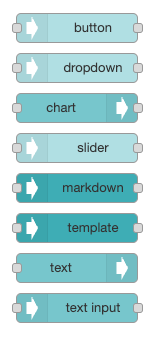

Just weeks ago, we at FlowForge [announced our plan](../../06/dashboard-announcement) to develop a successor to the Node-RED Dashboard. Today, we're excited to reveal the pre-alpha release of this highly anticipated project, bringing us one step closer to a new era of data visualization in Node-RED.

<!--more-->

## Sneak Peek into the New Node-RED Dashboard

<!-- -->

The version 0.1 of our Node-RED Dashboard successor, available for download as a npm package under the name [@flowforge/nr-dashboard](https://www.npmjs.com/package/@flowforge/nr-dashboard) in your Node-RED palette manager. This pre-alpha version includes the first set of Vue.js-based elements familiar to Node-RED Dashboard users:

These are but a hint of what's to come. The objective of these pre-alpha releases is to provide early access to the current status. The strength of the project comes from the community. Your insights, suggestions and contributions play a significant role in shaping the future of this dashboard. Keep them coming through our [Github page](https://github.com/flowforge/flowforge-nr-dashboard).

## What's Coming Next

Our immediate focus is to continue adding the missing elements, releasing each as soon as they're fully developed and tested. This will significantly increase the frequency of our releases in the upcoming weeks.

In addition to these releases, we plan to publish regular blog posts titled "What's New in Node-RED Dashboard". These posts will keep you informed of all the latest features, updates, and improvements.