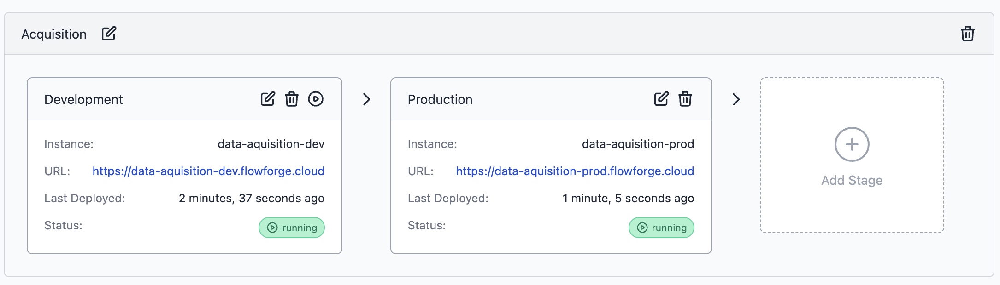
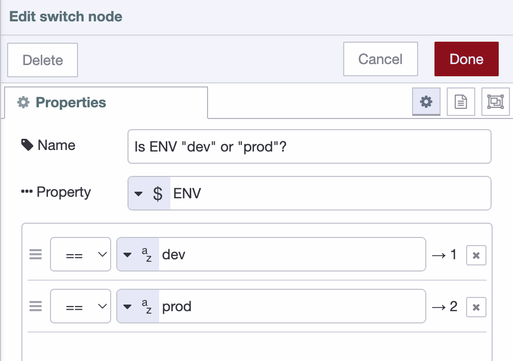

When FlowForge introduced the pipelines feature, users were quick to notice it
might lead to your development instances sending messages using the
[Project nodes](https://flowforge.com/docs/user/projectnodes/#flowforge-project-nodes) to the production data stream. In this post we'll explain
how to seperate your development and production work neatly.

<!--more-->

The key concept to utilize are [environment variables](...). Using FlowForge you
can set different `values` for the same key in different environments in the
pipeline. Consider a situation where the we have a pipeline with just a development
and production environment.

For each of these instances we can set `ENV` as variable name to their environment
name. For the production instance we set the vars in the FlowForge interface to:

When setting the same name, `ENV`, to `dev` in the development instance, we can now
restart the Node-RED instances and use them in the flow.

### Using Environment Variables with the switch node

For this example we're going to send the data onwards t
The easiest way to send one message to different [project nodes](https://flowforge.com/docs/user/projectnodes/#flowforge-project-nodes). One with the `timestamp-dev`
topic, one with the `timestamp-prod`. The easiest approach is to use the `Switch`
node:

The downside of this approach is that it takes up a lot of mental 'space'. Visually
and mentally a developer is confronted with environment the flow is executed in,
while that's not usually what needs attention.

### Composite Flow variables

