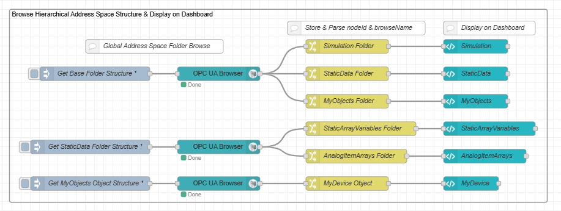
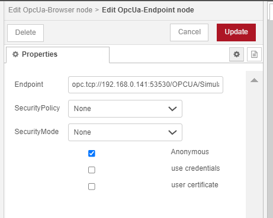
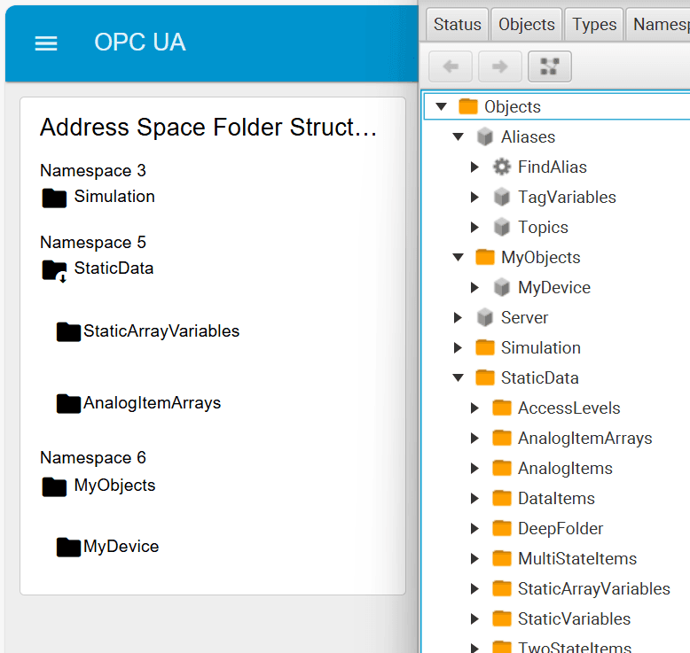
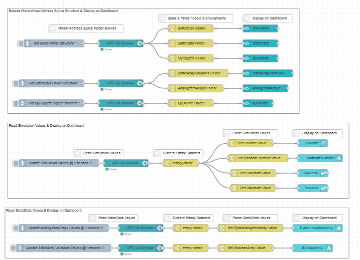
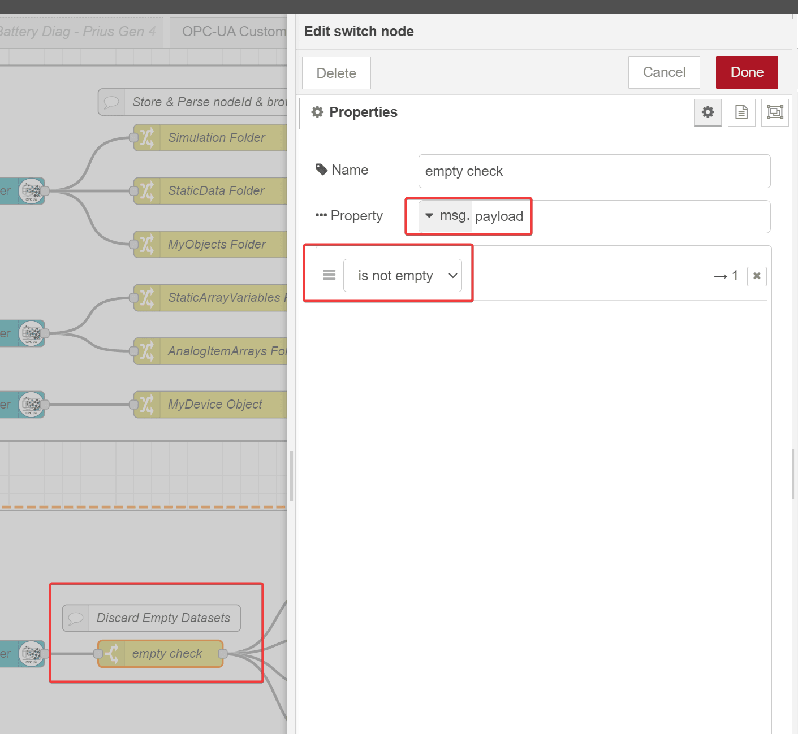
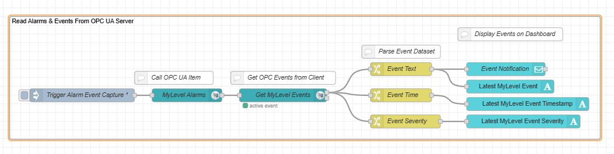
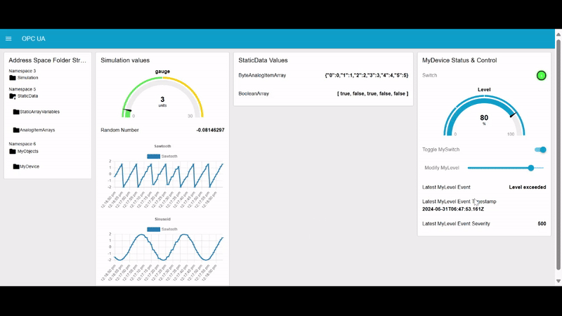

This article is the third and final part of our OPC UA content series. In the [first article](/blog/2023/07/how-to-deploy-a-basic-opc-ua-server-in-node-red/), we cover some OPC UA fundamentals and walk through an example OPC UA Server flow. In the [second article](/node-red/protocol/opc-ua/), we built a SSL-secured OPC UA server using data from an Allen Bradley PLC as a source. 
In this article, we show how to build an OPC Client in Node-RED that communicates with a 3rd party OPC UA Server and utilizes an interactive dashboard.
<!--more-->

This article will requires the [Prosys OPC UA Simulation Server](https://prosysopc.com/products/opc-ua-simulation-server/), an application designed for testing OPC UA client applications and learning the technology.  It’s a free cross-platform application that supports Windows, Linux, and MacOS.  This article will use the Windows version.  

Note: full source code for the OPC Client Dashboard is included at the end of the article.

## Custom Nodes Used & Assumptions

Several custom nodes are required in order to properly deploy this flow.  For more detailed information on how to install a custom node, follow the instructions from an [earlier article](/blog/2023/06/node-red-as-a-no-code-ethernet_ip-to-s7-protocol-converter/) where the process on installing custom nodes is explained in detail.

- [@flowfuse/node-red-dashboard](https://flows.nodered.org/node/@flowfuse/node-red-dashboard)
- [node-red-contrib-opcua](https://flows.nodered.org/node/node-red-contrib-opcua)
- [@flowfuse/node-red-dashboard-2-ui-led](https://flows.nodered.org/node/@flowfuse/node-red-dashboard-2-ui-led)

As this is not a production application, no security will be utilized, and it is assumed that the OPC UA Server is running on the same network as the Node-RED OPC Client.

Is it also assumed that the end user of this article has familiarization with dashboards.  There are many dashboard basic guides available on our FlowFuse website, For more infomation go to [Node-RED Dashboard 2.0 guides](/blog/dashboard/). 

## Install and Deploy the Prosys OPC UA Simulation Server

The Prosys OPC UA Simulation Server is [free to download](https://prosysopc.com/products/opc-ua-simulation-server/evaluate/), but requires a sign-up process.  Download and install the server, then run the application.  Once the application is started, the first thing you should do is go to `options -> switch to expert mode`.  

This will give us access to the address space tab, which we will need to develop our client application in Node-RED.

{data-zoomable}

When the application is run, an endpoint url will be displayed on the `status` tab, along with an indication that the server is currently running.

{data-zoomable}
 Copy the connection endpoint, but be warned that you will likely need to replace the computer name (in my case `DESKTOP-0K0483A`, with the actual IP address of the machine running the server.  The IP address of the machine on my local network is `192.168.0.141`, which changes my UA TCP endpoint address to `opc.tcp://192.168.0.141:53530/OPCUA/SimulationServer`. 

Now the simulation server is set up and we are ready to start developing the OPC Client application.

## Objectives of the Node-RED OPC Client Dashboard Application

The goal is not to develop a production-level application, rather, it’s to show a variety of features that one can utilize to demonstrate common OPC UA Client application capabilities in Node-RED, while also demonstrating a variety of methods to visualize the results in a dashboard.  There are 4 main objectives of the Node-RED OPC Client Dashboard application. They are:

1. Browse hierarchical server address space structure & display on a dashboard
2. Read OPC UA values from various namespaces, showing a variety of datatypes and different ways they can be visualized
3. Write OPC UA values back to the OPC UA server directly from the OPC UA Client dashboard
4. Read alarms & events from the OPC UA Server and display them on the dashboard

Rather than building the flow step-by-step, the flow source code will be presented for each objective, and a the flow will be explained so that it is understood what is happening in each section of code.

## Browse Hierarchical Server Address Space Structure With OPC UA Browser Node

The first flow will browse the hierarchical OPC UA Server address space structure and display it on the dashboard.

{data-zoomable}

You can import this flow into Node-RED using the code below:


[{"id":"ca62be3e01388319","type":"group","z":"5b972161c4e0464e","name":"Browse Hierarchical Address Space Structure & Display on Dashboard","style":{"label":true,"color":"#000000"},"nodes":["6b17b2da2b942bb4","61797eccf2785257","4d92d940177b6ee3","68a113d5893b7c01","d0c969b6a59fac3a","639da01fc957e547","29437ca7222d9a64","49983d5da0958bf2","49040d0cf1144f0a","e7c55f412ef86543","de21b7ad98a05833","2d56e9a431c21a3b","ac95bd0e2b304eec","6fdabcc2950ccf4e","1c49fa5142d2cf17","335878527020598c","7b208f2e8cba6205","52dd2e5dcddad58f","a5acdccfd2033aec","157322c9c360446d","78a012e5db377fd9"],"x":94,"y":139,"w":1172,"h":422},{"id":"6b17b2da2b942bb4","type":"OpcUa-Browser","z":"5b972161c4e0464e","g":"ca62be3e01388319","endpoint":"53f4394dbf12c6b7","item":"","datatype":"","topic":"","items":[],"name":"OPC Client Namespace Browse","x":550,"y":280,"wires":[["4d92d940177b6ee3","d0c969b6a59fac3a","639da01fc957e547"]]},{"id":"61797eccf2785257","type":"inject","z":"5b972161c4e0464e","g":"ca62be3e01388319","name":"Get Base Folder Structure","props":[{"p":"payload"},{"p":"topic","vt":"str"}],"repeat":"","crontab":"","once":true,"onceDelay":"0.3","topic":"","payload":"","payloadType":"date","x":280,"y":280,"wires":[["6b17b2da2b942bb4"]]},{"id":"4d92d940177b6ee3","type":"change","z":"5b972161c4e0464e","g":"ca62be3e01388319","name":"Simulation Folder","rules":[{"t":"set","p":"Objects.Simulation.nodeId","pt":"flow","to":"payload[2].item.nodeId","tot":"msg"},{"t":"set","p":"payload","pt":"msg","to":"payload[2].item.browseName.name","tot":"msg"}],"action":"","property":"","from":"","to":"","reg":false,"x":830,"y":220,"wires":[["335878527020598c"]]},{"id":"68a113d5893b7c01","type":"comment","z":"5b972161c4e0464e","g":"ca62be3e01388319","name":"Display on Dashboard","info":"","x":1140,"y":180,"wires":[]},{"id":"d0c969b6a59fac3a","type":"change","z":"5b972161c4e0464e","g":"ca62be3e01388319","name":"MyObjects Folder","rules":[{"t":"set","p":"Objects.MyObjects.nodeId","pt":"flow","to":"payload[4].item.nodeId","tot":"msg"},{"t":"set","p":"payload","pt":"msg","to":"payload[4].item.browseName.name","tot":"msg"}],"action":"","property":"","from":"","to":"","reg":false,"x":830,"y":340,"wires":[["52dd2e5dcddad58f"]]},{"id":"639da01fc957e547","type":"change","z":"5b972161c4e0464e","g":"ca62be3e01388319","name":"StaticData Folder","rules":[{"t":"set","p":"Objects.StaticData.nodeId","pt":"flow","to":"payload[3].item.nodeId","tot":"msg"},{"t":"set","p":"payload","pt":"msg","to":"payload[3].item.browseName.name","tot":"msg"}],"action":"","property":"","from":"","to":"","reg":false,"x":830,"y":280,"wires":[["7b208f2e8cba6205"]]},{"id":"29437ca7222d9a64","type":"OpcUa-Browser","z":"5b972161c4e0464e","g":"ca62be3e01388319","endpoint":"53f4394dbf12c6b7","item":"","datatype":"","topic":"","items":[],"name":"OPC Client Namespace Browse","x":550,"y":440,"wires":[["49040d0cf1144f0a","e7c55f412ef86543"]]},{"id":"49983d5da0958bf2","type":"inject","z":"5b972161c4e0464e","g":"ca62be3e01388319","name":"Get StaticData Folder Structure","props":[{"p":"payload"},{"p":"topic","v":"Objects.StaticData.nodeId","vt":"flow"}],"repeat":"","crontab":"","once":true,"onceDelay":"0.3","topic":"","payload":"","payloadType":"date","x":270,"y":440,"wires":[["29437ca7222d9a64"]]},{"id":"49040d0cf1144f0a","type":"change","z":"5b972161c4e0464e","g":"ca62be3e01388319","name":"AnalogItemArrays Folder","rules":[{"t":"set","p":"Objects.StaticData.AnalogItemArrays.nodeId","pt":"flow","to":"payload[1].item.nodeId","tot":"msg"},{"t":"set","p":"payload","pt":"msg","to":"payload[1].item.browseName.name","tot":"msg"}],"action":"","property":"","from":"","to":"","reg":false,"x":850,"y":460,"wires":[["157322c9c360446d"]]},{"id":"e7c55f412ef86543","type":"change","z":"5b972161c4e0464e","g":"ca62be3e01388319","name":"StaticArrayVariables Folder","rules":[{"t":"set","p":"Objects.StaticData.StaticArrayVariables.nodeId","pt":"flow","to":"payload[6].item.nodeId","tot":"msg"},{"t":"set","p":"payload","pt":"msg","to":"payload[6].item.browseName.name","tot":"msg"}],"action":"","property":"","from":"","to":"","reg":false,"x":860,"y":400,"wires":[["a5acdccfd2033aec"]]},{"id":"de21b7ad98a05833","type":"change","z":"5b972161c4e0464e","g":"ca62be3e01388319","name":"MyDevice Object","rules":[{"t":"set","p":"Objects.MyObjects.MyDevice.nodeId","pt":"flow","to":"payload[0].item.nodeId","tot":"msg"},{"t":"set","p":"payload","pt":"msg","to":"payload[0].item.browseName.name","tot":"msg"}],"action":"","property":"","from":"","to":"","reg":false,"x":830,"y":520,"wires":[["78a012e5db377fd9"]]},{"id":"2d56e9a431c21a3b","type":"inject","z":"5b972161c4e0464e","g":"ca62be3e01388319","name":"Get MyObjects Object Structure","props":[{"p":"payload"},{"p":"topic","v":"Objects.MyObjects.nodeId","vt":"flow"}],"repeat":"","crontab":"","once":true,"onceDelay":"0.5","topic":"","payload":"","payloadType":"date","x":270,"y":520,"wires":[["ac95bd0e2b304eec"]]},{"id":"ac95bd0e2b304eec","type":"OpcUa-Browser","z":"5b972161c4e0464e","g":"ca62be3e01388319","endpoint":"53f4394dbf12c6b7","item":"","datatype":"","topic":"","items":[],"name":"OPC Client Namespace Browse","x":550,"y":520,"wires":[["de21b7ad98a05833"]]},{"id":"6fdabcc2950ccf4e","type":"comment","z":"5b972161c4e0464e","g":"ca62be3e01388319","name":"Store & Parse nodeId & browseName","info":"","x":850,"y":180,"wires":[]},{"id":"1c49fa5142d2cf17","type":"comment","z":"5b972161c4e0464e","g":"ca62be3e01388319","name":"Global Address Space Folder Browse","info":"","x":410,"y":220,"wires":[]},{"id":"335878527020598c","type":"ui-template","z":"5b972161c4e0464e","g":"ca62be3e01388319","group":"ef9998baf5f61e8a","page":"","ui":"","name":"Simulation","order":1,"width":0,"height":0,"head":"","format":"<template>\n    
\n        
Namespace 3
\n        <v-icon color=\"black\" icon=\"mdi-folder\" size=\"large\"></v-icon> {{ msg.payload }}\n    
\n</template>","storeOutMessages":true,"passthru":true,"resendOnRefresh":true,"templateScope":"local","className":"","x":1110,"y":220,"wires":[[]]},{"id":"7b208f2e8cba6205","type":"ui-template","z":"5b972161c4e0464e","g":"ca62be3e01388319","group":"ef9998baf5f61e8a","page":"","ui":"","name":"StaticData","order":2,"width":0,"height":0,"head":"","format":"<template>\n    
\n        
Namespace 5
\n        <v-icon color=\"black\" icon=\"mdi-folder-arrow-down\" size=\"large\"></v-icon> {{ msg.payload }}\n    
\n</template>","storeOutMessages":true,"passthru":true,"resendOnRefresh":true,"templateScope":"local","className":"","x":1110,"y":280,"wires":[[]]},{"id":"52dd2e5dcddad58f","type":"ui-template","z":"5b972161c4e0464e","g":"ca62be3e01388319","group":"ef9998baf5f61e8a","page":"","ui":"","name":"MyObjects","order":5,"width":0,"height":0,"head":"","format":"<template>\n    
Namespace 6
\n    
\n        <v-icon color=\"black\" icon=\"mdi-folder\" size=\"large\"></v-icon> {{ msg.payload }}\n    
\n</template>","storeOutMessages":true,"passthru":true,"resendOnRefresh":true,"templateScope":"local","className":"","x":1110,"y":340,"wires":[[]]},{"id":"a5acdccfd2033aec","type":"ui-template","z":"5b972161c4e0464e","g":"ca62be3e01388319","group":"ef9998baf5f61e8a","page":"","ui":"","name":"StaticArrayVariables","order":3,"width":0,"height":0,"head":"","format":"<template>\n    
\n        <v-icon color=\"black\" icon=\"mdi-folder\" size=\"large\"></v-icon> {{ msg.payload }}\n    
\n</template>","storeOutMessages":true,"passthru":true,"resendOnRefresh":true,"templateScope":"local","className":"","x":1140,"y":400,"wires":[[]]},{"id":"157322c9c360446d","type":"ui-template","z":"5b972161c4e0464e","g":"ca62be3e01388319","group":"ef9998baf5f61e8a","page":"","ui":"","name":"AnalogItemArrays","order":4,"width":0,"height":0,"head":"","format":"<template>\n    
\n        <v-icon color=\"black\" icon=\"mdi-folder\" size=\"large\"></v-icon> {{ msg.payload }}\n    
\n</template>","storeOutMessages":true,"passthru":true,"resendOnRefresh":true,"templateScope":"local","className":"","x":1130,"y":460,"wires":[[]]},{"id":"78a012e5db377fd9","type":"ui-template","z":"5b972161c4e0464e","g":"ca62be3e01388319","group":"ef9998baf5f61e8a","page":"","ui":"","name":"MyDevice","order":6,"width":0,"height":0,"head":"","format":"<template>\n    
\n        <v-icon color=\"black\" icon=\"mdi-folder\" size=\"large\"></v-icon> {{ msg.payload }}\n    
\n</template>","storeOutMessages":true,"passthru":true,"resendOnRefresh":true,"templateScope":"local","className":"","x":1100,"y":520,"wires":[[]]},{"id":"53f4394dbf12c6b7","type":"OpcUa-Endpoint","endpoint":"opc.tcp://192.168.56.1:53530/OPCUA/SimulationServer","secpol":"None","secmode":"None","none":true,"login":false,"usercert":false,"usercertificate":"","userprivatekey":""},{"id":"ef9998baf5f61e8a","type":"ui-group","name":" Address Space Folder Structure","page":"44d3feb2a1143d7b","width":"2","height":"1","order":1,"showTitle":true,"className":"","visible":"true","disabled":"false"},{"id":"44d3feb2a1143d7b","type":"ui-page","name":"OPC UA","ui":"5355e0c476f9da3b","path":"/opcua","icon":"home","layout":"grid","theme":"61eee6fc60281b9b","order":1,"className":"","visible":"true","disabled":"false"},{"id":"5355e0c476f9da3b","type":"ui-base","name":"My Dashboard","path":"/dashboard","includeClientData":true,"acceptsClientConfig":["ui-notification","ui-control"],"showPathInSidebar":false,"navigationStyle":"default"},{"id":"61eee6fc60281b9b","type":"ui-theme","name":"Default Theme","colors":{"surface":"#0094ce","primary":"#0094ce","bgPage":"#eeeeee","groupBg":"#ffffff","groupOutline":"#cccccc"},"sizes":{"pagePadding":"12px","groupGap":"12px","groupBorderRadius":"4px","widgetGap":"12px"}}]


To understand what is going on in this flow, we must refer back to the OPC UA Simulation Server `Address Space` tab.  

When we browse the OPC Server base folder structure in Node-RED, we will be browsing everything included under the `Objects` tree.  

{data-zoomable}
In our flow, we get the base folder structure by using an OPC-UA Browser node, as shown, with an endpoint that points to our OPC UA Server endpoint url we grabbed earlier in this article.  It is also worth noting we leave the `Topic` blank.  By doing this, we will browse the entire folder structure by default.

{data-zoomable}
The configuration of the endpoint properties includes no security credentials, as shown below.

{data-zoomable}

Using the output of a debug node, we get from the OPC UA Browser yield a payload with an array of 5 objects.  

{data-zoomable}

Each object returned represents the 5 objects that are in our OPC UA Server Objects tree.  

{data-zoomable}

However, of those 5 objects, only 3 of them are folders that contain actual OPC values.  `MyObjects`, `Simulation`, and `StaticData`.  We can ignore `Aliases` and `Server`.  

{data-zoomable}

So looking deeper into the payload of our global browse from the `OPC UA Browser node`, we can drill down into the details and see how they correlate with the folders in the server.

{data-zoomable}

As shown above, element 2 in the array returned from the global browse corresponds to the `Simulation` folder.  And we are interested in two important values in this data-structure - the `NodeId`, which is topic an OPC Client uses to point specific OPC values, and the `browseName`, which is the name we see visually when we try to identify an OPC topic.  We can now use this logic to parse out this useful information using a change node.

{data-zoomable}
This change node is grabbing the `nodeId` and `browseName` .  The `nodeId` is stored in a context variable for later use, while the `browseName` is used as the payload to be displayed on our dashboard.  

The rest of the flow follows this same pattern, to end up with a folder structure that we can display on our dashboard that matches the structure on our OPC Server

- note - to make the flow more manageable, not all browsable folders were included in the dashboard, as this flow is just meant to serve as an example, rather than be a 1:1 copy of everything in the server.  

If you deploy the flow and pull up the dashboard, it results in the following output - 

{data-zoomable}
Showing side-by-side with the server, you can see that we successfully browsed a portion of the address space and displayed the values on the dashboard.  Admittedly, a lot of work for not much pay-off, but it’s a worthwhile exercise in understanding how to browse topics using the `OPC UA Browser` node.  The browser node is best used for reading OPC UA values, which will be covered next.

## Read OPC UA Values Using OPC UA Browser Node

The next set of flows read OPC UA values from the server and displays them on the dashboard.  

{data-zoomable}
You can import these flows into Node-RED using the code below:


[{"id":"ca62be3e01388319","type":"group","z":"5b972161c4e0464e","name":"Browse Hierarchical Address Space Structure & Display on Dashboard","style":{"label":true,"color":"#000000"},"nodes":["6b17b2da2b942bb4","61797eccf2785257","4d92d940177b6ee3","68a113d5893b7c01","d0c969b6a59fac3a","639da01fc957e547","29437ca7222d9a64","49983d5da0958bf2","49040d0cf1144f0a","e7c55f412ef86543","de21b7ad98a05833","2d56e9a431c21a3b","ac95bd0e2b304eec","6fdabcc2950ccf4e","1c49fa5142d2cf17","335878527020598c","7b208f2e8cba6205","52dd2e5dcddad58f","a5acdccfd2033aec","157322c9c360446d","78a012e5db377fd9"],"x":94,"y":139,"w":1172,"h":422},{"id":"6b17b2da2b942bb4","type":"OpcUa-Browser","z":"5b972161c4e0464e","g":"ca62be3e01388319","endpoint":"53f4394dbf12c6b7","item":"","datatype":"","topic":"","items":[],"name":"OPC Client Namespace Browse","x":550,"y":280,"wires":[["4d92d940177b6ee3","d0c969b6a59fac3a","639da01fc957e547"]]},{"id":"61797eccf2785257","type":"inject","z":"5b972161c4e0464e","g":"ca62be3e01388319","name":"Get Base Folder Structure","props":[{"p":"payload"},{"p":"topic","vt":"str"}],"repeat":"","crontab":"","once":true,"onceDelay":"0.3","topic":"","payload":"","payloadType":"date","x":280,"y":280,"wires":[["6b17b2da2b942bb4"]]},{"id":"4d92d940177b6ee3","type":"change","z":"5b972161c4e0464e","g":"ca62be3e01388319","name":"Simulation Folder","rules":[{"t":"set","p":"Objects.Simulation.nodeId","pt":"flow","to":"payload[2].item.nodeId","tot":"msg"},{"t":"set","p":"payload","pt":"msg","to":"payload[2].item.browseName.name","tot":"msg"}],"action":"","property":"","from":"","to":"","reg":false,"x":830,"y":220,"wires":[["335878527020598c"]]},{"id":"68a113d5893b7c01","type":"comment","z":"5b972161c4e0464e","g":"ca62be3e01388319","name":"Display on Dashboard","info":"","x":1140,"y":180,"wires":[]},{"id":"d0c969b6a59fac3a","type":"change","z":"5b972161c4e0464e","g":"ca62be3e01388319","name":"MyObjects Folder","rules":[{"t":"set","p":"Objects.MyObjects.nodeId","pt":"flow","to":"payload[4].item.nodeId","tot":"msg"},{"t":"set","p":"payload","pt":"msg","to":"payload[4].item.browseName.name","tot":"msg"}],"action":"","property":"","from":"","to":"","reg":false,"x":830,"y":340,"wires":[["52dd2e5dcddad58f"]]},{"id":"639da01fc957e547","type":"change","z":"5b972161c4e0464e","g":"ca62be3e01388319","name":"StaticData Folder","rules":[{"t":"set","p":"Objects.StaticData.nodeId","pt":"flow","to":"payload[3].item.nodeId","tot":"msg"},{"t":"set","p":"payload","pt":"msg","to":"payload[3].item.browseName.name","tot":"msg"}],"action":"","property":"","from":"","to":"","reg":false,"x":830,"y":280,"wires":[["7b208f2e8cba6205"]]},{"id":"29437ca7222d9a64","type":"OpcUa-Browser","z":"5b972161c4e0464e","g":"ca62be3e01388319","endpoint":"53f4394dbf12c6b7","item":"","datatype":"","topic":"","items":[],"name":"OPC Client Namespace Browse","x":550,"y":440,"wires":[["49040d0cf1144f0a","e7c55f412ef86543"]]},{"id":"49983d5da0958bf2","type":"inject","z":"5b972161c4e0464e","g":"ca62be3e01388319","name":"Get StaticData Folder Structure","props":[{"p":"payload"},{"p":"topic","v":"Objects.StaticData.nodeId","vt":"flow"}],"repeat":"","crontab":"","once":true,"onceDelay":"0.3","topic":"","payload":"","payloadType":"date","x":270,"y":440,"wires":[["29437ca7222d9a64"]]},{"id":"49040d0cf1144f0a","type":"change","z":"5b972161c4e0464e","g":"ca62be3e01388319","name":"AnalogItemArrays Folder","rules":[{"t":"set","p":"Objects.StaticData.AnalogItemArrays.nodeId","pt":"flow","to":"payload[1].item.nodeId","tot":"msg"},{"t":"set","p":"payload","pt":"msg","to":"payload[1].item.browseName.name","tot":"msg"}],"action":"","property":"","from":"","to":"","reg":false,"x":850,"y":460,"wires":[["157322c9c360446d"]]},{"id":"e7c55f412ef86543","type":"change","z":"5b972161c4e0464e","g":"ca62be3e01388319","name":"StaticArrayVariables Folder","rules":[{"t":"set","p":"Objects.StaticData.StaticArrayVariables.nodeId","pt":"flow","to":"payload[6].item.nodeId","tot":"msg"},{"t":"set","p":"payload","pt":"msg","to":"payload[6].item.browseName.name","tot":"msg"}],"action":"","property":"","from":"","to":"","reg":false,"x":860,"y":400,"wires":[["a5acdccfd2033aec"]]},{"id":"de21b7ad98a05833","type":"change","z":"5b972161c4e0464e","g":"ca62be3e01388319","name":"MyDevice Object","rules":[{"t":"set","p":"Objects.MyObjects.MyDevice.nodeId","pt":"flow","to":"payload[0].item.nodeId","tot":"msg"},{"t":"set","p":"payload","pt":"msg","to":"payload[0].item.browseName.name","tot":"msg"}],"action":"","property":"","from":"","to":"","reg":false,"x":830,"y":520,"wires":[["78a012e5db377fd9"]]},{"id":"2d56e9a431c21a3b","type":"inject","z":"5b972161c4e0464e","g":"ca62be3e01388319","name":"Get MyObjects Object Structure","props":[{"p":"payload"},{"p":"topic","v":"Objects.MyObjects.nodeId","vt":"flow"}],"repeat":"","crontab":"","once":true,"onceDelay":"0.5","topic":"","payload":"","payloadType":"date","x":270,"y":520,"wires":[["ac95bd0e2b304eec"]]},{"id":"ac95bd0e2b304eec","type":"OpcUa-Browser","z":"5b972161c4e0464e","g":"ca62be3e01388319","endpoint":"53f4394dbf12c6b7","item":"","datatype":"","topic":"","items":[],"name":"OPC Client Namespace Browse","x":550,"y":520,"wires":[["de21b7ad98a05833"]]},{"id":"6fdabcc2950ccf4e","type":"comment","z":"5b972161c4e0464e","g":"ca62be3e01388319","name":"Store & Parse nodeId & browseName","info":"","x":850,"y":180,"wires":[]},{"id":"1c49fa5142d2cf17","type":"comment","z":"5b972161c4e0464e","g":"ca62be3e01388319","name":"Global Address Space Folder Browse","info":"","x":410,"y":220,"wires":[]},{"id":"335878527020598c","type":"ui-template","z":"5b972161c4e0464e","g":"ca62be3e01388319","group":"ef9998baf5f61e8a","page":"","ui":"","name":"Simulation","order":1,"width":0,"height":0,"head":"","format":"<template>\n    
\n        
Namespace 3
\n        <v-icon color=\"black\" icon=\"mdi-folder\" size=\"large\"></v-icon> {{ msg.payload }}\n    
\n</template>","storeOutMessages":true,"passthru":true,"resendOnRefresh":true,"templateScope":"local","className":"","x":1110,"y":220,"wires":[[]]},{"id":"7b208f2e8cba6205","type":"ui-template","z":"5b972161c4e0464e","g":"ca62be3e01388319","group":"ef9998baf5f61e8a","page":"","ui":"","name":"StaticData","order":2,"width":0,"height":0,"head":"","format":"<template>\n    
\n        
Namespace 5
\n        <v-icon color=\"black\" icon=\"mdi-folder-arrow-down\" size=\"large\"></v-icon> {{ msg.payload }}\n    
\n</template>","storeOutMessages":true,"passthru":true,"resendOnRefresh":true,"templateScope":"local","className":"","x":1110,"y":280,"wires":[[]]},{"id":"52dd2e5dcddad58f","type":"ui-template","z":"5b972161c4e0464e","g":"ca62be3e01388319","group":"ef9998baf5f61e8a","page":"","ui":"","name":"MyObjects","order":5,"width":0,"height":0,"head":"","format":"<template>\n    
Namespace 6
\n    
\n        <v-icon color=\"black\" icon=\"mdi-folder\" size=\"large\"></v-icon> {{ msg.payload }}\n    
\n</template>","storeOutMessages":true,"passthru":true,"resendOnRefresh":true,"templateScope":"local","className":"","x":1110,"y":340,"wires":[[]]},{"id":"a5acdccfd2033aec","type":"ui-template","z":"5b972161c4e0464e","g":"ca62be3e01388319","group":"ef9998baf5f61e8a","page":"","ui":"","name":"StaticArrayVariables","order":3,"width":0,"height":0,"head":"","format":"<template>\n    
\n        <v-icon color=\"black\" icon=\"mdi-folder\" size=\"large\"></v-icon> {{ msg.payload }}\n    
\n</template>","storeOutMessages":true,"passthru":true,"resendOnRefresh":true,"templateScope":"local","className":"","x":1140,"y":400,"wires":[[]]},{"id":"157322c9c360446d","type":"ui-template","z":"5b972161c4e0464e","g":"ca62be3e01388319","group":"ef9998baf5f61e8a","page":"","ui":"","name":"AnalogItemArrays","order":4,"width":0,"height":0,"head":"","format":"<template>\n    
\n        <v-icon color=\"black\" icon=\"mdi-folder\" size=\"large\"></v-icon> {{ msg.payload }}\n    
\n</template>","storeOutMessages":true,"passthru":true,"resendOnRefresh":true,"templateScope":"local","className":"","x":1130,"y":460,"wires":[[]]},{"id":"78a012e5db377fd9","type":"ui-template","z":"5b972161c4e0464e","g":"ca62be3e01388319","group":"ef9998baf5f61e8a","page":"","ui":"","name":"MyDevice","order":6,"width":0,"height":0,"head":"","format":"<template>\n    
\n        <v-icon color=\"black\" icon=\"mdi-folder\" size=\"large\"></v-icon> {{ msg.payload }}\n    
\n</template>","storeOutMessages":true,"passthru":true,"resendOnRefresh":true,"templateScope":"local","className":"","x":1100,"y":520,"wires":[[]]},{"id":"53f4394dbf12c6b7","type":"OpcUa-Endpoint","endpoint":"opc.tcp://192.168.56.1:53530/OPCUA/SimulationServer","secpol":"None","secmode":"None","none":true,"login":false,"usercert":false,"usercertificate":"","userprivatekey":""},{"id":"ef9998baf5f61e8a","type":"ui-group","name":" Address Space Folder Structure","page":"44d3feb2a1143d7b","width":"2","height":"1","order":1,"showTitle":true,"className":"","visible":"true","disabled":"false"},{"id":"44d3feb2a1143d7b","type":"ui-page","name":"OPC UA","ui":"5355e0c476f9da3b","path":"/opcua","icon":"home","layout":"grid","theme":"61eee6fc60281b9b","order":1,"className":"","visible":"true","disabled":"false"},{"id":"5355e0c476f9da3b","type":"ui-base","name":"My Dashboard","path":"/dashboard","includeClientData":true,"acceptsClientConfig":["ui-notification","ui-control"],"showPathInSidebar":false,"navigationStyle":"default"},{"id":"61eee6fc60281b9b","type":"ui-theme","name":"Default Theme","colors":{"surface":"#0094ce","primary":"#0094ce","bgPage":"#eeeeee","groupBg":"#ffffff","groupOutline":"#cccccc"},"sizes":{"pagePadding":"12px","groupGap":"12px","groupBorderRadius":"4px","widgetGap":"12px"}},{"id":"8557072f05e4bda0","type":"group","z":"5b972161c4e0464e","name":"Read Simulation Values & Display on Dashboard","style":{"label":true,"color":"#000000"},"nodes":["9659d40ac9063764","9f5b597ec8179fb4","a8d919f497fcff04","13f5c98b7fd5f5da","ec5dca5eb9d4971b","1780cb86597d3c67","1a2fcac87247cda4","4d9b758e39555124","da468bc150517fa6","82aa12173dd7bbca","57d8777e34b55b7b","10877909d1daf6fe","c4d4a3b0df372e4c","b0cf511f824f2a86","f2efc6b419414c9a"],"x":94,"y":599,"w":1372,"h":302},{"id":"9659d40ac9063764","type":"OpcUa-Browser","z":"5b972161c4e0464e","g":"8557072f05e4bda0","endpoint":"53f4394dbf12c6b7","item":"","datatype":"","topic":"","items":[],"name":"OPC Client Namespace Browse","x":570,"y":760,"wires":[["ec5dca5eb9d4971b"]]},{"id":"9f5b597ec8179fb4","type":"inject","z":"5b972161c4e0464e","g":"8557072f05e4bda0","name":"Update Simulation Values @ 1 second","props":[{"p":"payload"},{"p":"topic","v":"Objects.Simulation.nodeId","vt":"flow"}],"repeat":"1","crontab":"","once":true,"onceDelay":0.1,"topic":"","payload":"","payloadType":"date","x":300,"y":760,"wires":[["9659d40ac9063764"]]},{"id":"a8d919f497fcff04","type":"comment","z":"5b972161c4e0464e","g":"8557072f05e4bda0","name":"Read Simulation Values","info":"","x":460,"y":720,"wires":[]},{"id":"13f5c98b7fd5f5da","type":"change","z":"5b972161c4e0464e","g":"8557072f05e4bda0","name":"Get Counter Value","rules":[{"t":"set","p":"payload","pt":"msg","to":"payload[1].item.value","tot":"msg"}],"action":"","property":"","from":"","to":"","reg":false,"x":1070,"y":680,"wires":[["10877909d1daf6fe"]]},{"id":"ec5dca5eb9d4971b","type":"switch","z":"5b972161c4e0464e","g":"8557072f05e4bda0","name":"empty check","property":"payload","propertyType":"msg","rules":[{"t":"nempty"}],"checkall":"true","repair":false,"outputs":1,"x":790,"y":760,"wires":[["13f5c98b7fd5f5da","1780cb86597d3c67","1a2fcac87247cda4","4d9b758e39555124"]]},{"id":"1780cb86597d3c67","type":"change","z":"5b972161c4e0464e","g":"8557072f05e4bda0","name":"Get Random Number Value","rules":[{"t":"set","p":"payload","pt":"msg","to":"payload[2].item.value","tot":"msg"}],"action":"","property":"","from":"","to":"","reg":false,"x":1100,"y":740,"wires":[["c4d4a3b0df372e4c"]]},{"id":"1a2fcac87247cda4","type":"change","z":"5b972161c4e0464e","g":"8557072f05e4bda0","name":"Get Sawtooth Value","rules":[{"t":"set","p":"payload","pt":"msg","to":"payload[3].item.value","tot":"msg"}],"action":"","property":"","from":"","to":"","reg":false,"x":1080,"y":800,"wires":[["b0cf511f824f2a86"]]},{"id":"4d9b758e39555124","type":"change","z":"5b972161c4e0464e","g":"8557072f05e4bda0","name":"Get Sawtooth Value","rules":[{"t":"set","p":"payload","pt":"msg","to":"payload[4].item.value","tot":"msg"}],"action":"","property":"","from":"","to":"","reg":false,"x":1080,"y":860,"wires":[["f2efc6b419414c9a"]]},{"id":"da468bc150517fa6","type":"comment","z":"5b972161c4e0464e","g":"8557072f05e4bda0","name":"Discard Empty Datasets","info":"","x":780,"y":720,"wires":[]},{"id":"82aa12173dd7bbca","type":"comment","z":"5b972161c4e0464e","g":"8557072f05e4bda0","name":"Parse Simulation Values","info":"","x":1070,"y":640,"wires":[]},{"id":"57d8777e34b55b7b","type":"comment","z":"5b972161c4e0464e","g":"8557072f05e4bda0","name":"Display on Dashboard","info":"","x":1340,"y":640,"wires":[]},{"id":"10877909d1daf6fe","type":"ui-gauge","z":"5b972161c4e0464e","g":"8557072f05e4bda0","name":"Counter","group":"af263064820fb7d0","order":0,"width":3,"height":3,"gtype":"gauge-half","gstyle":"needle","title":"gauge","units":"units","icon":"","prefix":"","suffix":"","segments":[{"from":"0","color":"#5cd65c"},{"from":"15","color":"#ffc800"},{"from":"30","color":"#ea5353"}],"min":0,"max":"30","sizeThickness":16,"sizeGap":4,"sizeKeyThickness":8,"styleRounded":true,"styleGlow":false,"className":"","x":1320,"y":680,"wires":[]},{"id":"c4d4a3b0df372e4c","type":"ui-text","z":"5b972161c4e0464e","g":"8557072f05e4bda0","group":"af263064820fb7d0","order":0,"width":0,"height":0,"name":"Random Number","label":"Random Number","format":"{{msg.payload}}","layout":"row-spread","style":false,"font":"","fontSize":16,"color":"#717171","className":"","x":1350,"y":740,"wires":[]},{"id":"b0cf511f824f2a86","type":"ui-chart","z":"5b972161c4e0464e","g":"8557072f05e4bda0","group":"af263064820fb7d0","name":"","label":"Sawtooth","order":9007199254740991,"chartType":"line","category":"Sawtooth","categoryType":"str","xAxisProperty":"","xAxisPropertyType":"msg","xAxisType":"time","yAxisProperty":"","ymin":"","ymax":"","action":"append","pointShape":"line","pointRadius":4,"showLegend":true,"removeOlder":1,"removeOlderUnit":"60","removeOlderPoints":"","colors":["#1f77b4","#aec7e8","#ff7f0e","#2ca02c","#98df8a","#d62728","#ff9896","#9467bd","#c5b0d5"],"width":"3","height":"4","className":"","x":1320,"y":800,"wires":[[]]},{"id":"f2efc6b419414c9a","type":"ui-chart","z":"5b972161c4e0464e","g":"8557072f05e4bda0","group":"af263064820fb7d0","name":"","label":"Sinusoid","order":9007199254740991,"chartType":"line","category":"Sawtooth","categoryType":"str","xAxisProperty":"","xAxisPropertyType":"msg","xAxisType":"time","yAxisProperty":"","ymin":"","ymax":"","action":"append","pointShape":"line","pointRadius":4,"showLegend":true,"removeOlder":1,"removeOlderUnit":"60","removeOlderPoints":"","colors":["#1f77b4","#aec7e8","#ff7f0e","#2ca02c","#98df8a","#d62728","#ff9896","#9467bd","#c5b0d5"],"width":"3","height":"4","className":"","x":1320,"y":860,"wires":[[]]},{"id":"af263064820fb7d0","type":"ui-group","name":"Simulation values","page":"44d3feb2a1143d7b","width":"3","height":"1","order":2,"showTitle":true,"className":"","visible":"true","disabled":"false"},{"id":"5afdbddf71507886","type":"group","z":"5b972161c4e0464e","name":"Read StaticData Values & Display on Dashboard","style":{"label":true,"color":"#000000"},"nodes":["e998aa804042128b","6c9b7d4d195a1e9a","cd097b744d0ec625","18d21607c87ab153","7b5143c4960f92a1","0625b0cf6f546a4a","9d899fbb4d1648b3","6e1edc31687dde54","051e1f282076fed2","de2a1c3e380f743b","c74606c48ccf5a40","053bda13f2a2eabe","277dcf430dc86996","d708e6264cec0070"],"x":84,"y":939,"w":1382,"h":202},{"id":"e998aa804042128b","type":"OpcUa-Browser","z":"5b972161c4e0464e","g":"5afdbddf71507886","endpoint":"53f4394dbf12c6b7","item":"","datatype":"","topic":"","items":[],"name":"OPC Client Namespace Browse","x":630,"y":1020,"wires":[["7b5143c4960f92a1"]]},{"id":"6c9b7d4d195a1e9a","type":"inject","z":"5b972161c4e0464e","g":"5afdbddf71507886","name":"Update AnalogItemArrays Values @ 1 second","props":[{"p":"payload"},{"p":"topic","v":"Objects.StaticData.AnalogItemArrays.nodeId","vt":"flow"}],"repeat":"1","crontab":"","once":true,"onceDelay":0.1,"topic":"","payload":"","payloadType":"date","x":320,"y":1020,"wires":[["e998aa804042128b"]]},{"id":"cd097b744d0ec625","type":"comment","z":"5b972161c4e0464e","g":"5afdbddf71507886","name":"Read StaticData Values","info":"","x":520,"y":980,"wires":[]},{"id":"18d21607c87ab153","type":"change","z":"5b972161c4e0464e","g":"5afdbddf71507886","name":"Get ByteAnalogItemArray Value","rules":[{"t":"set","p":"payload","pt":"msg","to":"$string(payload[0].item.value)\t","tot":"jsonata"}],"action":"","property":"","from":"","to":"","reg":false,"x":1070,"y":1020,"wires":[["277dcf430dc86996"]]},{"id":"7b5143c4960f92a1","type":"switch","z":"5b972161c4e0464e","g":"5afdbddf71507886","name":"empty check","property":"payload","propertyType":"msg","rules":[{"t":"nempty"}],"checkall":"true","repair":false,"outputs":1,"x":830,"y":1020,"wires":[["18d21607c87ab153"]]},{"id":"0625b0cf6f546a4a","type":"OpcUa-Browser","z":"5b972161c4e0464e","g":"5afdbddf71507886","endpoint":"53f4394dbf12c6b7","item":"","datatype":"","topic":"","items":[],"name":"OPC Client Namespace Browse","x":630,"y":1100,"wires":[["051e1f282076fed2"]]},{"id":"9d899fbb4d1648b3","type":"inject","z":"5b972161c4e0464e","g":"5afdbddf71507886","name":"Update StaticArrayVariables Values @1 second","props":[{"p":"payload"},{"p":"topic","v":"Objects.StaticData.StaticArrayVariables.nodeId","vt":"flow"}],"repeat":"1","crontab":"","once":true,"onceDelay":0.1,"topic":"","payload":"","payloadType":"date","x":320,"y":1100,"wires":[["0625b0cf6f546a4a"]]},{"id":"6e1edc31687dde54","type":"change","z":"5b972161c4e0464e","g":"5afdbddf71507886","name":"Get BooleanArray Value","rules":[{"t":"set","p":"payload","pt":"msg","to":"payload[0].item.value","tot":"msg"}],"action":"","property":"","from":"","to":"","reg":false,"x":1050,"y":1100,"wires":[["d708e6264cec0070"]]},{"id":"051e1f282076fed2","type":"switch","z":"5b972161c4e0464e","g":"5afdbddf71507886","name":"empty check","property":"payload","propertyType":"msg","rules":[{"t":"nempty"}],"checkall":"true","repair":false,"outputs":1,"x":830,"y":1100,"wires":[["6e1edc31687dde54"]]},{"id":"de2a1c3e380f743b","type":"comment","z":"5b972161c4e0464e","g":"5afdbddf71507886","name":"Discard Empty Datasets","info":"","x":820,"y":980,"wires":[]},{"id":"c74606c48ccf5a40","type":"comment","z":"5b972161c4e0464e","g":"5afdbddf71507886","name":"Parse StaticData Values","info":"","x":1070,"y":980,"wires":[]},{"id":"053bda13f2a2eabe","type":"comment","z":"5b972161c4e0464e","g":"5afdbddf71507886","name":"Display on Dashboard","info":"","x":1340,"y":980,"wires":[]},{"id":"277dcf430dc86996","type":"ui-text","z":"5b972161c4e0464e","g":"5afdbddf71507886","group":"3d4f386e812e8b5f","order":0,"width":0,"height":0,"name":"","label":"ByteAnalogItemArray","format":"{{msg.payload}}","layout":"row-spread","style":false,"font":"","fontSize":16,"color":"#717171","className":"","x":1340,"y":1020,"wires":[]},{"id":"d708e6264cec0070","type":"ui-text","z":"5b972161c4e0464e","g":"5afdbddf71507886","group":"3d4f386e812e8b5f","order":0,"width":0,"height":0,"name":"","label":"BooleanArray","format":"{{msg.payload}}","layout":"row-spread","style":false,"font":"","fontSize":16,"color":"#717171","className":"","x":1320,"y":1100,"wires":[]},{"id":"3d4f386e812e8b5f","type":"ui-group","name":"StaticData Values","page":"44d3feb2a1143d7b","width":"4","height":"1","order":3,"showTitle":true,"className":"","visible":"true","disabled":"false"}]


The values are derived from the `nodeId` values we stored in memory in our previous flow, via our `change` nodes in the previous flow.

{data-zoomable}
As stated earlier, you reference a OPC UA topic by its `nodeId`.  So we will use these node IDs to read actual values from our OPC nodes.

 In our first flow, we want to read the values in the `Simulation` folder at a 1 second interval.  So we use an `inject` node with a `msg.topic` that references the `nodeId` corresponding to the `Simulation` folder.

{data-zoomable}
That `msg.topic` tells the `OPC UA Browser` node what `nodeId` to browse.  If we look at the debug output of the browser `msg.payload`, we can see that it produces an array of 7 objects, and an empty set array.

{data-zoomable}
If we allow that empty array to be passed, that means all values will be reset to 0 on each read.  So to prevent that from happening, we use a `switch` node to filter out the empty set.

{data-zoomable}
Now only non-empty payloads will be passed, preventing the values being reset to 0 on each read.

Now we can actually read the values.  To do this, we use a `change` node again, referencing the non-empty payload and drilling down to the `value` that corresponds to the `name` of the node we want to read.  In this case, we’re getting the value of the node `Counter` located in the `Simulation` folder.  

{data-zoomable}
Going back to our OPC Server, we can see that exactly where that value is derived below - 

{data-zoomable}

Now we add a `gauge` dashboard node to visualize the counter on the dashboard.  In the OPC Server, it is shown that the counter increments in a range of 0-30 in 1 count increments.  

{data-zoomable}
Now that we’ve gone through the full process of reading an OPC UA value and displaying it on the dashboard, we can apply the same logic other values published by the OPC UA Server, which are repeated in the remaining parts of the flow.

The end result on the dashboard now looks like this - 

{data-zoomable}
## Write OPC UA Values To Server Using OpcUa-Item and Opc-Ua-Client Nodes

The next flow writes OPC UA values to the server using dashboard UI elements.  

{data-zoomable}
 You can import this flow into Node-RED using the code below:

 
[{"id":"3de6c861611c3afa","type":"group","z":"5b972161c4e0464e","name":"Write Mydevices values to OPC UA Server","style":{"label":true,"color":"#000000"},"nodes":["a66583d91b581cd8","3e8cb6e199012155","9fa33d1c9c621611","fb7f57b4da5883ae","9c5ff104eb9c8b10","77bcb828bec95336","afa83dbb46449d4a","fa08f0ed04296363","9f591797b56c565d"],"x":94,"y":1439,"w":792,"h":182},{"id":"a66583d91b581cd8","type":"OpcUa-Item","z":"5b972161c4e0464e","g":"3de6c861611c3afa","item":"ns=6;s=MySwitch","datatype":"Boolean","value":"","name":"Toggle MySwitch","x":470,"y":1520,"wires":[["3e8cb6e199012155"]]},{"id":"3e8cb6e199012155","type":"OpcUa-Client","z":"5b972161c4e0464e","g":"3de6c861611c3afa","endpoint":"53f4394dbf12c6b7","action":"write","deadbandtype":"a","deadbandvalue":1,"time":10,"timeUnit":"s","certificate":"n","localfile":"","localkeyfile":"","securitymode":"None","securitypolicy":"None","useTransport":false,"maxChunkCount":1,"maxMessageSize":8192,"receiveBufferSize":8192,"sendBufferSize":8192,"name":"Write MySwitch","x":720,"y":1520,"wires":[[],[]]},{"id":"9fa33d1c9c621611","type":"comment","z":"5b972161c4e0464e","g":"3de6c861611c3afa","name":"Dashboard Input","info":"","x":200,"y":1480,"wires":[]},{"id":"fb7f57b4da5883ae","type":"OpcUa-Item","z":"5b972161c4e0464e","g":"3de6c861611c3afa","item":"ns=6;s=MyLevel","datatype":"Double","value":"","name":"Modify MyLevel","x":460,"y":1580,"wires":[["9c5ff104eb9c8b10"]]},{"id":"9c5ff104eb9c8b10","type":"OpcUa-Client","z":"5b972161c4e0464e","g":"3de6c861611c3afa","endpoint":"53f4394dbf12c6b7","action":"write","deadbandtype":"a","deadbandvalue":1,"time":10,"timeUnit":"s","certificate":"n","localfile":"","localkeyfile":"","securitymode":"None","securitypolicy":"None","useTransport":false,"maxChunkCount":1,"maxMessageSize":8192,"receiveBufferSize":8192,"sendBufferSize":8192,"name":"Write MyLevel","x":720,"y":1580,"wires":[[],[]]},{"id":"77bcb828bec95336","type":"comment","z":"5b972161c4e0464e","g":"3de6c861611c3afa","name":"Call OPC UA Item","info":"","x":470,"y":1480,"wires":[]},{"id":"afa83dbb46449d4a","type":"comment","z":"5b972161c4e0464e","g":"3de6c861611c3afa","name":"Write OPC UA Item to Client","info":"","x":740,"y":1480,"wires":[]},{"id":"fa08f0ed04296363","type":"ui-switch","z":"5b972161c4e0464e","g":"3de6c861611c3afa","name":"","label":"Toggle MySwitch","group":"ec0ecb26fde8db3e","order":0,"width":0,"height":0,"passthru":false,"topic":"topic","topicType":"msg","style":"","className":"","onvalue":"true","onvalueType":"bool","onicon":"","oncolor":"","offvalue":"false","offvalueType":"bool","officon":"","offcolor":"","x":210,"y":1520,"wires":[["a66583d91b581cd8"]]},{"id":"9f591797b56c565d","type":"ui-slider","z":"5b972161c4e0464e","g":"3de6c861611c3afa","group":"ec0ecb26fde8db3e","name":"","label":"Modify MyLevel","tooltip":"","order":0,"width":0,"height":0,"passthru":false,"outs":"all","topic":"topic","topicType":"msg","thumbLabel":true,"min":"0","max":"100","step":1,"className":"","x":200,"y":1580,"wires":[["fb7f57b4da5883ae"]]},{"id":"53f4394dbf12c6b7","type":"OpcUa-Endpoint","endpoint":"opc.tcp://192.168.56.1:53530/OPCUA/SimulationServer","secpol":"None","secmode":"None","none":true,"login":false,"usercert":false,"usercertificate":"","userprivatekey":""},{"id":"ec0ecb26fde8db3e","type":"ui-group","name":"MyDevice Status & Control","page":"44d3feb2a1143d7b","width":"3","height":"1","order":4,"showTitle":true,"className":"","visible":"true","disabled":"false"},{"id":"44d3feb2a1143d7b","type":"ui-page","name":"OPC UA","ui":"5355e0c476f9da3b","path":"/opcua","icon":"home","layout":"grid","theme":"61eee6fc60281b9b","order":1,"className":"","visible":"true","disabled":"false"},{"id":"5355e0c476f9da3b","type":"ui-base","name":"My Dashboard","path":"/dashboard","includeClientData":true,"acceptsClientConfig":["ui-notification","ui-control"],"showPathInSidebar":false,"navigationStyle":"default"},{"id":"61eee6fc60281b9b","type":"ui-theme","name":"Default Theme","colors":{"surface":"#0094ce","primary":"#0094ce","bgPage":"#eeeeee","groupBg":"#ffffff","groupOutline":"#cccccc"},"sizes":{"pagePadding":"12px","groupGap":"12px","groupBorderRadius":"4px","widgetGap":"12px"}}]


We have two values to write, a boolean value corresponding to the node object `MySwitch`, and an integer value corresponding to the object `MyLevel`. Therefore, we will use a toggle switch to toggle the `MySwitch`, and a slider to modify `MyLevel`.  

There’s no need to modify the toggle switch properties, other than giving it a name.  The slider needs to have the range modified to match the range of the level, which is 0-100%.

{data-zoomable}
For the `OpcUa-Item` nodes, copy the `NodeId` corresponding to each device,

{data-zoomable}
and paste it into `OpcUa-Item` node.  You must also ensure the data-type matches with the value you’re writing to.

{data-zoomable}
The `Opc-Ua-Client` needs to have an endpoint and the action changed to `WRITE`.  

{data-zoomable}
The process is the same for `MySwitch` and `MyLevel`, the only difference being what `NodeId` is referenced in the  `OpcUa-Item` node.  

When deployed, you can confirm values are being written to from the client to the server from the dashboard.

{data-zoomable}

## Read Alarms & Events from OPC UA Server Using OpcUa-Event and Opc-Ua-Client Nodes

Our last flow we’ll show how to read OPC UA Alarms & Events. 

{data-zoomable}
You can import this flow into Node-RED using the code below:


[{"id":"a6e9abacd0bdf3b6","type":"group","z":"5b972161c4e0464e","name":"Read Alarms & Events From OPC UA Server","style":{"label":true,"color":"#000000"},"nodes":["90fb4ca64a642edf","b76f64786bc681c3","71e24b671bc03fb8","c7438df35b506470","c7e8919b636cb51d","5952b86dae22b056","04992b24a3836f19","325068cb935cd6d1","5b4d1bd8b342fc05","ba1ea89438335cb8","d662d662c5ccb9c1","1e3956200997581f","0b8ac86e5e4f9f8d","62b2e14ce0429eef"],"x":94,"y":1679,"w":1352,"h":282},{"id":"90fb4ca64a642edf","type":"comment","z":"5b972161c4e0464e","g":"a6e9abacd0bdf3b6","name":"Call OPC UA Item","info":"","x":470,"y":1820,"wires":[]},{"id":"b76f64786bc681c3","type":"OpcUa-Event","z":"5b972161c4e0464e","g":"a6e9abacd0bdf3b6","root":"ns=6;s=MyLevel.Alarm","activatecustomevent":false,"eventtype":"i=2041","customeventtype":"","name":"MyLevel Alarms","x":500,"y":1860,"wires":[["c7438df35b506470"]]},{"id":"71e24b671bc03fb8","type":"inject","z":"5b972161c4e0464e","g":"a6e9abacd0bdf3b6","name":"Trigger Alarm Event Capture","props":[{"p":"payload"},{"p":"topic","vt":"str"}],"repeat":"","crontab":"","once":true,"onceDelay":0.1,"topic":"","payload":"","payloadType":"date","x":260,"y":1860,"wires":[["b76f64786bc681c3"]]},{"id":"c7438df35b506470","type":"OpcUa-Client","z":"5b972161c4e0464e","g":"a6e9abacd0bdf3b6","endpoint":"53f4394dbf12c6b7","action":"events","deadbandtype":"a","deadbandvalue":1,"time":10,"timeUnit":"s","certificate":"n","localfile":"","localkeyfile":"","securitymode":"None","securitypolicy":"None","useTransport":false,"maxChunkCount":1,"maxMessageSize":8192,"receiveBufferSize":8192,"sendBufferSize":8192,"name":"Get MyLevel Events","x":720,"y":1860,"wires":[["c7e8919b636cb51d","5952b86dae22b056","04992b24a3836f19"],[]]},{"id":"c7e8919b636cb51d","type":"change","z":"5b972161c4e0464e","g":"a6e9abacd0bdf3b6","name":"Event Text","rules":[{"t":"set","p":"payload","pt":"msg","to":"payload.Message.text","tot":"msg"}],"action":"","property":"","from":"","to":"","reg":false,"x":990,"y":1800,"wires":[["d662d662c5ccb9c1","1e3956200997581f"]]},{"id":"5952b86dae22b056","type":"change","z":"5b972161c4e0464e","g":"a6e9abacd0bdf3b6","name":"Event Time","rules":[{"t":"set","p":"payload","pt":"msg","to":"payload.Time","tot":"msg"}],"action":"","property":"","from":"","to":"","reg":false,"x":990,"y":1860,"wires":[["0b8ac86e5e4f9f8d"]]},{"id":"04992b24a3836f19","type":"change","z":"5b972161c4e0464e","g":"a6e9abacd0bdf3b6","name":"Event Severity","rules":[{"t":"set","p":"payload","pt":"msg","to":"payload.Severity","tot":"msg"}],"action":"","property":"","from":"","to":"","reg":false,"x":1000,"y":1920,"wires":[["62b2e14ce0429eef"]]},{"id":"325068cb935cd6d1","type":"comment","z":"5b972161c4e0464e","g":"a6e9abacd0bdf3b6","name":"Parse Event Dataset","info":"","x":990,"y":1760,"wires":[]},{"id":"5b4d1bd8b342fc05","type":"comment","z":"5b972161c4e0464e","g":"a6e9abacd0bdf3b6","name":"Get OPC Events from Client","info":"","x":720,"y":1820,"wires":[]},{"id":"ba1ea89438335cb8","type":"comment","z":"5b972161c4e0464e","g":"a6e9abacd0bdf3b6","name":"Display Events on Dashboard","info":"","x":1240,"y":1720,"wires":[]},{"id":"d662d662c5ccb9c1","type":"ui-notification","z":"5b972161c4e0464e","g":"a6e9abacd0bdf3b6","ui":"5355e0c476f9da3b","position":"center center","colorDefault":true,"color":"#000000","displayTime":"3","showCountdown":true,"outputs":1,"allowDismiss":true,"dismissText":"Close","raw":false,"className":"","name":"Event Notification","x":1230,"y":1800,"wires":[[]]},{"id":"1e3956200997581f","type":"ui-text","z":"5b972161c4e0464e","g":"a6e9abacd0bdf3b6","group":"ec0ecb26fde8db3e","order":0,"width":0,"height":0,"name":"","label":"Latest MyLevel Event","format":"{{msg.payload}}","layout":"row-spread","style":false,"font":"","fontSize":16,"color":"#717171","className":"","x":1240,"y":1840,"wires":[]},{"id":"0b8ac86e5e4f9f8d","type":"ui-text","z":"5b972161c4e0464e","g":"a6e9abacd0bdf3b6","group":"ec0ecb26fde8db3e","order":0,"width":0,"height":0,"name":"","label":"Latest MyLevel Event Timestamp","format":"{{msg.payload}}","layout":"row-spread","style":false,"font":"","fontSize":16,"color":"#717171","className":"","x":1280,"y":1880,"wires":[]},{"id":"62b2e14ce0429eef","type":"ui-text","z":"5b972161c4e0464e","g":"a6e9abacd0bdf3b6","group":"ec0ecb26fde8db3e","order":0,"width":0,"height":0,"name":"","label":"Latest MyLevel Event Severity","format":"{{msg.payload}}","layout":"row-spread","style":false,"font":"","fontSize":16,"color":"#717171","className":"","x":1270,"y":1920,"wires":[]},{"id":"53f4394dbf12c6b7","type":"OpcUa-Endpoint","endpoint":"opc.tcp://192.168.56.1:53530/OPCUA/SimulationServer","secpol":"None","secmode":"None","none":true,"login":false,"usercert":false,"usercertificate":"","userprivatekey":""},{"id":"5355e0c476f9da3b","type":"ui-base","name":"My Dashboard","path":"/dashboard","includeClientData":true,"acceptsClientConfig":["ui-notification","ui-control"],"showPathInSidebar":false,"navigationStyle":"default"},{"id":"ec0ecb26fde8db3e","type":"ui-group","name":"MyDevice Status & Control","page":"44d3feb2a1143d7b","width":"3","height":"1","order":4,"showTitle":true,"className":"","visible":"true","disabled":"false"},{"id":"44d3feb2a1143d7b","type":"ui-page","name":"OPC UA","ui":"5355e0c476f9da3b","path":"/opcua","icon":"home","layout":"grid","theme":"61eee6fc60281b9b","order":1,"className":"","visible":"true","disabled":"false"},{"id":"61eee6fc60281b9b","type":"ui-theme","name":"Default Theme","colors":{"surface":"#0094ce","primary":"#0094ce","bgPage":"#eeeeee","groupBg":"#ffffff","groupOutline":"#cccccc"},"sizes":{"pagePadding":"12px","groupGap":"12px","groupBorderRadius":"4px","widgetGap":"12px"}}]


We use an inject node to trigger the `OpcUa-Event` node.  In the properties of the event node, we get the `NodeId` from the `MyLevelAlarm` event from the OPC Server - 

{data-zoomable}
And copy that `NodeId` into the `OpcUa-Event` node.  Event type will be `BaseEvent (all)`.  

{data-zoomable}
In the `Opc-Ua-Client` node, we set the `Action` to `EVENTS`. 

{data-zoomable}
If we stick a debug node on the output of the client event, we can see how the OPC Server annunciates events.  

{data-zoomable}
Every time `MyLevel` exceeds certain thresholds (10%, 30%, 70% and 90%) it will flag a `Level Exceeded` alarm.   The event is timestamped and assigned a severity level, which we will record and put onto the dashboard.  

To make things simple, we’ll only track the last event.  But in a production system, you’d likely want to store these events in a relational database (historian) to keep an alarm history.  We’ll also include a notification pop-up when an alarm occurs to notify someone monitoring the dashboard a new alarm has occurred.

Adding alarms and events to our dashboard creates the following result - 

{data-zoomable}

## Using FlowFuse to Enhance Your Node-RED Application: Security, Scalability, and Robustness

So, you've successfully built your Node-RED application—congratulations! But now, how do you ensure its security, scalability, and ease of collaboration? What if you want to invite your team to work on the application simultaneously or access it remotely?

Enter [FlowFuse](/), a cloud-based platform designed to add production-grade features to your Node-RED applications. With FlowFuse, you can seamlessly integrate advanced security measures, scale your application as needed, and collaborate effortlessly with your team. It simplifies management and deployment, turning your Node-RED project into a robust, scalable solution.

If you're interested in learning how to use Node-RED for professional use cases, check out our eBook: [Ultimate Beginner's Guide to Professionals](/ebooks/beginner-guide-to-a-professional-nodered/). For additional resources, visit our [Node-RED Learning Resources section](/node-red/core-nodes/), where you can explore integrations with different protocols, messaging services, databases, hardware, and much more.

## Conclusion

In this final article, we went over building a OPC UA Client dashboard that can browse the address space, read values from an OPC Server, write values to an OPC Server, and get events from an OPC Server.  

This flow provides examples that can serve as a foundation for an interactive OPC Client application built in Node-RED.  This now concludes the OPC UA Series.  

full source code for this project - 

 
[{"id":"ca62be3e01388319","type":"group","z":"5b972161c4e0464e","name":"Browse Hierarchical Address Space Structure & Display on Dashboard","style":{"label":true,"color":"#000000"},"nodes":["6b17b2da2b942bb4","61797eccf2785257","4d92d940177b6ee3","68a113d5893b7c01","d0c969b6a59fac3a","639da01fc957e547","29437ca7222d9a64","49983d5da0958bf2","49040d0cf1144f0a","e7c55f412ef86543","de21b7ad98a05833","2d56e9a431c21a3b","ac95bd0e2b304eec","6fdabcc2950ccf4e","1c49fa5142d2cf17","335878527020598c","7b208f2e8cba6205","52dd2e5dcddad58f","a5acdccfd2033aec","157322c9c360446d","78a012e5db377fd9"],"x":94,"y":139,"w":1172,"h":422},{"id":"6b17b2da2b942bb4","type":"OpcUa-Browser","z":"5b972161c4e0464e","g":"ca62be3e01388319","endpoint":"53f4394dbf12c6b7","item":"","datatype":"","topic":"","items":[],"name":"OPC Client Namespace Browse","x":550,"y":280,"wires":[["4d92d940177b6ee3","d0c969b6a59fac3a","639da01fc957e547"]]},{"id":"61797eccf2785257","type":"inject","z":"5b972161c4e0464e","g":"ca62be3e01388319","name":"Get Base Folder Structure","props":[{"p":"payload"},{"p":"topic","vt":"str"}],"repeat":"","crontab":"","once":true,"onceDelay":"0.3","topic":"","payload":"","payloadType":"date","x":280,"y":280,"wires":[["6b17b2da2b942bb4"]]},{"id":"4d92d940177b6ee3","type":"change","z":"5b972161c4e0464e","g":"ca62be3e01388319","name":"Simulation Folder","rules":[{"t":"set","p":"Objects.Simulation.nodeId","pt":"flow","to":"payload[2].item.nodeId","tot":"msg"},{"t":"set","p":"payload","pt":"msg","to":"payload[2].item.browseName.name","tot":"msg"}],"action":"","property":"","from":"","to":"","reg":false,"x":830,"y":220,"wires":[["335878527020598c"]]},{"id":"68a113d5893b7c01","type":"comment","z":"5b972161c4e0464e","g":"ca62be3e01388319","name":"Display on Dashboard","info":"","x":1140,"y":180,"wires":[]},{"id":"d0c969b6a59fac3a","type":"change","z":"5b972161c4e0464e","g":"ca62be3e01388319","name":"MyObjects Folder","rules":[{"t":"set","p":"Objects.MyObjects.nodeId","pt":"flow","to":"payload[4].item.nodeId","tot":"msg"},{"t":"set","p":"payload","pt":"msg","to":"payload[4].item.browseName.name","tot":"msg"}],"action":"","property":"","from":"","to":"","reg":false,"x":830,"y":340,"wires":[["52dd2e5dcddad58f"]]},{"id":"639da01fc957e547","type":"change","z":"5b972161c4e0464e","g":"ca62be3e01388319","name":"StaticData Folder","rules":[{"t":"set","p":"Objects.StaticData.nodeId","pt":"flow","to":"payload[3].item.nodeId","tot":"msg"},{"t":"set","p":"payload","pt":"msg","to":"payload[3].item.browseName.name","tot":"msg"}],"action":"","property":"","from":"","to":"","reg":false,"x":830,"y":280,"wires":[["7b208f2e8cba6205"]]},{"id":"29437ca7222d9a64","type":"OpcUa-Browser","z":"5b972161c4e0464e","g":"ca62be3e01388319","endpoint":"53f4394dbf12c6b7","item":"","datatype":"","topic":"","items":[],"name":"OPC Client Namespace Browse","x":550,"y":440,"wires":[["49040d0cf1144f0a","e7c55f412ef86543"]]},{"id":"49983d5da0958bf2","type":"inject","z":"5b972161c4e0464e","g":"ca62be3e01388319","name":"Get StaticData Folder Structure","props":[{"p":"payload"},{"p":"topic","v":"Objects.StaticData.nodeId","vt":"flow"}],"repeat":"","crontab":"","once":true,"onceDelay":"0.3","topic":"","payload":"","payloadType":"date","x":270,"y":440,"wires":[["29437ca7222d9a64"]]},{"id":"49040d0cf1144f0a","type":"change","z":"5b972161c4e0464e","g":"ca62be3e01388319","name":"AnalogItemArrays Folder","rules":[{"t":"set","p":"Objects.StaticData.AnalogItemArrays.nodeId","pt":"flow","to":"payload[1].item.nodeId","tot":"msg"},{"t":"set","p":"payload","pt":"msg","to":"payload[1].item.browseName.name","tot":"msg"}],"action":"","property":"","from":"","to":"","reg":false,"x":850,"y":460,"wires":[["157322c9c360446d"]]},{"id":"e7c55f412ef86543","type":"change","z":"5b972161c4e0464e","g":"ca62be3e01388319","name":"StaticArrayVariables Folder","rules":[{"t":"set","p":"Objects.StaticData.StaticArrayVariables.nodeId","pt":"flow","to":"payload[6].item.nodeId","tot":"msg"},{"t":"set","p":"payload","pt":"msg","to":"payload[6].item.browseName.name","tot":"msg"}],"action":"","property":"","from":"","to":"","reg":false,"x":860,"y":400,"wires":[["a5acdccfd2033aec"]]},{"id":"de21b7ad98a05833","type":"change","z":"5b972161c4e0464e","g":"ca62be3e01388319","name":"MyDevice Object","rules":[{"t":"set","p":"Objects.MyObjects.MyDevice.nodeId","pt":"flow","to":"payload[0].item.nodeId","tot":"msg"},{"t":"set","p":"payload","pt":"msg","to":"payload[0].item.browseName.name","tot":"msg"}],"action":"","property":"","from":"","to":"","reg":false,"x":830,"y":520,"wires":[["78a012e5db377fd9"]]},{"id":"2d56e9a431c21a3b","type":"inject","z":"5b972161c4e0464e","g":"ca62be3e01388319","name":"Get MyObjects Object Structure","props":[{"p":"payload"},{"p":"topic","v":"Objects.MyObjects.nodeId","vt":"flow"}],"repeat":"","crontab":"","once":true,"onceDelay":"0.5","topic":"","payload":"","payloadType":"date","x":270,"y":520,"wires":[["ac95bd0e2b304eec"]]},{"id":"ac95bd0e2b304eec","type":"OpcUa-Browser","z":"5b972161c4e0464e","g":"ca62be3e01388319","endpoint":"53f4394dbf12c6b7","item":"","datatype":"","topic":"","items":[],"name":"OPC Client Namespace Browse","x":550,"y":520,"wires":[["de21b7ad98a05833"]]},{"id":"6fdabcc2950ccf4e","type":"comment","z":"5b972161c4e0464e","g":"ca62be3e01388319","name":"Store & Parse nodeId & browseName","info":"","x":850,"y":180,"wires":[]},{"id":"1c49fa5142d2cf17","type":"comment","z":"5b972161c4e0464e","g":"ca62be3e01388319","name":"Global Address Space Folder Browse","info":"","x":410,"y":220,"wires":[]},{"id":"335878527020598c","type":"ui-template","z":"5b972161c4e0464e","g":"ca62be3e01388319","group":"ef9998baf5f61e8a","page":"","ui":"","name":"Simulation","order":1,"width":0,"height":0,"head":"","format":"<template>\n    
\n        
Namespace 3
\n        <v-icon color=\"black\" icon=\"mdi-folder\" size=\"large\"></v-icon> {{ msg.payload }}\n    
\n</template>","storeOutMessages":true,"passthru":true,"resendOnRefresh":true,"templateScope":"local","className":"","x":1110,"y":220,"wires":[[]]},{"id":"7b208f2e8cba6205","type":"ui-template","z":"5b972161c4e0464e","g":"ca62be3e01388319","group":"ef9998baf5f61e8a","page":"","ui":"","name":"StaticData","order":2,"width":0,"height":0,"head":"","format":"<template>\n    
\n        
Namespace 5
\n        <v-icon color=\"black\" icon=\"mdi-folder-arrow-down\" size=\"large\"></v-icon> {{ msg.payload }}\n    
\n</template>","storeOutMessages":true,"passthru":true,"resendOnRefresh":true,"templateScope":"local","className":"","x":1110,"y":280,"wires":[[]]},{"id":"52dd2e5dcddad58f","type":"ui-template","z":"5b972161c4e0464e","g":"ca62be3e01388319","group":"ef9998baf5f61e8a","page":"","ui":"","name":"MyObjects","order":5,"width":0,"height":0,"head":"","format":"<template>\n    
Namespace 6
\n    
\n        <v-icon color=\"black\" icon=\"mdi-folder\" size=\"large\"></v-icon> {{ msg.payload }}\n    
\n</template>","storeOutMessages":true,"passthru":true,"resendOnRefresh":true,"templateScope":"local","className":"","x":1110,"y":340,"wires":[[]]},{"id":"a5acdccfd2033aec","type":"ui-template","z":"5b972161c4e0464e","g":"ca62be3e01388319","group":"ef9998baf5f61e8a","page":"","ui":"","name":"StaticArrayVariables","order":3,"width":0,"height":0,"head":"","format":"<template>\n    
\n        <v-icon color=\"black\" icon=\"mdi-folder\" size=\"large\"></v-icon> {{ msg.payload }}\n    
\n</template>","storeOutMessages":true,"passthru":true,"resendOnRefresh":true,"templateScope":"local","className":"","x":1140,"y":400,"wires":[[]]},{"id":"157322c9c360446d","type":"ui-template","z":"5b972161c4e0464e","g":"ca62be3e01388319","group":"ef9998baf5f61e8a","page":"","ui":"","name":"AnalogItemArrays","order":4,"width":0,"height":0,"head":"","format":"<template>\n    
\n        <v-icon color=\"black\" icon=\"mdi-folder\" size=\"large\"></v-icon> {{ msg.payload }}\n    
\n</template>","storeOutMessages":true,"passthru":true,"resendOnRefresh":true,"templateScope":"local","className":"","x":1130,"y":460,"wires":[[]]},{"id":"78a012e5db377fd9","type":"ui-template","z":"5b972161c4e0464e","g":"ca62be3e01388319","group":"ef9998baf5f61e8a","page":"","ui":"","name":"MyDevice","order":6,"width":0,"height":0,"head":"","format":"<template>\n    
\n        <v-icon color=\"black\" icon=\"mdi-folder\" size=\"large\"></v-icon> {{ msg.payload }}\n    
\n</template>","storeOutMessages":true,"passthru":true,"resendOnRefresh":true,"templateScope":"local","className":"","x":1100,"y":520,"wires":[[]]},{"id":"53f4394dbf12c6b7","type":"OpcUa-Endpoint","endpoint":"opc.tcp://192.168.56.1:53530/OPCUA/SimulationServer","secpol":"None","secmode":"None","none":true,"login":false,"usercert":false,"usercertificate":"","userprivatekey":""},{"id":"ef9998baf5f61e8a","type":"ui-group","name":" Address Space Folder Structure","page":"44d3feb2a1143d7b","width":"2","height":"1","order":1,"showTitle":true,"className":"","visible":"true","disabled":"false"},{"id":"44d3feb2a1143d7b","type":"ui-page","name":"OPC UA","ui":"5355e0c476f9da3b","path":"/opcua","icon":"home","layout":"grid","theme":"61eee6fc60281b9b","order":1,"className":"","visible":"true","disabled":"false"},{"id":"5355e0c476f9da3b","type":"ui-base","name":"My Dashboard","path":"/dashboard","includeClientData":true,"acceptsClientConfig":["ui-notification","ui-control"],"showPathInSidebar":false,"navigationStyle":"default"},{"id":"61eee6fc60281b9b","type":"ui-theme","name":"Default Theme","colors":{"surface":"#0094ce","primary":"#0094ce","bgPage":"#eeeeee","groupBg":"#ffffff","groupOutline":"#cccccc"},"sizes":{"pagePadding":"12px","groupGap":"12px","groupBorderRadius":"4px","widgetGap":"12px"}},{"id":"8557072f05e4bda0","type":"group","z":"5b972161c4e0464e","name":"Read Simulation Values & Display on Dashboard","style":{"label":true,"color":"#000000"},"nodes":["9659d40ac9063764","9f5b597ec8179fb4","a8d919f497fcff04","13f5c98b7fd5f5da","ec5dca5eb9d4971b","1780cb86597d3c67","1a2fcac87247cda4","4d9b758e39555124","da468bc150517fa6","82aa12173dd7bbca","57d8777e34b55b7b","10877909d1daf6fe","c4d4a3b0df372e4c","b0cf511f824f2a86","f2efc6b419414c9a"],"x":94,"y":599,"w":1372,"h":302},{"id":"9659d40ac9063764","type":"OpcUa-Browser","z":"5b972161c4e0464e","g":"8557072f05e4bda0","endpoint":"53f4394dbf12c6b7","item":"","datatype":"","topic":"","items":[],"name":"OPC Client Namespace Browse","x":570,"y":760,"wires":[["ec5dca5eb9d4971b"]]},{"id":"9f5b597ec8179fb4","type":"inject","z":"5b972161c4e0464e","g":"8557072f05e4bda0","name":"Update Simulation Values @ 1 second","props":[{"p":"payload"},{"p":"topic","v":"Objects.Simulation.nodeId","vt":"flow"}],"repeat":"1","crontab":"","once":true,"onceDelay":0.1,"topic":"","payload":"","payloadType":"date","x":300,"y":760,"wires":[["9659d40ac9063764"]]},{"id":"a8d919f497fcff04","type":"comment","z":"5b972161c4e0464e","g":"8557072f05e4bda0","name":"Read Simulation Values","info":"","x":460,"y":720,"wires":[]},{"id":"13f5c98b7fd5f5da","type":"change","z":"5b972161c4e0464e","g":"8557072f05e4bda0","name":"Get Counter Value","rules":[{"t":"set","p":"payload","pt":"msg","to":"payload[1].item.value","tot":"msg"}],"action":"","property":"","from":"","to":"","reg":false,"x":1070,"y":680,"wires":[["10877909d1daf6fe"]]},{"id":"ec5dca5eb9d4971b","type":"switch","z":"5b972161c4e0464e","g":"8557072f05e4bda0","name":"empty check","property":"payload","propertyType":"msg","rules":[{"t":"nempty"}],"checkall":"true","repair":false,"outputs":1,"x":790,"y":760,"wires":[["13f5c98b7fd5f5da","1780cb86597d3c67","1a2fcac87247cda4","4d9b758e39555124"]]},{"id":"1780cb86597d3c67","type":"change","z":"5b972161c4e0464e","g":"8557072f05e4bda0","name":"Get Random Number Value","rules":[{"t":"set","p":"payload","pt":"msg","to":"payload[2].item.value","tot":"msg"}],"action":"","property":"","from":"","to":"","reg":false,"x":1100,"y":740,"wires":[["c4d4a3b0df372e4c"]]},{"id":"1a2fcac87247cda4","type":"change","z":"5b972161c4e0464e","g":"8557072f05e4bda0","name":"Get Sawtooth Value","rules":[{"t":"set","p":"payload","pt":"msg","to":"payload[3].item.value","tot":"msg"}],"action":"","property":"","from":"","to":"","reg":false,"x":1080,"y":800,"wires":[["b0cf511f824f2a86"]]},{"id":"4d9b758e39555124","type":"change","z":"5b972161c4e0464e","g":"8557072f05e4bda0","name":"Get Sawtooth Value","rules":[{"t":"set","p":"payload","pt":"msg","to":"payload[4].item.value","tot":"msg"}],"action":"","property":"","from":"","to":"","reg":false,"x":1080,"y":860,"wires":[["f2efc6b419414c9a"]]},{"id":"da468bc150517fa6","type":"comment","z":"5b972161c4e0464e","g":"8557072f05e4bda0","name":"Discard Empty Datasets","info":"","x":780,"y":720,"wires":[]},{"id":"82aa12173dd7bbca","type":"comment","z":"5b972161c4e0464e","g":"8557072f05e4bda0","name":"Parse Simulation Values","info":"","x":1070,"y":640,"wires":[]},{"id":"57d8777e34b55b7b","type":"comment","z":"5b972161c4e0464e","g":"8557072f05e4bda0","name":"Display on Dashboard","info":"","x":1340,"y":640,"wires":[]},{"id":"10877909d1daf6fe","type":"ui-gauge","z":"5b972161c4e0464e","g":"8557072f05e4bda0","name":"Counter","group":"af263064820fb7d0","order":0,"width":3,"height":3,"gtype":"gauge-half","gstyle":"needle","title":"gauge","units":"units","icon":"","prefix":"","suffix":"","segments":[{"from":"0","color":"#5cd65c"},{"from":"15","color":"#ffc800"},{"from":"30","color":"#ea5353"}],"min":0,"max":"30","sizeThickness":16,"sizeGap":4,"sizeKeyThickness":8,"styleRounded":true,"styleGlow":false,"className":"","x":1320,"y":680,"wires":[]},{"id":"c4d4a3b0df372e4c","type":"ui-text","z":"5b972161c4e0464e","g":"8557072f05e4bda0","group":"af263064820fb7d0","order":0,"width":0,"height":0,"name":"Random Number","label":"Random Number","format":"{{msg.payload}}","layout":"row-spread","style":false,"font":"","fontSize":16,"color":"#717171","className":"","x":1350,"y":740,"wires":[]},{"id":"b0cf511f824f2a86","type":"ui-chart","z":"5b972161c4e0464e","g":"8557072f05e4bda0","group":"af263064820fb7d0","name":"","label":"Sawtooth","order":9007199254740991,"chartType":"line","category":"Sawtooth","categoryType":"str","xAxisProperty":"","xAxisPropertyType":"msg","xAxisType":"time","yAxisProperty":"","ymin":"","ymax":"","action":"append","pointShape":"line","pointRadius":4,"showLegend":true,"removeOlder":1,"removeOlderUnit":"60","removeOlderPoints":"","colors":["#1f77b4","#aec7e8","#ff7f0e","#2ca02c","#98df8a","#d62728","#ff9896","#9467bd","#c5b0d5"],"width":"3","height":"4","className":"","x":1320,"y":800,"wires":[[]]},{"id":"f2efc6b419414c9a","type":"ui-chart","z":"5b972161c4e0464e","g":"8557072f05e4bda0","group":"af263064820fb7d0","name":"","label":"Sinusoid","order":9007199254740991,"chartType":"line","category":"Sawtooth","categoryType":"str","xAxisProperty":"","xAxisPropertyType":"msg","xAxisType":"time","yAxisProperty":"","ymin":"","ymax":"","action":"append","pointShape":"line","pointRadius":4,"showLegend":true,"removeOlder":1,"removeOlderUnit":"60","removeOlderPoints":"","colors":["#1f77b4","#aec7e8","#ff7f0e","#2ca02c","#98df8a","#d62728","#ff9896","#9467bd","#c5b0d5"],"width":"3","height":"4","className":"","x":1320,"y":860,"wires":[[]]},{"id":"af263064820fb7d0","type":"ui-group","name":"Simulation values","page":"44d3feb2a1143d7b","width":"3","height":"1","order":2,"showTitle":true,"className":"","visible":"true","disabled":"false"},{"id":"5afdbddf71507886","type":"group","z":"5b972161c4e0464e","name":"Read StaticData Values & Display on Dashboard","style":{"label":true,"color":"#000000"},"nodes":["e998aa804042128b","6c9b7d4d195a1e9a","cd097b744d0ec625","18d21607c87ab153","7b5143c4960f92a1","0625b0cf6f546a4a","9d899fbb4d1648b3","6e1edc31687dde54","051e1f282076fed2","de2a1c3e380f743b","c74606c48ccf5a40","053bda13f2a2eabe","277dcf430dc86996","d708e6264cec0070"],"x":84,"y":939,"w":1382,"h":202},{"id":"e998aa804042128b","type":"OpcUa-Browser","z":"5b972161c4e0464e","g":"5afdbddf71507886","endpoint":"53f4394dbf12c6b7","item":"","datatype":"","topic":"","items":[],"name":"OPC Client Namespace Browse","x":630,"y":1020,"wires":[["7b5143c4960f92a1"]]},{"id":"6c9b7d4d195a1e9a","type":"inject","z":"5b972161c4e0464e","g":"5afdbddf71507886","name":"Update AnalogItemArrays Values @ 1 second","props":[{"p":"payload"},{"p":"topic","v":"Objects.StaticData.AnalogItemArrays.nodeId","vt":"flow"}],"repeat":"1","crontab":"","once":true,"onceDelay":0.1,"topic":"","payload":"","payloadType":"date","x":320,"y":1020,"wires":[["e998aa804042128b"]]},{"id":"cd097b744d0ec625","type":"comment","z":"5b972161c4e0464e","g":"5afdbddf71507886","name":"Read StaticData Values","info":"","x":520,"y":980,"wires":[]},{"id":"18d21607c87ab153","type":"change","z":"5b972161c4e0464e","g":"5afdbddf71507886","name":"Get ByteAnalogItemArray Value","rules":[{"t":"set","p":"payload","pt":"msg","to":"$string(payload[0].item.value)\t","tot":"jsonata"}],"action":"","property":"","from":"","to":"","reg":false,"x":1070,"y":1020,"wires":[["277dcf430dc86996"]]},{"id":"7b5143c4960f92a1","type":"switch","z":"5b972161c4e0464e","g":"5afdbddf71507886","name":"empty check","property":"payload","propertyType":"msg","rules":[{"t":"nempty"}],"checkall":"true","repair":false,"outputs":1,"x":830,"y":1020,"wires":[["18d21607c87ab153"]]},{"id":"0625b0cf6f546a4a","type":"OpcUa-Browser","z":"5b972161c4e0464e","g":"5afdbddf71507886","endpoint":"53f4394dbf12c6b7","item":"","datatype":"","topic":"","items":[],"name":"OPC Client Namespace Browse","x":630,"y":1100,"wires":[["051e1f282076fed2"]]},{"id":"9d899fbb4d1648b3","type":"inject","z":"5b972161c4e0464e","g":"5afdbddf71507886","name":"Update StaticArrayVariables Values @1 second","props":[{"p":"payload"},{"p":"topic","v":"Objects.StaticData.StaticArrayVariables.nodeId","vt":"flow"}],"repeat":"1","crontab":"","once":true,"onceDelay":0.1,"topic":"","payload":"","payloadType":"date","x":320,"y":1100,"wires":[["0625b0cf6f546a4a"]]},{"id":"6e1edc31687dde54","type":"change","z":"5b972161c4e0464e","g":"5afdbddf71507886","name":"Get BooleanArray Value","rules":[{"t":"set","p":"payload","pt":"msg","to":"payload[0].item.value","tot":"msg"}],"action":"","property":"","from":"","to":"","reg":false,"x":1050,"y":1100,"wires":[["d708e6264cec0070"]]},{"id":"051e1f282076fed2","type":"switch","z":"5b972161c4e0464e","g":"5afdbddf71507886","name":"empty check","property":"payload","propertyType":"msg","rules":[{"t":"nempty"}],"checkall":"true","repair":false,"outputs":1,"x":830,"y":1100,"wires":[["6e1edc31687dde54"]]},{"id":"de2a1c3e380f743b","type":"comment","z":"5b972161c4e0464e","g":"5afdbddf71507886","name":"Discard Empty Datasets","info":"","x":820,"y":980,"wires":[]},{"id":"c74606c48ccf5a40","type":"comment","z":"5b972161c4e0464e","g":"5afdbddf71507886","name":"Parse StaticData Values","info":"","x":1070,"y":980,"wires":[]},{"id":"053bda13f2a2eabe","type":"comment","z":"5b972161c4e0464e","g":"5afdbddf71507886","name":"Display on Dashboard","info":"","x":1340,"y":980,"wires":[]},{"id":"277dcf430dc86996","type":"ui-text","z":"5b972161c4e0464e","g":"5afdbddf71507886","group":"3d4f386e812e8b5f","order":0,"width":0,"height":0,"name":"","label":"ByteAnalogItemArray","format":"{{msg.payload}}","layout":"row-spread","style":false,"font":"","fontSize":16,"color":"#717171","className":"","x":1340,"y":1020,"wires":[]},{"id":"d708e6264cec0070","type":"ui-text","z":"5b972161c4e0464e","g":"5afdbddf71507886","group":"3d4f386e812e8b5f","order":0,"width":0,"height":0,"name":"","label":"BooleanArray","format":"{{msg.payload}}","layout":"row-spread","style":false,"font":"","fontSize":16,"color":"#717171","className":"","x":1320,"y":1100,"wires":[]},{"id":"3d4f386e812e8b5f","type":"ui-group","name":"StaticData Values","page":"44d3feb2a1143d7b","width":"4","height":"1","order":3,"showTitle":true,"className":"","visible":"true","disabled":"false"},{"id":"25f95391088d4a08","type":"group","z":"5b972161c4e0464e","name":"Read MyDevice Values & Display on Dashboard","style":{"label":true,"color":"#000000"},"nodes":["bfe4274963a84e2e","0662c62c7f0cfac0","249c223139c5779e","efb293f13af17dc1","507d2c11c7586957","3b7695a52a1bf6e0","594ec38acadc9673","d4e2915ba92db8a6","85619f0eab615ac7","cd4941a8db3edcb6","ad91d2ca81697fc2"],"x":94,"y":1179,"w":1292,"h":182},{"id":"bfe4274963a84e2e","type":"OpcUa-Browser","z":"5b972161c4e0464e","g":"25f95391088d4a08","endpoint":"53f4394dbf12c6b7","item":"","datatype":"","topic":"","items":[],"name":"OPC Client Namespace Browse","x":590,"y":1280,"wires":[["507d2c11c7586957"]]},{"id":"0662c62c7f0cfac0","type":"inject","z":"5b972161c4e0464e","g":"25f95391088d4a08","name":"Read MyDevice Values @ 1 second","props":[{"p":"payload"},{"p":"topic","v":"Objects.MyObjects.MyDevice.nodeId","vt":"flow"}],"repeat":"1","crontab":"","once":true,"onceDelay":0.1,"topic":"","payload":"","payloadType":"date","x":290,"y":1280,"wires":[["bfe4274963a84e2e"]]},{"id":"249c223139c5779e","type":"comment","z":"5b972161c4e0464e","g":"25f95391088d4a08","name":"Read MyDevice","info":"","x":480,"y":1240,"wires":[]},{"id":"efb293f13af17dc1","type":"change","z":"5b972161c4e0464e","g":"25f95391088d4a08","name":"Get MyLevel Value","rules":[{"t":"set","p":"payload","pt":"msg","to":"payload[0].item.value","tot":"msg"}],"action":"","property":"","from":"","to":"","reg":false,"x":1030,"y":1260,"wires":[["cd4941a8db3edcb6"]]},{"id":"507d2c11c7586957","type":"switch","z":"5b972161c4e0464e","g":"25f95391088d4a08","name":"empty check","property":"payload","propertyType":"msg","rules":[{"t":"nempty"}],"checkall":"true","repair":false,"outputs":1,"x":810,"y":1280,"wires":[["efb293f13af17dc1","3b7695a52a1bf6e0"]]},{"id":"3b7695a52a1bf6e0","type":"change","z":"5b972161c4e0464e","g":"25f95391088d4a08","name":"Get MySwitch Value","rules":[{"t":"set","p":"payload","pt":"msg","to":"payload[4].item.value","tot":"msg"}],"action":"","property":"","from":"","to":"","reg":false,"x":1040,"y":1320,"wires":[["ad91d2ca81697fc2"]]},{"id":"594ec38acadc9673","type":"comment","z":"5b972161c4e0464e","g":"25f95391088d4a08","name":"Display on Dashboard","info":"","x":1260,"y":1220,"wires":[]},{"id":"d4e2915ba92db8a6","type":"comment","z":"5b972161c4e0464e","g":"25f95391088d4a08","name":"Parse MyDevice Values","info":"","x":1040,"y":1220,"wires":[]},{"id":"85619f0eab615ac7","type":"comment","z":"5b972161c4e0464e","g":"25f95391088d4a08","name":"Discard Empty Datasets","info":"","x":800,"y":1240,"wires":[]},{"id":"cd4941a8db3edcb6","type":"ui-gauge","z":"5b972161c4e0464e","g":"25f95391088d4a08","name":"Level","group":"ec0ecb26fde8db3e","order":0,"width":3,"height":3,"gtype":"gauge-half","gstyle":"needle","title":"Level","units":"%","icon":"","prefix":"","suffix":"","segments":[{"from":"0","color":"#0094ce"},{"from":"25","color":"#0094ce"},{"from":"50","color":"#0094ce"},{"from":"100","color":"#0094ce"}],"min":0,"max":"100","sizeThickness":16,"sizeGap":4,"sizeKeyThickness":8,"styleRounded":true,"styleGlow":false,"className":"","x":1250,"y":1260,"wires":[]},{"id":"ad91d2ca81697fc2","type":"ui-led","z":"5b972161c4e0464e","g":"25f95391088d4a08","name":"","group":"ec0ecb26fde8db3e","order":-1,"width":0,"height":0,"label":"Switch","labelPlacement":"left","labelAlignment":"flex-start","states":[{"value":"false","valueType":"bool","color":"#ff0000"},{"value":"true","valueType":"bool","color":"#00ff00"}],"allowColorForValueInMessage":false,"shape":"circle","showBorder":true,"showGlow":true,"x":1250,"y":1320,"wires":[]},{"id":"ec0ecb26fde8db3e","type":"ui-group","name":"MyDevice Status & Control","page":"44d3feb2a1143d7b","width":"3","height":"1","order":4,"showTitle":true,"className":"","visible":"true","disabled":"false"},{"id":"3de6c861611c3afa","type":"group","z":"5b972161c4e0464e","name":"Write Mydevices values to OPC UA Server","style":{"label":true,"color":"#000000"},"nodes":["a66583d91b581cd8","3e8cb6e199012155","9fa33d1c9c621611","fb7f57b4da5883ae","9c5ff104eb9c8b10","77bcb828bec95336","afa83dbb46449d4a","fa08f0ed04296363","9f591797b56c565d"],"x":94,"y":1439,"w":792,"h":182},{"id":"a66583d91b581cd8","type":"OpcUa-Item","z":"5b972161c4e0464e","g":"3de6c861611c3afa","item":"ns=6;s=MySwitch","datatype":"Boolean","value":"","name":"Toggle MySwitch","x":470,"y":1520,"wires":[["3e8cb6e199012155"]]},{"id":"3e8cb6e199012155","type":"OpcUa-Client","z":"5b972161c4e0464e","g":"3de6c861611c3afa","endpoint":"53f4394dbf12c6b7","action":"write","deadbandtype":"a","deadbandvalue":1,"time":10,"timeUnit":"s","certificate":"n","localfile":"","localkeyfile":"","securitymode":"None","securitypolicy":"None","useTransport":false,"maxChunkCount":1,"maxMessageSize":8192,"receiveBufferSize":8192,"sendBufferSize":8192,"name":"Write MySwitch","x":720,"y":1520,"wires":[[],[]]},{"id":"9fa33d1c9c621611","type":"comment","z":"5b972161c4e0464e","g":"3de6c861611c3afa","name":"Dashboard Input","info":"","x":200,"y":1480,"wires":[]},{"id":"fb7f57b4da5883ae","type":"OpcUa-Item","z":"5b972161c4e0464e","g":"3de6c861611c3afa","item":"ns=6;s=MyLevel","datatype":"Double","value":"","name":"Modify MyLevel","x":460,"y":1580,"wires":[["9c5ff104eb9c8b10"]]},{"id":"9c5ff104eb9c8b10","type":"OpcUa-Client","z":"5b972161c4e0464e","g":"3de6c861611c3afa","endpoint":"53f4394dbf12c6b7","action":"write","deadbandtype":"a","deadbandvalue":1,"time":10,"timeUnit":"s","certificate":"n","localfile":"","localkeyfile":"","securitymode":"None","securitypolicy":"None","useTransport":false,"maxChunkCount":1,"maxMessageSize":8192,"receiveBufferSize":8192,"sendBufferSize":8192,"name":"Write MyLevel","x":720,"y":1580,"wires":[[],[]]},{"id":"77bcb828bec95336","type":"comment","z":"5b972161c4e0464e","g":"3de6c861611c3afa","name":"Call OPC UA Item","info":"","x":470,"y":1480,"wires":[]},{"id":"afa83dbb46449d4a","type":"comment","z":"5b972161c4e0464e","g":"3de6c861611c3afa","name":"Write OPC UA Item to Client","info":"","x":740,"y":1480,"wires":[]},{"id":"fa08f0ed04296363","type":"ui-switch","z":"5b972161c4e0464e","g":"3de6c861611c3afa","name":"","label":"Toggle MySwitch","group":"ec0ecb26fde8db3e","order":0,"width":0,"height":0,"passthru":false,"topic":"topic","topicType":"msg","style":"","className":"","onvalue":"true","onvalueType":"bool","onicon":"","oncolor":"","offvalue":"false","offvalueType":"bool","officon":"","offcolor":"","x":210,"y":1520,"wires":[["a66583d91b581cd8"]]},{"id":"9f591797b56c565d","type":"ui-slider","z":"5b972161c4e0464e","g":"3de6c861611c3afa","group":"ec0ecb26fde8db3e","name":"","label":"Modify MyLevel","tooltip":"","order":0,"width":0,"height":0,"passthru":false,"outs":"all","topic":"topic","topicType":"msg","thumbLabel":true,"min":"0","max":"100","step":1,"className":"","x":200,"y":1580,"wires":[["fb7f57b4da5883ae"]]},{"id":"a6e9abacd0bdf3b6","type":"group","z":"5b972161c4e0464e","name":"Read Alarms & Events From OPC UA Server","style":{"label":true,"color":"#000000"},"nodes":["90fb4ca64a642edf","b76f64786bc681c3","71e24b671bc03fb8","c7438df35b506470","c7e8919b636cb51d","5952b86dae22b056","04992b24a3836f19","325068cb935cd6d1","5b4d1bd8b342fc05","ba1ea89438335cb8","d662d662c5ccb9c1","1e3956200997581f","0b8ac86e5e4f9f8d","62b2e14ce0429eef"],"x":94,"y":1679,"w":1352,"h":282},{"id":"90fb4ca64a642edf","type":"comment","z":"5b972161c4e0464e","g":"a6e9abacd0bdf3b6","name":"Call OPC UA Item","info":"","x":470,"y":1820,"wires":[]},{"id":"b76f64786bc681c3","type":"OpcUa-Event","z":"5b972161c4e0464e","g":"a6e9abacd0bdf3b6","root":"ns=6;s=MyLevel.Alarm","activatecustomevent":false,"eventtype":"i=2041","customeventtype":"","name":"MyLevel Alarms","x":500,"y":1860,"wires":[["c7438df35b506470"]]},{"id":"71e24b671bc03fb8","type":"inject","z":"5b972161c4e0464e","g":"a6e9abacd0bdf3b6","name":"Trigger Alarm Event Capture","props":[{"p":"payload"},{"p":"topic","vt":"str"}],"repeat":"","crontab":"","once":true,"onceDelay":0.1,"topic":"","payload":"","payloadType":"date","x":260,"y":1860,"wires":[["b76f64786bc681c3"]]},{"id":"c7438df35b506470","type":"OpcUa-Client","z":"5b972161c4e0464e","g":"a6e9abacd0bdf3b6","endpoint":"53f4394dbf12c6b7","action":"events","deadbandtype":"a","deadbandvalue":1,"time":10,"timeUnit":"s","certificate":"n","localfile":"","localkeyfile":"","securitymode":"None","securitypolicy":"None","useTransport":false,"maxChunkCount":1,"maxMessageSize":8192,"receiveBufferSize":8192,"sendBufferSize":8192,"name":"Get MyLevel Events","x":720,"y":1860,"wires":[["c7e8919b636cb51d","5952b86dae22b056","04992b24a3836f19"],[]]},{"id":"c7e8919b636cb51d","type":"change","z":"5b972161c4e0464e","g":"a6e9abacd0bdf3b6","name":"Event Text","rules":[{"t":"set","p":"payload","pt":"msg","to":"payload.Message.text","tot":"msg"}],"action":"","property":"","from":"","to":"","reg":false,"x":990,"y":1800,"wires":[["d662d662c5ccb9c1","1e3956200997581f"]]},{"id":"5952b86dae22b056","type":"change","z":"5b972161c4e0464e","g":"a6e9abacd0bdf3b6","name":"Event Time","rules":[{"t":"set","p":"payload","pt":"msg","to":"payload.Time","tot":"msg"}],"action":"","property":"","from":"","to":"","reg":false,"x":990,"y":1860,"wires":[["0b8ac86e5e4f9f8d"]]},{"id":"04992b24a3836f19","type":"change","z":"5b972161c4e0464e","g":"a6e9abacd0bdf3b6","name":"Event Severity","rules":[{"t":"set","p":"payload","pt":"msg","to":"payload.Severity","tot":"msg"}],"action":"","property":"","from":"","to":"","reg":false,"x":1000,"y":1920,"wires":[["62b2e14ce0429eef"]]},{"id":"325068cb935cd6d1","type":"comment","z":"5b972161c4e0464e","g":"a6e9abacd0bdf3b6","name":"Parse Event Dataset","info":"","x":990,"y":1760,"wires":[]},{"id":"5b4d1bd8b342fc05","type":"comment","z":"5b972161c4e0464e","g":"a6e9abacd0bdf3b6","name":"Get OPC Events from Client","info":"","x":720,"y":1820,"wires":[]},{"id":"ba1ea89438335cb8","type":"comment","z":"5b972161c4e0464e","g":"a6e9abacd0bdf3b6","name":"Display Events on Dashboard","info":"","x":1240,"y":1720,"wires":[]},{"id":"d662d662c5ccb9c1","type":"ui-notification","z":"5b972161c4e0464e","g":"a6e9abacd0bdf3b6","ui":"5355e0c476f9da3b","position":"center center","colorDefault":true,"color":"#000000","displayTime":"3","showCountdown":true,"outputs":1,"allowDismiss":true,"dismissText":"Close","raw":false,"className":"","name":"Event Notification","x":1230,"y":1800,"wires":[[]]},{"id":"1e3956200997581f","type":"ui-text","z":"5b972161c4e0464e","g":"a6e9abacd0bdf3b6","group":"ec0ecb26fde8db3e","order":0,"width":0,"height":0,"name":"","label":"Latest MyLevel Event","format":"{{msg.payload}}","layout":"row-spread","style":false,"font":"","fontSize":16,"color":"#717171","className":"","x":1240,"y":1840,"wires":[]},{"id":"0b8ac86e5e4f9f8d","type":"ui-text","z":"5b972161c4e0464e","g":"a6e9abacd0bdf3b6","group":"ec0ecb26fde8db3e","order":0,"width":0,"height":0,"name":"","label":"Latest MyLevel Event Timestamp","format":"{{msg.payload}}","layout":"row-spread","style":false,"font":"","fontSize":16,"color":"#717171","className":"","x":1280,"y":1880,"wires":[]},{"id":"62b2e14ce0429eef","type":"ui-text","z":"5b972161c4e0464e","g":"a6e9abacd0bdf3b6","group":"ec0ecb26fde8db3e","order":0,"width":0,"height":0,"name":"","label":"Latest MyLevel Event Severity","format":"{{msg.payload}}","layout":"row-spread","style":false,"font":"","fontSize":16,"color":"#717171","className":"","x":1270,"y":1920,"wires":[]}]
