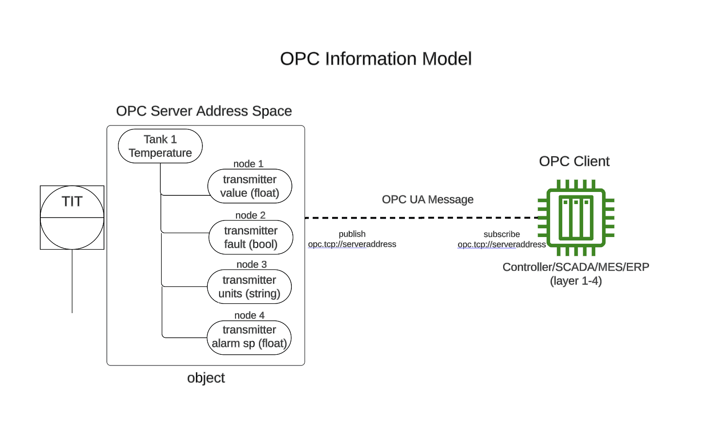
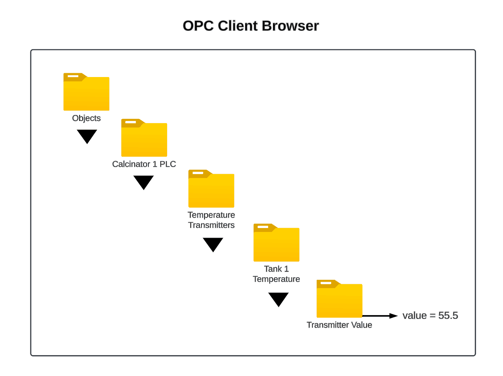
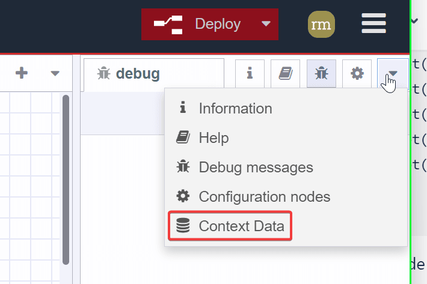
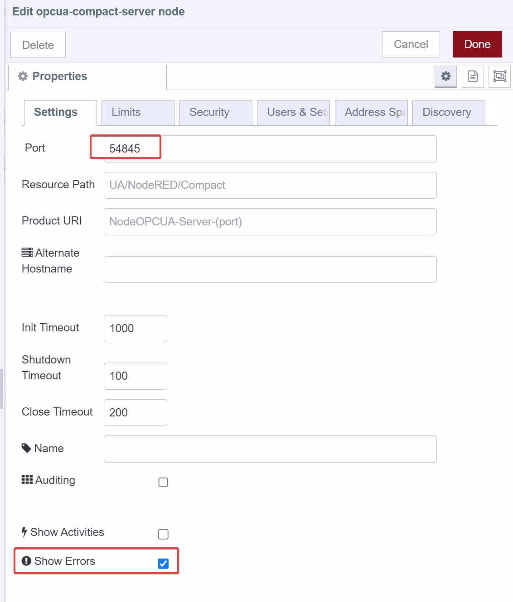
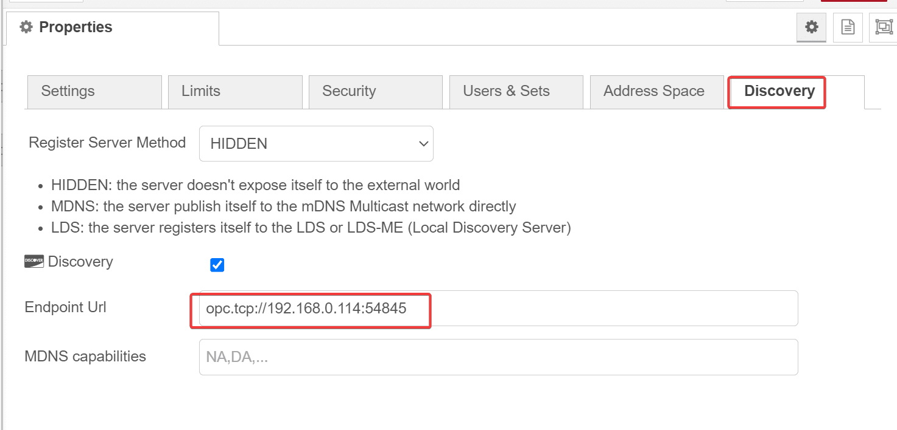

This article is the first part of a series of OPC-UA content.  Here, we will explain some basic concepts of OPC-UA as they apply to building a server in Node-RED, then walk through and deploy an example OPC-UA Server.  

<!--more-->

## What is OPC-UA?

Open Platform Communications Unified Architecture (OPC UA) is an open, platform independent communication framework frequently utilized in industrial automation, and is considered one of the key protocol standards for Industry 4.0 and Industrial IoT (IIoT).  The standard is developed and maintained by a consortium called the OPC Foundation, with recognizable industry names such as Siemens, Honeywell, Microsoft, Beckhoff, SAP, Yokogawa, ABB, Rockwell, and Schneider Electric.

Because of OPC-UA’s wide industry acceptance, it is increasingly becoming natively supported on devices and systems spanning the entirety of the automation pyramid.  


*Image reference - [imagecontroltips.com](https://www.motioncontroltips.com/what-is-opc-ua-and-how-does-it-compare-with-industrial-ethernet/)*


## Fieldbus Model vs OPC-UA Information Model

As of today, industrial ethernet fieldbuses dominate the field/device-level (level 0) and controller/PLC-level (level 1) of the automation pyramid. 

*Image reference - [mdpi.com](https://www.mdpi.com/1424-8220/21/14/4656)*

Fieldbuses such as Profinet, Ethernet/IP, and EtherCAT, employ deterministic, real-time communication, which is essential for mission-critical and safety-oriented automation tasks.  OPC-UA is most commonly encountered at the SCADA level and above (level 2-4).  However, with the inclusion of [Time Sensitive Networking (TSN) into the OPC-UA technology stack](https://www.tttech-industrial.com/resource-library/blog-posts/opc-ua-fx), OPC-UA can be feasibly used for real-time communication all the way down to the device level.  

Traditionally, fieldbus protocols transmit only raw data from field devices (ie, a float to represent a pressure, or a boolean to represent the position of a switch).  The fieldbus data gets pushed up the automation stack layer by layer, where eventually it will be converted to a format suitable for IT systems to consume (such as OPC-UA).


In contrast to fieldbus protocols, OPC-UA represents automation data in the form of nodes. The framework for constructing nodes is referred to as the [OPC Information model](lhttps://reference.opcfoundation.org/Core/Part5/v104/docs/), and consists of pre-defined classes and methods that are programmed in the OPC Server address space.  


Devices can be described as objects that give a holistic view of the device, beyond simply the raw value.  To construct a device object, we can take different individual attributes associated with a device, such as the transmitter raw value, transmitter fault flag, alarm setpoint, and combine them, similar to how user-defined datatypes (UDTs) are objects used to represent devices in PLCs.  The information model also defines a folder structure, to allow devices information to reside in a structured hierarchy.  Using the example temperature transmitter above, an example folder structure can be constructed as follows:

`/Root/Objects/Calcinator 1 PLC/Temperature Transmitters/Tank 1 Temperature/Transmitter Value`

This folder structure will be exposed via the OPC Client browser, allowing end-users to easily “drill down” to individual node information in a logical manner.


In summary, OPC-UA represents a trade-off between complex information modeling, with the versatility for that data to be consumed by devices and systems all the way up the automation pyramid layers.  The data does not have to pass through subsequent automation layers on the way up, nor does the data need to undergo any conversion along the way.  


*Image reference - [ifr.org](https://ifr.org/post/faster-robot-communication-through-the-opc-robotics-companion-specification)*

The OPC client simply needs to subscribe to the OPC Server endpoint url (ex. opc.tcp://server.address), and the client will be able to browse the structured OPC data as it’s modeled in the server.  Any client will receive the information in the same manner, regardless if it’s a PLC, SCADA, MES, or ERP system.  This opens the possibility for horizontal and vertical system integration in a standardized manner. Additionally, the more information that is exposed about a device, the easier it is to track, and use said data to autonomously reconfigure, or pre-emptively take maintenance actions.  

## Deploying an Example OPC-UA Server in Node-RED

With some background on OPC-UA and how information is modeled in mind, we can take a look at the [node-red-contrib-opcua-server](https://flows.nodered.org/node/node-red-contrib-opcua-server) node, which is merely a compact version of the [node-red-contrib-opcua](https://flows.nodered.org/node/node-red-contrib-opcua) node that only focuses on the OPC-UA server and hence requires less dependencies.  

 An [example flow](https://github.com/BiancoRoyal/node-red-contrib-opcua-server/blob/master/examples/server-with-context.json) is provided on github that can serve as a basis for understanding how a OPC-UA server is constructed.  Let’s get the example server up and running.  

Deploying the example flow yields the following result - 


- an inject node is trigging the function `set flow context Inputs` at a one second interval, which creates 7 randomly generated float values and stores them as flow context variables, `isoInput2` - `isoInput8` (isolated inputs).  The values will change to a new random number each time the node is injected.

```javascript 
flow.set('isoInput2', Math.random() + 12.0)
flow.set('isoInput3', Math.random() + 13.0)
flow.set('isoInput4', Math.random() + 14.0)
flow.set('isoInput5', Math.random() + 15.0)
flow.set('isoInput6', Math.random() + 16.0)
flow.set('isoInput7', Math.random() + 17.0)
flow.set('isoInput8', Math.random() + 18.0)

...
```
- another inject node is triggering the function `set flow context Outputs`, also at a one second interval, which creates another set of 7 randomly generated float values and stores them as flow context variables, `isoOutput2` - `isoOutput8` (isolated inputs).  The values will change to a new random number each time the node is injected.

```javascript 
flow.set('isoOutput2', Math.random() + 2.0)
flow.set('isoOutput3', Math.random() + 3.0)
flow.set('isoOutput4', Math.random() + 4.0)
flow.set('isoOutput5', Math.random() + 5.0)
flow.set('isoOutput6', Math.random() + 6.0)
flow.set('isoOutput7', Math.random() + 7.0)
flow.set('isoOutput8', Math.random() + 8.0)

...
```

We can confirm the values are being stored in memory by checking the flow context data and pressing the refresh button.




Each time we hit refresh, the values change, confirming that the values are randomly changing every second.

The last, and most important part of the flow, is the `Compact-Server` node, which actually stands alone without any incoming or outgoing connections.


In the `Compact-Server` node properties, the first tab is `Settings`, and the two important properties here are `Port` and `Show Errors`.  As can be seen in the node screenshot above, the node is reporting `active`, which means the server is configured correctly.  



The `Limits` tab specifies some default limits that we can configure if we like, but are not necessary to be modified for test purposes.  

The `Security` tab has one important option, `Allow Anonymous`.  By default, anonymous access is enabled.  


For a production system, we will want to enable security, but for test purposes, we will leave anonymous access enabled.  

`Users & Sets` tab is related to security and permissions.  We can leave this empty for testing.  

 The `Address Space` tab is where our server OPC Information Model is constructed, using classes and methods from the [node-opcua sdk](https://node-opcua.github.io/).  
 
 Breaking down the provided example code for further context, it starts with a function that is responsible for invoking the OPC-UA server, 

```javascript 
  const opcua = coreServer.choreCompact.opcua;
```

and then the namespace is created. 

```javascript 
const namespace = addressSpace.getOwnNamespace();
```

Further down, the variables that will be published by the server (which are our `isoInput` & `isoOutput` flow context variables) are initialized, 

```javascript 
  this.sandboxFlowContext.set("isoInput1", 0);
  this.setInterval(() => {
    flexServerInternals.sandboxFlowContext.set(
      "isoInput1",
      Math.random() + 50.0
    );
  }, 500);
  this.sandboxFlowContext.set("isoInput2", 0);
  this.sandboxFlowContext.set("isoInput3", 0);
...
```

and an OPC folder structure is defined. 

```javascript 
  coreServer.debugLog("init dynamic address space");
  const rootFolder = addressSpace.findNode("RootFolder");

  node.warn("construct new address space for OPC UA");

  const myDevice = namespace.addFolder(rootFolder.objects, {
    "browseName": "RaspberryPI-Zero-WLAN"
  });
...
```

Then, with our variables and folder structure defined, nodes are added to the namespace for each context variable. 

```javascript 
  const gpioDI1 = namespace.addVariable({
    "organizedBy": isoInputs,
    "browseName": "I1",
    "nodeId": "ns=1;s=Isolated_Input1",
    "dataType": "Double",
    "value": {
      "get": function() {
        return new Variant({
          "dataType": DataType.Double,
          "value": flexServerInternals.sandboxFlowContext.get("isoInput1")
        });
      },
      "set": function(variant) {
        flexServerInternals.sandboxFlowContext.set(
          "isoInput1",
          parseFloat(variant.value)
        );
        return opcua.StatusCodes.Good;
      }
    }
  });

...
```

Last, OPC views are defined.  Views create custom hierarchies our OPC Client can browse as an alternative to the default folder structure.

```javascript 
  const viewDI = namespace.addView({
    "organizedBy": rootFolder.views,
    "browseName": "RPIW0-Digital-Ins"
  });

  const viewDO = namespace.addView({
    "organizedBy": rootFolder.views,
    "browseName": "RPIW0-Digital-Outs"
  });

  viewDI.addReference({
    "referenceType": "Organizes",
    "nodeId": gpioDI1.nodeId
  });

...

```

Finally, on the `Discovery` tab, we must define an endpoint for an OPC Client to subscribe to.  

The `Endpoint Url` follows the format `opc.tcp://<address>:port`.  Our port was defined on the `Settings` tab, which by default, is port `54845`. The address will be either the url or ip address of your Node-RED instance.  In my case, it’s 192.168.0.114.  So my Endpoint Url = `opc.tcp://192.168.0.114:54845`


Once the endpoint url is added, deploy the flow, and confirm the server is reporting “active”.


## Connect to Example OPC-Server Using OPC-UA Browser

To connect to our OPC endpoint, we need an OPC Client.  Prosys provides a [free OPC-UA Browser ](https://www.prosysopc.com/products/opc-ua-browser/)that supports Windows, Linux, and Mac OS.  To test our Server, the Windows version of Prosys OPC-UA Browser will be utilized.

To connect to our Node-RED OPC server, enter the endpoint url and press “connect to server”.


It will ask for security.  Remember that we allowed anonymous access, so the default security mode of `None` is the correct option.

Once connected, we can browse our OPC Server.


If we navigate to `Objects → RaspberryPI-Zero-WLAN → GPIO → Inputs`, we can see a list of inputs that correspond to the `isoInput` context variables defined in the example flow, which are randomly generated numbers. 

Clicking `I1` we can see the value in real-time, along with some additional properties.


If we go to `Views`, we can see the custom hierarchy defined in the example server, which divides the data by Digital-Ins and Digital-Outs.  


## Summary

In this article, we compare OPC-UA to traditional fieldbus protocols, explain the importance of the OPC UA Information Model to understand how data is modeled in the address space of an OPC Server, and then walk through and deploy an example compact OPC-UA Server flow.  

In our next article, we will build a custom OPC-UA Server in Node-RED with data pulled from an Allen Bradley PLC over Ethernet/IP, using the PLC data to develop a custom OPC UA Information Model programmed in the OPC server address space.
