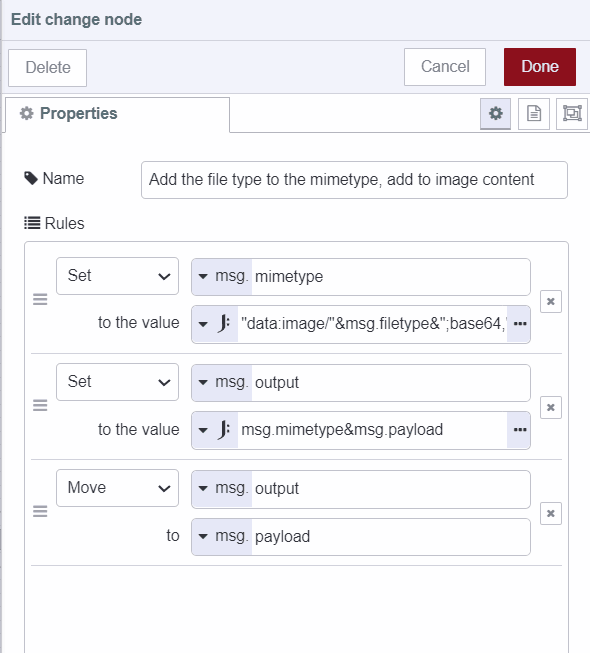

Using images in your Node-RED dashboards can significantly improve your users' experience. The most common method to add images to dashboards is to store them within the filesystem of an Node-RED instance but sometimes that's not an option. How can you easily use images when working in a containerized environment such as Docker, or Kubernetes? We will also explore latest feature from FlowFuse that makes this step super easy.

<!--more-->

When designing a dashboard, images allow you to significantly enrich your content. Some examples include:

- displaying maps to guide engineers to a problem which needs resolving.

- displaying pictures of specific hardware on a factory-floor which needs to be checked.

- displaying physical tools which should be used to resolve a problem.

### Prerequisites

Before we begin, ensure you have the following custom nodes installed:

- [@flowfuse/node-red-dashboard](https://flows.nodered.org/node/@flowfuse/node-red-dashboard) - A set of dashboard nodes for Node-RED. We will use this dashboard to demonstrate how to quickly display images using static assets. If you're a beginner and want to dive deeper, refer to [Getting started with FlowFuse Dashboarad](/blog/2024/03/dashboard-getting-started/).
- [node-red-contrib-string](https://flows.nodered.org/node/node-red-contrib-string) - A string manipulation node based on the lightweight stringjs library.
- [node-red-node-base64](https://flows.nodered.org/node/node-red-node-base64) - A Node-RED node to encode and decode data to and from base64.

## Easily Add Images to Node-RED Dashboards with FlowFuse’s Static Asset Service

[FlowFuse's static assets](https://flowforge.com/docs/user/static-asset-service/) service provides a simple way to manage images and other assets in Node-RED. Follow these steps to quickly add images to your Node-RED dashboard.

### Steps to Add Images Using the Static Asset Service:

##### 1. Access the Static Assets Service
- Log into your FlowFuse account, navigate to your **Node-RED instance**, and click on the **Static Assets Service** tab.

##### 2. Create a New Folder (Optional)
- Click the **New Folder** button to create a folder that will help you organize your assets. Provide a folder name and **confirm** the creation.

##### 3. Upload Your Image
- Enter the folder (or skip this step if not using folders), click **Upload**, select your image file, and **confirm**.

##### 4. Copy the Image Path
- Once uploaded, click the **copy icon** next to the image to get the path for use in Node-RED.

##### 5. Set Up the Image Flow in Node-RED
- Open the Node-RED editor for the relevant instance.
- Drag an `inject` node onto the canvas and set it to trigger immediately when the flow is deployed.
- Drag a `read file` node, paste the copied file path in the **Filename** field, and set the output to Single buffer object.

##### 6. Prepare the Image for Display
- Add a `string` node to convert the buffer to a base64 string. Set **From** as `msg.filename` and adjust the **Method** to `getmost`.
- Add a `change` node and configure it to add the elements shown in the following image:

    

##### 7. Display the Image in the Dashboard
- Drag a `ui-template` node onto the canvas.
- Add the code in `ui-template` with an `` tag, configuring the `src` attribute with `msg.payload`, as shown in the following code. Alternatively, you can use the following code directly if you want to display the image in the top-left corner of your dashboard header:

    ```javascript
    <template>
        <Teleport v-if="mounted" to="#app-bar-title">
            
        </Teleport>
    </template>

    <script>
        export default {
            data() {
                return {
                    mounted: false
                }
            },
            mounted() {
                this.mounted = true;
            }
        }
    </script>
    ```

##### 8. Connect the Nodes
- Finally connect the nodes in the following order:
    the **output** of the `inject` node to the **input** of the `read file` node, then link to the `string node`, followed by the `change` node, and finally to the `ui-template` node.

    `inject → read file → string → change → ui-template`


[{"id":"e50f7c57189d62f8","type":"group","z":"d4aa6dd5b63a56de","style":{"stroke":"#b2b3bd","stroke-opacity":"1","fill":"#f2f3fb","fill-opacity":"0.5","label":true,"label-position":"nw","color":"#32333b"},"nodes":["3bf4c71150bd0524","4d3ca1b96c181645","315948cc6a2cc9e8","fcf061d4cc732e2e","6563d8715af4cb06","d40caa36040de881"],"x":514,"y":699,"w":1752,"h":82},{"id":"3bf4c71150bd0524","type":"ui-template","z":"d4aa6dd5b63a56de","g":"e50f7c57189d62f8","group":"","page":"","ui":"25f447d87d1ce5c9","name":"Display image","order":0,"width":0,"height":0,"head":"","format":"<template>\n    <!-- Teleport the image to the #app-bar-title area when mounted -->\n    <Teleport v-if=\"mounted\" to=\"#app-bar-title\">\n        \n    </Teleport>\n</template>\n\n<script>\n    export default {\n        data() {\n            return {\n                mounted: false\n            }\n        },\n        mounted() {\n            // Set mounted to true when the component is mounted\n            this.mounted = true\n        }\n    }\n</script>","storeOutMessages":true,"passthru":true,"resendOnRefresh":true,"templateScope":"widget:ui","className":"","x":2160,"y":740,"wires":[[]]},{"id":"4d3ca1b96c181645","type":"inject","z":"d4aa6dd5b63a56de","g":"e50f7c57189d62f8","name":"","props":[{"p":"payload"}],"repeat":"","crontab":"","once":true,"onceDelay":0.1,"topic":"","payload":"","payloadType":"date","x":630,"y":740,"wires":[["315948cc6a2cc9e8"]]},{"id":"315948cc6a2cc9e8","type":"file in","z":"d4aa6dd5b63a56de","g":"e50f7c57189d62f8","name":"","filename":"Images/ff-logo--wordmark--light.png","filenameType":"str","format":"","chunk":false,"sendError":false,"encoding":"none","allProps":false,"x":880,"y":740,"wires":[["d40caa36040de881"]]},{"id":"fcf061d4cc732e2e","type":"change","z":"d4aa6dd5b63a56de","g":"e50f7c57189d62f8","name":"Add the file type to the mimetype, add to image content","rules":[{"t":"set","p":"mimetype","pt":"msg","to":"\"data:image/\"&msg.filetype&\";base64,\"","tot":"jsonata"},{"t":"set","p":"output","pt":"msg","to":"msg.mimetype&msg.payload","tot":"jsonata"},{"t":"move","p":"output","pt":"msg","to":"payload","tot":"msg"}],"action":"","property":"","from":"","to":"","reg":false,"x":1820,"y":740,"wires":[["3bf4c71150bd0524"]]},{"id":"6563d8715af4cb06","type":"string","z":"d4aa6dd5b63a56de","g":"e50f7c57189d62f8","name":"Get file type from file name","methods":[{"name":"getRightMost","params":[{"type":"str","value":"."}]}],"prop":"filename","propout":"filetype","object":"msg","objectout":"msg","x":1480,"y":740,"wires":[["fcf061d4cc732e2e"]]},{"id":"d40caa36040de881","type":"base64","z":"d4aa6dd5b63a56de","g":"e50f7c57189d62f8","name":"Convert Buffer to Base 64 String","action":"","property":"payload","x":1210,"y":740,"wires":[["6563d8715af4cb06"]]},{"id":"25f447d87d1ce5c9","type":"ui-base","name":"Dashboard","path":"/dashboard","includeClientData":true,"acceptsClientConfig":["ui-control","ui-notification"],"showPathInSidebar":false,"showPageTitle":false,"titleBarStyle":"default"}]


Using the FlowFuse Static Assets service is highly beneficial when you want to display images in Node-RED dashboards, as it saves time compared to alternative solutions. However, it’s important to note that moving Node-RED instances through a DevOps pipeline currently does not support handling static assets. This feature is expected in future updates. If you want to manage images effectively within your Node-RED dashboards, consider the alternative solutions discussed in this blog, ensuring that the movement of instances does not affect the usage of these assets.

## Why not just store them in Node-RED's host operating system?

Storing images locally can work well when you can access and edit the images on an operating system, but that approach doesn't scale if you are moving instances through a DevOps pipeline. It can also not work well when deploying to environments where you don't have easy access to the host operating system.

How can we include images in dashboards, and be confident that a given build of an application will show the correct images, no matter where your Node-RED instances are hosted?

## Inspiration

There are various solutions to this problem, I wanted to share one I came across when working with a FlowFuse customer recently. I've modified the flows to make them more general in design, but the underlying principal is the same. I asked if I was OK to credit the customer but they said there was no need. Thanks for the inspiration, kind customer!

## Solution explanation

There are three key sections to this solution:

1. Pull the images we need from URLs

1. Store those images in the temporary filesystem of Node-RED

1. Serve up those images as needed in the dashboard

It is possible for us to skip step 2, but I wanted to have the images stored locally, in the Node-RED instance. storing the images locally will improve the loading times of the dashboard. This is especially beneficial when your dashboard is dynamically displaying relevant images, e.g. to show an image of a specific machine which needs to be attended to.

The key benefit of pulling the images from URLs this way is, no matter where you are running Node-RED, the correct images will be shown in your dashboard.

## Prequsite

Before moving forward, ensure you have the following nodes installed, as the flows shared later will require them:

- [node-red-contrib-calc](https://flows.nodered.org/node/node-red-contrib-calc) - A Node-RED node to perform basic mathematical calculations.
- [node-red-contrib-image-output](https://flows.nodered.org/node/node-red-contrib-image-output) - A simple way to preview and examine images in your flows.
- [node-red-contrib-os](https://flows.nodered.org/node/node-red-contrib-os) - Nodes for obtaining system information like CPU usage.
- [node-red-contrib-string](https://flows.nodered.org/node/node-red-contrib-string) - A string manipulation node based on the lightweight stringjs library.
- [@flowfuse/node-red-dashboard](https://flows.nodered.org/node/@flowfuse/node-red-dashboard) - A set of dashboard nodes for Node-RED.
- [node-red-node-base64](https://flows.nodered.org/node/node-red-node-base64) - A Node-RED node to encode and decode data to and from base64.

## File and file-in nodes

I've included the flows as json below so you can try them out yourself. Please note, I'm using FlowFuse's own [file and file-in nodes](/docs/user/filenodes/) in these examples. If you want to use these flows on hosting other than FlowFuse, you will need to replace the nodes with the standard Node-RED file and file-in nodes.

## The flows

The first flow takes image URLs in an array, each image is downloaded, processed, then saved to the local file storage. Let's take a look at the flow:


[{"id":"6b8059f703d0f574","type":"group","z":"c6f2a894be05d857","name":"Write the images to disk from the URLs","style":{"label":true},"nodes":["04fb6911559797a0","8a3c077f0f85a905","22c5026dd58e418b","6fcca5cfee2bcb89"],"x":38,"y":53,"w":1004,"h":434},{"id":"04fb6911559797a0","type":"group","z":"c6f2a894be05d857","g":"6b8059f703d0f574","name":"Inject the image URLs to download","style":{"label":true},"nodes":["e635ceb0577a86d5","29fe40a054be5b2b","1e81a35c27aae6ad"],"x":74,"y":79,"w":502,"h":82},{"id":"e635ceb0577a86d5","type":"inject","z":"c6f2a894be05d857","g":"04fb6911559797a0","name":"Send in image URLs as an array","props":[{"p":"payload"}],"repeat":"","crontab":"","once":false,"onceDelay":0.1,"topic":"","payload":"[\"https://openjsf.org/wp-content/uploads/sites/84/2023/02/ff-logo-wordmark-light_4x.png\",\"https://nodered.org/images/nr-image-1.png\",\"/img/screen-pseudo-overview-2QvTVle3Mr-384.avif\"]","payloadType":"json","x":250,"y":120,"wires":[["29fe40a054be5b2b"]]},{"id":"29fe40a054be5b2b","type":"split","z":"c6f2a894be05d857","g":"04fb6911559797a0","name":"","splt":"\\n","spltType":"str","arraySplt":1,"arraySpltType":"len","stream":false,"addname":"","x":450,"y":120,"wires":[["1e81a35c27aae6ad"]]},{"id":"1e81a35c27aae6ad","type":"link out","z":"c6f2a894be05d857","g":"04fb6911559797a0","name":"link out 3","mode":"link","links":["f582702ec222069c"],"x":535,"y":120,"wires":[]},{"id":"8a3c077f0f85a905","type":"group","z":"c6f2a894be05d857","g":"6b8059f703d0f574","name":"Download the images","style":{"label":true},"nodes":["453f3b9d7d312bd2","ecbd7b1a410ecd9d","4d650baa2118036e","f582702ec222069c"],"x":84,"y":179,"w":532,"h":82},{"id":"453f3b9d7d312bd2","type":"http request","z":"c6f2a894be05d857","g":"8a3c077f0f85a905","name":"Get the image","method":"GET","ret":"bin","paytoqs":"ignore","url":"","tls":"","persist":false,"proxy":"","insecureHTTPParser":false,"authType":"","senderr":false,"headers":[],"x":460,"y":220,"wires":[["4d650baa2118036e"]]},{"id":"ecbd7b1a410ecd9d","type":"change","z":"c6f2a894be05d857","g":"8a3c077f0f85a905","name":"Set URL to download","rules":[{"t":"move","p":"payload","pt":"msg","to":"url","tot":"msg"}],"action":"","property":"","from":"","to":"","reg":false,"x":260,"y":220,"wires":[["453f3b9d7d312bd2"]]},{"id":"4d650baa2118036e","type":"link out","z":"c6f2a894be05d857","g":"8a3c077f0f85a905","name":"link out 1","mode":"link","links":["8bc38803dec97185"],"x":575,"y":220,"wires":[]},{"id":"f582702ec222069c","type":"link in","z":"c6f2a894be05d857","g":"8a3c077f0f85a905","name":"link in 3","links":["1e81a35c27aae6ad"],"x":125,"y":220,"wires":[["ecbd7b1a410ecd9d"]]},{"id":"22c5026dd58e418b","type":"group","z":"c6f2a894be05d857","g":"6b8059f703d0f574","name":"Save the images to the local storage","style":{"label":true},"nodes":["95c819560d22f394","0fe7f013b6356c5d","7edc6cb2b0d243db","829bfc8e6e293ada","8bc38803dec97185","98980d88013c6e12"],"x":84,"y":279,"w":932,"h":82},{"id":"95c819560d22f394","type":"base64","z":"c6f2a894be05d857","g":"22c5026dd58e418b","name":"convert to base64","action":"str","property":"payload","x":250,"y":320,"wires":[["829bfc8e6e293ada"]]},{"id":"0fe7f013b6356c5d","type":"file","z":"c6f2a894be05d857","g":"22c5026dd58e418b","name":"Write file to storage","filename":"filename","filenameType":"msg","appendNewline":true,"createDir":false,"overwriteFile":"true","encoding":"none","x":850,"y":320,"wires":[["98980d88013c6e12"]]},{"id":"7edc6cb2b0d243db","type":"string","z":"c6f2a894be05d857","g":"22c5026dd58e418b","name":"Get filename from the URL","methods":[{"name":"getRightMost","params":[{"type":"str","value":"/"}]}],"prop":"responseUrl","propout":"filename","object":"msg","objectout":"msg","x":620,"y":320,"wires":[["0fe7f013b6356c5d"]]},{"id":"829bfc8e6e293ada","type":"image","z":"c6f2a894be05d857","g":"22c5026dd58e418b","name":"preview","width":"150","data":"payload","dataType":"msg","thumbnail":false,"active":true,"pass":true,"outputs":1,"x":420,"y":320,"wires":[["7edc6cb2b0d243db"]]},{"id":"8bc38803dec97185","type":"link in","z":"c6f2a894be05d857","g":"22c5026dd58e418b","name":"link in 1","links":["4d650baa2118036e"],"x":125,"y":320,"wires":[["95c819560d22f394"]]},{"id":"98980d88013c6e12","type":"link out","z":"c6f2a894be05d857","g":"22c5026dd58e418b","name":"link out 2","mode":"link","links":["1e94b5bab542830a"],"x":975,"y":320,"wires":[]},{"id":"6fcca5cfee2bcb89","type":"group","z":"c6f2a894be05d857","g":"6b8059f703d0f574","name":"Output a debug once all images have been processed","style":{"label":true},"nodes":["d1a6feea3ac829c6","119f8008752bc4fb","1e94b5bab542830a"],"x":64,"y":379,"w":382,"h":82},{"id":"d1a6feea3ac829c6","type":"debug","z":"c6f2a894be05d857","g":"6fcca5cfee2bcb89","name":"debug 140","active":true,"tosidebar":true,"console":false,"tostatus":false,"complete":"true","targetType":"full","statusVal":"","statusType":"auto","x":330,"y":420,"wires":[]},{"id":"119f8008752bc4fb","type":"join","z":"c6f2a894be05d857","g":"6fcca5cfee2bcb89","name":"","mode":"auto","build":"object","property":"payload","propertyType":"msg","key":"topic","joiner":"\\n","joinerType":"str","accumulate":"false","timeout":"","count":"","reduceRight":false,"x":190,"y":420,"wires":[["d1a6feea3ac829c6"]]},{"id":"1e94b5bab542830a","type":"link in","z":"c6f2a894be05d857","g":"6fcca5cfee2bcb89","name":"link in 2","links":["98980d88013c6e12"],"x":105,"y":420,"wires":[["119f8008752bc4fb"]]}]


We've now downloaded the images we need, and saved them to our local storage, to make them load more quickly when a user views them in the dashboard.

Onto the second flow, which will get the images from the local storage and then load them into the dashboard. Let's take a look at it:


You can import this flow into Node-RED using the code below:


[{"id":"596006fe79275d55","type":"group","z":"d4aa6dd5b63a56de","name":"Get the images from the filestore and display in the Dashboard","style":{"label":true},"nodes":["be421f8265c4c090","d2dc98b4f3d6b968","b9029adc6097bd14","1e54acecec6bd411","99aaee673fc70bc2"],"x":1228,"y":3733,"w":974,"h":654},{"id":"be421f8265c4c090","type":"group","z":"d4aa6dd5b63a56de","g":"596006fe79275d55","name":"Get the images from the local storage","style":{"label":true},"nodes":["c698b2945583e126","ab22b978a2f5d80f","2836914f9b643e34","8e32aba67d9ac9d4"],"x":1264,"y":3899,"w":492,"h":82},{"id":"c698b2945583e126","type":"image","z":"d4aa6dd5b63a56de","g":"be421f8265c4c090","name":"preview","width":"150","data":"payload","dataType":"msg","thumbnail":false,"active":true,"pass":true,"outputs":1,"x":1620,"y":3940,"wires":[["8e32aba67d9ac9d4"]]},{"id":"ab22b978a2f5d80f","type":"file in","z":"d4aa6dd5b63a56de","g":"be421f8265c4c090","name":"Read file from storage","filename":"payload","filenameType":"msg","format":"utf8","chunk":false,"sendError":false,"encoding":"none","allProps":false,"x":1440,"y":3940,"wires":[["c698b2945583e126"]]},{"id":"2836914f9b643e34","type":"link in","z":"d4aa6dd5b63a56de","g":"be421f8265c4c090","name":"link in 4","links":["a9958e1e4b07191a"],"x":1305,"y":3940,"wires":[["ab22b978a2f5d80f"]]},{"id":"8e32aba67d9ac9d4","type":"link out","z":"d4aa6dd5b63a56de","g":"be421f8265c4c090","name":"link out 5","mode":"link","links":["bbdd3a2e737e1074"],"x":1715,"y":3940,"wires":[]},{"id":"d2dc98b4f3d6b968","type":"group","z":"d4aa6dd5b63a56de","g":"596006fe79275d55","name":"Prepare each image to be shown in the dashboard","style":{"label":true},"nodes":["54f0e7fddf447d10","d856077cc6d37093","bbdd3a2e737e1074","2d29c953bcdab787"],"x":1264,"y":3999,"w":832,"h":82},{"id":"54f0e7fddf447d10","type":"change","z":"d4aa6dd5b63a56de","g":"d2dc98b4f3d6b968","name":"Add the file type to the mimetype, add to image content","rules":[{"t":"set","p":"mimetype","pt":"msg","to":"\"data:image/\"&msg.filetype&\";base64,\"","tot":"jsonata"},{"t":"set","p":"output","pt":"msg","to":"msg.mimetype&msg.payload","tot":"jsonata"},{"t":"move","p":"output","pt":"msg","to":"payload","tot":"msg"}],"action":"","property":"","from":"","to":"","reg":false,"x":1810,"y":4040,"wires":[["2d29c953bcdab787"]]},{"id":"d856077cc6d37093","type":"string","z":"d4aa6dd5b63a56de","g":"d2dc98b4f3d6b968","name":"Get file type from file name","methods":[{"name":"getRightMost","params":[{"type":"str","value":"."}]}],"prop":"filename","propout":"filetype","object":"msg","objectout":"msg","x":1460,"y":4040,"wires":[["54f0e7fddf447d10"]]},{"id":"bbdd3a2e737e1074","type":"link in","z":"d4aa6dd5b63a56de","g":"d2dc98b4f3d6b968","name":"link in 5","links":["8e32aba67d9ac9d4"],"x":1305,"y":4040,"wires":[["d856077cc6d37093"]]},{"id":"2d29c953bcdab787","type":"link out","z":"d4aa6dd5b63a56de","g":"d2dc98b4f3d6b968","name":"link out 6","mode":"link","links":["c5e4febe48363987"],"x":2055,"y":4040,"wires":[]},{"id":"b9029adc6097bd14","type":"group","z":"d4aa6dd5b63a56de","g":"596006fe79275d55","name":"Send the images to the correct section of the dashboard","style":{"label":true},"nodes":["fa873d7bccd2b6be","c5e4febe48363987","d80e5a54a7c5b2f8","fb0c76a6934b0a7f","4e4105a9774c7b5c","917c842a1b46ad4c"],"x":1264,"y":4099,"w":912,"h":162},{"id":"fa873d7bccd2b6be","type":"switch","z":"d4aa6dd5b63a56de","g":"b9029adc6097bd14","name":"Send the image to the correct section of the dashboard","property":"filename","propertyType":"msg","rules":[{"t":"eq","v":"ff-logo-wordmark-light_4x.png","vt":"str"},{"t":"eq","v":"screen-pseudo-overview-2QvTVle3Mr-384.avif","vt":"str"},{"t":"eq","v":"nr-image-1.png","vt":"str"}],"checkall":"true","repair":false,"outputs":3,"x":1550,"y":4180,"wires":[["917c842a1b46ad4c"],["4e4105a9774c7b5c"],["fb0c76a6934b0a7f"]]},{"id":"c5e4febe48363987","type":"link in","z":"d4aa6dd5b63a56de","g":"b9029adc6097bd14","name":"link in 6","links":["2d29c953bcdab787"],"x":1305,"y":4180,"wires":[["fa873d7bccd2b6be"]]},{"id":"d80e5a54a7c5b2f8","type":"link out","z":"d4aa6dd5b63a56de","g":"b9029adc6097bd14","name":"link out 7","mode":"link","links":["c9de7384c9ca672f"],"x":2135,"y":4180,"wires":[]},{"id":"fb0c76a6934b0a7f","type":"ui-template","z":"d4aa6dd5b63a56de","g":"b9029adc6097bd14","group":"ec62d482d77f7908","page":"","ui":"","name":"Display the image on the Dashboard","order":6,"width":"3","height":"1","head":"","format":"<template>\n    <div>\n        <br>\n    </div>\n</template>","storeOutMessages":true,"passthru":true,"resendOnRefresh":true,"templateScope":"local","className":"","x":1930,"y":4220,"wires":[["d80e5a54a7c5b2f8"]]},{"id":"4e4105a9774c7b5c","type":"ui-template","z":"d4aa6dd5b63a56de","g":"b9029adc6097bd14","group":"ec62d482d77f7908","page":"","ui":"","name":"Display the image on the Dashboard","order":5,"width":"3","height":"1","head":"","format":"<template>\n    <div>\n        <br>\n    </div>\n</template>","storeOutMessages":true,"passthru":true,"resendOnRefresh":true,"templateScope":"local","className":"","x":1930,"y":4180,"wires":[["d80e5a54a7c5b2f8"]]},{"id":"917c842a1b46ad4c","type":"ui-template","z":"d4aa6dd5b63a56de","g":"b9029adc6097bd14","group":"ec62d482d77f7908","page":"","ui":"","name":"Display the image on the Dashboard","order":2,"width":0,"height":0,"head":"","format":"<template>\n    <div>\n        <br>\n    </div>\n</template>","storeOutMessages":true,"passthru":true,"resendOnRefresh":true,"templateScope":"local","className":"","x":1930,"y":4140,"wires":[["d80e5a54a7c5b2f8"]]},{"id":"ec62d482d77f7908","type":"ui-group","name":"Default","page":"550c9ac3b2ed01c9","width":"6","height":"1","order":1,"showTitle":false,"className":"","visible":"true","disabled":"false"},{"id":"550c9ac3b2ed01c9","type":"ui-page","name":"Home","ui":"25f447d87d1ce5c9","path":"/","icon":"home","layout":"grid","theme":"c68088445147719b","breakpoints":[{"name":"Default","px":0,"cols":3},{"name":"Tablet","px":576,"cols":6},{"name":"Small Desktop","px":768,"cols":9},{"name":"Desktop","px":1024,"cols":12}],"order":1,"className":"","visible":true,"disabled":false},{"id":"25f447d87d1ce5c9","type":"ui-base","name":"Dashboard","path":"/dashboard","includeClientData":true,"acceptsClientConfig":["ui-control","ui-notification"],"showPathInSidebar":false,"showPageTitle":false,"titleBarStyle":"default"},{"id":"c68088445147719b","type":"ui-theme","name":"Theme Name","colors":{"surface":"#ffffff","primary":"#0094ce","bgPage":"#eeeeee","groupBg":"#ffffff","groupOutline":"#cccccc"}},{"id":"1e54acecec6bd411","type":"group","z":"d4aa6dd5b63a56de","g":"596006fe79275d55","name":"Output a debug once all images have been processed","style":{"label":true},"nodes":["c9de7384c9ca672f","b073cd4970e6ddf2","c1b52f44fd4260b3"],"x":1254,"y":4279,"w":392,"h":82},{"id":"c9de7384c9ca672f","type":"link in","z":"d4aa6dd5b63a56de","g":"1e54acecec6bd411","name":"link in 7","links":["d80e5a54a7c5b2f8"],"x":1295,"y":4320,"wires":[["b073cd4970e6ddf2"]]},{"id":"b073cd4970e6ddf2","type":"join","z":"d4aa6dd5b63a56de","g":"1e54acecec6bd411","name":"","mode":"auto","build":"object","property":"payload","propertyType":"msg","key":"topic","joiner":"\\n","joinerType":"str","accumulate":"false","timeout":"","count":"","reduceRight":false,"x":1380,"y":4320,"wires":[["c1b52f44fd4260b3"]]},{"id":"c1b52f44fd4260b3","type":"debug","z":"d4aa6dd5b63a56de","g":"1e54acecec6bd411","name":"debug 141","active":true,"tosidebar":true,"console":false,"tostatus":false,"complete":"false","statusVal":"","statusType":"auto","x":1530,"y":4320,"wires":[]},{"id":"99aaee673fc70bc2","type":"group","z":"d4aa6dd5b63a56de","g":"596006fe79275d55","name":"Inject the image files' names","style":{"label":true},"nodes":["11787d1ab6c8a9ec","49b8f3cce48dd5a9","a9958e1e4b07191a","c452f250e1303c69","08b30802899573a6"],"x":1254,"y":3759,"w":782,"h":122},{"id":"11787d1ab6c8a9ec","type":"inject","z":"d4aa6dd5b63a56de","g":"99aaee673fc70bc2","name":"Inject","props":[],"repeat":"","crontab":"","once":true,"onceDelay":"1","topic":"","x":1350,"y":3800,"wires":[["c452f250e1303c69"]]},{"id":"49b8f3cce48dd5a9","type":"split","z":"d4aa6dd5b63a56de","g":"99aaee673fc70bc2","name":"","splt":"\\n","spltType":"str","arraySplt":1,"arraySpltType":"len","stream":false,"addname":"","property":"payload","x":1910,"y":3800,"wires":[["a9958e1e4b07191a"]]},{"id":"a9958e1e4b07191a","type":"link out","z":"d4aa6dd5b63a56de","g":"99aaee673fc70bc2","name":"link out 4","mode":"link","links":["2836914f9b643e34"],"x":1995,"y":3800,"wires":[]},{"id":"c452f250e1303c69","type":"change","z":"d4aa6dd5b63a56de","g":"99aaee673fc70bc2","name":"Image file names as an array","rules":[{"t":"set","p":"payload","pt":"msg","to":"[\"ff-logo-wordmark-light_4x.png\",\"screen-pseudo-overview-2QvTVle3Mr-384.avif\",\"nr-image-1.png\"]","tot":"json"}],"action":"","property":"","from":"","to":"","reg":false,"x":1720,"y":3800,"wires":[["49b8f3cce48dd5a9"]]},{"id":"08b30802899573a6","type":"ui-event","z":"d4aa6dd5b63a56de","g":"99aaee673fc70bc2","ui":"25f447d87d1ce5c9","name":"Update images on dashboard open","x":1420,"y":3840,"wires":[["c452f250e1303c69"]]}]


I have also included some simple dashboard elements you can view alongside the images. Let's take a look at the dashboard:


If you import these flows into Node-RED, you should see the images automatically loaded into the dashboard when you view it. You can also replace the URLs and file paths to try using some different images if you'd like to.

## More things to try

In this example, the images are static but it's simple to load images depending on the state of the flow. As mentioned in this article's introduction, you could display context aware images guiding the user of the dashboard to a specific location on a map, to complete a maintenance task. If you're interested in seeing examples of dynamic image loading please comment below.

## Conclusion

Images can significantly enhance dashboards, but ensuring their proper display in different Node-RED hosting environments, especially within DevOps pipelines, can be challenging. The techniques discussed here enable effective use of images in dashboards, even within containerized setups. Additionally, if you are using FlowFuse, the new features simplify adding and managing static assets.
I'd love to hear your comments and suggestions on this article. please tell us what you think about this article, and how you might use these techniques in the comments section below.
