Every new dashboard is met with the fast-following request, “can we save this data and somehow look back on it?”  Yes, you can, and let’s use InfluxDB to make it happen!

<!--more-->

Edge devices are often polling sensors at regular intervals and are a perfect candidate to be paired with a database purpose-built for time-series data, like InfluxDB.  Let’s capture some data, create a live chart, store the data, and then create a GUI for retrieving the data.

Here’s a screenshot of the dashboard we will create, which is divided into two sections. The first section displays live data, while the second section consists of fields that enable users to query the database and retrieve historical data.  Looking at the live data, the chart depicts a sinusoidal graph that represents the scale measurements used for quality assurance in the aggregate production process at an automated mining operation. The graph showcases fluctuations in weight over time, indicating variations in the samples being weighed. This monitoring process ensures the quality and consistency of the aggregates being produced.  The historical data shows a snippet of this information that was retrieved from InfluxDB.

 

Here is a screenshot of the simple Node-RED flow to create that dashboard.  We will dive into the details through this article, and, by the end, you will be able to create this flow yourself.

## Capturing serial port data

The live view is fed by data coming from a simple scale with a serial interface.  This [Brecknell LPS-150](https://www.brecknellscales.com/wp-content/uploads/2022/09/LPS-Series_u_en_fr_501724-1.pdf) scale will auto power-on, remembers the last tare setting, and continuously sends its reading via RS-232, so it is a great unit to use for unattended IoT projects.

On the Node-RED side, a serial node can be configured to capture this incoming data.  If your device running Node-RED doesn’t have an RS-232 port, there are many variations of RS-232-to-USB cables to help you connect.  This scale is sending data at a very high-speed interval so it is important to use a “delay” node before the rest of your flow gets bogged down.

Below, I have configured the serial port node with the same settings that were used to set up the scale. These settings are commonly documented as "9600 8N1" in shorthand.  In serial communication it is necessary for the two devices to have the exact same settings or the data becomes garbled.  The incoming stream of ASCII text is divided using the hex value 0x0D, which corresponds to the return character. This character is used as a delimiter to separate the individual chunks of text within the incoming data stream.

 

With this “delay” node, we now have a new message from the scale at a rate of 1 msg per 5 seconds

 

The debugger allows us to see the raw data as it is captured.

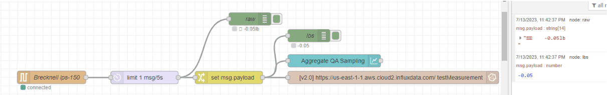

 

Unfortunately, these values are not in a friendly form to work with.  Ideally, we want our payload to just be a number, not this string with odd characters, extra spaces, and the units.

  

We need to extract the numeric part of the string using a regular expression with a “change” node and the JSONata expression $number($match(msg.payload,  /-?(\d+(\.\d+)?)/ , 10).match).  “$match” and “/-?(\d+(\.\d+)?)/” help the function pull out the numeric components of the string and “$number” parses these components to be an actual number data type.

Here are the properties of the “change” node.

When we look in the debugger we see the payload specified as a “number” and the value displayed in blue, both indications that we have successfully extracted the weight as the correct data type.

## Setting up serverless InfluxDB in the cloud

Now we have some live data, let’s store it using InfluxDB. Below are the steps to set up an account with the InfluxDB free service.  Navigate to [https://www.influxdata.com/products/influxdb-overview/](https://www.influxdata.com/products/influxdb-overview/) and let’s begin.  Click on “Get Started for Free” under Cloud, InfluxDB Cloud Serverless.

For this example the Free plan will work fine.

Create a bucket to store the data.

Generate a token to direct the calls from Node-RED to your InfluxDB account when they hit the InfluxDB server:

I selected “Generate All Access API Token,” but eventually you will want a custom, more restricted approach.

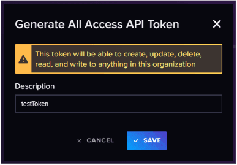

Copy your token and do not share it!  (mine will be deleted later)

## Connecting Node-RED to InfluxDB

Navigate to “Manage Palette” in the Node-RED hamburger menu in the upper right corner of the flow editor.  I did a search for InfluxDB and selected the most popular one, “node-red-contrib-influxdb” by looking at the number of downloads per week at [https://flows.nodered.org/node/node-red-contrib-influxdb](https://flows.nodered.org/node/node-red-contrib-influxdb).  When you are just starting out, it can be a smart decision to go with the popular option. The popularity indicates a level of trust and adoption within the community, making it a reliable choice for beginners

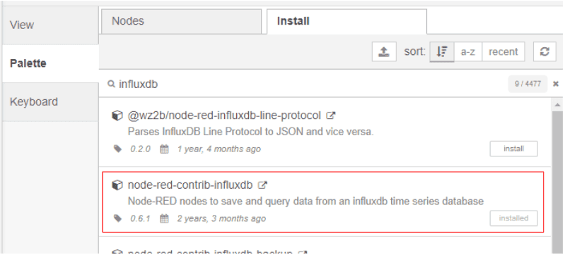

 

After installing this package you will see three new nodes in your flow editor.

Drag and drop the “influxdb out” node into your flow, double click on it, and start filling out the needed fields.  The naming convention of “test&lt;<THING>>” works well for initial setups to make it clear what names should go where.

  

It was a little unclear what URL to use with this serverless option, but I guessed it was the same as the URL for the InfluxDB resource center account page, “[https://us-east-1-1.aws.cloud2.influxdata.com/](https://us-east-1-1.aws.cloud2.influxdata.com/)” and it worked.  Then, enter the API token that was generated earlier.

 

The “influxdb out” node is now ready to start storing payloads.  The documentation for the InfluxDB nodes at [https://flows.nodered.org/node/node-red-contrib-influxdb](https://flows.nodered.org/node/node-red-contrib-influxdb) gives more detail as to extra options, such as tags, that you might want to attach to your data being stored.  In this simple example, we are just going to send the “influxdb out” node a number via the msg.payload.

 

Here is a chart of the live data which is also being stored.

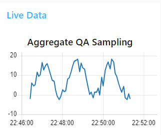

  

The InfluxDB Data Explorer helps you create a SQL call and allows you to run it right in the browser so you can verify that your data is being stored correctly.

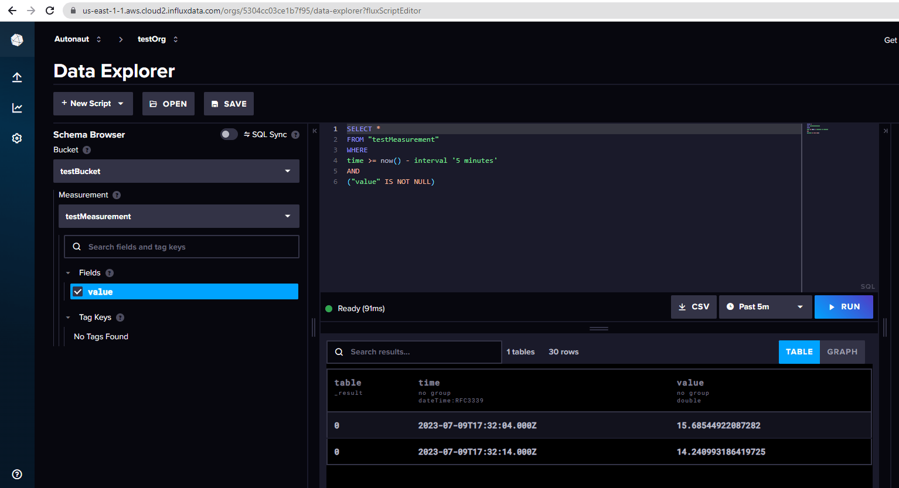

 

## Creating a historical data GUI

Now we have our data being stored, but we aren’t quite finished. We still want an easy way to pull this information up and for it to be presented in a chart, just like the live data.

Here is the Dashboard group we will create for this GUI.

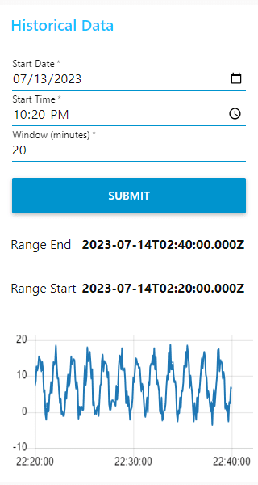

And here is the flow to create it.

A “template” node creates a convenient way to create a plain text output with variable properties within.  Below you can see that `msg.query` is created from a string of text with “rangeStart” and “rangeEnd” dynamically inserted using the “mustache” syntax.  More information about how to query InfluxDB can be found here:  [https://docs.influxdata.com/influxdb/v2.0/query-data/get-started/query-influxdb/](https://docs.influxdata.com/influxdb/v2.0/query-data/get-started/query-influxdb/).

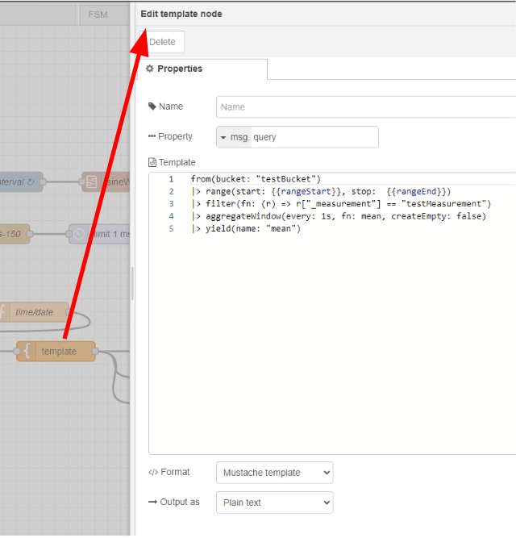

 

Using the "Form" dashboard node is an easy way to collect all the required information for our query. We need to be able to enter in a date and time to start gathering the data, and a window to know how long a range of values to pull.

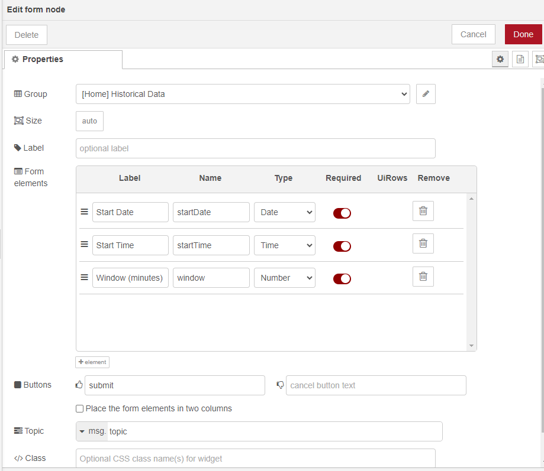

Here is the code from the “time/date” function node.  A bit of juggling of local time versus UTC time is needed to allow the user to intuitively query the correct data for their timezone. 

  

Here is the “change” node used to create the msg.rangeEnd.  The JSONatta expression is `$fromMillis($toMillis(msg.rangeStart) + msg.payload.window * 60 * 1000)`.  The expression combines the milliseconds from the `msg.rangeStart` with the calculated milliseconds in the “Window (minutes)” from the GUI.

 

Now that the query is coming back from InfluxDB, let’s break down how to transform this data object into one that can be read by the “chart” node.  Below, we see on the left column what the object looks like from InfluxDB and on the right we see how it must be structured to be viewed in the chart.

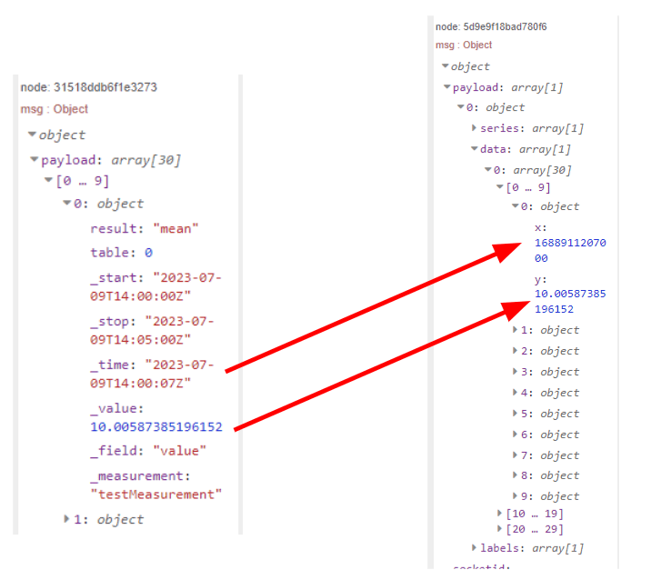

Rob Marcer has a great article on working with persistent chart data found here: [/blog/2023/05/persisting-chart-data-in-node-red/](/blog/2023/05/persisting-chart-data-in-node-red/).

We can use a series of nodes from the Node-RED core package to transform this data.

 

First, a “switch” node is used to determine if the response InfluxDB contains any data so that we can either format the data properly, or clear the chart and indicate “No Data.”

  

The “Label” field in the “chart” node can also be dynamically created with the mustache syntax.

  

If the “is not empty” “switch” node sees an empty payload, this “change” node sets the payload to an empty array, clearing the chart, and sets the `msg.title` to “No Data” so users know their query, though successful, returned an empty set of values.

 

The parameters for the “split” node can be left as-is.

 

In the “chartData” “change” node, will pull out the two values we need for the chart, milliseconds since the UNIX epoch for the x-value and the measurement from the scale for the y-value.  A simple JSONatta expression helps us transform the date from a string to milliseconds for the x-value.

 

The “join” node just needs to be set to “Combine each” msg.chartData object and configured “to create” an array.

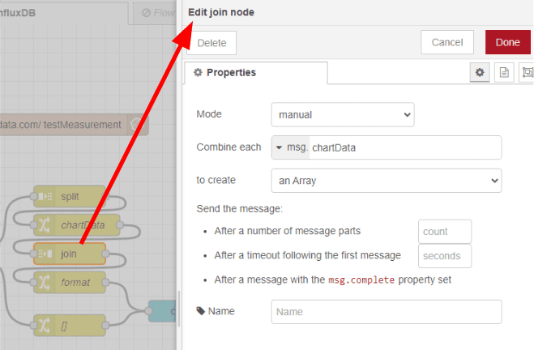

 

The final “change” node, “format,” is where we prescribe the format needed for the “chart” node, [{"series":[""],"data":[[]],"labels":[""]}], and finally we insert our `msg.chartData` array into that structure.  Notice `msg.title` is now set to “Data Received.”

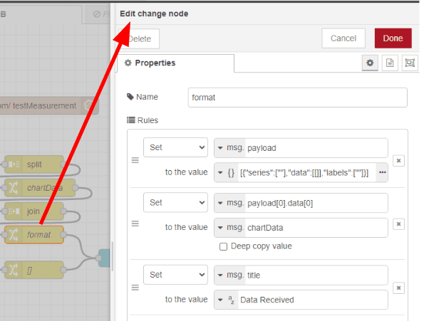

 

And, there you have it.  You can query the same range of data found on the live chart to ensure the code is working and then you can use the dashboard to pull up historical data, way in the past from what is shown on the live chart.

Your current version is clear and concise—great for a blog or call-to-action section. Here's a slightly refined version with improved flow, punctuation, and tone for polish, while keeping the structure intact:

## Final Thoughts

You’ve successfully built a powerful dashboard that captures real-time data and stores it in InfluxDB for historical analysis. This setup provides valuable insights into your process data and helps identify trends over time.

If you are planning to run this dashboard in production, a few important questions may come to mind: How do you ensure it runs reliably 24/7? How do you deploy it to other locations? What happens if someone accidentally breaks the flow?

This is where **FlowFuse** comes in. It takes your existing Node-RED flows and adds:

* Automatic backups and instant recovery
* Easy deployment to multiple locations
* Version control for safe and trackable updates
* Team collaboration without conflicts
* Remote instance management—and much more

Your flows continue to work just as they are—FlowFuse simply makes them production-ready.

[Try FlowFuse free for 30 days]() and see how it transforms Node-RED into a scalable, enterprise-ready platform.
